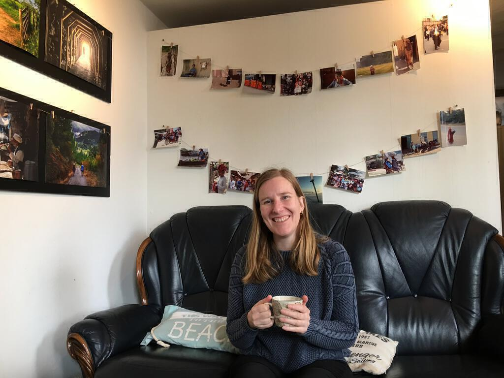
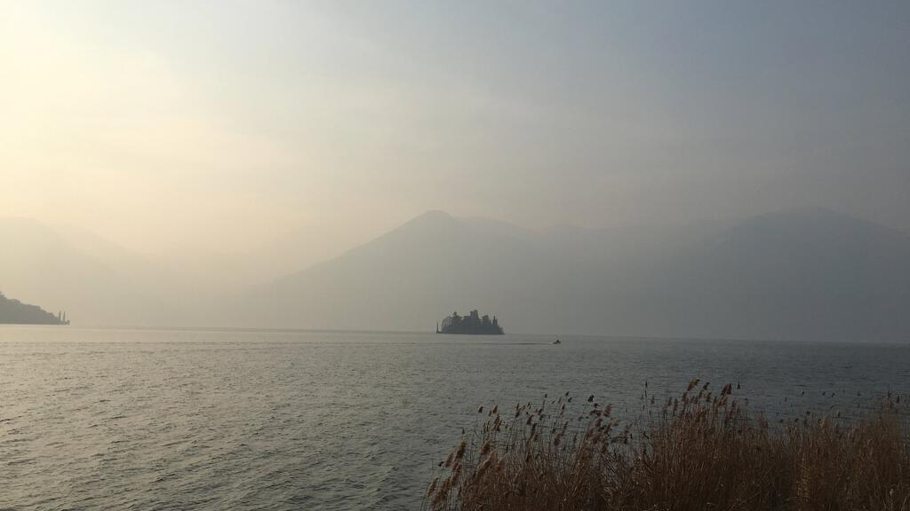

We bought a cheap package holiday in the British Airways Black Friday sale. The weekend spanned Ingrid's birthday, so it was ideal. £99 each for flights and a hotel, and we bagged a hire car quite cheaply too.

Because our flight was from Heathrow and the trains from Chichester are both expensive and inconvenient for early flights, we spoiled ourselves with a taxi to the airport. It felt very strange to be whisked through the Sussex and Surrey countryside at six am on a Friday morning!

We picked up our little hire car. There were snow chains in the boot and we hoped we wouldn't have to use them. Ingrid set to understanding the mind boggling experience of driving on the right hand side of the road. I set to understanding the mind boggling experience of navigating on the right hand side of the road. It took us three circuits to get out of the multistory car park. After that though, it was fine.

We pootled along the motorway from Milan to Bergamo, and then on to the little town just outside where we would stay. We settled in to our room and went for an exploratory walk. We found a pizza place that catered to Ingrid's allergy to both gluten and to tomatoes. Pizza bianca![^1] Just as well, because there was no way that I wasn't going to eat pizza in Italy!

On the way home we stopped off at the Gelato shop. There were almost too many options but we managed &#x263a;. 

The next day, our only full day, we set out to Lake Iseo in the car[^2]. We got to see lots of the countryside, stopping on the way to buy some lunch and more _senza glutine_ products. The surrounding hills were beautiful and the lake itself was just gorgeous. We stopped off for lunch in Sarnico, a sleepy town next to the lake. We drank tea and coffee and played Lost Cities in a Phileas Fogg themed cafe.

After this we drove on to Iseo, parked the car, and went for a walk alongside the lake. It was cold (there had been a week of heavy snow prior to our arrival) but with the sun just low in the sky, it was the perfect light for taking photos.

The next morning we drove to a different airport, Malpensa, with Ingrid ever-increasing in confidence on the Italian motorways. We made good time and had plenty of time to return the car and have a good look around the airport. It was a brief visit but we really enjoyed it. We could have booked another hotel in Milan and stayed there for the weekend, which is what we might do next time.

[^1]: Literally, white pizza.
[^2]: After giving Ingrid her birthday present of course.