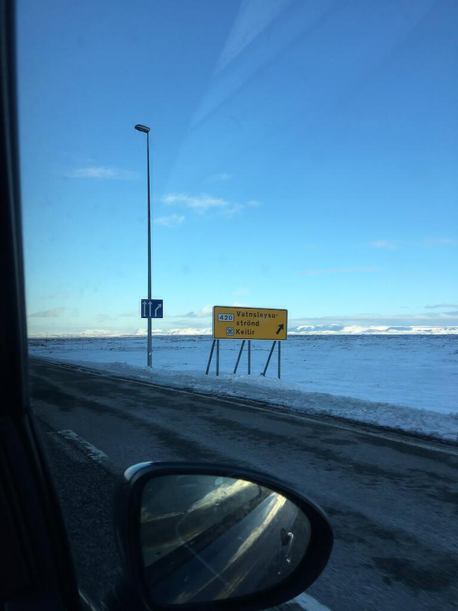
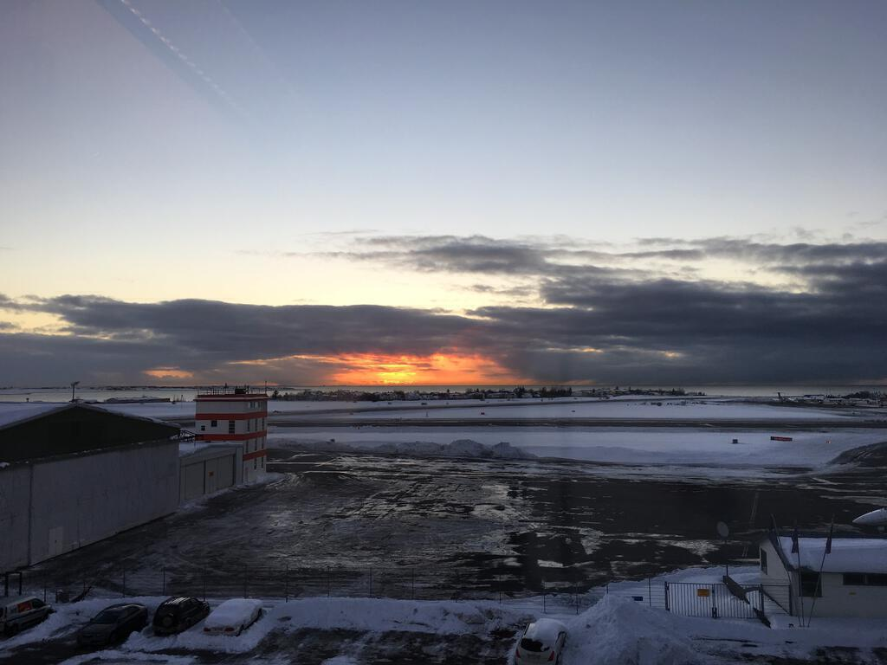
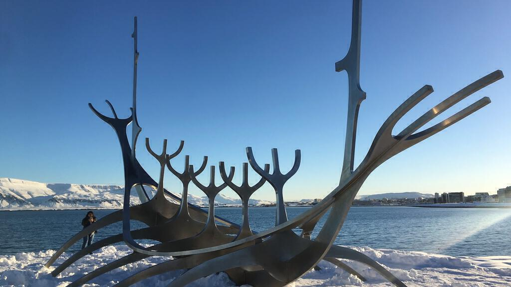
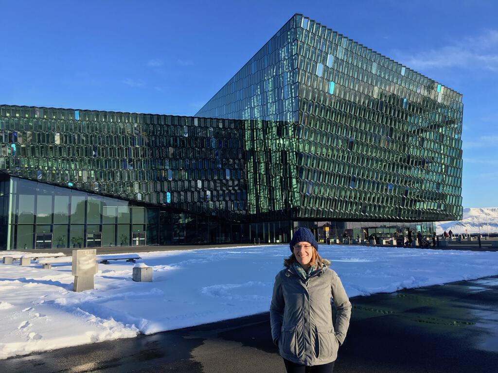
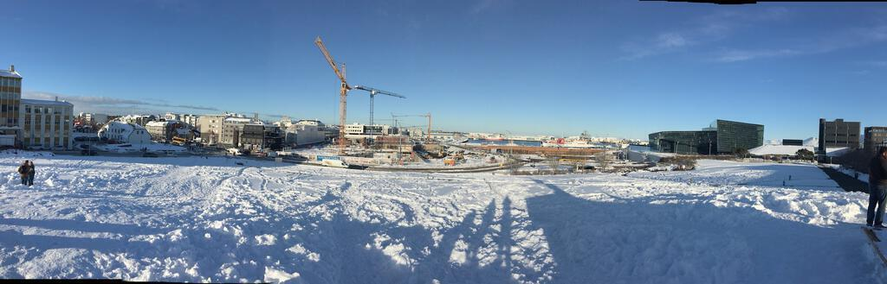
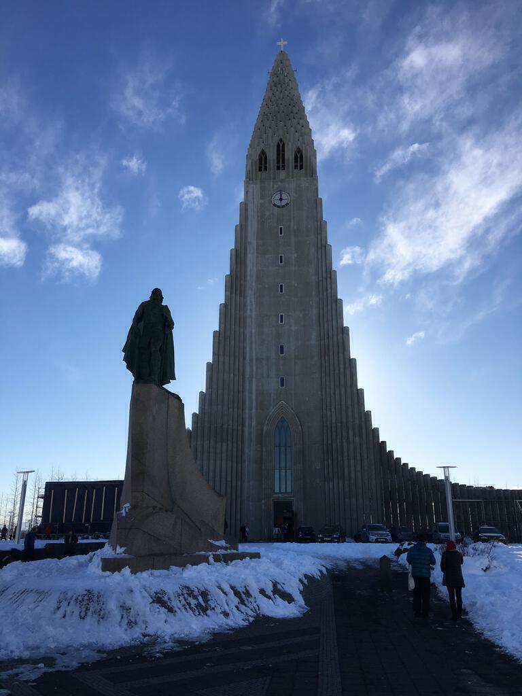
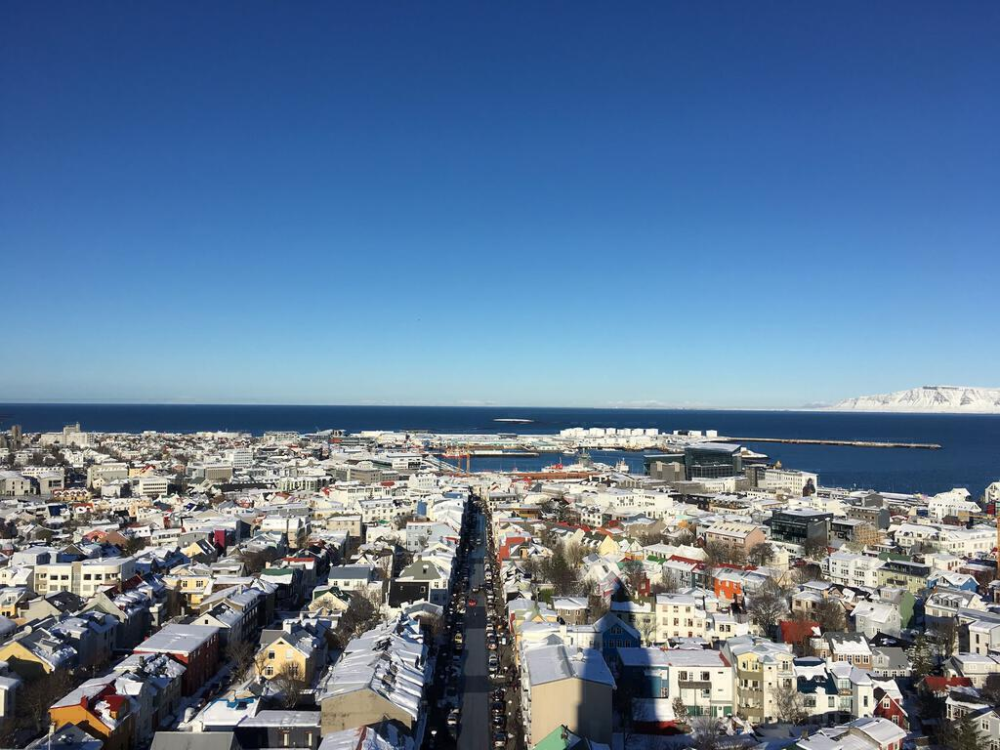
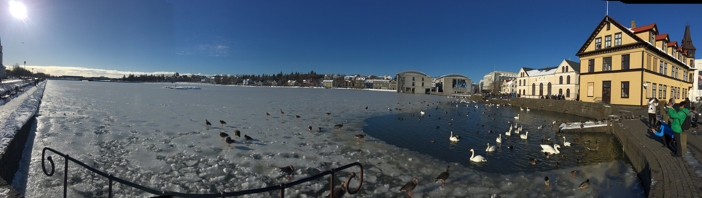
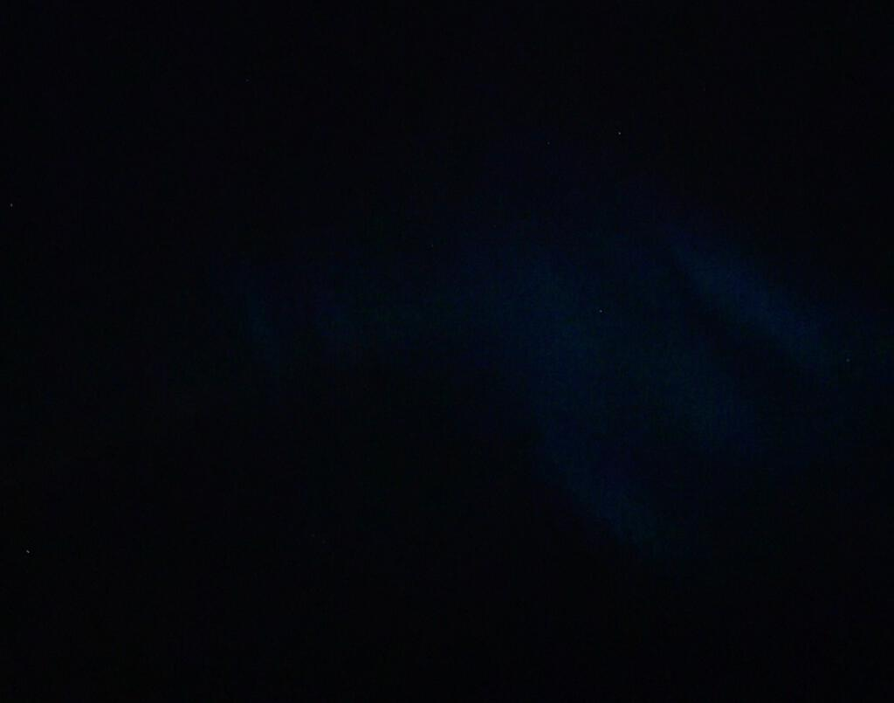

We arrived in Reykjavík a few days [after a monumental snowstorm](https://weather.com/news/news/reykjavik-iceland-record-snowfall-february). As such the city was still under at least six inches of snow. We collected the hire car from the airport and drove out of Keflavik. The scenery normally looks like a moonscape, but for us it was a frosty white wonderland.

After about an hour's drive, we arrived at the Hotel Nattura. From the outside it looks like a huge secondary school but as soon as you step inside it's warm and comfortable. This is quite good when you've just parked next to a snow bank that's two and half metres tall and then bambi'd it in over the icy paths with your luggage. 

Because we got to the hotel as the light was fading, we decided to stay the night at the hotel. Food is expensive in Iceland but at least it was tasty. We hoped forlornly for northern lights and even trekked out into the snow for a while. For a capital city, even one under a massive wad of snow, it sure was quiet. All we could hear was the sound of kids playing indoor football at a sports centre in the distance. Every now and then a small car or bus would pad by. We explored the immediate surrounds of the hotel in giant snowman steps, encountering buried cars and melted-then-remelted snow that had twisted and warped into strange forms.

The next day we did our best to eat as much as we could at breakfast[^1]. Lots of Skyr, lots of bacon, lots of fruit, lots of pastries. We snagged a free bus pass and rode into town. It was full of tourists and not many other people. We trudged through crunchy snow from the bus station down to the opera house, taking selfies and group photos for other tourists along the way.

We wandered in to down town Reykjavík and up the hill to the [Hallgrimskirkja](http://en.hallgrimskirkja.is), a beautiful modern(-ish) church. It's currently being restored and you can see the battering that the exterior has taken over the years. When you walk in there's a magnificent tranquillity, even with a guy pounding away at his organ as we went in. We did the tourist thing and queued for the lift to the top. We were rewarded with some fine views of Reykjavík in the sunshine and the snow.

We then went for lunch at a creperie at the bottom of the road leading up to the Hallgrimskirkja. We'd spotted it earlier and had noted that it sold gluten free crepes. This was good for Ingrid (and for me, because I love pancakes). Ironically, it was Ash Wednesday and so groups of children came in dressed in fancy dress and sang songs for sweets. It was great fun. The costumes were great and the boy dressed as a Pringles can was my favourite.

After lunch we went to the modern art museum, because frankly it wouldn't be a birthday without the chance to take in an art exhibition. It was entertaining but not all that memorable. Ingrid and I had an interesting discussion about what it must be like to be an abstract painter from a nation that only has 300,000 people. You probably end up being *the* abstract painter. And if that's the case, how do you know if you are any good?!

Following the art museum we wandered down to the dock area again, taking our time slowly through the snowbound streets. We found our way to the Aurora Borealis experience and had a wander around in there. Armed with knowledge we went back to our hotel for another expensive dinner, which was interrupted with a call out to the balcony to look at the northern lights. It was a mere wisp of light that quickly faded. Later on we got a call to our hotel room and went down again to see them. This time a giant arc of green-blue light writhed across the sky looking for all the world like a dragon or the great Midgard serpent [Jörmungandr](https://en.wikipedia.org/wiki/Jörmungandr). The photos we took hardly did it justice. It was a great way to end my birthday!

[^1]: After I'd opened my birthday presents!
