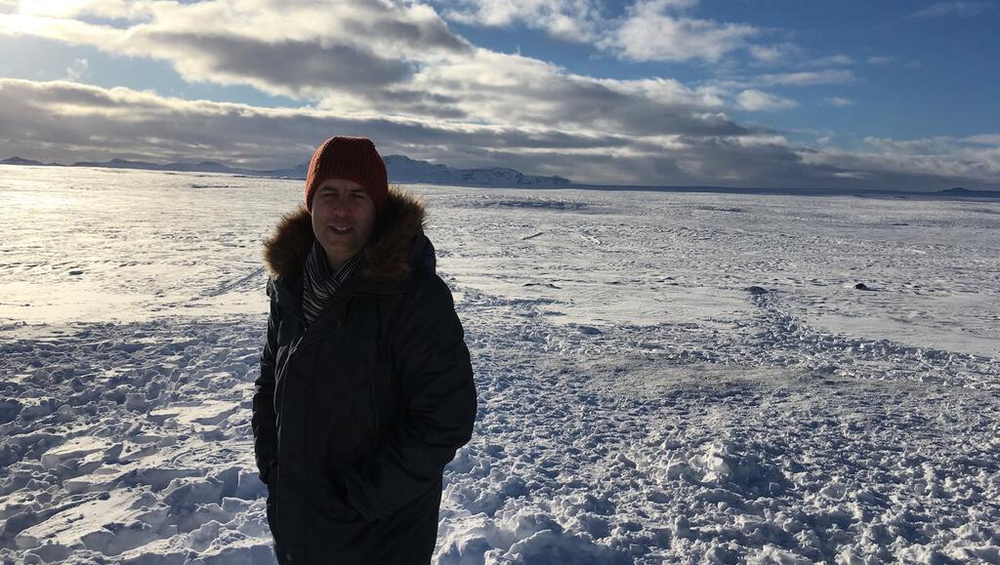
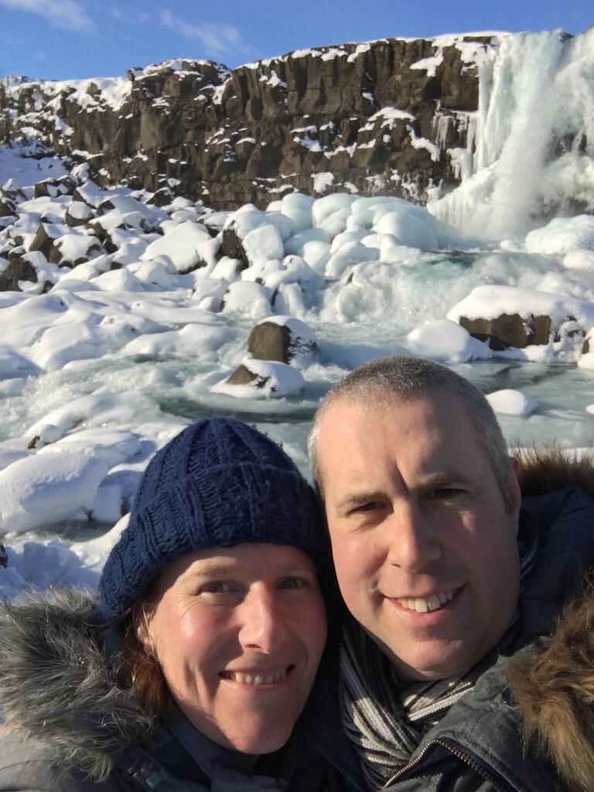
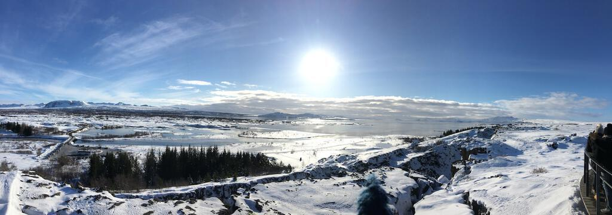
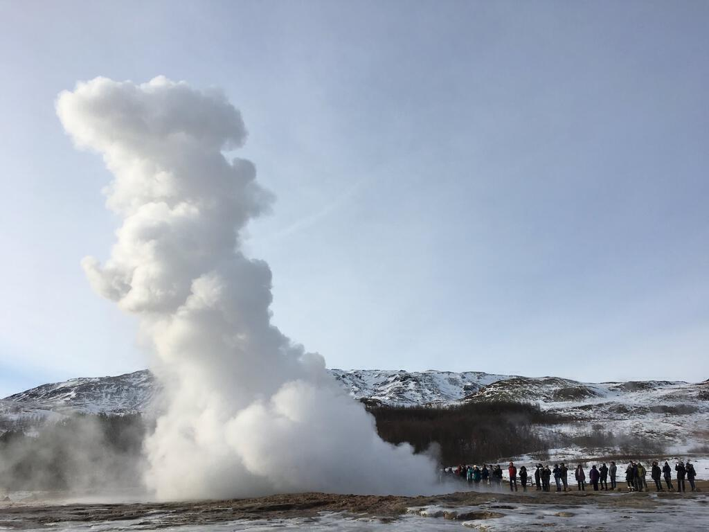
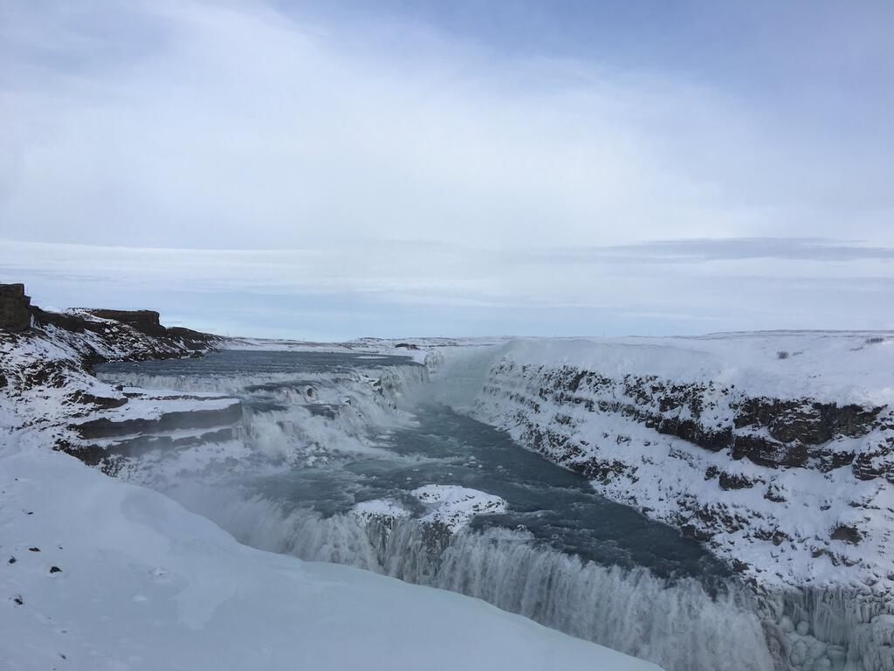

[After a day on foot in Reykjavík](iceland-part-one), and with some trepidation, we returned to the car for our drive through Iceland's countryside. We started by heading out on route 1, which is like Iceland's M25 except that it encircles an entire country *and* about thirty times fewer people. We went to house of Nobel Prize winner Halldór Laxness, only to be turned away because it was being renovated and wouldn't open for another month. Undeterred, we pressed on toward [&THORN;ingvellir](https://en.wikipedia.org/wiki/Þingvellir), stopping off on the way to take pictures at a viewpoint. It was just crazy, a flat expanse of undisturbed snow. Just as with the drive from the airport, the territory should have been relentlessly bleak but instead we got a winter wonderland.

Arriving at &THORN;ingvellir we quickly paid our £4 parking fee and began to jostle with the tourists that had recently been decanted from about ten tour buses. It was a bit manic but we managed to take lots of photos. &THORN;ingvellir is a UNESCO World Heritage Site and the site of Iceland's first parliament, said to be the oldest in the world. It's also a place where new land is being created as the Earth's tectonic plates drift apart.

Across the hills, you can see a beautiful old church. Our guidebook advised us to walk there, but it looked pretty treacherous in the snow. Instead we took a walk to Öxaráfoss, the first of many fosses (or waterfalls) that we would encounter in the next few days, though it was the only one that was almost frozen. The walk was chilly and slippery in the snow, but well worth it. The cool crisp air filled our lungs and, even more than had been the case in Reykjavík, we felt as though we were somewhere strange, beautiful, and foreign.

Looking at pictures of &THORN;ingvellir online while writing this post shows that while we were lucky to see it all covered in snow, it is just as beautiful in the summer. It's a wonderful place that I would definitely love to go back to. I bet it's great to walk around during the long twilights of Icelandic summers.

By the time we returned to the viewing platform all the day trippers had moved on and we had the sumptuous views pretty much to ourselves. We took some more photos and then set off for our next destination: Geysir. Can you guess what was there?

Yep, we'd gone to Geysir for the eponymous geysers. We felt hungry all of sudden, so we decided to investigate the food hall next door. There's a whiff of motorway service station about it, but it had a decent range of food on offer. We went for the lamb soup, hearty but simple fare that suited Ingrid's dietary requirements. We also had a wander around the gift shops looking at whimsical and/or beautiful tourist stuff that we couldn't afford.

Outside, we followed the sulphur smells to the geysers. The principal attraction is Strokkur (not to mention the Geysir geyser, but that doesn't erupt so often and didn't while we were there) but we took our time to wander around the steaming pools, hoping that the coach trips might disperse as they had done earlier at &THORN;ingvellir.

After our little wander, we stood near to Strokkur and waited for it to erupt, having heard it go several times while we were walking around. Because a geyser is a natural phenomenon, it doesn't go off like clockwork. Each time the tension builds among the bystanders as they wait. Each time someone screams as the jet of hot water shoots up in to the air. Each time you can't wait to see it happen again. I'll admit that it made me jump. Ingrid remained cool and managed to snap pictures of the plume in motion.

As we left, we lingered by the hot pools and watched clouds of steam drift along the ground in the fading sunlight. It looked like the earth itself were exhaling, warm breath in front of its face in the cool afternoon.

Next we headed for Gullfoss or the golden waterfall. Our Satnav took us down what seemed like a farm track covered in compressed and compacted snow. It was a bit hairy but we made it. As we walked from the car we could hear the buzz of falling water but in the cold twilight it was surreal when we saw it. A wall of water streaming in all directions that continued down, bifurcating and twisting into new rivulets on the way down. At points it was if it were a vertical river pouring into the centre of the world. Lower down it twisted into a hydra of further torrents exiting one's view through rocks and snow.

We held up our cameras and tried to do it justice. High above us and to the left, other crowds stood looking down on us and goodness knows what vertigo-inducing sights they could see up there. From our vantage point midway down, Gullfoss was not so much golden as a cold sliver of writhing whiteness held in the deepening blue-black gloom. Needless to say, our photos did not do it justice. We just stood there, very cold and a little giddy, trying to take it all in. I turned to Ingrid, said "It's *alright* isn't it?!", and we laughed. We'd already seen so many beautiful things on our trip so far and this just took the biscuit.

We drove to Flu&eth;ir on quiet country roads, barely seeing a soul. The little village itself came as something of a surprise, a little smattering of buildings adrift in the hills and caught in the snow. We gratefully checked into the hotel, eagerly awaiting food and sleep.