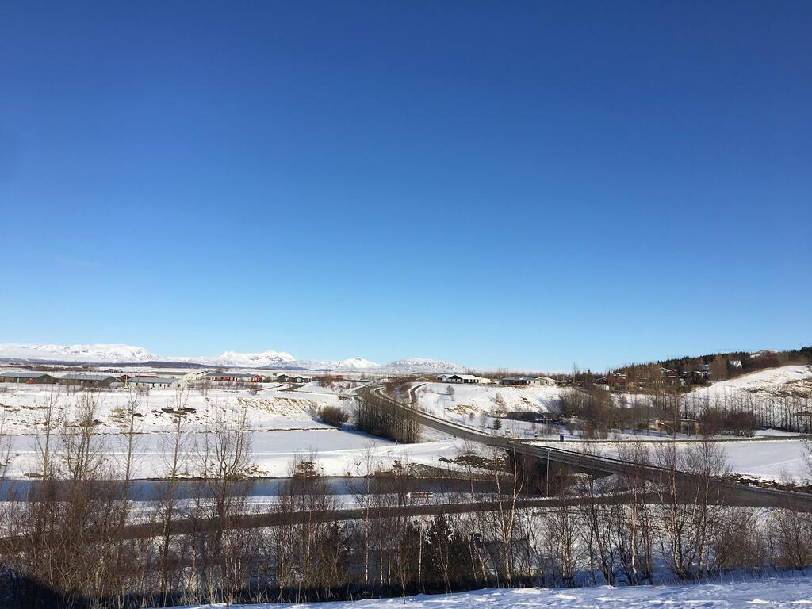

[We left Gulfoss](iceland-part-two) and drove through the countryside to Flu&eth;ir where our next hotel stay would be. The hotel had cute little cabins arranged around a central square and the room itself was comfy and warm. Our dinner was nice enough, although we had a bit of a Fawlty Towers moment with Ingrid’s chicken salad. First it went back because they didn’t leave the BBQ sauce off. Then it came back *with* tomatoes. And then back again with more BBQ sauce. Fourth time lucky.

Flu&eth;ir is a small village nestled between some rare hills in the middle of nowhere. The [Secret Lagoon](http://secretlagoon.is) is nearby but we passed on the opportunity as we were both tired from the day before. We rested until checkout time and then set off for more adventures. First we visited the oldest church in Iceland at Skalholt. This was the site of the first Icelandic capital until Reykjavík became a better place to build the main settlement. It's strange to think of a bustling settlement now that nothing is there.

 We were fortunate to take in both the main church and the crypts below. Despite outward appearances and the bleak setting, made all the more so by the biting wind whipping up off the snow, the interior of the church was beautiful. It was warm and calm. Sunlight poured in through modern and colourful stained glass windows. In the crypts were old tombstones with interesting placards telling their stories. Most were carved in Copenhagen and then shipped to Iceland, which highlights their importance.

Next we drove to [Keri&eth;](http://kerid.is) to see the volcanic crater lake. Much like everything else during our visit, it was covered in snow. This made for a cautious walk around the top as the paths down to the lake were closed off. The lake itself is at the same level as the water table and is not caused by rainfall. It was frozen over and some parts were very thick, having refrozen over several times. As with &THORN;ingvellir, it would be nice to see it again one day in an unsnowy state. 

We had lunch in Selfoss and headed out for Vík on Route 1. On the way we stopped for a cup of tea at a cafe run by the Icelandic equivalent of the store owners from The League of Gentlemen. As with most countries I tried to read a newspaper and pretend that I understood it. We drove on through a town called Hella, where (presumably) American teens posed with the road sign featuring the town's name.

Our destination was the Seljalandsfoss, a beautiful waterfall (yes, another one) that cascades over a rocky plateau. In the bright wintery sunshine, rainbows scattered and split away from the falling water. A newly wed couple were having their photo taken beneath the waterfall. The bride looked particularly chilly. 

Just along the road is Skogafoss, which Icelanders voted as the best waterfall in Iceland. I can see the attraction, a huge span of water falls off the rocks in a huge horizontal curtain. You can walk up a vast path leading up to the mouth of the waterfall, though at our visit the conditions were icy and treacherous. Wooden stairs wind up the cliffs along side for the chance to look down from above but we didn't have enough time left before dark.

As the light faded we drove along winding roads to Vik. The hotel was modern and warm so we decided to leave exploring the town for the next day.

