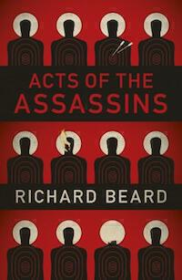

[Acts of the Assassins](https://www.waterstones.com/book/acts-of-the-assassins/richard-beard/9780099592938) is an interesting novel by [Richard Beard](http://www.richardbeard.info) that retells the story of [the apostles](https://en.wikipedia.org/wiki/Apostle_(Christian)) and their deaths. It uses a modern crime genre style and a contemporary setting. The author himself refers to it as "Gospel Noir".
Cassius Gallio, a Roman CSI-type referred to as a speculator, investigates the murders of the apostles following the crucifixion and resurrection of Jesus. Gallio, charged with guarding the body following Jesus' death and greatly undermined by the disappearance of the body, views the resurrection as the greatest conspiracy of the age.

It's even stranger and more interesting than that because the novel unfolds in a superposition of past and present. Rather than updating every aspect of the story of the apostles and then bending the story to suit, Beard instead allows the action to progress regardless. If a narrative event requires a modern element of the story to proceed, then the modern version is used. When the story needs a more traditional take, that gets used. This means that the novel is neither a simple rehash of alleged events, nor an irreverent attempt to update them. The meaning of the events is the same either way, so why not superimpose the two versions of the narrative.

The modern setting allows for some fun to be had with the narrative involving stakeouts, the DNA testing of glass fragments from Joseph of Arimathea's house, and the general crapness of English roads.

However it doesn't mean that things are easy to follow. By about halfway through things get rather confusing. When Gallio arrives at the scene of Philip's death in [Hierapolis](http://www.bibleplaces.com/hierapolis/), he sees it with modern eyes and so there is "already" a martyrium at the scene. During the course of the novel the bones of the apostle James [make their way to Spain and become venerated](http://www.santiagodecompostela.gal), even though this is within weeks or months of his death. But simultaneously those bones have been venerated there for over a thousand years because the novel is set in our modern timeline. America is referenced and appears to be no different from in our reality, which seems improbable given how much of its identity stems from Christianity.

The deaths aren't easy to stomach. [Don't read Chapter 7 before bed](http://www.beyondtheyalladog.com/2012/07/simon-the-zealot-complete-with-saw/). The gothic noir narrative and modern setting allow known events to retain their tension. You might know the overall outcome (chapters are named for the disciple who has died or is about to) but the graft of events on to the new timeline and the interior story of Cassius Gallio are both unknown to the reader. The confusion about the timelines is part of the fun.
Whether you enjoy the entirety of the novel will depend on how you feel about the author's sensitivity and attentiveness to the original legends, in particular their meaning. Why update the stories of the apostles in the first place? After all, if it were simply a case of retelling the story with a gumshoe detective [for yuks](https://en.wiktionary.org/wiki/yuks), then surely it would be better to shake out more of the temporal inconsistencies? I think the superposition dares us to see the parallels between events then and events today, but also draws out of us how unprepared we are to believe in the more supernatural elements of the original story.

[Featured image is The Apostles preaching the Gospel](https://flic.kr/p/eaCbGP), from a stained glass window in the former church of St Paul's, Jericho in Oxford ([creative commons license](https://creativecommons.org/licenses/by-nc-nd/2.0/)).