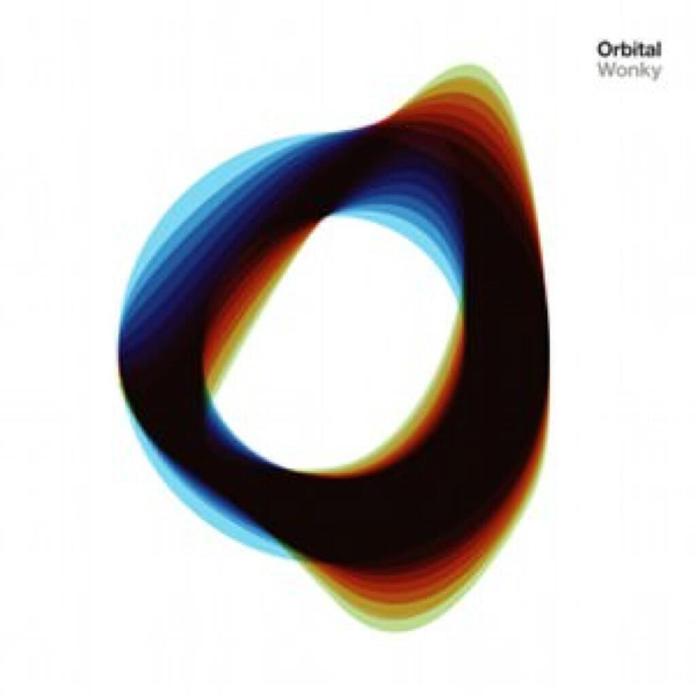
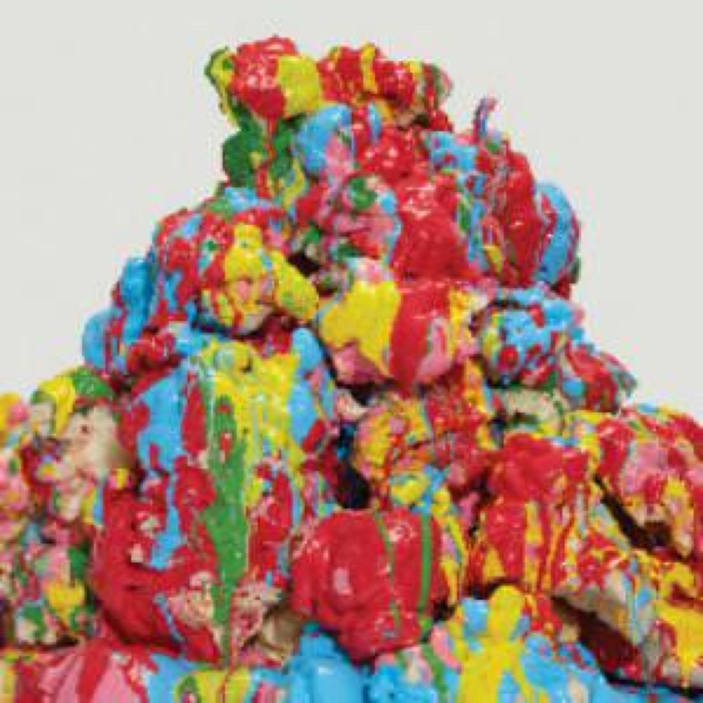
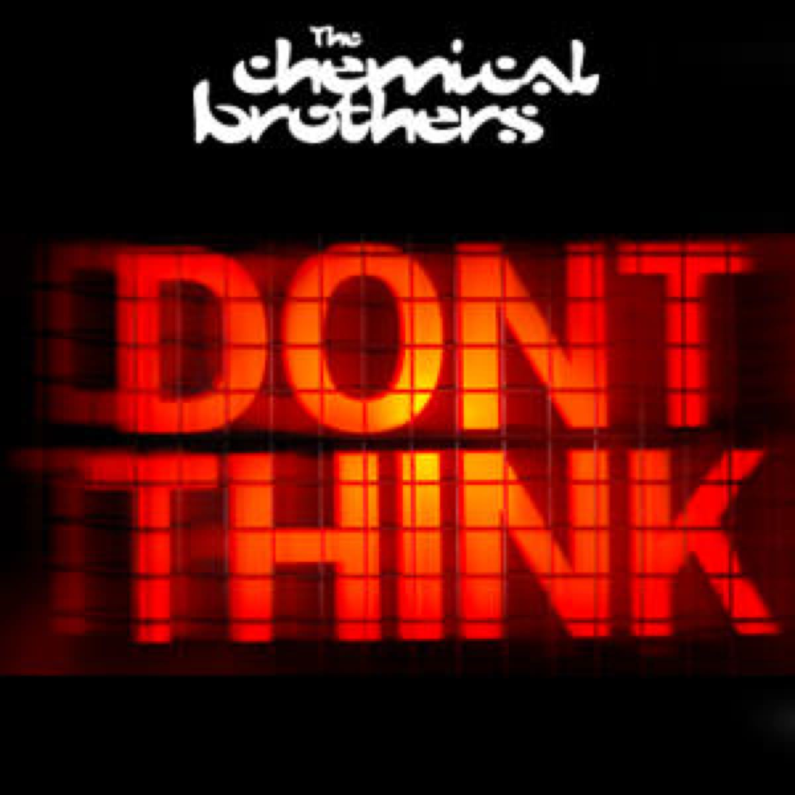
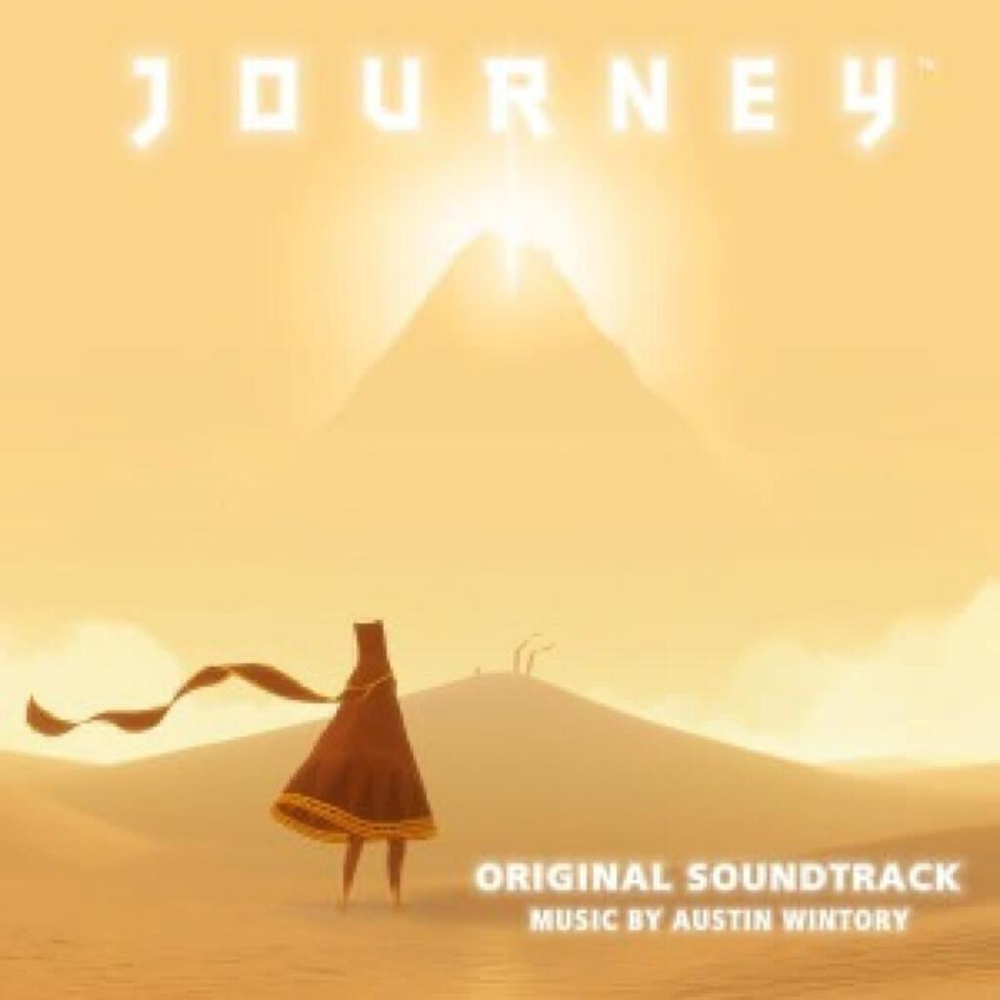

A mostly instrumental month with a comeback from Orbital, an excellent remix collection from Battles, an amazing movie documenting a live performance by the Chemical Brothers and Austin Wintory’s soundtrack to the game _Journey_.

1. Orbital _Wonky_
2. Battles _Dross Glop_
3. The Chemical Brothers _Don’t Think_
4. Austin Wintory _Journey (Original Soundtrack)_

## Orbital _Wonky_

I am quite keen on Orbital, though perhaps not as keen as I am on the similarly named Orb. I think I have got all the Orbital albums, mostly bought on eBay after the fact. (Funny story though, I did find a copy of _In Sides_ in the loft of a house where I lived in Bath, along with several other albums…) My favourite Orbital album is probably _Snivilisation_ but they all have their moments, whether it is the genuine sliver of emotion shot through _Halcyon_ off the brown album, the proggy long-form tracks on _In Sides_ like _The Girl With The Sun In Her Head_ or _Out There Somewhere_ (parts one and two), or indeed the arsing about with heavy metal samples on tracks like _Tension_ off the highly underrated _The Altogether_.

If pushed I would have said that their last album, _The Blue Album_ (named self-referentially with respect to their debut and sophomore eponymous green and brown albums) was probably their weakest, although I say that while only remembering the annoying Christopher Ecclestone sample on _You Lot_ and I could be doing the rest of the album a massive injustice. I will listen to it again some time and issue the appropriate apology in due course[^1].

However, whatever the case may be, my lukewarm memory of the blue album is why I approached _Wonky_ with a little trepidation - especially given the long absence between the albums. Bands rarely come back from this long away with something genuinely new to offewar ore often than not it is just with warmed over nostalgia for the good old days. A good case in point is the recent Leftfield _Liveism_ album that I was going to review this month but it was such a waste of time[^2] that I felt cheated for having listened to just three quarters of it on Spotify for free!

So colour me pleasantly surprised to discover that _Wonky_ is actually pretty good and at some points is utterly brain meltingly phenomenonal. It starts off with _One Big Moment_, a track that neatly dovetails disparate sound bites together in the classic _Snivilisation_ fashion and instantly sets the tone as being “business as usual”. Then comes _Straight Sun_ a track that bluffs through the first minute or so, crashes into a big wall of trance (at which point I am thinking, about seven minutes into the album, oh dear what have they done? This is a mess…) and emerges on the other side riding an insanely bouncy synth loop all the way over the horizon (and by this point I am thinking this is the best tune EVARRR!). Just for sheer grin inducing madness _Straight Sun_ is my favourite instrumental of the year so far. There is a cool video on YouTube too which is embedded at the bottom of this post.

After that, I am putty in their hands. I very much like the collab with Zola Jesus (_New France_) and after [her great contribution to M83’s album](album-digest-october-2011), I am very keen on looking up more of her (their?) music. There’s another sweet instrumental called _Stringy Acid_ that is also deliriously good primetime Orbital but it doesn’t quite match _Straight Sun_’s goofiness to my ears. The only mis-step is the title track and even that has its moments so it’s bearable.

All in all, _Wonky_ is a solid album that isn’t so much a comeback as picking up from where they left off. It definitely isn’t a novelty record, I think it is something you can pick up now and again, just like any of the other albums. In fact perhaps the best praise for _Wonky_ is that if you put all your Orbital tracks into one itunes playlist, you will have a hard time telling the new tracks from the old ones… in a good way. I hope they do stick around to make more.

## Battles _Dross Glop_

Usually remix albums are nothing to get worked up about, as per previous examples [here](album-digest-june-2011) and [here](album-digest-october-2011). But with this reconfiguration of Battles’ _Gloss Drop_ from [last year](album-digest-june-2011) there is much to love: there’s that wonderful Spoonerism of the title, the gleefully anarchic pop art approach to remixing the original artwork and the sly extension of one minute interludes to full on eight minute techno remixes… more of which later.

_Dross Glop_ was initially released as a series of twelve inch records over the course of eight weeks so I have been listening to these remixes in clutches of three (just two on _Dross Glop 1_) and listening to each of the tracks more closely than when receiving all of them in one go. Interestingly two of the remixes each get two minutes lopped off but the resulting album is not so long that the four minutes could not have been accommodated so some thought must also have been put into the pacing of the CD version.

So how are the remixes and how do they compare with the originals? The answers are “generally excellent” and “really quite well”. I compiled a Spotify playlist that interwove the original album tracks with the corresponding remixes and it is quite a fun listen. Some of the remixes are radical re-workings and some are much longer than the original but others stay quite close to their parent so it works quite nicely.

The Gui Boratto remix of _Wall Street_ takes the post-rock Bond theme stylings of the original and blends in a little Kratwerk tic, it’s quite a minimal reversion of the original that folds in its elements slowly in layers. It’s not quite as minimal as The Field’s take on _Sweetie & Shag_, which scoops out the innards of _Gloss Drop_’s most poppy track and replaces it with an insistent techno rhythm that takes quite a few listens to get in to. All the melody and rhythm of the original are replaced with drones and clicks, the vocals with barely audible gasps. It’s very compelling but at first it seems very disorientating.

On the other hand, the Alchemist’s mix of _Futura_ stays quite close to the original just adding in some hip hop beats and some vocal samples over the top. The intricate Battles man-machine playing instead becomes (for the most part) an insistent drum machine grind, peeling back boundary between performance and sequencing that makes Battles’ music so interesting. Similarly, the Shabazz Palaces remix of _White Electric_ mercifully halves the original’s length and with a rap over the top highlights the quality and inventiveness of the original by transforming it into an hip-hop track. I look forward to investigating Shabazz Palaces’ music further.

Sometimes a really good remix will extrapolate its parent track into multiple directions away from the original. The mix will take one element and tease it out in one way, then take another element and explore a different direction for a bit. If your remixer is truly skillful, they will then take all these strands and build something as interesting and compelling as the original. This is what Kode9 achieves with his mix of _Africastle_, which is a good thing because the original is probably the best thing on _Gloss Drop_ — the opening track that dances lightly out into space echoing other glories like _Atlas_. Remixed, it becomes a house banger with shifting beats and steel drums, retaining its original charms while inhabiting new places too.

I do have to confess that I had to go back and play _Gloss Drop_ again to remember how the original of _Inchworm_ sounds, it’s the one that sounds like a demented slowed-down carnival float, all marching toy soldiers and chiming guitar riffs. This makes the fact that the Silent Servant version turns into a glitchy techno track with spooky shimmering dub echoes over the top something of a disappointment. It’s a great track that rattles along pleasantly like a more immediate variant of that difficult remix of _Sweetie & Shag_ but it pales compared to the original. I feel like _Inchworm_ should have a much crazier remix than this one.

This is followed by two remixes that extend quite considerably two shorter tracks from the original album, _Toddler_ and _Dominican Fade_. _Toddler_ is this simple little guitar jam that Klanding Ray draw out into a glitchy techno beat and a swarm of synth noises that play over the top on their remix. Pretty much a companion piece to the mix of _Inchworm_ it stands apart from the original precisely because it takes a short piece and expands it into new territory. The treatment of _Dominican Fade_ by Qluster is also similar, taking a short face paced jam and pulling it out into a chiming proggy piece that is very charming and though it is double the length of the original, it is quite brief compared to other mixes here — it shimmers away into nothingness after just after three and a half minutes.

_Dross Glop_ then ends with what are probably the most accessible mixes on the album. The remix of _Ice Cream_ by Gang Gang Dance is phenomenal, achieving success at least partly because they leave Matias Aguyo’s unique vocal well alone for well over a minute, focussing instead on their bizarro-world reinterpretation of the musical themes. In fact, it comes pretty close to replicating the demented carnival float vibe of _Inchworm_ too. As does the Hudson Mohawke mix of _Roll Bayce_ which turns the original into a deliriously happy goose-bumping inducing cousin of Penguin Cafe Orchestra’s _Music For A Found Harmonium_ but with added circular saws — it makes me grin from ear to ear.

The remix of _My Machines_ plays the same role on _Dross Glop_ as the original does on _Gloss Drop_, it’s a competent song featuring Gary Numan that gives you something coherent on which to hang everything else going on around it. The remix itself is one of those standard DFA-esque numbers that extend the track to twice its original length over a elastic bass line while staying pretty faithful to the original vocal. I guess another reference point would be those Shepp Pettibone remixes of tracks like New Order’s _True Faith_ that just pad out the track to twelve inch length.

Finally Yamantaka Eye gets to remix his own collaboration _Sundome_ and it’s not too bad, albeit just like a dub version of the original album version. Everything gets spun out of control whereas the original was interesting because of the tension that grows up when attempting to keep chaotic elements in check. Nevertheless it is a nice way to close out the remixes, with something that doesn’t stray too far from the original but shows how central discipline is to the Battles sound.

## The Chemical Brothers _Don’t Think_

_Don’t Think_ is a movie built from lots of HD footage shot at Fuji Rock Festival last year. Although there is a free CD with the blu-ray, this is ostensibly a review of the film. As with Orbital, I’ve got all the Chemical Brothers’ albums and the selection here works well as a greatest hits set — one of the highlights of the movie is how well all the material dovetails together to create the whole set. Sure, the tracks played from the first two albums are perhaps more belligerent than those from _Surrender_ onwards. Mind you the version of _Out Of Control_ here is pretty fierce too. They obviously have so much quality material to play and the kinetic nature of the songs means that they can keep the tracks spinning into one another.

The visuals are mostly drawn from the videos that accompanied their excellent 2010 album _Further_ (probably their best since _Surrender_) and seem designed to totally freak the audience out. And why not? The brilliance of the visuals are the fact that it is not just some lights and an HD projector beaming images on to the screen behind the band, they also beam stuff on to the ground around the arena and at one amazing point in the middle of _Swoon_, a swimmer is projected into the air over the crowd. You should not watch this if you are scared of clowns or bugs (though the bugs are very animated) and if you aren’t scared of clowns, you may well be afterward.

The film crew also went into the crowd and so the film is much a document of going to a gig as it is the performance on the stage. The fan reactions are great fun and one woman’s reaction  to a particular moment at the end of _Superflash_ (no spoilers here) is hilarious and is almost worth watching the movie for on its own. At other points the camera cuts back over a huge swathe of dancing people and you realise just how powerful and uniting a force dance music is for people all over the world. As with any footage of a mass of humanity enjoying themselves, I found it very affecting.

There isn’t much more to say besides the fact that even though the album is more fun as a movie, the accompanying CD does represent a good document of the same gig and works well as a summary of the band’s music (perhaps better than a studio greatest hits given its refreshingly scattershot and patchwork approach to the discography). I think I still prefer the albums (_Further_ and _Dig Your Own Hole_ especially) but the movie certainly helps to flesh out the tracks and to show the human side of this music and how it gets people moving. Meanwhile, “Don’t think, just let it flow” is my new motto.

## Austin Wintory _Journey (Original Soundtrack)_

I bought the soundtrack to Journey on something of a whim because it was cheap. Having played the game I knew that the music was excellent and an integral part of the experience though I still needed to it to be cheap to persuade myself to buy “video game music”.

There is something I should tell you about my listening habits, specifically what the most played tracks in my iTunes library actually are. They are from the albums that I listen to whenever I can’t sleep, specifically _Woob 2_ by Woob (a forthcoming understated classic) and Underworld’s soundtrack to the movie _Breaking and Entering_ (a movie that I have not yet seen). Austin Wintory’s soundtrack is definitely going to be another album on this list, interesting enough to soothe the mind if the mind has to cling on to something and unobtrusive enough to let you drift away in to sleep if you are lucky.

Despite being an ideal bedtime soundtrack, it is not an uneventful listen. It is, after all, the soundtrack to a game and so there is plenty in the music that connects it to the events in the game. I am not sure whether the music in the game just loops in certain places or is generative, so I am not sure what the soundtrack represents. Perhaps the “confluence” tracks (there are six) are the seeds of generative pieces, I am not sure. The game may be short but I don’t think you can complete it in 58 minutes, and so I think this summary of the music in the game is probably slightly more lyrical.

The pieces are quite simply constructed, most of the arrangements sound performed rather than just digital. It’s all harps, violins and cellos in the slow mournful sections, elsewhere there are insistent tribal drums and chiming bells. For me it’s inextricably linked to the images of the game but I think someone coming to it without having played Journey would still find it an interesting and captivating album of music. I can testify to its transformative power as I have not just listened to it in bed but also on the way to work in the middle of a rain storm. The soundtrack provided a strange backdrop to the rain lashing down and I was nearly lifted off the ground like the little character from Journey as the wind whipped up under my umbrella (not to mention the fact that I too should have been wearing a scarf).

I have to mention how beautiful the string arrangements and (Tibetan?) percussion in _Atonement_ are, the wonderful dramatic ending to _Threshold_ and the sheer joy of _Apotheosis_. If you download only one track though, make it _I Was Born For This_ the vocal track that plays over the end credits of the game — it’s haunting, mystical, and would work well on any soundtrack. In conclusion, I’d say the soundtrack is worth £3.49 of your money (it certainly was mine) and that if you are having a stressful day it would probably help to soothe your soul almost as effectively as playing the game itself. It’s available from iTunes and from the playstation network. The video shows footage from the recording sessions as well as from the game itself.

---

## Album Digest April 2012 - Notes

[^1]: Yes I went back and listened to it. Turns out I remembered correctly, _The Blue Album_ is not that great compared to the other Orbital albums. The first and last tracks are excellent but I’d forgotten the true horror of _Acid Pants_, a track that is far worse than _You Lot_ (which itself was as annoying as I remembered it to be). The problem with _Acid Pants_ is that if you are going to produce a track that is meant to be funny, it’s not a good idea to make it utterly humourless.

[^2]: OK, here is a short review of _Liveism_. Its one redeeming feature is a goosebump rendering performance of _Release The Pressure_ but it only shows how the rest of the tracks are lifeless facsimiles of the album versions (with crowd noise over the top). Meanwhile at one point there is the following exhortation of the crowd: “Come on Australia!” This made me wonder why on earth they’d decided to record a supposedly definitive concert there. Why not Brixton Academy which is surely the place where Leftfield’s live performances have been laid down in history? Or is the whole rumour true and they really are banned from there for life? Whatever, this album is a complete waste of time. Even an utterly useless third album of subpar new material would be better than this.
