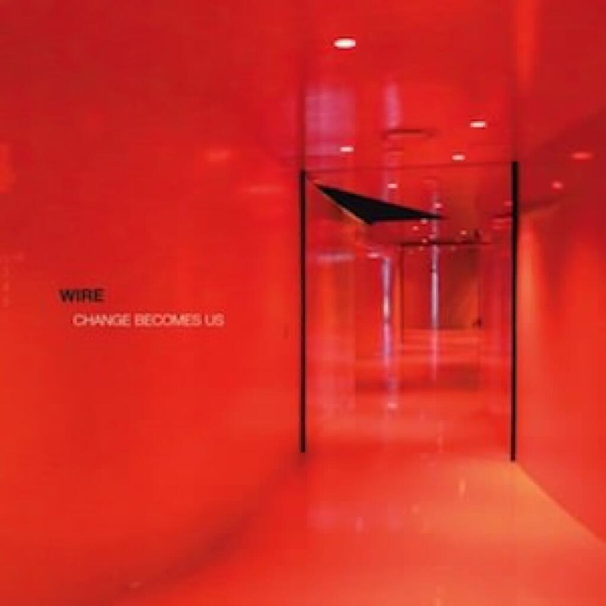

Some great albums this month!

1. The Flaming Lips _The Terror_
2. Wire _Change Becomes Us_
3. James Blake _Overgrown_
4. The Knife _Shaking The Habitual_

## The Flaming Lips _The Terror_

How you view _The Terror_ pretty much depends on how much you have kept up with The Flips output since their last official album, the clanking double behemoth in Merkin packaging that was _Embryonic_. The irony being that I used _Embryonic_ to deal with a break-up and _The Terror_ is pretty much about... a break-up.

Generally, the sound is an evolution once more from both _Embryonic_'s noisy CAN-style warblings and the more acid-touched atmospheres present on last year's excellent collab-corralling collection _The Flaming Lips And Heady Fwends_. The key track on that album was very much _I'm Working At NASA On Acid_ and its line "We trying to control... what cannot be controlled" is echoed in the line "We don't control the controls" on _The Terror_'s title track. If you missed _... And Heady Fwends_, not only did you miss a treat, you'll also not know that the band is much more synth-dependent now and that verse-chorus structures are largely out for the time being.

Early interviews about the record made _The Terror_ seem like a very unapproachable and experimental record: after all, the title certainly does. However, it turns out that it's pretty in places and a bit messy in others but generally, as ever, the sparkle outdoes the grime. There are some lovely affecting moments early on in _Be Free A Way_ and _Try To Explain_, while the album's centrepiece is _You Lust_ -- a track that in edited form (it is 13 minutes long) could have sat comfortably on _Embryonic_ -- and the title track. All nine tracks run into one another to form a whole suite: each track is a distillation of one aspect of the whole thing.

It's pretty good -- as Flaming Lips albums tend to be -- but it's not the best album I've heard this month and I personally think that _The Flaming Lips And Heady Fwends_ is a more interesting and entertaining album.

## Wire _Change Becomes Us_

The new Wire album could actually have been their fourth: the songs that comprise it are rewrites (or touch ups) of songs that were played on an ill-fated tour after their third album _154_. Because the bad was falling apart at that stage, the songs in question were only ever featured on a long deleted album called "Document & Eyewitness", and had not seen the inside of a studio until now.

And what songs they are! I really love _Change Becomes Us_ and would go so far as to say that it is definitely one of the best albums I have heard in the last five years. You can read back through over two years of album digest and understated classics posts on this site and you will know that I listen to a fair few!

What's so great about the album? It's hard to put my finger on. Perhaps it's just the cerebral and elegiac tone of many of the songs, perhaps it's the consistency throughout. It's not uneven like _Pink Flag_, in fact it puts me more in mind of _Chairs Missing_, their highly underrated sophomore effort. Some punky stuff remains: _Doubles & Trebles_ is a secret agent echo of _Pink Flag_'s opener _Reuters_ and _Stealth Of A Stork_ is sufficiently energetic that I hurt my back pogoing along to it the other morning (the shame of it! 3/4 of this band are twice my age!).

Meanwhile, a good portion of the album is pure pop -- or at least it's pop radio music on the planet I want to live on. There's a beautiful yet undecipherable love song in _Re-Invent Your Second Wheel_ and a pure hit of dopamine on _Love Bends_, whereas _B&W Silence_ casts a moment to remember as a black and white photograph. I could go on at length about the six song run through the middle of the album that I've 'loved' on last.fm -- normally I love at most two tracks on an album.

Wire should be better known to everyone everywhere. The fact that they aren't makes them an even greater pleasure to those in the know, but it does seem a shame that more people can't enjoy them. I urge you to make this album a part of your collection, I am certain that you won't regret it.

## James Blake _Overgrown_

James Blake's eponymous debut album really blew me away back in [February 2011](album-digest-february-2011) but I did wonder at the time  whether my interest would be maintained over time. True enough, that album did fade into the periphery and so I wasn't too excited at the prospect of _Overgrown_. However, I think that he has done a good job here and that this album takes what made the first so unusual and adds in a few more conventional song tropes to make a record that feels much more tangible and interesting than that debut does now, two years on.

It's apparent immediately on the title track (the first and best song on the album) that there is a better match of his beatmaking skills and his beautiful voice, it's much more soulful. Whereas previous tracks like _The Wilhelm Scream_ delighted in contorting his voice into weird shapes and others like _I Never Learned To Share_ seemed to almost goad the listener with how spartan their musical arrangements were, on _Overgrown_ everything seems more focussed on content and emotion.

Admittedly _Take A Fall For Me_ is a little wacky but it lends a sense of fun to the album, it's certainly not as dour as _James Blake_ by any means. Then you have tracks like _Digital Lion_, graced by the hand of Brian Eno no less, which are beautiful without the austerity and archness of previous songs like _Lindisfarne_.

After his debut, James Blake could have found himself with nowhere else to go but I think that _Overgrown_ proves there could be many more interesting albums to come from him.

## The Knife _Shaking The Habitual_

The problem I have in considering this album from The Knife is one of whether it is more subversive to overtly address challenging topics using difficult material or to obliquely reference the same topics with more commercial material. In the main _Shaking The Habitual_ takes the former approach -- all the issues addressed in the music are discussed upfront in the artwork, but the music within runs the gamut from genuinely compelling to pretentiously abstruse.

There are two tracks here that last less than a minute and one that runs for almost twenty. The two miniatures _Oryx_ and _Crake_ are fine, if a little pointless in that way that all short tracks are. I have listened to the long one _Old Dreams Waiting To Be Realized_ three times now (so that's an hour of my life gone) and have not included it in my playlist of this month's albums. I'm loathe to say that something is pointless, but _Old Dreams..._ is certainly not very compelling. At first I thought it might serve a purpose in the overall structure of the album, but if that's the case I don't think it works at all. The two halves of the album either side of this long instrumental don't really reflect or echo one another. Unfortunately it just sounds like a band with no ideas filling up space on a CD or MP3.

Of course elsewhere, there are plenty of good ideas all over the place. _Full Of Fire_ is likely to still be the best dance track of the year come December and it has more ideas in its nine minutes than most albums have in their whole run times. _Without You My Life Would Be Boring_ throws everything at the wall and most of it sticks, complete a gloriously beautiful/ugly vocal. _Networking_ and _A Cherry On Top_ are both largely instrumental, one a nervy fast-paced thing and the other a slow and ominous dirge against monarchy and privilege. _A Tooth For An Eye_ is fantastic, as is _Raging Lung_: both proof that political intelligent songs can also be songs that make you feel good and empowered. Most of the album is also littered with interesting and unique sounds and rhythms; some sound and feel like they have only ever existed in a synth or computer, while others feel like real sounds and voices trapped between this world and the digital one.

Returning to _Old Dreams..._, the "challenging instrumental that will enrage older people who won't get it" angle is covered again in a more satisfying way, taking the form of the creepily titled _Fracking Fluid Injection_. If twenty minutes of a rumbling boiler room worries you, just wait until you hear this! It's ten minutes of a sighing voice processed to sound like a squeaky gate and in keeping with its title it just sounds like the Earth having been plundered to death and giving up the ghost. It's hideous (the reactions in the track's shout box on last.fm are hilarious) but it's a hell of a lot more entertaining than _Old Dreams Waiting To Be Realized_.

All in all, I really like _Shaking The Habitual_, perhaps more so than _Silent Shout_ or _Tomorrow, In A Year_ (An opera! About Darwin! With synths!) because it takes more time to get close to it. I don't understand it all, I don't even like it all, but I do really admire The Knife for their approach. It is far better for a band to try something different and experimental, even if the results aren't always compelling or fruitful. It's not a failure or a bad album by any means because seven of the tracks here are fantastic - that's about fifty five minutes of amazing music, the diamonds in the coal.

## Next month

Lilacs & Champagne, The Phoenix Foundation, and maybe Atoms For Peace.