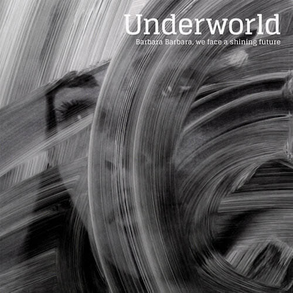
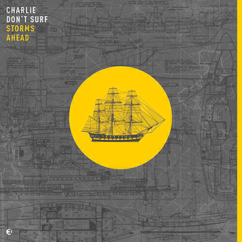
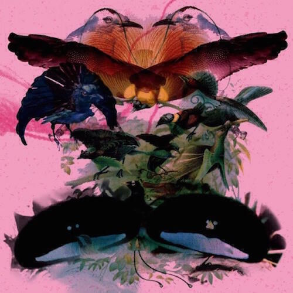

This month's album digest is a mixture of comparisons. First we compare the fortunes of old hands Underworld to even older hands the Pet Shop Boys. After that I've found two dance albums, one that I liked and one that I didn't. I find it quite hard to write about dance music and so the comparison is quite useful. Sometimes it helps to work out why you like one thing and not another.

## Pet Shop Boys "Super"

This month's pop album is "Super" by the Pet Shop Boys. For some it will be a surprise that they are still going but they did spark back to life somewhat with their last release "Electric". This album, by following in the same vein of melding their usual pop sensibilities to 'up to date' electronic music, does not have the novelty value of "Electric" but it is another strong showing nonetheless. This time there aren't as many big pop songs (there are no equivalents here to "Bolshy", "Love is a Bourgeois Construct" or "Thursday") but instead a sense of invention. If "Electric" was the monster, "Super" turns out to be the laboratory.

Some of the experiments are more successful than others. "The Pop Kids" details exactly how the Pet Shop Boys (and most of their fans) have felt for decades about pop music and its power to liberate people from the banality of their everyday lives. It does so in ebullient fashion. "Happiness" misspells its titular emotion for wry comic effect, tittering with tongue in cheek. "Twenty Something" ambles along on a loping beat and sympathetically follows the titular twenty-something through his or her day. It manages to wryly observe the dull minutiae of modern life, just as "West End Girls" did back in the day. I also really like "Pazzo!", a fizzing and fissile instrumental just about held together by sampled vocal snippets. It's short and to the point, like a leaner meaner version of "Axis" from "Electric".

Other experiments are less successful. "The Dictator Decides" attempts to give us Kim Jong Un's interior monologue as a weepy show tune and it only partially succeeds. It's more wishful thinking than insightful geopolitical analysis. "Sad Robot World" isn't as funny as it would like to be and is undermined by Neil Tennant pitching his voice way too high. In my opinion, very few PSB songs benefit when he sings in this way. "Undertow" has a great chorus but is underdeveloped compared to "Pop Kids" and "Twenty Something". The same can also be said of "Inner Sanctum": it's a belter of a tune but the lyric is so underdeveloped they needn't have bothered. While "Pazzo!" also gets by with a minimal lyrics, I guess the repetition of this makes the album feel weaker.

It's a shame that "Twenty Something" and "The Pop Kids" are the only songs that recapture the observational skill that marked their heyday, but it's nice to see that there's still life and experimentation in them. Perhaps the conclusion to the "trilogy" will have more to say.

## Underworld "Barbara Barbara, We Face A Shining Future"

"Barbara Barbara, We Face A Shining Future" is Underworld's eighth album (in the current incarnation that assumes that "Dubnobasswithmyheadman" was their first) and their creativity shows no sign of abating.

The opening trio of the single "I exhale", "If Rah", and "Low Burn" is probably the best Underworld 1-2-3 since "Beaucoup Fish". "I Exhale" has a playful "blah blah blah" chorus and sing-song-spoken verses. "If Rah" comes from a long tradition of Underworld songs that use cut-up vocals (some might say fridge poetry) to present a strange story from multiple points of view. I think it might be about a literal fly on the wall trying to work out the habits of the silly humans he can see. "Low Burn" borrows more than just the word "burn" from "Beautiful Burnout" and is all the more wonderful for it.

"Santiago Cuatro" is the first time that they break from their new template. It's a moody instrumental piece dominated by acoustic guitar and electronic atmospherics. One of the drawbacks of listening to music through streaming services rather than by owning it is that you can't see the sleeve notes. I have no idea if Karl or Rick played the guitar, or if it's a guest, or a sample. Perhaps it's better to just to sit back and listen.

"Motorhome" reminds me of the collaborations between Chemical Brothers and Beth Orton on the Chems' first couple of albums. It's chilled out and has a slow folky vibe but in the background the electronics noodle away. I'd say that it's one of their more successful attempts to meld live instrumentation with electronics. I tend to be agnostic about Karl's more song-like creations, for every "Sola Sistim" we end up with a "Ring Road" now and then, but "Motor Home" isn't too bad and fits in well with the surrounding tracks.

The album closes with a beautiful double-header that returns to the territory of "Low Burn". First "Ova Nova" pulses while Karl softly croons a song of love and redemption over the top. It's the first time that Karl really sings on the album and it's a transcendent moment precisely because it's been stowed away to this point. The end chorus of "every diamond" is yet another one of the many joyous nerve tingling moments their music has given us over the years.

Next comes "Nylon Strung", in which Underworld finally master the art of closing an album in an upbeat way. Looking back through their work, most of their closing tracks have either been sad ("Louisiana" off "Barking", "Stagger" off "Second Toughest in the Infants") or weird and unsatisfactory ("M.E." off "Dubnobasswithmyheadman", "Stagger" off "Beaucoup Fish", "Ess Gee" off "A Hundred Days Off"). But "Nylon Strung" is just beautiful - a slow steady pulse with sweet love struck vocals swooping back and forth.

So much of Underworld's earlier music was couched in the alienation and loneliness of modern life, and how seeking refuge from that just leads you to ever more alienated and lonely places. Now they've settled nicely into a comfortable groove that allows them to demonstrate that things do get better. They show that if you are brave enough to keep inventing and exploring, eventually you find the place you belong.

## Charlie Don't Surf "Storms Ahead"

First things first, I think Charlie Don't Surf is an awful pseudonym to perform under. Especially on Spotify, which doesn't include the apostrophe and therefore makes my inner grammar disciplinarian twitch unnecessarily. There's just something innately odd about appropriating a line from a classic film in this manner.

I discovered this album via a playlist on Spotify called "Electronic concentration". It's full of rather soporific mid-tempo dance music and is designed for when you need a dull thud to drive you along as you do something you don't really want to do. Like writing essays. In that playlist was the "Einmusic Remix" of this album's title track "Storms Ahead". The album itself was released the very week that I'd discovered the playlist, so I decided to give it a listen.

There are plenty of good ideas on the album but they're often drawn out and repeated too much. One of his favourite tricks is to build a track around a mall vocal snippet that expands gradually after many repetitions. It's a fine trick at first but it begins to grate when the majority of the tracks use it.

The album is a curious blend of what one might call "wine bar dance music" and the harder beats that peppered the second Leftfield album. It's a fairly toothless combination in the end and the album sounds a lot like the playlist that led me to it in the first place: a dull thud to drive you along while you do something else.

## Leon Vynehall "Rojus"

In contrast to Charlie Don't Surf, Leon Vynehall's "Rojus" is a joyous and innovative dance album. It is also repetitive at times but the sounds evolve in layers and rely much less on brute force beats. Every time I listen to it the whole thing just flies by.

It sounds a lot like the Oxia album that I reviewed almost four years ago. I struggled to say a lot about that album too, I only know that it feels a lot more relaxed and less macho than the Charlie Don't Surf one. For examples of why, check out "Saxony" which has a languid and funky beat - you can dance to it but it is also relaxing. "Beau Sovreign" is initially a breathy track that builds through repetitive vocal samples into a sleek house track. "Paradisea" is where I began to make the connection to Oxia.

The album culminates in a glorious eight minute track called "Blush" that has a sense of movement that is missing from almost the entirety of "Storms Ahead". It reminds me of a massive pop-dance crossover hit from the mid-90s but for the life of me I can't remember what it is. I will update when I remember what it is.

## Next Month

I think the album digest is back! Next month I'll write about "The Ship" by Brian Eno, "Human Performance" by Parquet Courts, and, with any luck, a brand spanking new album by Radiohead if recent rumblings are anything to go by.
