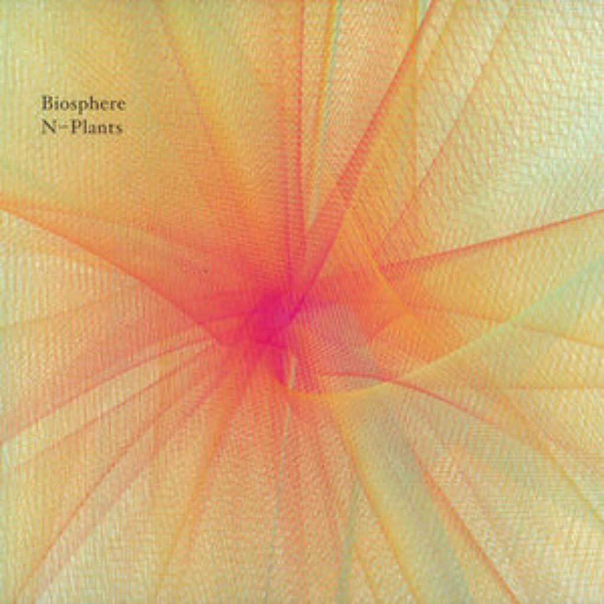
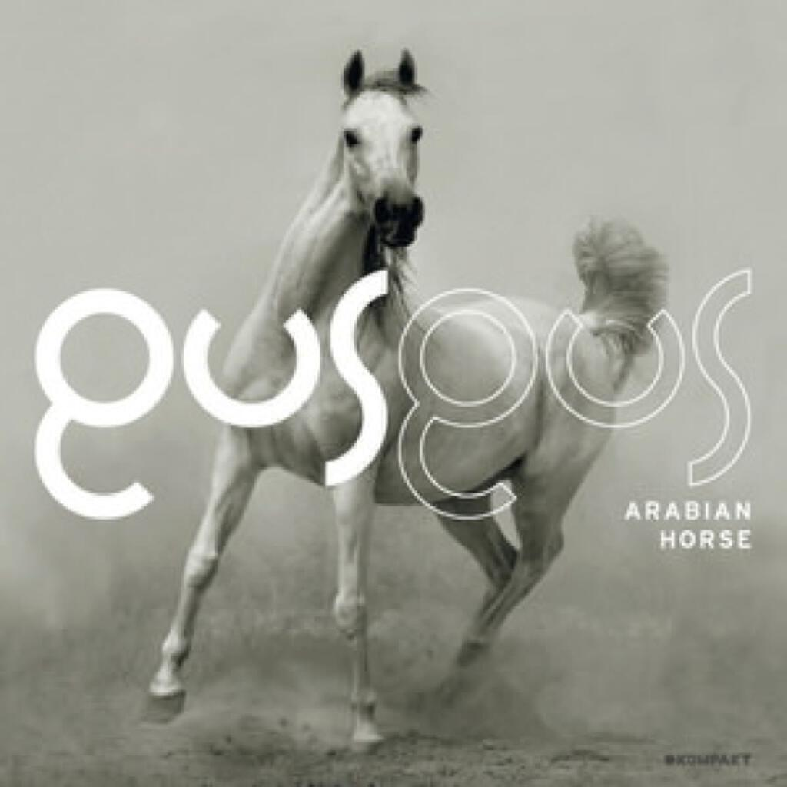
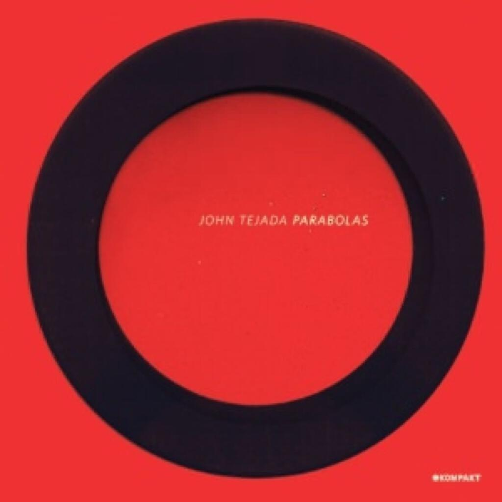

I bought a collection of electronic music this month. I mixed them all up in a smart playlist on iTunes, the smart aspect being to limit to tracks that had been played fewer than five then six then seven times etc. This made sure I was still listening to all the tracks equally often, despite the randomness.

1. Biosphere _N-plants_
2. Ford & Lopatin _Channel Pressure_
3. Gus Gus _Arabian Horse_
4. Instra:Mental _Resolution 653_
5. Jon Tejada _Parabolas_

## Biosphere _N-Plants_

I think this album makes Biosphere the most reviewed musician on this blog at the moment but I don’t mind too much, he makes some great stuff. _N-Plants_ is a series of pieces about Japanese nuclear power plants and was ready for release by about February this year, just before the [Fukishima nuclear disaster](http://en.wikipedia.org/wiki/Fukushima_Daiichi_nuclear_disaster) in March. It ended up being released in June. I am not sure if this represents a delay or not but as this quote shows, [Geir Jenssen is aware of how spooky the timing was](http://www.touchmusic.org.uk/catalogue/to84_biosphere_nplants.html).

It is a fantastic album and it is definitely a set of tunes that celebrates nuculear power rather than seeks to create anxiety about it (Unlike Kraftwerk’s downbeat revisit to _Radioactivity_ say). Each track burbles along with a wonderous sense of precision and something emerges out of the mechanical rhythms that is really rather joyous. Even from the initial hisses and creaks of _Joyo_, a crystalline and shifting tune begins to develop.

Initially I was concerned that a Biosphere album not linked to natural phenomena (compared to [Substrata](uc4) and Cirque) might be too abstract and austere but I like it more and more with every listen.

## Ford & Lopatin _Channel Pressure_

_Channel Pressure_ has been out for a while. Ford & Lopatin originally went under the moniker of Games but were unfortunately undermined by [talentless rapping knob-bucket The Game](http://www.guardian.co.uk/music/2011/aug/15/game-twitter-prank-la-police). A shame because there is a nice 8-bit quality that underpins a lot of the songs on this album. It mainly features angular house music with an 80s vibe and there are plenty of songs that would fit well on the radio. Or would have done if we had experienced anything remotely like a proper summer this year.

As a result, great songs like _Emergency Room_, _World of Regret_ and _Joey Rodgers_ are missing from your life and you should probably do your level best to rectify this. The latter in particular sounds like it should come from the soundtrack to an 80s buddy cop movie and I mean that as high praise. It’s not just the lovely camp vocal but also the genius guitar solo in the middle.

Elsewhere the album is full of little instrumentals and tracks like _Rock Center Paranoia_ and _Dead Jammer_. The former sounds a bit like Giorgio Moroder crossed with Boards of Canada and the latter is not far off that either. These little flourishes and diversions work well both within and between the songs.

There is a lot to admire here and it bears up well to repeat listens. I will be going back to it many times for upcoming walks to and from work, particularly when the sunshine comes back. Meanwhile, can anyone tell me what the heck the song sampled on _Break Inside_ is? Or is it a cover? It seems really familiar. The problem with digital downloads is that often you don’t get a booklet to pore through to see who wrote and performed what.

## Gus Gus _Arabian Horse_

Also released a while ago was _Arabian Horse_, the new album by everyone’s fourth  favourite Icelandic band Gus Gus (after Bjork, Sigur Ros and The Sugarcubes right?). I was amazed when I read on their wikipedia page just how long they had been releasing albums, even though I do remember having a copy of _Polydistortion_ way back in 1999 and it is probably just my fault for forgetting just how fast time has been passing.

Anyway, on to the music. The best tracks for me are the opener _Selfoss_, the title track and _When Your Lover’s Gone_.

_Selfoss_ emerges out of the silence at the start of the album with a subdued but strident beat, it is reminiscent of _Dubnobass…_-era Underworld. Gradually as tetchy fragmented electronics shimmer over the surface it breaks into life around the three minute mark with a trancey break that Tiesto would be proud of. Best of all, it collapses in on itself at the end with a laconic accordian sample. From trance to Tom Waits in ninety seconds, marvellous.

_Arabian Horse_ the song is a bit more straightforward. It begins with a thumping beat and a nice synth sound that could have originated with a recording of a wasp in a bottle. By about a minute in, we have settled into a nice vocal and a house beat. The female chorus line of “More and more sand in my eye / Too bright to even see the sun” is one I have caught myself singing along to quite often.

The other obvious single is *When Your Lover’s Gone”, which has a vocal that sounds very similar to something that Anthony and the Johnsons might produce (I’m thinking of his collaboration with Bjork on her last album). Underneath the vocal another interesting beat and synth combination bounces along. I think that is what I like so much about the album as a whole, the details that appear from under the surface.

## Instra:Mental _Resolution 653_

Next up is _Resolution 653_ by Instra:mental, which I think was released back in May. I am still not sure what to make of this record. I think I admire it but I don’t really like it that much. Take the opening track _Sun Rec_ as an example, it begins with a rather unfriendly sequence built out of some nasty synth sounds but then it loses its nerve about half way through and pads things out with some synth.

A lot of the album reminds me of LFO, who were fantastic at melding interesting sounds to some pretty frenetic beats at times. This means that there are definitely some gems here. _User_ would be a great track without the vocal sample but is just annoying with it present. _Waterfalls_ and Arc get the mix of menace and subtlety dead right though. Meanwhile _Aggro Acid_ would give Aphex Twin a run for his money despite not quite having the deranged charm that makes Aphex’s records such a delight.

I enjoyed dBridge and Instra:mental’s FabricLive mix, which was a little more mellow than this album. Perhaps if I live with it a little longer I will find a bit more to like as well as admire.

## Jon Tejada _Parabolas_

Jon Tejada is another artist I have been introduced to by the fabric series. I also really liked his remix of Bomb The Bass’s _X-Ray Eyes_ last year. That and the fact that his new album has been released on the [Kompakt label](http://www.kompakt.fm/) led me to shelling out for his CD. For the most part, it’s money well spent. Of all the albums above _Parabolas_ is most like the Biosphere album, it is quite mellow and abstract - yet it is also pretty humane and fun.

It is harder to pick out individual tracks for discussion from this album than any of the others previously mentioned. Perhaps the title is a clue, because the album is called _Parabolas_ are we meant to discern some general pattern from the examples presented here? It is certainly the case that the tracks here ebb and flow without changing dramatically, though this is not meant to damn with faint praise (“he’s saying they all sound the same”) rather to exhibit the possibility that exploring variations of themes is sometimes interesting. It certainly works well as a whole and it also dovetails nicely with other tracks from this month’s albums.

I have listened to most of these five albums _en masse_ from a shuffled smart playlist in iTunes and it has been a good listen. The albums are sufficiently similar to cohere well together as a playlist and yet sufficiently different that it doesn’t feel like I’ve just been playing a five hour Jon Tejada album.
