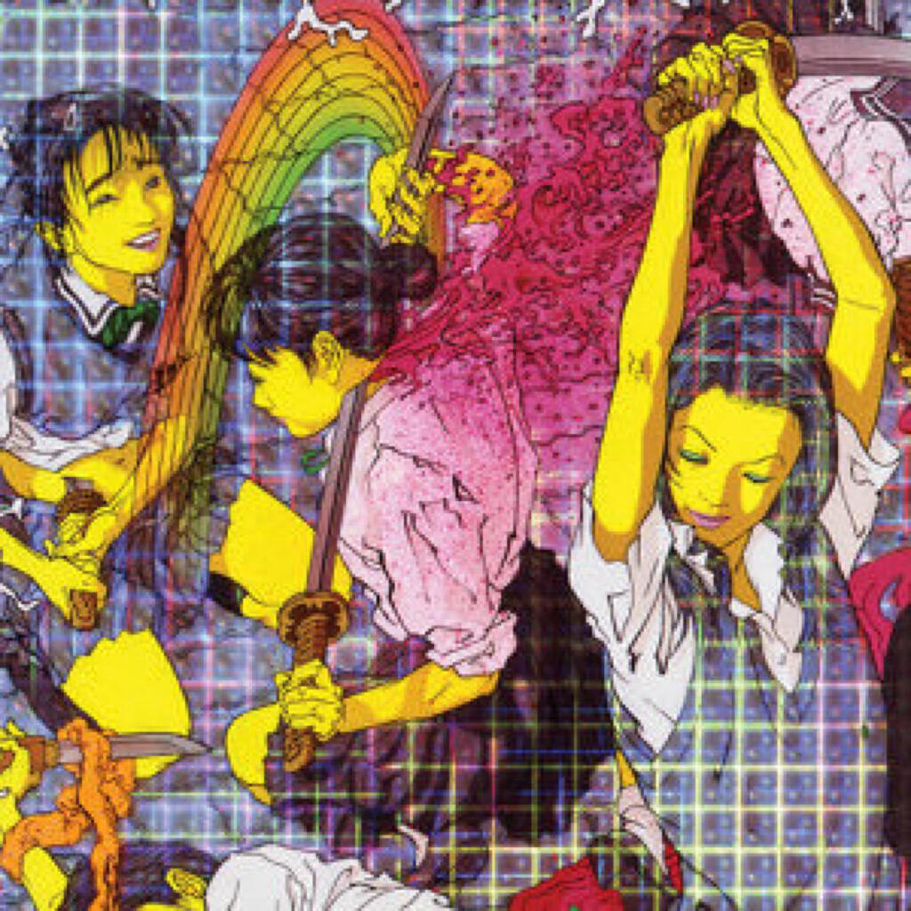
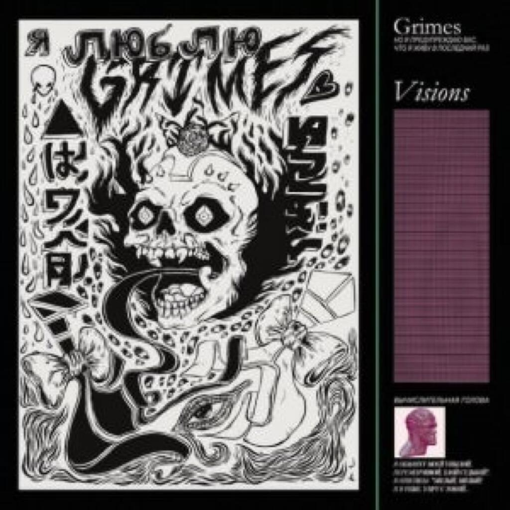
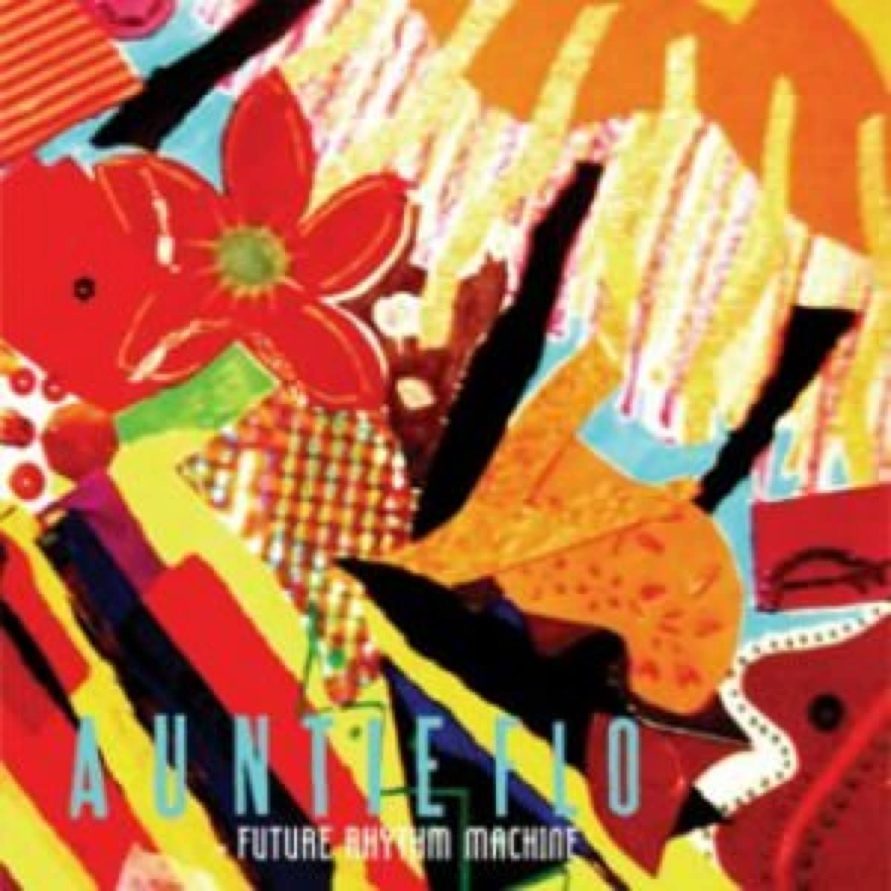
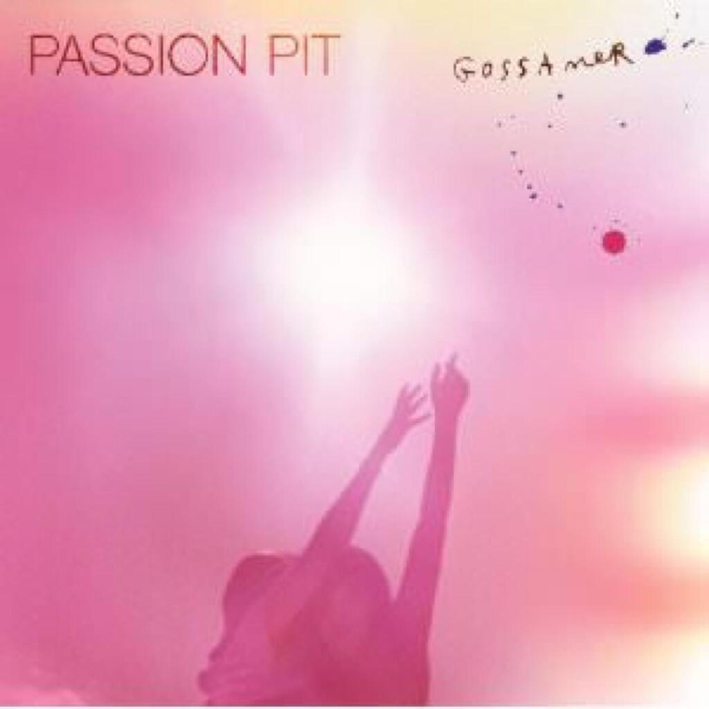

Album Digest August 2012 is also from the stack of albums that I [mentioned last month](album-digest-july-2012). I chose this selection (along with the Passion Pit album) because the colours looked good together in the mosaic of covers that I make each month. Last month’s digest was about the right amount of detail so this will be another briefer digest. These are all good albums but not ones that will change your life, they'll just happily sit alongside it. They are:

1. Laurel Halo _Quarantine_
2. Grimes _Visions_
3. Auntie Flo _Future Rhythm Machine_
4. Passion Pit _Gossamer_

As usual, there’s a playlist at the end but this month it’s in Spotify as I wasn’t able to find any free MP3s of songs from the Passion Pit album. Note also that I write this post while deaf in one ear, so if my descriptions sound skewiff that might be why.

## Laurel Halo “Quarantine”

 I first listened to this album in June and to be totally honest, I was a little underwhelmed. I think I was too perturbed by the artwork featuring Japanese manga schoolgirls committing sepakku surrounded by rainbows. The interior is worse with cartoon guts unspooling everywhere: it makes me feel queasy. After a while I understood how well that queasiness sits with the sound of the album.

The songs on “Quarantine” explore how the cognitive dissonance of listening to songs that are simultaneously beautiful and ugly. At least that is how it seems the first few times. As I became more familiar with the album, the songs seemed to be either match-ups of either a pretty vocal combined with grizzly challenging backing, or a dissonant unappealing vocal paired with pretty blissed-out atmospherics. Towards the end of the album on “Light+Space” this formula changes and all the appealing elements appear together.

With repeated listens I found that many of the elements that I had dismissed as ugly (e.g. the vocal on “Years”) were actually complementing the prettier elements. I got more used to her voice and her sound the more I listened to the album. I began to really enjoy it. “Thaw”, “MK Ultra” and the aforementioned “Light+Space” are my favourite tracks.

## Grimes “Visions”

This is another album with a cover that might put you off. There’s an alien head and the track titles are all weird. It’s as though there is a deliberate attempt to mask just how fun this album is! It's the poppiest album I have heard all year. It’s hard to believe that music this poppy isn’t being beamed into all the places where we could possibly hear music. It's that good. For now though it isn’t and so _Visions_ is still a private party inside my own head. I urge you to track down a copy and join in.

“Genesis”, the first full length song on the album, has a riff that sounds a bit like Kraftwerk’s “Trans Europe Express” and a vocal that sounds like an Enya record back from 1991. You won't believe this but Enya was pretty cool back in 1991. She made concept albums about Saturn's rings. The Kraftwerk-Enya combo seems way too corny to work but it does. The words are completely indecipherable and yet “Genesis” is still a massive ear worm.

Not convinced? What about “Vowels = Space and Time”, which sounds like the songs that Madonna was trying to make all those years when she tried to be cool? A sinuous vocal winds around a funky synth line and it just works. This is the sort of pop music the world needs but rarely gets.

My absolute favourite is “Be A Body”. I love the short and simple lyric (entire first verse: “I close my eyes until I see / I don’t need hands to touch me / Be a body”) but the best bit is the enormous beat that kicks in at 2:00. It’s a song that relies on repetition and layering and these are things that I respond well to.

Overall "Visions" is a fabulous maze of an album. It's full of little of dead ends and intricate details, yet never forgets the sheer pleasure of pop vocals and chunky beats. Many albums these days are po-faced and overly serious but “Visions” is a welcome reminder that albums can still be fun.

## Auntie Flo “Future Rhythm Machine”

 One joy of the [CAN “Lost Tapes” box set](can-the-lost-tapes) is a little track called _E.F.S. 108_. The acronym stands for “Ethnological Forgery Series”, a knowing nod to the creation of exotic-sounding but nonetheless fake ‘ethnic’ music for a western audience. Whether music constructed in this fashion is more or less authentic than music that appropriates existing recordings via sampling is a debate for another day. (One that will in fact be sparked by a forthcoming understated classic, believe it or not.)

Obviously I say all this because “Future Rhythm Machine” also seems subject to this debate. The main features of the album are a set of world-straddling driving beats spannning the distance from London to Rio and then back over to Africa. I feel embarrassed that I don’t know more about afrobeat to be more precise with the geography. It also has a similarly diverse set of vocals. Exceptionally, it is also really concise despite its breadth of influences and underlying energy. I often write in these digests that I like an album that fits entirely in to my walk to work. The album is thirty five minutes long, a party that makes you happy and doesn’t over stay its welcome. Perfect for that walk to work.

It’s not all worldbeat. The last two tracks span a third of the album’s short running time and sound completely different to the rest. Both instrumentals and have a more experimental feel that tapers off the album in a satisfying fashion. “Train” owes a debt to “Different Trains” by Steve Reich and “Futurismo” also has a minimalist vibe. The latter perhaps has too many layers and is too melodic to be confused with a Philip Glass piece, but it does have a very similar insistent pulse. I only mention the change in style because of the short length of the album. Did they run out of ideas? I hope not because I would like to hear more stuff by these guys.

## Passion Pit “Gossamer”

 I keep deriding the maximalist sound of Rustie’s “Glass Swords” album but Passion Pit’s “Gossamer” gives those same maximalist tendencies a run at the pop mainstream. I say mainstream but [the peak UK chart position of “Gossamer” was number 56](http://en.wikipedia.org/wiki/Gossamer_(album)#Charts). For an album of melodramatic pop songs that chart the fall of a relationship, the maximal approach works really well.

The opening track “Take A Walk” is a highlight, charting a whole life story in four and a half minutes. It tells a tale of an immigrant family who end up undone by their ambitions. I’ve adopted it as the sound track to my summer because of my fondness for choruses with an “oh oh oh” line. I have probably mentioned this fondness before. I really like “Carried Away” because its cheeky tale of postgraduate seduction reminds me of PhD days (albeit with rose tinted lenses).

Elsewhere, too much psychological damage is in evidence for the whole album to truly be a comfortable listen. Examples include lines like: “I drink a gin and take a couple of my pills” (“I’ll Be Alright”); “And now I’m drunker than before, they told me drinking doesn’t make me nice” (“Constant Conversations”); “Yes I drank all those drinks on my own / My life’s become some blurry little quest” (“Cry Like A Ghost”); and “Sorry I couldn’t be there, I was tied to a rocking chair / I was beat down to a pulp rocking back and forth somewhere” (“It’s Not My Fault I’m Happy”). I think albums which explore the break up of relationships are always going to be pretty raw for me and this one seems rawer than most.

Overall, “Gossamer” is as a well-produced set of dark songs that glow in the shadows of uncomfortably colourful illuminations. I have a feeling that apart from “Take A Walk” I may have forgotten all about this album by this time next year. I hope not.
