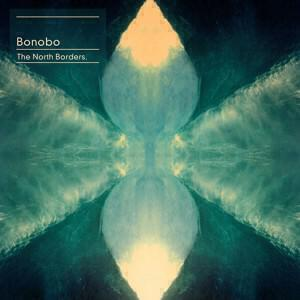
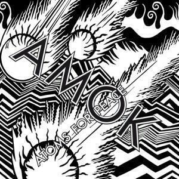

For reasons that will become apparent, there will be a short period soon where I will not be writing album digests. Until then, I'm clearing a backlog of some albums that I've been listening to but haven't had enough time or motivation to write about. Only one of this month's albums was released this month, something that's not that uncommon at this time of the year as it is not the best time to release things. Here's the list:

1. Washed Out "Paracosm"
2. Bonobo "The North Borders"
3. Atoms For Peace "AMOK"

## Washed Out "Paracosm"

'n I wanted to like this so much more. I am certainly very happy with it, but after a while I had to work out why I was hardly bothering to listen to it. I've decided that I don't think it is better (as a whole) than his first album "Within and Without". It starts really well: the opening swirls of ambient noise and a big knowing wink of a harp sample lead into the wonderful single "It All Feels Right". At this point it feels like the smooch-fest of "Within and Without" has, with a red face and sweaty sex hair, made it back to the party with the aim of sipping mojitos in the garden. It's really pretty and fun and good natured: for me "It All Feels Right" has been one of the songs of the summer.

This momentum gets backed up by another great song "Don't Give Up": it's all sweet vocals and interesting low end before a pretty strong chorus kicks in (for a Washed Out record). After that song though, the album becomes a bit anonymous and the samples of party noise that are woven between the songs, which must have sounded like a good idea at the time, just come across as a bit annoying.

The problem with a record about having a good time is that it has to make you feel like you are having a good time too, or you're not really going to like it or remember it. "Within and Without" was great because even thought it _was_ as if two people were getting their freak on in the room with you, it at least felt like a threesome: most of "Paracosm" feels more like gatecrashing a couple's date and having to listen to them tell anecdotes about a holiday they went on which was way better than yours. By the end of "Weightless" (the third proper song!) you start to wonder if they even need you there at all...

It's not a complete wash out though (see what I did there?!?!?): "All I Know" turns the dial labelled "pop mode" all the way to the right and is pretty fun (check out the amazing instrumental middle 8!), and "Falling Back" is pretty sweet: the backing has a cool twitchiness to it, although I'm still in two minds about the hipster-ish clapping and party whoops at the end. It also has an absolutely beautiful coda that makes up for that, it's all swooning twinkles that make you think that the last track has already started.

The closing track "All Over Now" leads out of that wonderful coda to "All I Know" and doesn't squander it, instead playing out the album with the track that's probably closest to "Within and Without" in spirit. I feel a bit bad about feeling good about how the new album finishes sounding closer to the first one, it doesn't feel like I am being an open minded music fan to be pleased by a retrograde step like that. Nevertheless, "Paracosm" is a mixed bag and, to my ears, a little bit of a backward step. However, the (very) good bits are good enough make me think that it will be worth checking out whatever he might do next.

## Bonobo "The North Borders"

This album is great. It is the first album that I have come across by Bonobo. Apparently his previous album "Black Sands" is even better; I have listened to it a couple of times but not enough to make a decent comparison. "The North Borders" was released a while ago but for some reason it did not appear on Spotify. I think a couple of singles were released to Spotify, which is why I knew the album was worth chasing. Either that or I'd heard a few samples on iTunes. This month I finally managed to get a listen to it on Spotify and slowly fell in love with it. It's an album as suited to the bleary-eyed walk to work as it is to meandering through some debugging as it is to switching off the light and drifting away.

As you might predict, "The North Borders" is pretty mellow. From the outset you get music that is by turns soulful (opener "First Fires"), laid-back (follow-on "Emkay" with its layers of vocal samples), and mysterious (third track "Cirrus"). However, there is all kind of satisfying detail and structure too: these tracks reward active listening as much as they do passive sessions where you put the headphones on and do something else. "Cirrus" for instance has these lovely layers of drones and bass lines that fold in and out of the mix, above and beneath one another, underpinned by some interesting synth chimes and insistent drum patters. In the grand scheme of the entirety of "The North Borders", "Cirrus" seems at first listen to just be there to connect track two to track four, and yet on repeat listens it's very rewarding and is it's own internally consistent sound world.

In fact, if Bonobo mis-steps at all throughout it's in attempting to plant that hoary staple of dance albums -- the "proper song" -- throughout the track listing. For example, Erykah Badu collab "Heaven For The Sinner" seems to be both a misuse of her talents and his as it isn't a particularly brilliant song (as songs go) and as a track it only really gets fun once it opens up in the last minute and starts to sample itself, falling down and repeating snippets of the vocal line over the collapsing music box backing. By contrast "Sapphire", which follows next, is an almost entirely instrumental track and quickly sets to work at being a pretty groove-laden track that goes some way to disproving any initial hunch that "The North Borders" might prove to be an inert album that's slightly too chilled out. The vocal samples and the bass line are busy and intricate, as well as beautiful.

After that the formula is established and it just gets mucked about with for the remainder of the album. "Jets" has a tasteful jazzy tinge like something Roni Size might have done in this genre (there's also a really satisfying grind of a bass line at points), "Towers" steps into trip-hop territory to make 1999 sound even better than you remember it (this is the way to do vocal tracks on albums like these: keep it simple, sweet, and short), while "Don't Wait" and "Know You" both split the difference between Burial and Four Tet with processed vocals and confident arrangements. The feel here is very much sun-dappled forest glades, which is admittedly rather different to the actual collaboration between Burial and Four Tet (it was all glowering shades and moodiness in case you were asking: do check it out if you haven't already, it's brilliant).

If this track-by-track description of "The North Borders" makes it sound like it starts to tail off and repeat itself, maybe it does do that a little but I don't think that it's to the detriment of the album as a whole. If you read a few of my reviews of albums, you'll notice that I favour albums that are a consistent experience and are interesting all the way through (see the Washed Out review above for what I think when this fails). I think that "The North Borders" is both of these and even though I thought it sounded a little samey at first, it's grown on me a lot as I listened to it more (much more). If you like Burial and Four Tet, I think you will find it a treat.

## Atoms For Peace "AMOK"

Atoms For Peace is a supergroup formed by Thom Yorke, ostensibly to perform songs from his (very good) solo album "The Earaser" in a live setting. "AMOK" follows up "The Eraser" in a very similar vein and has been out since February. Back then I listened to it on Spotify and decided that it wasn't worth getting a copy, well at least until Record Store Day when I saw a copy of the limited edition CD and fell in love with it as an object. Recently Thom Yorke and Nigel Godrich have been very vocal about withdrawing their music from Spotify because of the poor royalties that the service offers to new artists. I guess the fact that I bought a physical copy because the actual thing was remarkably pretty is part of another argument entirely but these reviews are largely underpinned by finding stuff I like on Spotify so that I can write enthusiastically.

Musically, I have already summed up "AMOK" as "more of the same" but on a closer listen you can hear that it is slightly looser and more relaxed because it is based on jams by a live band. I find it hard to believe that all of it is performed live (but apparently it is) but I certainly believe that a lot of it is. Some of the "Amnesiac" era Radiohead B-sides (like "Kinetic" and "The Amazing Sounds Of Orgy") are very much the sound of a band trying to replicate live the sound of an electronic act. In fact, that's been the main source of much of Radiohead's success between 1997's "OK Computer" and today. Here, there's a more overt attempt to precisely replicate the clicks and samples of modern music and to incorporate them into interesting songs.

Whereas "The Eraser" mostly hectored about climate change and the Iraq war, "AMOK" (despite its title) seems to be a mellower and happier record. There's a certain dark edge to tracks like "Before My Very Eyes" and "Unless" but the songs seem to be mostly focussed on the idea that you catch more flies with honey. Just as "King Of Limbs" features a lot of straight out sweet love songs, "AMOK" is stacked with interesting arrangements and songs you can croon along to. While it is probably a good thing that someone tried to write a sensible pop song about the death of weapons inspector Dr. David Kelly, it's not going to be something you can comfortably enjoy while taking a long train journey (that's ok, you are not supposed to be able to). "AMOK" is a good album and I think it's a bit better than "The Eraser", even if it feels a little like the sharper edges have been smoothed off of Thom's songs.

Let's come back to that Spotify thing. I understand the point that they are making: the figures that get released by small artists about how much they get paid are shocking. What we don't see is what the same artists might be getting from their album sales and from their gigs, but of course we are told that one of the reasons that Spotify exists is because people don't buy albums and because it is hard for smaller bands to make a profit from their tours.

The simple fact is that Spotify should charge its advertisers and its customers more. £10 a month to play unlimited albums is too low. Twice that would be too low to give artists the royalties they deserve. Spotify has obviously decided that the only way to persuade people (and advertisers) to sign up is to keep the prices ridiculously low but the very existence of a free tier is always going to undermine both them and the artists. It's OK for Apple, Amazon, and Google to pay smaller amounts to artists because these are (supposed to be) plays of material that the user of the service has already (indirectly) paid the artist for, but Spotify has to face up to the reality of what the service they are offering actually means for artists. This means abolishing the free tier altogether and at least doubling the prices of its premium offering. Would I still be a user of that service? Probably not, I'd probably go back to taking a punt on three or four albums a month instead.
