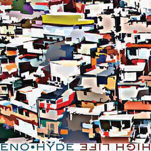
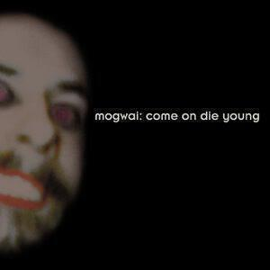

The album digest returns with five albums by four artists.

1. Karl Hyde & Brian Eno *Someday World* & *HIGH-LIFE*
2. Lone *Reality Testing*
3. FKA twigs *LP1*
4. Mogwai *Come On Die Young: Appendix*

## Karl Hyde & Brian Eno *Someday World* & *HIGH-LIFE*

I’m a big fan of both Karl Hyde’s work with Underworld and of Brian Eno’s stuff so Someday World seemed like a dream collaboration to me when it was released last May. I was a bit underwhelmed by it, to the point of overlooking it for [May’s album digest](/album-digest-may-2014/). Last month they released a follow-up called High-Life, which includes some of the more experimental tracks they’d worked on. Together the two albums are greater than the some of their parts, so I’m writing about both of them together this month.

Someday World is improved with the hindsight that High-Life offers but it was a pretty decent album to begin with. It is song-based and so I assume that Brian Eno’s influence is more hidden in the details and it is these that emerge in High-Life, which is looser and more jam-based. Anyway there are some cracking songs on Someday World, it just runs out of steam toward the end. “The Satellites” would have graced any of the last four Underworld albums, “Daddy’s Car” is a sweet bit of summery nostalgia, and “Witness” demonstrates that all those spoken word sequences on Underworld records weren’t entirely down to Rick Smith after all.

High-Life offers longer tracks and just one full-blown song, “Cells & Bells”, which closes the album. Instead there’s the upbeat and funky “DBF” with its sinuous guitar riff that’s ripe for a remix by someone like Daphni and the gorgeous nine minute stretch of “Lilac”, which is one of those gorgeous open-ended pieces that Underworld used to be so fond of making before they went all pop on Barking.

So this is a good pair of albums that complement each other - after listening to High-Life you can appreciate the more technical aspects of Someday World that are hidden by the more conventional songwriting. Meanwhile Someday World helps invest the more abstract moments of High-Life with emotional meaning. They aren’t quite complementary but each certainly enhances the other. Could they be compressed into a single album? Probably not. By releasing two, Karl Hyde and Brian Eno have given us the best of both worlds without making too many artistic compromises.

## Lone *Reality Testing*

I really like Lone’s music but I have no idea how to write about it so this may be a rather short review. I had the same problem with his last album “Galaxy Garden” in 2012, I loved it and listened to it loads but despite plans to write about it, I never managed to find the way to write about it in an album digest.

I would describe the music on “Reality Testing” as being a bit like a Mondrian painting - Lone abstracts dance music into something so structured and polished that you can’t help but admire it, much in a way that Mondrian’s compositions turn painting into something algebraic and modern. Nevertheless it’s very hard to explain what a Mondrian painting _is_ and _expresses_, and I find the same to be true of Lone’s music.

Everything sounds like a million dollars. There are huge diving synth sweeps, housy piano licks, muscular hip-hop beats, even the tropes of drum’n’bass. It’s all glossy and warm, like something that should soundtrack footage of a trendy holiday destination. I always see Lisbon or San Francisco’s trams when I listen to tracks like “Restless City”.

There are plenty of easy references to spot, like the Future Sound Of London on “Aurora Northern Quarter”, and The Go Team on “2 is 8”. The centrepiece “Airglow Fires” is as smart and sensible a piece of dance music as you could wish for, aimed square at the dance floor and good times like a slightly less frenetic Disclosure track.

So yes, I like this, it’s so perfect and well-made, but it’s hard to actually describe the emotion involved. Perhaps eventually I’ll grok it better, perhaps no one is meant to. Perhaps it is just enough to enjoy it and why not, “Reality Testing” certainly is an enjoyable album.

## FKA twigs *LP1*

After a month or so I am still not sure about twigs’ début album LP1. I am convinced it’s a unique sounding album and it has to be commended for its daring approach. The way she flits from dirty talk on “Two Weeks” to cooing sweetly on “Pendulum” demonstrates that she has a lot of ground she can cover. Nonetheless it’s also uneven, perhaps by design, and at first all the trapdoor beats and pitch-shifted vocals make it hard to settle in close to the songs and enjoy them.

Listening to LP1 made me think about how my relationship to new music has changed in recent years. This album has come along much hyped and I found it quite disappointing at first: I thought of it as a mere re-tread of [Tricky’s Maxinequaye nearly twenty years on](http://www.theguardian.com/music/2009/nov/01/tricky-maxinquaye-reissue-review) but without any of the eccentricities that made Tricky’s debut seem so new and dangerous. But what if it seemed that way because I was young and naïve? Perhaps I am too old for this sort of thing. Her tunes are postmodern and deconstructed, all shiny and new, and that has always been a young person’s game. However the ideas underpinning the songs are pretty standard: they’re about sex, fame, and ennui. Saying what’s been said before but with sleeker, trendier, beats doesn’t automatically make something interesting or valuable.

In fact when she swings closer to existing records and doesn’t try so hard she has more success. “Numbers” is a fantastic song that sounds [like early Portishead](http://songmeanings.com/songs/view/6570/) and as it progresses she starts to break down all its elements. With a decent tune and a reference point, it’s easier to understand her experiments with the beats and the voices.

The songs crammed with crazier ideas are worth persevering with. “Two Weeks” throws everything at you as though twigs has everything to prove: think of an X Factor audition performed with music production software rather than vocal histrionics. When she duets with a chipmunked version of herself on “Closer” it makes no sense in terms of the song but it does sound really cool. “Kicks” introduces more chipmunks while also incorporating mutant samples of her voice into the backing track, this is probably [what Björk was going for with Medulla](http://www.bbc.co.uk/music/reviews/mh63).

As I said, I am not sure about this album. It’s possible that in a year’s time I will completely understand all these songs and know them inside and out but it will obviously take a while for them all to bed down. I think it’s worth sticking with. I do believe in twigs as an artist and I don’t think I would have bothered to mention Tricky, Portishead, and Björk if I didn’t. I predict that LP2 will be better than LP1 and once she’s pinned down her sound, I think she will write fantastic songs.

## Mogwai *Come On Die Young: Appendix*

My beautiful vinyl box set of the Come On Die Young remaster finally arrived and, as promised, here are some notes on the bonus material, or “appendix” as the box would have it.

I really like the two songs that I’d not heard before “Nick Drake” and “Hugh Dallas”. I think they’ve been released before but I’d not heard them. “Nick Drake” sounds a lot like other tracks on CODY, perhaps a little more chilled, I think it was dropped from the track list quite late. It opens the appendix album and I think this makes me think of it fitting well near the start of CODY, perhaps nestled in between the title track and “Helps Both Ways”. “[Hugh Dallas](http://en.wikipedia.org/wiki/Hugh_Dallas)” is longer and more open-ended, certainly more subtle than any of the longer tracks on the album proper, it has a soft vocal and I think it’s even better than “cody”.

The demo of “Helps Both Ways” is included and features its original American Football sample that didn’t get cleared for the album, it includes the line “he helps both ways” and explains the title. Personally I prefer the album version for all the reasons I gave in my [understated classics post](/uc26/). Elsewhere the other demos for tracks that later appeared on CODY are almost all more muted than the finished versions and demonstrate the fantastic job the band did with Dave Friedman on opening up the tracks and making them more expansive - the demos feel flatter and without as much space. Sometimes they are more melodic, as with the version of “Ex-Cowboy” in which the quiet-loud dynamics of the finished track barely appear.

It’s also good to have the tracks from the “Travels In Constants EP” again as I lost my copy a while back, I think it was a loan made permanent somewhere. “Arundel” is creepy and stately, all piano and effects pedal.

Overall the material in the appendix is far better than I was expected it to be and makes for almost as good a listen as its parent album. You get so many reissues where the bonus material is an afterthought but here it’s a delight to listen to. I'm really glad that I invested in the box set.

## Album Digest August 2014 - Digested

Here’s a playlist of this month’s albums so that you can listen along at home. It sounds pretty good shuffled; the Mogwai tracks stand out a bit but they are older than the others (and demos at that).

Next month will definitely feature an album called “Punish, Honey” by Vessel. I’ve heard a track from it called “Red Sex” and it is amazing. I will probably write about “LOSE” by Cymbals Eat Guitars too because there is a dearth of quality guitar rock at the moment and “LOSE” sounds pretty good.
