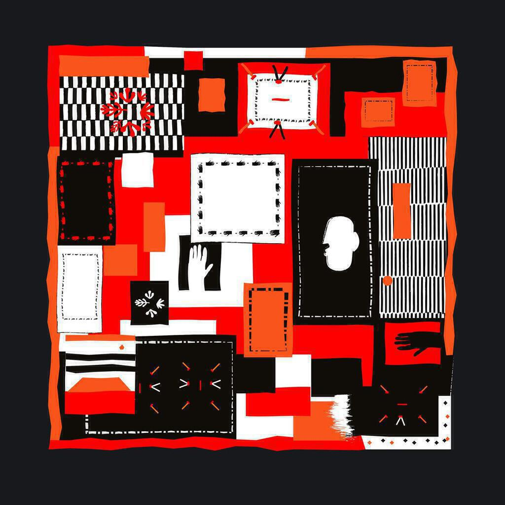
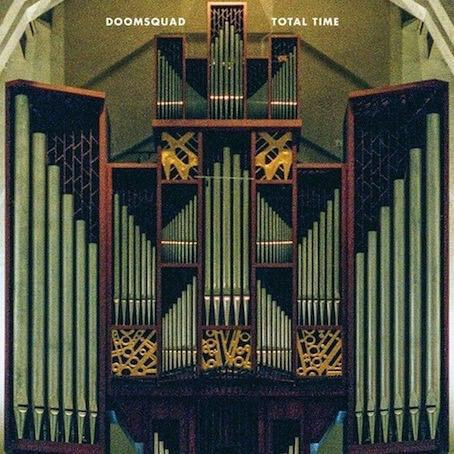
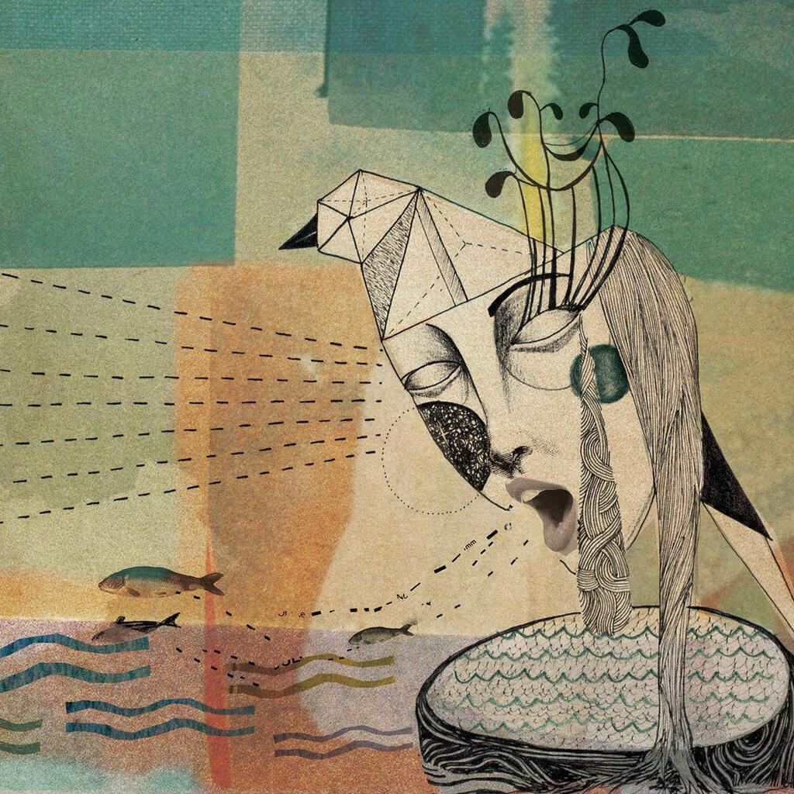

As I mentioned in yesterday's post, I allowed Spotify to pick some new albums for me this month. It chose some noodly ambient techno, a captivating slice of World Jazz, a moody gothic hallucination, and a concept album about humans being rescued by aliens. All in all a pretty good job! Here is the list:

  1. Prins Thomas "Principe del Norte"
  2. Sarathy Korwar "Day to Day"
  3. Doomsquad "Total Time"
  4. United Vibrations "The Myth of the Golden Ratio"

## Prins Thomas "Principe del Norte"

 [Prins Thomas recently remixed the Orb's "Alpine EP"](/orb-alpine-diskomiks-sin-in-space-pt-2/) so I'm not surprised that Spotify included one of his tracks on my Discover Weekly playlist. The connection was obviously waiting to be made. "Principe del Norte" was released back in March and features 9 tracks over almost 90 minutes. Each track title is a single letter, save the first two which are labelled A1 and A2. I think it was B that caught my attention, a proper old school ambient tune but one with some teeth.

But let's go back to the beginning. A1 and A2 each unfurl slowly with rippling synth lines. Both tracks feel like cousins of one another. A2 is the darker, meatier underside of the two. I must confess about half the times I have listened to this album, I have fallen asleep by the end of these two. This is not to say that they are soporific, just pretty hypnotic.

B is the most complete and song-like piece on the album. It may last for nearly twelve minutes but it uses the time methodically, from a chiming start to some melodic bass lines throughout. It's music that soundtracks you doing other things but it is also pretty enough to pay attention to.

C is even longer, smearing a sneering synth sound that the Aphex Twin would be proud of all over its fourteen minutes. Toward the end there's a euphoric little riff that's both intense and minimal channelling Philip Glass all the while. D builds out of hissing drones and a metallic synth line into a twitchy techno track, retooling the fine filigree loops of A1.

Each successive track adds a new element to the overall formula and yet the tracks do not simply retread their predecessors' ground (with the possible exception of A2 after A1). Instead they build over one another, usually using a new bass or synth line to get each track started before borrowing bits and bobs from the tracks before.

E motors along on a funky Moroder-esque bass line, speeding up the initial twitchy elements of D and setting them against the charming bass lines of B. Later on it too has appropriated the chiming loops used in A1 and A2.

F shuffles into your ears on a strident almost-house beat that then starts to sink under a hiss, while a bizarre rise-and-fall synth line struggles to be heard over it. It too has an almost song-like quality in places, particularly in the guitar-sounding interludes.

G and H are both over thirteen minutes long. G begins as a techno stomper with doof doof beats and a wishy-washy trance synth, building delicately into something quite powerful and beautiful. It's about as animated as ambient music can get, reminiscent of that fantastic Orb remix of Keiichi Suzuzi's Satellite Serenade. Towards the end it shimmers into something quieter, again influenced by the ringing keyboard washes of A1.

H starts with hand claps and the burbling dark synth lines that you first hear hidden in the depths of A2. It builds into a midtempo progressive house track, again flirting with the cusp of what can really be called ambient music. It's very beaty, yet it too eventually starts to break up and fall away.

Principe del Norte is very satisfying as an album in its entirety because you get to hear several ideas being pulled around and fleshed out before your very ears. Every time it begins to feel familiar, you notice some new element that makes that track seem fresh and new. That said, it captures your attention rather than insists on it. As I mentioned above, it's more music for doing things to than music that insists on being appreciated for its own sake.

## Sarathy Korwar "Day to Day"

 Sarathy Korwar is an American composer and percussionist raised in India. He plays the tabla and studied music at SOAS in London. His interests include the arrangement of traditional Indian percussion on western instruments.

"Day to Day" was part-funded by a bursary from the Steve Reid Foundation and Sarathy has received guidance from the likes of Kieran Hebden (AKA Fourtet) and Gilles Petersen. Released on Ninja Tune, a label renowned for releasing interesting material, the album blends western jazz and electronica with field recordings of Sidi musicians from India.

The track "Bismillah" appeared on my Discover Weekly playlist and I was struck by how unusual it sounded. This drove me to explore the whole album, of which "Bismillah" is broadly representative. Drawing on my fondness for long expansive tracks, "Bismillah" allies the field recordings to a relaxed jazz backing. It feels loose and chilled, even when things pick up in the middle. There is also a lovely little guitar line that weaves into the mix just before the five-minute mark. It's good morning music.

Despite being built around samples of Sidi musicians, Korwar doesn't limit himself to that particular sound palette, so "Dreaming" feels like it is from the Outback and the nagging minimal pulses of "Indefinite Leave to Remain" flesh out that loaded term. I love the shimmering guitar intro to "Karam", which - like any beautiful piece of art - needs no context for you to simply enjoy its beauty.

The Sidi people are descendents of people who migrated from Africa to India along trade routes before 1000 BCE. This makes "Day to Day" with its patchwork of migrated musical patterns an interesting comment on the power of migration to blend people and their cultures together. And yet it succeeds as interesting and captivating music despite this information about its creation. Music that brings us away from the normal and the everyday, toward new places and new thinking, is always good for the soul. This short bright album is just that sort of music.

## Doomsquad "Total Time"

 Doomsquad are a Canadian group on the Bella Union label. According to my reading "Total Time" was recorded in Mexico and inspired by local myths and customs. All I know is that this is an interesting album crammed packed with ideas, even if it does run out of steam a bit the middle.

The opening track "Who Owns Noon In Sandusky?" (no, I don't get the title either) is one of the most arresting songs I've heard all year. It has this sexy swivelling beat that has a bhangra/Timbaland feel to it. The lyrics are all about confronting naked beauty though they're quite hard to parse.

"Pyramids on Mars" takes on the gothic techno vibe, binding another compelling beat to an interesting lyric about possession and domination. The band aren't afraid to explore the musical sound worlds of these songs, some bands feel the need to cram loads of lyrics into songs like these and it's good that Doomsquad invest as much effort into atmosphere as they do songcraft.

The entire first half of the album is front loaded in this way. "Collective Insanity" is built not on a beat but a drone that sneers its way through the first minute of the song before the drums and vocals enter. It's an interesting turn of pace and they manage it well, creating a truly creepy song that feels like a spectre raised from the sexy black magic of the previous two. Meanwhile "It's the nail that counts, not the rope" manages to live up to its fantastic title, a relentless pulse building up to the shouted line of "this is the mark the fire gave me, you motherfucker!". "Solar Ass" is probably both the best and sexiest song about a donkey ever written. Any alternative suggestions for either title on a postcard please. Any song that can get me humming "my burro / my hero / my ass" to myself while I make a cup of tea at work gets my vote.

There are some minor missteps in the second half. "Farmer's Almanac" has a pleasant dubby feel but it drags on too long - a longer track later on feels shorter than this one. "The Very Large Array" pulses and sighs but doesn't really go anywhere.

Things pick up again with "Eat the Love". It is brimful of unsettling sounds and lyrics, throbbing with an intensity that consumes the track in a pre-chorus of "Fire". There's some excellent little riffs throughout and the true chorus of "Open up your mouth / and chew the sun / open up your mouth / swallow the moon" is probably the most immediate on the entire record. That just leaves "Russian Gaze", an inessential and noisy spoken word track that closes the album.

I can't help wondering why Spotify picked out "Why Owns Noon in Sandusky?" for me. A lot of the songs on my Discover Weekly have occult or gothic themes, yet I wouldn't necessarily think of myself as having those particular interests. Maybe I do. Maybe I should wear more black. And eyeliner. Definitely more eyeliner. That said, despite their name (and terrifying website) Doomsquad don't seem that scary or goth to me. Just perplexing and interesting, and at the end of the day that's probably what I like the most.

## United Vibrations "The Myth of the Golden Ratio"

 This is my favourite of the albums that Spotify picked out for me. I even bought a copy on vinyl. United Vibrations are a group from London who have already released a couple of albums (which I will check out soon). "The Myth of the Golden Ratio" is their coming-of-age album. It comes with a little short story that describes the concept of the album. Basically, humans in love with nature fall out of love with nature, then a shaman calls in some aliens to fix them.

I put this attention on the concept because one day while we listened to it Ingrid asked if it was a musical. Up to that point I hadn't really noticed that aspect of it, I'd just been enjoying the songs. "Sofia", the song that Spotify had included in my playlist, is particularly good. Also, despite having words in Greek, it stands alone from the concept and therefore it's the most accessible track on the album.

Whether you like concept albums or not, there are some lovely moments on "Myth..." that transcend the thread running through it. It's not hard to hear the beautiful voices at the end of "Grow" or the joy that coruscates through the chorus of "Far Away Pt. 2". You have to listen a wee bit harder to grasp what is being said in "Far Away Pt. 3" and to really feel the existential message of "Golden". That message is quite profound and goes beyond the ecological theme of the album: if you find what you're looking for, you might not know that you have because you'll be a different person transformed by your discovery.

And if you really buy into the concept then you'll love the barmier tracks like "Scion" and "I Am We". The chorus of the latter may not have been properly thought through and it's deadly catchy too, don't say I didn't warn you. You'll also find it hard to resist the intense drumming and chants of "Twister".

To conclude, it's brilliant to discover an album that is so joyous and themed along self-empowerment and the desire to improve the predicament of the planet. If you're a skeptic, you'll find it challenging, but the rest of us will be dancing.

## Spotify Playlist

All four hours of it!

https://open.spotify.com/user/mattischrome/playlist/3lJDODzvCwldpr7dMgf8GO
