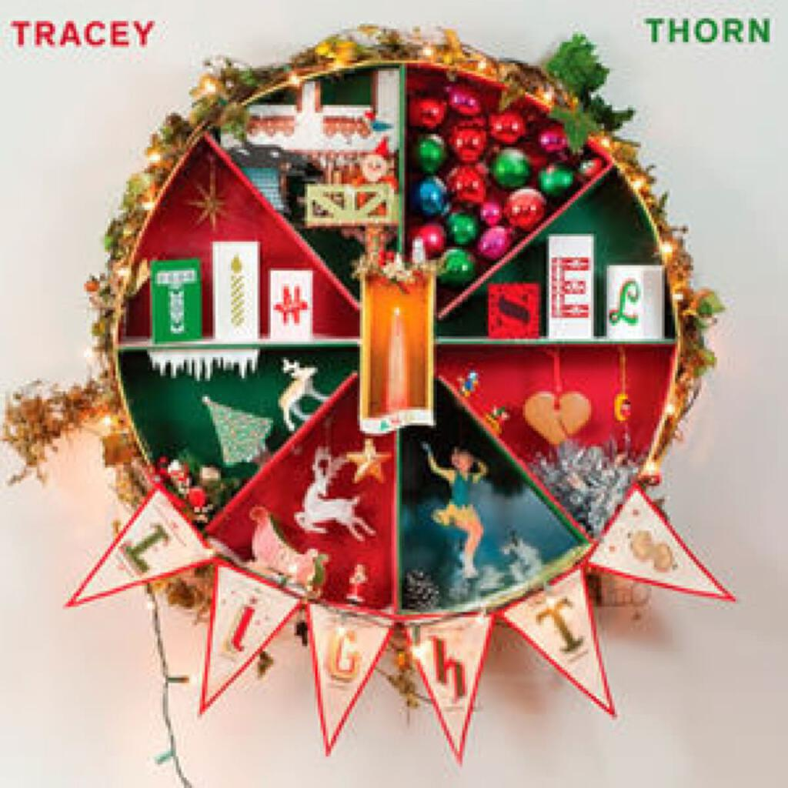
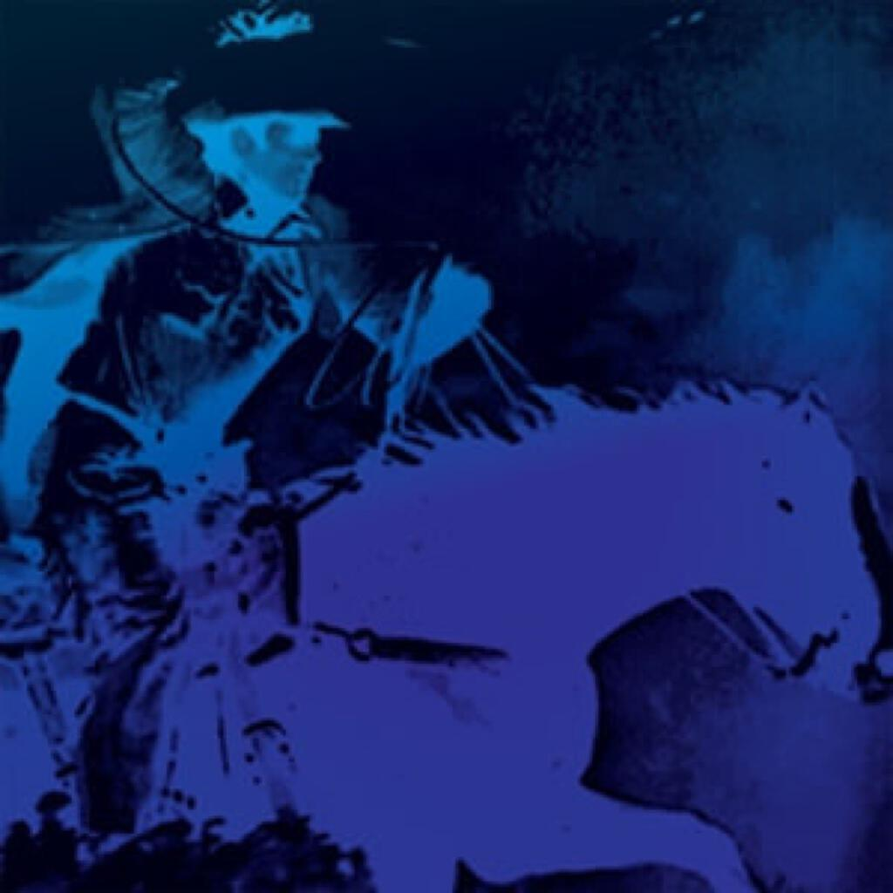

Three albums (one very Christmassey one!) and an EP this month.

1. Tracey Thorn “Tinsel and Lights”
2. Woob “Have Landed”
3. Tim Hecker and Daniel Lopatin “Instrumental Tourist”
4. Burial “Truant / Rough Sleeper

## Tracey Thorn “Tinsel and Lights”

“Tinsel and Lights” is that rarest of records, a Christmas record that is perfectly suited to the season and is not in any way overbearing or irritating. Most albums that are Christmas themed are usually centred on lots of covers that are taken from a small subset of well worn classics. The songs on “Tinsel And Lights” are either originals or slightly more obscure covers and this works to its great advantage. The most famous song here (“Have yourself a merry little Christmas” aside) is probably the White Stripes’ “In The Cold Cold Night” and that’s not really a Christmas song (though it works better here than I’d anticipated).

The tone throughout is quiet and intimate, an antidote to the gaudier chintzier Christmas fare that abounds at this time of year. The tone is pretty melancholy, but not to the point of being miserable. Opener “Joy” gets right to the heart of why Christmas works even for the most irreligious of people (including myself): “you loved it as a kid / and now you need it more than you ever did / because of the dark / we see the beauty in the spark” and “Like A Snowman” hits a sweet sad note about a relationship that’s melting away: “give me your love or something / knowing how soon it’ll fade away / like a snowman”.

I think it tails off a little bit at the end but that might just be because it starts out so strongly. It’s quite a short album, one of those ones that fades out almost as soon as its begun. If you’re getting the mulled wine out again, it might be worth putting it on repeat. I put it on quite late at my sister’s over Christmas and I think it’s the first time she’s said “that’s nice” about something that I’ve introduced her to. Well the first time in a while anyway!

## Woob “Have Landed”

[Last month I wrote about “Woob 2”](/uc21/) shortly after finding out about the existence of this, the third (fourth?) Woob album. The previous albums have been long languid ambient affairs but “Have Landed”, despite retaining many elements of the earlier albums’ sound worlds, is positively busy by comparison. In addition to the sweeping strings and washes of synth, there are skittering drums and eastern elements that add even more to the atmosphere. I played a bit to a colleague at work and he asked if was listening to my code as it was running.

When I try to convince people of the merits of ambient music, the biggest objection they voice is that ambient music must be, by definition, somehow inert and boring. That’s far from the case here. “The Great Divide” is all sinews and fuzz and crunch that somehow manages to appear out of chirps and finger picked guitar work, while “Bognor Regis Stripper” has a woozy almost jazz-like feel and bizarrely sounds perfectly suited to its title. As we’ll see is not the only electronic album this month to feature a track that plays up the allusions to jazz. Elsewhere, I was genuinely surprised by the folk music motifs that appeared within tracks like “Sleep” and “Thieves”, not to mention the dramatic cellos that form the basis of the short “Interval” in the middle of the album or the spanish themes in “La Luna Y El Caballero”.

The previous Woob albums have always felt like descriptions of nature, perhaps like soundtracks to imaginary nature documentaries. It is probably because of the wildlife stock photography that em:t records used on its covers. Some tracks on “Have Landed” retain that atmosphere (like “Sleep”) but I would say that this probably more an album about people and machines, with human melodies and mechanical beats much more prominent than before. Throughout there is also a soundtrack feel though I couldn’t pick out an underlying theme. This album is highly recommended if you love ambient music or if you’re looking for some highly engaging instrumental music. [Buy it directly from them and support an artist that makes great music](http://woob.bandcamp.com/album/have-landed).

## Tim Hecker and Daniel Lopatin “Instrumental Tourist”

I wrote about Tim Hecker’s amazing “Ravedeath, 1972” album in January as part of an album catchup sequence that never really took off and Ford & Lopatin’s “Channel Pressure” was among my favourite albums of 2011: I wrote about it in an [album digest in August](/album-digest-august-2011/) that year. This is a collaboration between two of those three artists. Daniel Lopatin is also records as Oneohtrix Point Never and though his “Replica” album (and its [amazing cover](http://pitchfork.com/features/take-cover/8705-oneohtrix-point-never-replica/)!) was well received earlier this year, I couldn’t really get in to it when I tried it on Spotify.

I’ve not had much time to get into this album yet. For me the absolute stand out track is the first one “Uptown Psychedelia”. It is one of those tracks that is perfect for soundtracking those moments where you think your head is falling apart, precisely because listening to it makes you feel like your head is indeed falling apart. “Uptown Psychedelia” is dominated by Tim Hecker’s methods of processing existing sounds into new, fascinating, shapes and shades, but also benefits greatly from the greater attention to the underlying melodies and sounds, at least compared to the rather spartan “Ravedeath, 1972” tracks. I’m guessing this is what Dan Lopatin brings to the party.

I need to listen to the rest of the album again to get more of a feel for the remaining tracks but overall I was struck by how well they’d made processed electronic music sound free and improvised, as opposed to mechanical and manipulated. At one point, on “GRM Blue II”, it feels a bit like listening to free jazz played by dial-up modems – and I mean that in a good way.

## Burial “Truant / Rough Sleeper EP”

This is the second Burial album that I’m going to be cack-handedly reviewing on these pages this year. The first was the “Kindred EP”, which [I wrote about back in February](/album-digest-february-2012/) and I wasn’t able to say a great deal about it beyond talking about how difficult it is to review music by this guy because it is just so different from anything else out there.

The two tracks on this EP clock in at 11:45 and 13:47 respectively, and both tracks are mini-suites. “Truant” begins with a very confident and recognisable Burial sound: the rainfall, the shuffling beats and a female vocal sample (“I fell in love with you”). However, at about 3:55 everything cuts away – almost like someone pressing pause on a cassette player in the way that you can tell that it is stopping suddenly even as it stops… What comes in next is much more insistent, almost the same elements though the vocal sample is now diced up and rearranged to the point where none of the original phrase is discernible. I love the way his tracks build in such a beautiful layered way that you nod along and yet every time he can fool you by switching the beat slightly and throwing you off. Even better, by about 6:30 “Truant” sounds a bit like an old KLF record for a little while, it’s just majestically done. At 8:32 we get another “tape pause” moment and a skittery D’n’B rhythm comes in – though even that gets completely taken apart in the minutes that follow, it’s as though all these beats just drown in rain and static.

“Rough Sleeper” is warmer and more melodic and even features some sax at one point. The weird silence trick is employed again on this track but “Rough Sleeper” feels more like one evolving single track rather than about three glued together like “Truant”. I’d say the section from 4:00 to about 9:30 is probably the best bit of the whole EP: some really pretty vocals and melodies (with bells!) in there.

The thing that constantly surprises me about Burial’s music is how he is able to consistently create tunes that are instantly recognisable as his but are never boring or cliché. Each new tune seems to add something different and offer a new take on what has gone before. Here he has taken a multitude of ideas and smooshed them together on two sides of vinyl. It might not be the length of a whole album but it certainly has enough invention and ideas for one. This pair and Kindred (together about 50 minutes) are well worth investigating.
