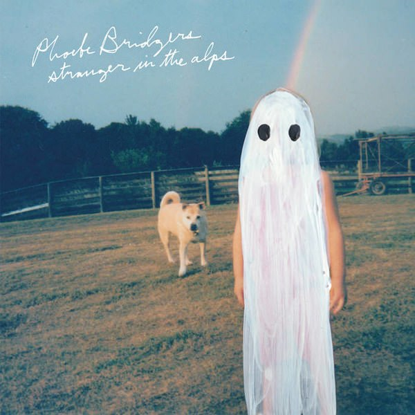
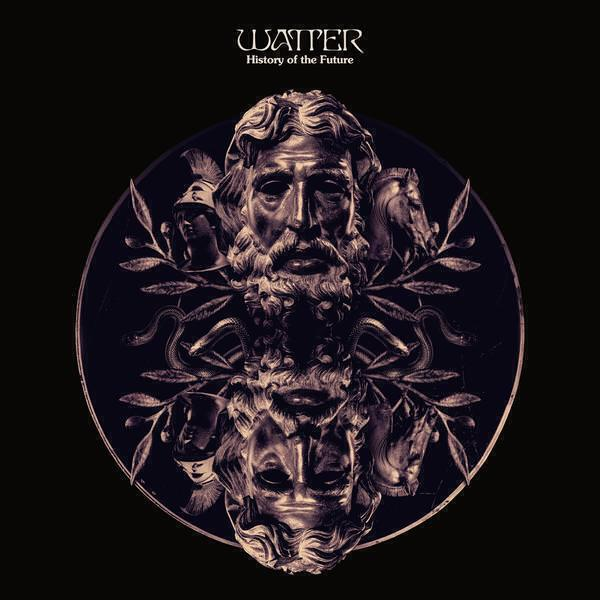
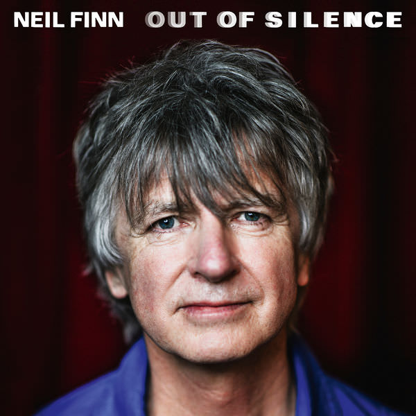

## Bjork *Utopia*

"Utopia" is Björk's ninth album. It's a happier album compared to the emotional wreckage of "Vulnicura". But while "Vulnicura" was a compelling if uncomfortable listen, "Utopia" is more comfortable and, unfortunately, not that compelling. This is old ground retrodden with few glimmers of past glories.

The brevity, succinctness and sharpness are all gone. Even on the best songs (the first three), there is very little strength in the lyrics. The music is all texture and no melody. And while formlessness and adaptability are central to the album's lyrical themes, the songs themselves are ill-served by allowing these same concepts to take hold of their arrangements.

The songs on "Vespertine" handled similar subject matter with intricate and complex beats. Those songs managed to still *be* songs despite the experimentation. On "Medulla", Björk masterfully arranged voices and teased out complicated emotions with the bare minimum of technology. Whereas on "Utopia" the technology swamps everything and smothers the many good ideas that sit within the lyrics.

Perhaps time will help me appreciate this album more. I can think of similar albums that took me a while to get into. It took me ages to realise just how good "Biophilia" is (Oh for a song with as catchy a chorus as "Virus" here) and so perhaps there are hidden depths to it. Because it's Björk I will keep trying, but be warned "Utopia" is hard work. However, past history says it may yet be worth it.

## Phoebe Bridgers *Stranger in the Alps*

Much like [Mary Epworth's "Elytral"]() a few months back, I was introduced to Phoebe Bridgers' album "Stranger in the Alps" by Spotify's Discover Weekly feature. The song was called "Emotional Motion Sickness" and draws on that strange dislocation you feel when you're stuck in a relationship's that's going wrong.

Just as before, Discover Weekly has gone and recommended the best song, but there's plenty of material to enjoy on "Stranger in the Alps". I'd describe her sound as a bit like a country version of Elliott Smith: songs with a keen sense of melody and sadness. It's the sort of music I try to avoid in the darker months, but there's also a (bitter) sweetness that makes the darker hues more palatable. If sad songs are your bag, you might like this.

## Watter *History of the Future*

Watter are a "supergroup" featuring at least one member of Grails, whose "Chalice Hymnal" is one of my favourite and most played albums this year[^1]. I enjoyed Watter's first album "This World", which was released back in 2014 and was one of my favourite albums of that year. I reviewed it [in an album digest in June](album-digest-june-2014).

"This World" was full of slow burning guitar tracks and "History of the Future" provides more of the same. This bunch feels a bit more Grails-y and that's not a problem for me. It's an enjoyable sequel, though I do wonder what else this music for apart from watching the world go by. 

If you're pushed for time, check out "The Cloud Sanctuary" and the title track, which are the tunes representative of the album as a whole.

## Neil Finn *Out of Silence*

If anyone has the right to complain about running out of ideas for songs, it must surely be Neil Finn. He's written so many great ones over the years for Split Enz, Crowded House and for various solo projects. While there have been some rather odd albums (I'm thinking of 2000's "One Nil" and the last Crowded House album in particular), the quality has rarely lapsed.

This album was written and recorded in a short space of time earlier in 2017. It doesn't show, save for the fact that there is only one uptempo song[^2]: the gloriously spare "Second Nature". "Out of Silence" showcases Neil's excellent song writing skills and unlike "Utopia" it doesn't attempt to reinvent the wheel, just to knock out a few decent songs. "Terrorise Me" is a big-hearted and sincere response to the Bataclan atrocity in Paris, turning difficult subject matter into art. It should be a song that's hard to listen to and yet he finds a way to articulate a response to harrowing events. 

Some of the songs are sketchier than others. "The Law is Always On Your Side" doesn't really fill the outline that it sketches of a traumatic childhood. "More Than One of You" seems to run out of steam. "Widow's Peak" is a strange dream-like song that I think could do with a little more polish - perhaps that might happen one day. On the other hand "Chameleon Days", "Alone" and "Second Nature" seem complete.

To summarise: "Out of Silence" is an interesting insight into the creative process of one of the best ever writers of pop music. It's short and bittersweet, but if you love Finn's earlier work you will definitely enjoy this.

[^1]: For more information, there's a top 10 post coming before the end of the year.
[^2]: When I wrote songs, I always found it was the uptempo ones that were harder to come up with. You need more words in your lyrics, more notes in your melodies &#x1f609;.