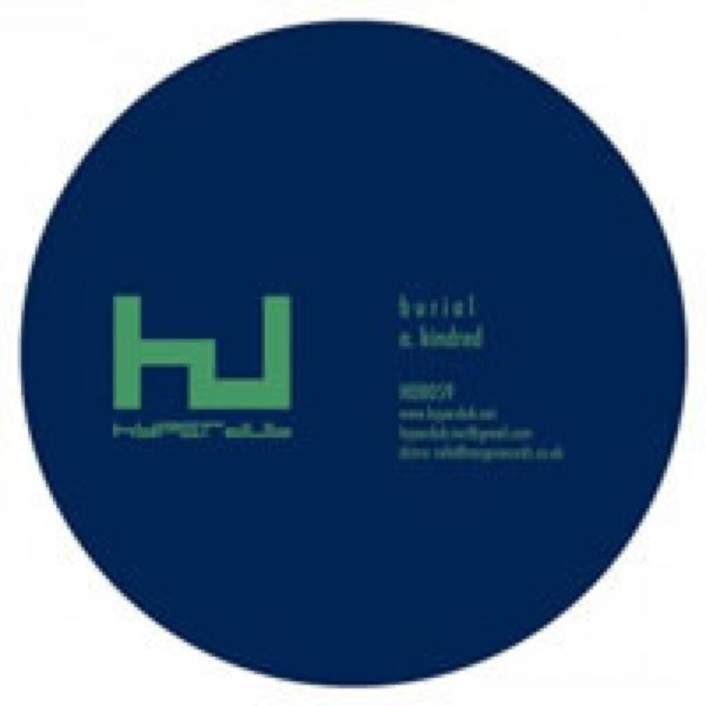
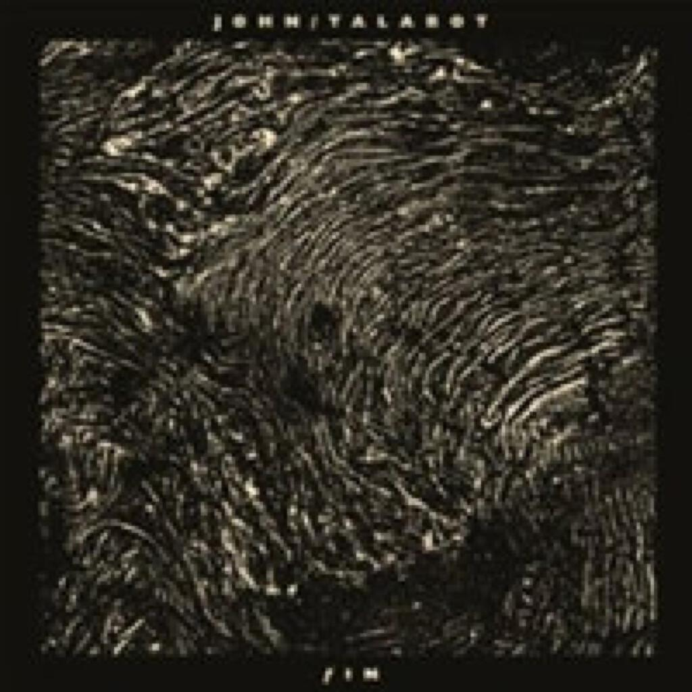
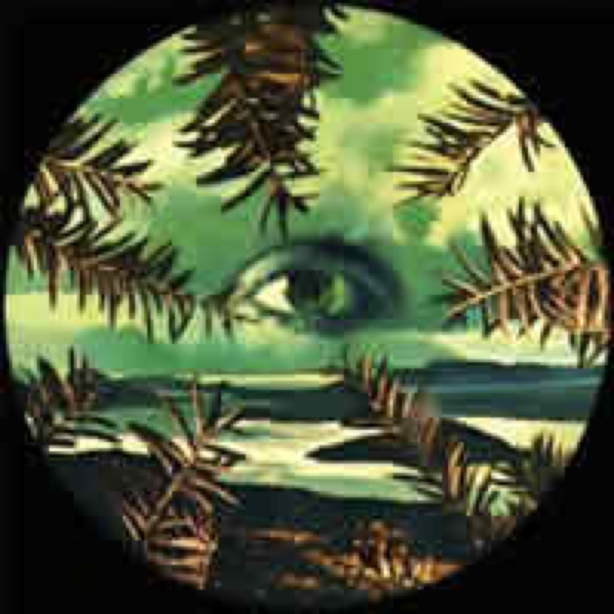

One EP and three albums for Album Digest February 2012:

1. Burial _Kindred EP_
2. John Talabot _fIN_
3. Lilacs & Champagne _Lilacs & Champagne_
4. The 2 Bears _Be Strong_

[Last February](album-digest-february-2011) was a pretty good month for song based albums, although the likes of Radiohead and James Blake provided plenty of electronic noodling in and around their song structures. (Interestingly, out of the two out-and-out song based albums, one was one of the worst albums of the year and the other one of the best).

There is something about February that is particularly suited to both brooding shifting electronica and wonky instrumental hip-hop. Perhaps it is the cold or the grey skies or that awful feeling that the new year is not going to be quite as new as you wanted it to be. Despite this rather maudlin realisation, at least music can ride to the rescue. The 2 Bears album is almost designed to be a winter tonic - more of that later.

## Burial _Kindred EP_

 Burial’s music is something that I find hard to write about. This might be why new forms of music are so compelling, because the task of writing a description is intellectually stimulating. It can also lead to embarassment if you try too hard and end up writing pretentious dribble.

Generally when it comes to Burial I describe the beats as ‘shuffling’ and usually end up mentioning that the tracks make me think of car journeys as a kid - ones where I would watch the rain fall on the windows and watch the droplets race one another from top to bottom. There is other stuff going on too, particularly in the title track from last year’s EP _Street Halo_ where all sorts of emotional mayhem unfolds. I came to _Street Halo_ via [Fourtet’s FabricLive mix](http://www.fabriclondon.com/store/catalog/product/view/id/340/s/fabriclive-59/categories/8/) and it ended up being the track from that compilation that I put into my 50 Best Songs of 2011 playlist. However in all the tracks, despite the beats and mood being very distinctive there is definitely a ghost in the machine somewhere: some element that makes each track greater than the sum of its parts.

The _Kindred_ EP consists of three tracks and comes in at around half an hour with all the tracks being longer than the ones on _Untrue_. I cannot say for certain that the sound has changed dramatically since that album but the tracks seem much more weighty and confident. I think that music that is subtle and builds slowly should have the confidence to unfold over a longer span than four or five minutes, so to me the longer tracks are welcome and are easier for me to digest and understand.

My favourite track is _Ashtray Wasp_ because although all three tracks are of a piece, this one is probably the most structured and there are some lovely vocal samples throughout that perhaps make it more human than the others. As a partial explanation of why I recently asked whether you can get blue glow sticks, it was this track that inspired the question. [Apparently you can](http://www.google.co.uk/search?q=blue%20glow%20sticks), I just had to frigging google it.

I have always felt an emotional connection when listening to music by Burial (in fact _Archangel_ is probably one of my favourite pieces of music from the last five years) that is absent when listening to other dubstep artists and the same is true of _Kindred_ (making for an appropriate title).

## John Talabot _fIN_

Some more electronica on this next album, one that I went to after reading the review on Pitchfork. The beauty of Spotify is that you can give these albums a try, which is a good thing with Pitchfork who tend to laud great albums a lot of the time but also elevate a lot of pretentious crap too. Sometimes it’s harrowing pretentious crap too, which just makes it worse. Fortunately this album from John Talabot (nope, not even a track on a Fabric comp) is definitely one of their better calls.

Opening track _Depak Ine_ reminds me of something and it really bugs me that I can’t place it. The track itself slowly grows out of animal noises and through various layers of synths, simple and insistent. At about 3:40 it becomes this weird Enigma-like piece before a much more strident beat kicks in a minute later. It sounds completely different from the Burial tracks but like most of the tracks on _Fin_ it sits nicely alongside them. The sounds and beats seem to take inspiration from late 80s and early 90s sounds, bands like Erasure and Depeche Mode. Despite having the potential to not be very fashionable, it actually all gets mixed up in to a very stylish track.

The whole album plays out like a tasteful patchwork of albums and artists that I love. _Destiny_ sounds like it could have come off a hybrid of the first two Junior Boys albums (the layers of the first matched to the warmth and directness of the second). _El Oeste_ builds out of a weird loop that sounds like something off of Philip Glass’s _Einstein On The Beach_ mixed with Mike Oldfield’s soundtrack to _The Killing Fields_. _Oro y Sangre_ is probably how New Order might have sounded around _Technique_ if they’d experimented with steel drums and tried to ape 808 State. Perhaps the track is not actually as good as that would really sound but it’s a pretty captivating instrumental. Unfortunately there are mis-steps, _Missing You_ sounds like a bad joke though it does have a pretty nifty beat behind it.

It’s well paced, engaging and entertaining. Like I said above, I knew nothing about this guy before I set ears on this on Spotify via the Pitchfork. It shows how great Spotify is as a risk-free music discovery application.

## Lilacs & Champagne _Lilacs & Champagne_

On the other hand, I discovered _Lilacs & Champagne_ for myself, seeing its weird artwork on [bleep](www.bleep.com) while I was buying the Burial EP there. I am a sucker for trippy absinthe pictures with big eye in them. A quick search on Spotify found it and I’ve given it such heavy rotation that I have pre-ordered a physical copy ahead of its UK release next week.

Best listened to as a whole, it’s a wonderful sample-based instrumental hip-hop record and to my mind on a par with DJ Shadow’s two highlights _Endtroducing_ and _The Private Press_. Please bear in mind that I am no expert in these matters though, I’m just telling you what my ears like!

It is a great album for walking home from work in the amber streetlights - all those cold nights in recent weeks were perfect, it’s the best sort of music to listen to while your breath streams out in front of you and dances in front of your face. Of course this is probably because it is a great album to _smoke_ to, if you catch my drift. The only thing ‘wrong’ with it is that it only lasts thirty five minutes but at least that way it does not overstay its welcome.

I have a feeling that this is going to be one of my favourites come the end of the year. Apparently the guys who made it also record as a band called Grails, you can bet that I am definitely going to check them out!

## The 2 Bears _Be Strong_

Formed from one of Hot Chip and Raf Rundell, [The 2 Bears](http://www.the2bears.co.uk/) were always going to be a fantastic listen. From my point of view it’s because Hot Chip are one of the best bands currently going and are hugely underrated.

Beginning with a cool instrumental called _The Birds And The Bees_, the title track then appears with some great lyrics “Some people tell what to listen to / Spend the whole time saying this and that is cool / You … got to find a sound that stays inside for you” and the best roll call of namechecks since LCD Soundsystem’s _Losing My Edge_. Meanwhile the whole track and the following _Bear Hug_ echo the sounds of that wonderful era between 1991 and 1993 that produced so many songs (mostly from Europe) that cross pollinated pop music and dance music. And of course any record that can introduce one of Joe Goddard’s sweet verses at the drop of a hat is going to make me swoon.

At first I thought “OK this is a perfect storm of things I like but it can’t really have longevity, it’s just a novelty” but those wonderful house pianos on _Work_, the sweetly folky _Time In Mind_ (I really thought it was Billy Bragg at first) and the strangely affecting chorus of _Take A Look Around_ (not to mention the amazing Robert Owens style backing track). There won’t be no problems if you just move your body.

If _Lilacs & Champagne_ is the perfect after work soundtrack then _Be Strong_ is definitely one for the walk to work, if only because all the upbeat numbers tend to get cut off with the more maudlin _Time In Mind_ by the time I am swiping my pass.

## Album Digest February 2012 - Summary
At the start of the month I really wasn’t sure if there would be many good albums to write about this month: how wrong I was! Next month, there’s the new Fanfarlo album at least and likely much more. I am off to see Fanfarlo live tomorrow, something that I am very excited about.
