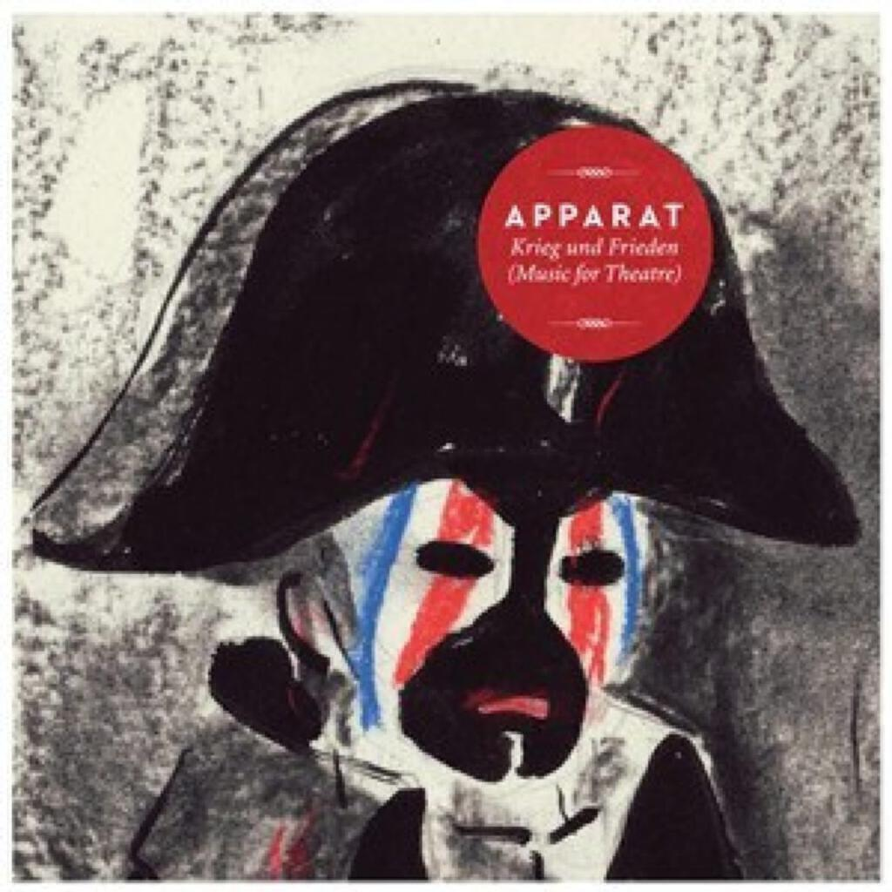

Most Februaries are quite quiet when it comes to albums (though this was not the case [back in 2011](album-digest-february-2011)) and although only the Foals album is a major release, I was quite surprised to find myself with four decent albums to write about. They are:

1. Darkstar "News From Nowhere"
2. Foals "Holy Fire"
3. Daniel Hope "Spheres"
4. Apparat "Krieg und Frieden (Music For Theatre)"

## Darkstar "News From Nowhere"

I don't need to give too much biographical background for the Darkstar album as I don't know too much about who the are. I saw this album and its lovely artwork in an e-mail from [bleep.com](http://www.bleep.com/). Because it was on Spotify, I gave it a go. At first I wasn't too impressed but over repeated listens, it has become my favourite album of the month.

The overriding sound of the album is pastoral, though its sound is also quite digital: all skittering beats, processed vocals, and interesting synth sounds. Opening track "Light Body Clock Starter" weirdly lives up to its title, the aural equivalent of one of those alarm clocks that wakes you up gently by filling your room with light.

Continuing the theme, the next song "Timeaway" is built around a clockwork music box beat while breathy vocals coo soothingly over the top. On the first two tracks the only words I can make out are "wake me up" at the start of "Light Body Clock Starter". The mechanical clocklike vibe continues on "Armonica" (and so does the lyrical theme: "I sleep until I'm told") and though the vocals continue to be heavily processed, it's easier to make them out. About halfway through, everything bubbles down into some wonderful and delicate noise, then sure enough the beat kicks back in but only briefly. It's a lovely moment.

The next two tracks are the centrepiece of the album to my ears. The anonymously titled "-" comes off like a collab between Doves and "Assassin"-era The Orb - a great combination as far as I am concerned - and "A Day's Pay For A Day's Work", a beautiful song with Beach Boys style harmonies and perhaps the least electronic arrangement on the whole album. It's a sad but beautiful song, lyrics like "I never get so much for losing touch" hint at the sadness of being away from the ones you love (or perhaps the sadness of abandoning one's dreams for the world of work).

Those five tracks and the more anonymous "Young Heart's" go by in just over twenty minutes. I'm always saying how much I like short albums and it's certainly the case that less is more here. The rest of the album is a bit more expansive: "Amplified Ease" is a (welcome) reanimation of the much missed Beta Band and the final three tracks are dense and largely instrumental. These three are the longest tracks on the album and tick away through their ambient prettiness very nicely indeed.

In summary: I still don't have a clue who they are, but "News From Nowhere" is a fantastic little album once you take the time to examine its nooks and crannies. It touches on several early naughties touchstones, while also ticking and burbling away like a record that could only have been made in 2013. Try it, I think you'll like it.

## Foals "Holy Fire"

I was unnaturally excited for "Holy Fire" when I found out that it was coming but I think I've been undone by my immense love for their last album "Total Love Forever", which shocked me back in 2009 by being about six squillion times better than their debut "Antidotes" would have had me believe was possible. That's not to say that "Antidotes" isn't a fine album, it's just that at the time it seemed a little one dimensional… their subsequent albums have somehow managed to make it sound better while being better albums themselves. What can I say? Foals are an odd band.

"Holy Fire" isn't quite as good as "Total Love Forever", though like "News From Nowhere" it's an album that I am warming to more as I repeatedly listen to it. The good news is that their facility at writing pop songs is undiminished: "Inhaler" and "My Number" (2013's best pop song so far) are as good as "Blue Blood" (not really a pop song), "Balloons", and "Mathletics". More importantly I think they probably have a wider appeal than their earlier songs. Be sure to check out the Hot Chip remix of "My Number" too, it's a real ear worm.

Also good news is that some of their attempts to expand their sound work really well: the opening instrumental "Prelude" is great fun and sounds like something off CAN's ["Lost Tapes" box set](can-the-lost-tapes), "Bad Habit" intelligently takes their sound and builds in tropes from dance music, while the closing track "Moon" has some great eerie synth noises that would grace the fx track of a sci-fi flick.

To get to the other positive aspect of "Holy Fire", we have to first discuss the bad news:  "Holy Fire" is a break-up album. Ouch. It could be worse, it could have been about how shit it is to always be on tour. To be fair only "Late Night" really pushes this aspect of the album too far (oh and "Stepson", which wins the dubious accolade of worst Foals song ever) with its morose leanings. Other songs like "My Number" and "Bad Habit" deal with it maturely (sadly miles now from the exuberant lovestruck joy of "Miami" and "Total Love Forever" though), while the songs about coming out the other side are pretty good: "Out Of The Woods" may have a gauchely obvious title but it's a beautiful slight song about feeling better.

In summary: I like this album a lot and there are definitely outstanding songs here but the "evolution not revolution" approach and the sometimes dreary subject matter mean that it's not as sparkling a success as "Total Love Forever". Still looking forward to the next one though.

In summary II: Does the horse meat scandal mean that there has never been a better time to be a band called Foals?

## Daniel Hope "Spheres"

You know you are getting old when you buy a classical album and one of the composers was born after you were. In fact, you know you are getting old when you buy a classical album full stop. Daniel Hope definitely looks on the cover here like a guy with a violin who your gran might like.

I bought into "Spheres" because there's a theme: pieces that are related to the concept of "music of the spheres". This is the same thing that motivated Kepler's Harmony Of The Worlds, the piece by Laurie Spiegel that is on the Voyager golden record. The great thing about that piece, performed by an antique computer, is that it is a really screechy avant-garde piece that you feel should have no connection to violin pieces performed by dashing chaps that your gran might like.

Unsurprisingly there's no screechiness here and despite the youth of the composers involved (born in 1983?!?!?! WTF?!?) there isn't much that is avant-garde either, though the piece by Prokofiev isn't by _that_ Prokofiev and is pretty screechy. Instead we get blissed out renditions of "I giorni" by Einaudi (it is, admittedly, very nice) and there's also a remarkably beautiful piece called "Lento" by Aleksey Igudesman (who I will be investigating further). The Michael Nyman piece (from the soundtrack to "Drowning By Numbers") is also pretty good.

Another thing that had piqued my interest was the Glass piece but this doesn't seem as fun in isolation in between pieces by other composers, as Einstein On The Beach or Akhnahten are when spread out as a whole over a longer time span.

In summary: Your gran might like him. It's all beautifully played but I think I prefer classical music to be all by one composer and not this kind of greatest hits approach. I consider this to be part of my musical education.

## Apparat "Krieg und Frieden (Music For Theatre)"

I was happy to leave it at three albums this month, but then I came across this new one by Apparat. Listening on iTunes preview my housemate said "that sounds sad" but it was too late, I was already captivated.

This is not a full album by Apparat, at least not one as complete as "Walls", which is the other of his that I own. Instead it's a soundtrack to a theatre play, presumably an adaptation of "War And Peace" if my use of Google translate is to be believed. As such, the album is comprised of tracks that are very soundtrack like and alternate versions that I guess are later rewordings of the same material for fun. For example the opening track "44" (the piece that my housemate called sad) is followed up by "44 (Noise Version)" in which all the original's strings are torn away and the track retooled as a ringing wall of noise that Tim Hecker or Fennesz would be proud of.

It makes for a very good night time listen and it has quite the success rate in making me fall asleep, [which, as I've said before, is a good thing](uc21). It's not all drone lullabies and sad strings though, there are a couple of songs throughout that are simpler than those on "Walls" (i.e. just a repeated phrase over the music, like "Lighton") but are no worse for it.

In summary: Apparat released an album called "The Devil's Walk" back in 2011 that I missed because I had too much else to listen to at the time. "Krieg und Frieden" has convinced me that I shall have to go back and check it out at some point, even if this album is a deliberate exercise in the more atmospheric aspects of his work.

## Next month

OMFG there's only a first ruddy album in ten years by David Bowie! Swoon!