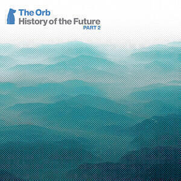

## Aphex Twin "Computer Controlled Acoustic Instruments Pt2 EP"

 Aphex Twin follows SYRO (reviewed in [Album Digest September 2014 here](/album-digest-september-2014/)) with this 27 minute EP of music that, if we take the title literally, features computers playing acoustic musical instruments. It's a very different sound to SYRO and sounds acoustic for the most part. It's an important experiment about the role of the musician, one that is already blurred in the creation of electronic music.

Before I get too drawn in to the philosophical connotations, I should discuss the music itself. The EP has about four long-ish pieces that could be considered complete, while the remaining nine tracks are shorter pieces that feel more like experiments and components of the longer pieces. This distinction between the long and short tracks is borne out by the track listing, though as usual it is unpronounceable inscrutable gobbledygook.

Some of the little experiments are cute like "piano un1 arpej" and "piano un10 it happened", which tinkle away like some of the gentler pieces on "drukqs". Another "disk aud1-12" is nine seconds of jazzy piano: without the provenance you would assume it was a quick improvisational flourish. Other pieces such as "DISKPREPT4" and the longer "disk prep calrec2 barn dance (slo)" experiment with rhythms that are recognisable as Aphex Twin music from albums like "Selected Ambient Works II". (Incidentally, if you're wondering whether there's a "Computer Controlled Acoustic Instruments Pt1", there isn't: just as there isn't a "Selected Ambient Works I".

I enjoyed listening to this. On one occasion I was even able to forget that it was music being played by computers and simply think about how it sounds like the backing track to a Tom Waits song at one point and like Mike Oldfield's soundtrack to "The Killing Fields" at another. Most of the time, I thought about the separation of composition and performance that has all but evaporated in the age of popular music, compared to classical music. I'd be happy to hear part 3 some time.

## The Orb "The History of The Future Part 2"

 Now for a real part two. Part one was released a couple of years back, a disappointing retread of the Big Life and Island material. It was hamstrung by sample clearance, corporate indifference and a tin ear for what made the twentieth century version of The Orb so magnificent. Part of the problem is that they were on such a hot streak between 1989 and 2000 that you'd need twelve CDs and a complete disregard for copyright law to do a decent job. I’ve already given it short shrift before in [a post about their live album “Live 93”](/amazing-subversive-revolutionary-adolescence/).

It's something of a boon then that The Orb have had a leaner streak in the twenty first century, it means that this 4 disc set (3 CDs and 1 DVD) is a generous and succinct exploration of less essential but occasionally surprising material.

It begins with a slight anomaly in the form of "Suck My Kiss", the first ever release from the Orb back in 1989, an upbeat piece (that feels it has had samples removed from it) written in collaboration with The KLF's Jimmy Cauty. But far from sticking out like a sore thumb like "Little Fluffy Clouds" would, "Suck My Kiss" manages to fit in nicely with what follows.

Most of the Orb's recent phases are featured so I will start by listing what isn't, namely the revisit of 1990s material on "Orbsessions vol 1" so "Mummie Don't" and "Yungle" are overlooked. There is also no room for anything from the "Metallic Spheres" collaboration with David Gilmour, which is probably just as well. It might have been nice if some of the tracks from the "FFWD" album had been included. This collaboration with Robert Fripp was released in 1994 so it's not part of this time line but if there's room for "Suck My Kiss", why not "Lucky Saddle" or "Hempire"? To my ears, either of those tracks would slot nicely in between and around the "Baghdad Batteries" material.

The discs stand alone as discreet compilations. The first takes the more straightforward material, mostly from "The Dream" (an album that was even more of an attempt to head back to "U.F.Orb" territory than "Orblivion") and "Bicycles and Tricycles". The latter is one of their most underrated albums, I saw them live around the time of its release and the newer tunes stood up against the classics. An intriguing track on this disc that I'd not come across before is "Apple Tree" - basically a remake of "Little Fluffy Clouds" with fewer contentious samples. It shouldn't work but it does.

Disc two mostly covers the more austere material released on the Baghdad Batteries album, with minimal tracks like "Super Soakers" and "Dolly Unit". The only representative of the enjoyable "C Batter C" album is the seventeen minute soundtrack to the short film "Battersea Bunches" - a shame that the film itself couldn't be included on the DVD disc.

The third disc covers the rest: some hard to find bonus tracks, the Kompakt material and the recent collaborations with Lee "Scratch" Perry. Unfortunately all the Lee Scratch Perry collabs are remixes (at least on the audio discs) which - apart from the OICHO remix of "Golden Clouds" - aren't as interesting as the originals.

Apparently a new Orb album is due later this year and [Gaudi](http://gaudimusic.com) is going to be collaborating with Tom and Alex. This sounds like a good combination, so I am looking forward to it. Hopefully putting together this excellent compilation will give them the knowledge of what they do best and the confidence to strike out for new territory.

## Susanne Sundfør "Ten Love Songs"

 Apart from the fact that [Susanne Sundfør](http://tumblr.susannesundfor.com) features in [the Royksopp album I reviewed last month](/album-digest-january-2015/), “Ten Love Songs” is the only “part one” of this month’s digest. I found this album on Spotify’s new releases page and recognised her name; if you recall, I said that the track she featured on (“Running To The Sea”) was one of the best songs on “The Inevitable End” so I decided to give it a go. I listened to the first minute of the first song “Darlings”, thought “OK this is weird, a bit like an album of Christian show-tunes”, and paused it there and then because it was late.

I started again the following morning as I walked to work, partly because I didn’t have the time to change back to the Sleater-Kinney album which was my then favourite recent album for walking to work to. In that fifteen minutes I listened to the sequence of the first four songs and was blown away.

First off “Darlings” swells into a wonderful bittersweet song (the first line is “So it’s definite then? / … everything must come to an end”) that really could be in a musical and then “Accelerate” lurches into your ears, which sounds like ABBA on bad acid: detached Nordic vocals over squelchy bass and a crazy “Phantom of the Opera”-style organ break. And later on in the song, both. At the same time. After that “Fade Away” manages to sound like regular ABBA, which as everyone knows is no bad thing and very hard to pull off. Finally “Silencer” pulls off a wonderful film noir storyline with minimal string backdrop - key lyric: “…no one heard you but the stars / Through the rain of the sprinklers, a bullet pierced your heart”.

From there the quality remains high, even if the lyrical conceit of “Kamikaze” is a little gauche: you get everything you need to know about the song from the title. Following that, “Memorial” is a ten minute miniature masterpiece of murder and loss in collaboration with M83 (they previously collaborated on M83’s soundtrack to “Oblivion” - [the movie where Tom Cruise takes on aliens WHO BLEW UP THE MOON](/oblivion-a-short-review/)). The best bit is when it takes about six minutes off in the middle to explore a miniature classical piece. Throughout the whole album every element of each song sounds amazing and was, apart from three songs, produced by Susanne on her own. “Ten Love Songs” is the work of a major talent.

“Delirious” and “Slowly” are both amazing pop songs. The first begins slowly, perhaps attempting to follow “Memorial” somehow, before it bursts into a playful double-entendre lyric about BDSM. Meanwhile “Slowly” revisits the same territory as “Fade Away” with an 80s vibe that one won’t make you cringe - her vocals are a hair’s breadth of those of Nina Persson on this song, bringing back memories of [The Cardigans’ excellent “Long Gone Before Daylight” album](/uc25/).

The last of the ten love songs are “Trust Me” - a slow burning torch song that makes you want to do anything but trust its narrator - and “Insects”, a song in which a swarm of synths tries to overwhelm a lyric about keeping a clandestine sexual relationship a secret. The two combine to create a creepy end to the album, in particular the way that “Trust Me” slows things right down only for “Insects” to pick up the pace again and end the album on the wrong foot. It makes you want to play it all over again. I have done this. Repeatedly.

The only bad thing about “Ten Love Songs” is that there are only ten. It’s one of those rare albums where an artists throws everything on to tape and it all manages to stick and congeal into something fascinating. Given this masterpieces, Sleater-Kinney’s excellent “No Cities To Love”, and Björk’s “Vulnicura” glowering on the horizon (I’m waiting for a physical copy) then 2015 promises to be an excellent year for music.
