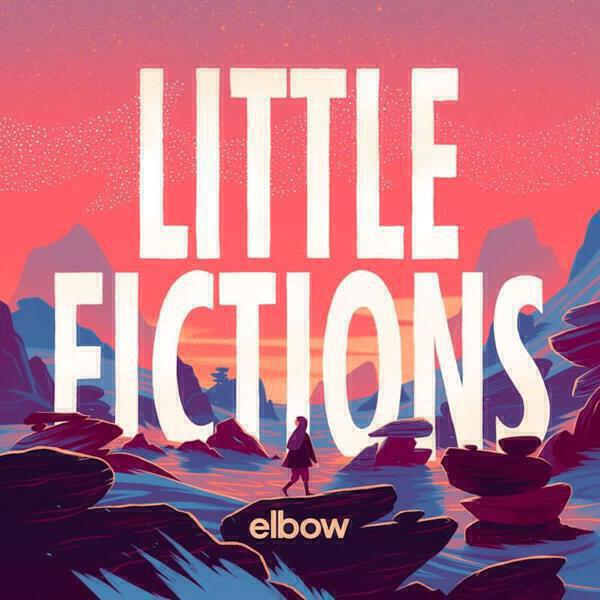

## Grails *Chalice Hymnal*

Some albums are good because a band continues making the music that you love. Some albums are good because a band takes their ideas a step or two further than before. *Chalice Hymnal*is that rare album that does both of these things. 

The references to past albums include the track *Deeper Politics* and *Deep Snow II*, and, as per albums past, these tracks evolve slowly out of languid guitar hooks and smoky atmospherics. If it ain't broke don't fix it. 

However Grails are also a restless band as well as a restful one. The sheer number of side acts that members of the band are involved with, including Watter and Lilacs & Champagne, are testimony to that. As a result there's also some revolution mixed in with the revolution here. 

Take *Tough Guy* for instance. The Lilacs & Champagne project grew out of repurposing Grails tracks as instrumental hip hop. This track feeds that process back in the other direction with a swinging swagger that keeps the track in motion. As the title suggests it's more robust than your average Grails tune. 

*Pelham* is a noise-fest reminiscent of bands like Russian Circles. The slightly-too-long closing track *After the Funeral* is a reminder that while this band once named one of their albums *Doommonger's Holiday*, their tongues may not have been firmly in their cheeks. 

My favourite track is called *Rebecca*. It's a beautiful and folky tune, the sort of thing that Grails seem able to dash off without even thinking about it. Its seemingly improvised nature gives it an emotional heft, after all it's often more meaningful when we express emotion without intention, when we don't even have to think about it. 

To conclude this is another interesting and compelling album from Grails. It would serve as a good introduction if you've never heard their music before. If you have heard them before then you'll know what to expect and I think you will like what you find. 

## Elbow *Little Fictions*

Guy Garvey could sing the ingredients of a can of tomato soup and make you cry. That said, it's felt like more recent Elbow albums lost their way. They became a bit too narrative: it became possible to map stories about his personal life on to the songs. “Build a rocket boys!” seemed preoccupied with serious subject matter. Perhaps they felt that serious statement songs were needed once everyone started playing “One Day Like This” at their weddings. Meanwhile, “The Takeoff And Landing of Everything” made the mistake of thinking that tales of transatlantic living were somehow interesting to those of us who got caught up in the original camp fire glow of songs like "Red" and "Any Day Now".

There's no doubt in my mind that both albums have redeeming songs. But the thing that made both "The Seldom Seen Kid" and "Asleep in the Back" so darn irresistible is that they were each a knockout run of eleven great songs from start to finish. For elbow there's very little elbow room these days: the bar is set high, beyond the reach of many other bands. I’d started to wonder if they were out of reach of themselves.

The great news is that "Little Fictions" is another fantastic album. It's knotty and tricksy, perhaps more in keeping with "Cast of Thousands" or "Leaders of the Free World". The title refers to how they have returned to writing about characters and the details of their invented lives. Some bands need to tell you how it is, Elbow will more often break your heart with modern fairy tales.

## Dreadzone *Dread Times*

As regular readers will know, I'm a big fan of Dreadzone's Second Light. As I discussed in my review of Grails’ new album above, sometimes the hardest thing is for a beloved band to give you new material that doesn’t slavishly depend on the past. Dread Times might be thought of as a jukebox album, taking elements of past Dreadzone albums to produce new tracks that recombine and remix those elements. As with the Grails album, it's an evolution rather than a revolution. 

There's much to like on Dread Times, which inverts a the band's usual trick of peppering techno tracks with trad reggae. This time the approach is more song-based. While this means that the samples are not quite as extensive or clever (there's little of the mood building of Second Light or Earth Radio here), but it does mean that there's a bit more to hang onto. Other Dreadzone albums have been song-based but Dread Times is one of their more successful. 

There's *Rootsman*, which gets things off to a garrulling start - especially with its “all of the youth“ chorus. *Mountain* mixes Tricky-like rapping with can-do positive messages, a combination that sounds better through speakers than it does as typed out text. *16 Hole* makes a plea for an end to gun violence and does so with an ear worm for a chorus: the best advice is catchy advice.

*Area Code* is a hyper-kinetic party song that is all over my playlists. It has the best reference to the rings of Saturn in any album this month, or most months come to think of it. It’s a belter of a song that really gets you up and running. 

The album tails off with *Where is my Friend?*, a near-acoustic song about a missing DJ. It’s touching and demonstrates that for all Dreadzone’s occasional  over-production they do know their way with a good tune and how to leave it alone. The last track *After the Storm* echoes *Out of Heaven* off Second Light, perhaps even making a cheeky nod to the YouTube video that set *Out of Heaven* to the tornado scene from Wizard of Oz[^1]. After the Storm is slightly more upbeat and is a nice salve for those hankering for the other side of Dreadzone throughout. 

It’s good that Dreadzone have kept going and also nice that they’ve been rewarded with their highest chart placing for many a year. Long may it continue!

[^1]: Needless to say, that video is not up on YouTube anymore.