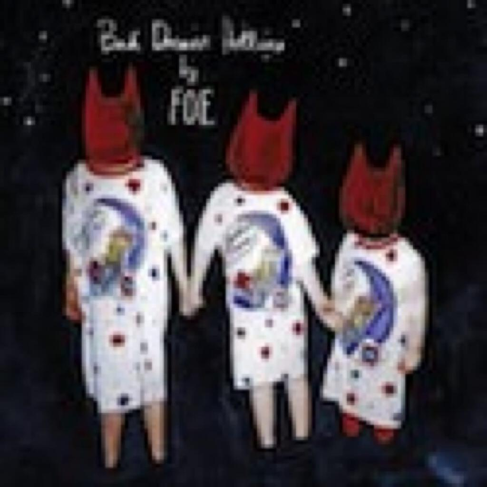
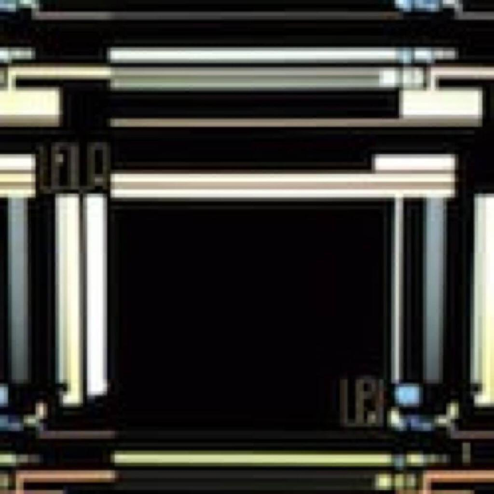
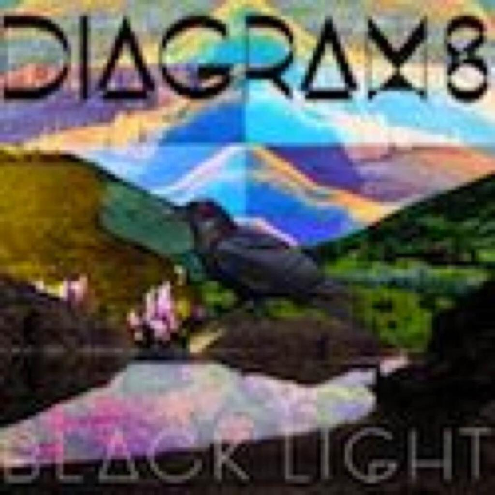
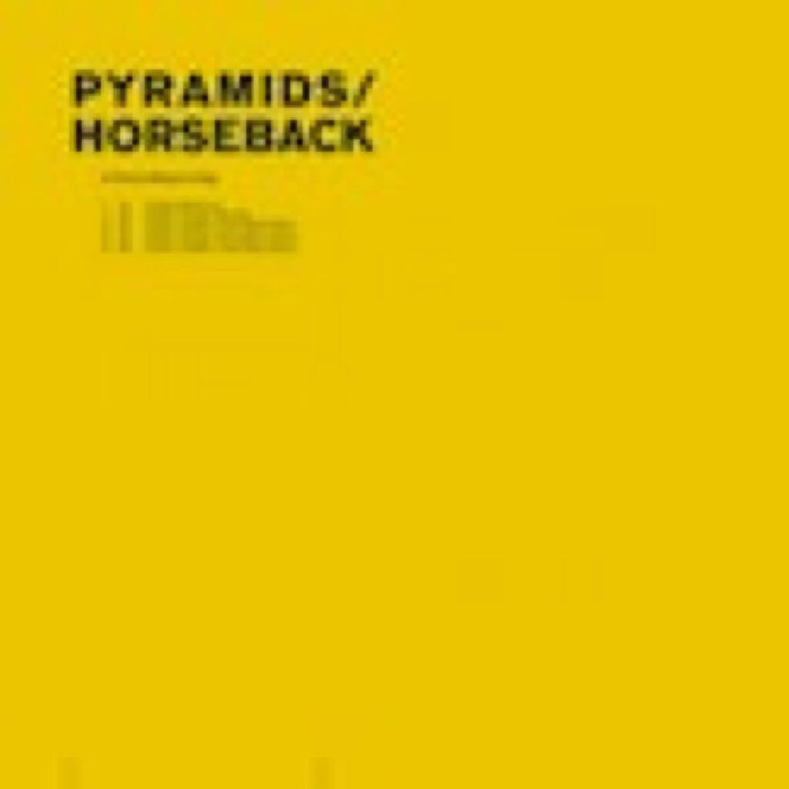
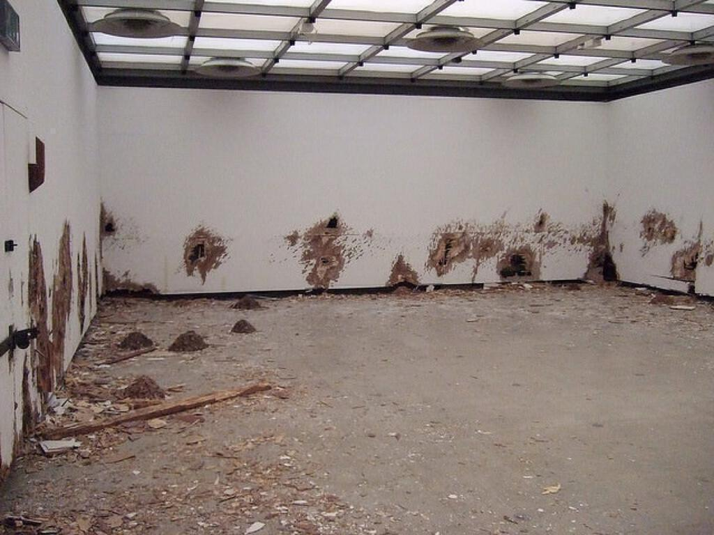

Five albums to see in the new year:

1. FOE “Bad Dream Hotline”
2. Leila “U & I”
3. Diagrams “Black Light”
4. Pyramids & Horseback “A Throne Without A King”
5. FabricLive 61 mixed by Pinch

## FOE _Bad Dream Hotline_

 I listened to “Bad Dream Hotline” about four times thinking “who does her voice remind me of?”. In the end I realised it was Sophie Ellis-Bextor, though in parts she sounds like KT Tunstall too. Of course these are rather tame references and I don’t mean to damn with faint praise, this album is much more edgy than those two ever were. If you are after some girly power pop with a darker edge then this will no doubt be the album that you have been waiting for.

Throughout the lyrics are enjoyable and are mostly wry observations about the kind of pop culture that generates shows like _The X Factor_. Probably the best of these songs is _Tyrant Song_ with its line “Too many nights sucking sweets / makes your head spin” and the rest of the song gleefully grinds through childhood tales of bed-wetting and playground teasing before culminating in a weird cut up outro that sounds as though it was made from the same samples as used on DJ Shadow’s _The Private Press_. These little details are everywhere on the album and make it a pleasure to listen to. The other nice feature that I haven’t really heard on an album for a while is the way that most of the songs are sung in the round and fragments of the lyrics get diced up and reassembled to create variations. It keeps you on your toes when you attempt to sing along!

Other tracks like _Ballad For The Brainkeepers_, _Get Money_ and _Cold Hard Rock_ are excellent, all could be singles and would sound fantastic in the cheery parallel world where I run all the radio stations. I really hope that the songs can get a bit of traction because they really are great.

My favourite track is _The Black Lodge_ (sample lyric: “There’s a breeze in the trees singing your black heart / your black heart needs a transplant / bad luck has ground you down / down in the mud where the worms spin round and round”) but it all rushes by so quickly I keep finding new delights in it including those cut up lyrics I mentioned. It tells the story of a little boy, a little girl and a little old toy who get lost in the woods and are rescued by a witch.

## Leila _U & I_

 Good stuff. The collaborations with Mt. Sims are reminiscent of his work with The Knife on their Darwin opera _Tomorrow In A Year_ and are slightly better than something like _Hailin From The Edge_ from _Walls_ by Apparat. Personally I prefer the instrumental tracks and I was interested to read a review elsewhere that claimed that her first two albums are better. Given that I enjoyed this one a lot, I look forward to tracking the other two down (_Like Weather_ and _The Other One_).

Of the vocal tracks, I like _Welcome To Your Life_ the most - it’s an intense track that is ideal to have blaring on your headphones as you arrive at work. Elsewhere the vocals are also used as mere samples on tracks like _Colony Collapse Disorder_ and the title track. I should also mention the single _Disappointed Cloud (anyway)_, which is really interesting and sounds like the sort of track that will really grow on me if I give it the chance. Full disclosure: all albums this month apart from the Pinch comp were bought or streamed after the 23rd so I haven’t had much chance to get used to them all.

I also had a lot of fun guessing the samples and influences on this album. The last track _Forasmuch_ seems to sample Mike Oldfield’s _Étude_ from the soundtrack to _The Killing Fields_ (admittedly just one note!); and _Activate I_ reminds me a lot of _Tension_, the opening track from Orbital’s _The Altogether_ album.

## Diagrams _Black Light_

> “Nothing else matters / Nothing else matters at all”

 This is a sort-of solo album by one of the members of Tuung, a band who I know practically nothing about save for a copy of one of their albums loaned to me by a work colleague. I must admit that I let that one pass over me a bit but I did like it enough to be curious when one song came up at random on my iTunes library’s shuffle. They sound a bit like Gomez for people who buy organic vegetables and know what quinoa is.

_Black Light_ though is a little more straightforward than Tuung and like the FOE album, it’s refreshing to have another album that is enjoyable on the surface and that also rewards closer listening. For the most part, the songs are happy and wistful. The arrangements are mostly designed to foreground a soft folky voice that takes in a great number of influences. I knew I should have written down a list because I had loads of comparisons and now I can only think of Paul Simon and Beck (I’m being really MOR with my comparisons this month!). Oh, there’s a Sufjan Stevens-y bit on one of the tracks too.

As for the music, there’s some satisfying and squelchy synth work on most tracks but the bonus track, a “Disco Bloodbath” remix of standout track _Night All Night_ that is aimed squarely at the dance floor, shows the rest of the electronic touches as being for decoration rather than propulsion. The lyrics are interesting but much more a patchwork of different elements: from the thrilling excitement of the closing lines of _Tall Buildings_ (“Hexagon! Pentagon! Triangle! Square!”) to the throwaway _Star Trek 2: The Wrath of Kahn_ reference on _Night All Night_ (“It’s a sleep worm inside the skull / soft mouth on your brain stem”) via the existential lovestruck words of the title track (“If I can glue myself, the past and future killed / If I can lose myself then lose myself I will / Nothing else matters / Nothing else matters at all”).

It’s a nice solid album and great for the remaining nights of walking home in the dark.

## Pyramids & Horseback _A Throne Without A King_

 I’ll admit that I didn’t buy this album. I was rather tempted by rather the smart yellow and black cover though. After listening to it on Spotify I was a bit too scared and weirded out. I am very impressed that it was on Spotify in the first place (The Leila album wasn’t though). Last year I celebrated five years on last.fm; well, one of the first things I got into there was **dark ambient**, at least until it really started to creep me out. I don’t pretend to be an expert but to my mind dark ambient is about taking unsettling noise and making it even more unsettling. In some ways, metal does the same thing to rock music.

This incredibly creepy and challenging album consists of one track from each of the two bands and then a collaboration between the two bands called _A Throne Without A King_, which is divided into four parts and lasts three quarters of an hour.

If it is that creepy and I didn’t buy it, why do I mention it? Well, in parts it is quite spectacular. There are some really creepy spoken word parts on part one, though I have no idea what is being said - it makes me think of one of the pieces I saw at the Hayward’s Psycho Buildings exhibition. The installation was called _To The Memory of H.P. Lovecraft_ and it was by Mike Nelson: a room with chipboard walls that appear to have been destroyed by either some supernatural or insane force; it was fascinating and creepy. Well, _A Throne Without A King_ for me is the aural equivalent of that exhibit (picture below by [ultraruby on flickr](http://www.flickr.com/people/ultraruby/)).

## FabricLive 61 mixed by Pinch

 This mix brings together two tracks from the [December 2011 album digest](album-digest-december-2011) - one by Pinch & Shackleton (_Rooms Within A Room_) and one by Emika (Pinch’s remix of _Double Edge_ - the track of hers that I really should have put on my 50 Songs from 2011 playlist.) - and a whole lot more besides.

I said in the December 2011 digest that I would go back to Shackleton’s fabric mix and to be honest it was fine enough but perhaps about fifteen minutes too long - though my patience was probably worn a little thin by the fact that I was listening to it while on a two mile walk through some rather permeating drizzle.

This mix is another matter entirely: propulsive, entertaining and stacked with music that you will want to track down afterwards. It seems that Fabric are on a bit of a run at the moment with other entries by Fourtet and Visionquest both being very good.

Special mention for the artwork, it’s brilliant isn’t it?