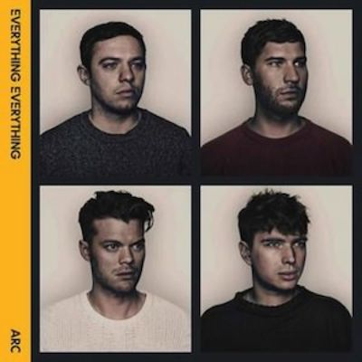
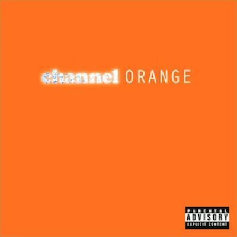
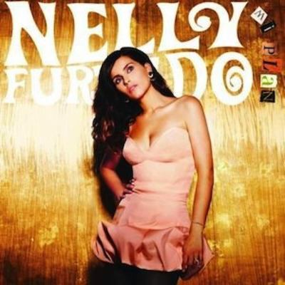

Only one of this month three albums was actually released this month. Nelly Furtado's Mi plan was actually released over three years ago - I only discovered it last year when I wrote [the September album digest](album-digest-september-2012) following the release of "The Spirit Indestructible", or it might have been when I wrote about ["Folklore"](uc20) at around the same time.

Anyway, I guess these are albums that I bought with my Christmas gift vouchers!

## Everything Everything "Arc"

I suppose I had better start with albums actually released this month. Before listening listening to the iTunes previews of Arc I'd not heard anything anything by Everything Everything (pun is author's own!) but I was quite impressed.

Much is made in reviews of their glitchy sounds and hyperactive cut-up songs, but to my mind "Arc" doesn't sound too different to the second Longpigs album "Mobile Home". This was the album that did for the Longpigs as a band, leaving us with Richard Hawley's solo career and "On and On" at funerals. However "Arc" does sound bang up to date. More importantly they sound like a band in command of their sound rather than one that is falling apart.

All that hyperactivity is the sound of ideas jostling with one another. It's infectious too; the first time I listened all the way through, I came up with about five ideas for song lyrics of my own (and I have written any lyrics for going on ten years now).

I just wish the lead singer didn't sing so high (as said every reviewer my age when they heard "The Bends" by Radiohead) because I think there are moments where he sounds more comfortable and more expressive singing lower. I guess they will figure that out in time.

I should point out some highlights. For me the best tune is the opening track "Cough Cough" and I think it's the most successful of the songs here that are experiments. Elsewhere, gluing songs together so that they end in the middle just as they begin is a bit like turning the Mona Lisa into a Mobius strip: it doesn't really add to the picture and it looks amateurish when you can see the join.

Also great is "Undrowned", which I'd say is a little less experimental that instead relies on a sing-song tune and sinister wordplay in the lyrics. It's like the world's most malevolent nursery rhyme. I can just picture it now in a songtage at the end of a gritty crime drama set on a council estate.

Overall "Arc" is an album that's fun and is over quickly. Some of the ideas go places, others don't. That's great, because next time out we either get to hear a band hitting their stride (like Foals on their second album) or reinventing to develop some consistency (think of something like "Skying" by The Horrors). A pretty good January album.

## Frank Ocean "channel ORANGE"

A friend of mine whose taste I trust without reservation recommended Frank Ocean's previous album ("Nostalgia Ultra") to me a while back. On that occasion I decided to exercise a reservation despite my friend's great taste because I didn't approve of Odd Future's distasteful lyrics (and still don't).

Later on though, I came across the video to "Swim Good", which is an amazing song. In fact, I'm going to embed it right here, right now:

See? Amazing. So I took advantage of "channel ORANGE" being sold for peanuts on the iTunes Store over Christmas and have really enjoyed it. The album seems to mostly be about unrequited love (ah, something I can relate to) and drugs (…and something I can't…). Let's just say that "Thinking Bout You" kind of resonates with me. I'm not sure I've ever felt quite as bad as he purports to on the excellent and devastating "Bad Religion" but I think I get the sentiment on "Pilot Jones" (I'm not sure though, I might be too square to properly appreciate the lyrics).

Elsewhere there are songs that are really interesting from a musical point of view too. (Talented songwriter in musically interesting shock!) Probably the best track in this regard is "Pyramid", something this ambitious is rarely seen on a pop album. It juxtaposes two tales over ten minutes, one in ancient Egypt and another in modern America, so it's great lyrically - but the musical flourishes interest me more: the trance breakdown, the vocoders, and perhaps most surprisingly, the Led Zeppelin-esque guitar solo at the end. There are lots of little musical and sample-based interludes like "White" too.

I also really like "Super Rich Kids", which has just the right amount of pathos to cut with its satire of… well… super rich kids. The lyrics go from arrogance "A million one, a million two / A hundred more will never do" to despair "I end my day upon the roof / I say I'll jump, I never do" (another line that resonates). Talking of great lines, "Why see the world when you've got the beach?" from "Sweet Life" is similarly excellent.

My absolute favourite though is "Pink Matter", which reminds me how much I've missed Andre 3000. Again the song itself is a combination of a great lyric with a spooky spare arrangement that manages to underpin things in a simple, sexy and unfussy way. And all that business about the nature of thought in the lines "What do you think my brain is made for? / Is it just a container for the mind? / This great grey matter" echoes a lot of the thoughts I've been having lately.

## Nelly Furtado "Mi Plan"

It's worth checking the reviews of this album out on iTunes, particularly the ones from boneheads who think she's insulted them in some way by having the audacity to record an album in Spanish. It's hilarious (but also really disappointing) that people feel threatened by foreign languages.

Unfortunately, although the songs on "Mi Plan" are pretty good and quite fun, they do seem rather conservative. Now I'm not saying that I expected a Spanish language Nelly Furtado album to be a hip-hop concept album about the life and work of [Frida Kahlo](http://en.wikipedia.org/wiki/Frida_Kahlo), but "Mi Plan" doesn't have the sparkle and sass of "Loose". I would have thought it might have the vibrancy of "Whoah Nelly" but not really, there's more duets than I expected with guys who sound much older than her. It's all a little… stiff.

Nevertheless, I do really enjoy songs like "Manos Al Aire", "Bajo Otra Luz" and "Fantasmas". What's more, I like to shuffle all Nelly's songs on my phone and any of these  songs are a fine contribution when they come up (even if there's some weird sounding dude warbling on them too).