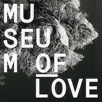
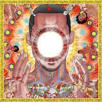

Album Digest January 2015 rounds up a few albums from the tail end of 2014 that I didn't get much time to write about. The only one of these six to be released this month is the excellent "No Cities To Love" by Sleater-Kinney.

## Sleater-Kinney "No Cities To Love" 

 I had heard of Sleater-Kinney before their boxed set “Start Together” was released in 2014. I was quite impressed that they curated their own Spotify playlist with the contents of the box. I added it and even downloaded the songs for offline listening but didn’t get around to much more than a cursory play of a few tracks.

The great thing about Spotify playlists is that any additions get pushed out to you. In fact you even get little notifications pushed to your phone. So when S-K released “No Cities To Love” they added it to the “Start Together” playlist and this reminded me to check them out. For now I have just stuck to the new record because it’s good enough to hold my attention.

I love a bit of shouty punky guitar music so "No Cities To Love" is perfect for me. It's really well produced and the songs are beautifully constructed with thoughtful lyrics. Now that I have a walk to work each morning once more, it's nice to find something amazing to listen to. My favourite songs are the title track (I start my morning walk with it and put the rest of the album on shuffle), "Fangless", and "Bury Our Friends". Magnificent stuff!
 
## Azealia Banks "Broke With Expensive Taste"

 Delayed [multiple times](http://www.vibe.com/article/azealia-banks-broke-expensive-taste-debut-delayed-again) for three years and [then suddenly released with no warning and a shrug of the shoulders](http://pitchfork.com/news/57348-surprise-azealia-banks-long-delayed-broke-with-expensive-taste-is-coming-out-tomorrow/), Azealia Banks' delayed debut does not disappoint. It's infectious, raucous and very very rude. Exactly what you need for the winter months, even if you can't help but think it should have been released in the summer… about three years ago.

Why did the record company sit on it for so long? It's such a good album. The fact that it doesn't sound dated despite the delay is testament to Azealia's savvy choice of collaborators, the sterling work of those collaborators, and her talent for weaving her flow around those sinuous beat constructions. She can also sing pretty well, and raps and sings in both English and Spanish. She covers Ariel Pink. It's heady stuff.

The first eight or nine songs gel together perfectly while loop-the-looping through a variety of genres and styles meaning that "Broke With Expensive Taste" almost has a mixtape feel. If there's one flaw it's that when she starts to settle into a style and the collaborators thin out a bit toward the end of the album, it does start to feel a bit monotonous - even if that Ariel Pink cover does liven things up a little. Still, a front-loaded album with the quality of these tracks is hardly the worst crime ever in pop music. My faves are "Desperado", "Heavy Metal and Reflective", and "212". 

I think it will be very interesting to see how Azealia Banks follows up this album. Hopefully she's worked on more tunes while Universal sat on this album (Again, what the hell were they thinking?) and she'll be able to release a follow up quickly. For all the infamous swears on “212” that made everyone sit up and take notice, I still think the most important line of the song is the first one: “Hey! I can be the answer”. As long as this delay hasn't broken her, I think she'll produce even better records than this one in the years to come.

## Museum of Love "Museum of Love"

 Following on from Nancy Whang's stellar turn as part of The Juan Maclean ([see here](/album-digest-september-2014/)), the set of bands germinating from or out of LCD Soundsystem continues with Museum Of Love, whose main man Pat Mahoney was the live drummer for LCD Soundsystem. (Museum of Love are a duo and prior to taking on the name they remixed Battles' collaboration with Gary Numan "My Machines" for [the Dross Glop remix album](/album-digest-april-2012/). They also share a third member with The Juan Maclean.)

Their self-titled album attempts to be as arch as LCD were, though I'm not entirely convinced that are genuinely clever or are perhaps just trying too hard. Some of the song titles are a hoot, viz "Learned Helplessness in Rats (Disco Drummer)" and "The Who's Who Of Who Cares". I like some of the lyrics a lot, particularly the moments where obvious rhymes are implied and then under cut with something else entirely. 

Throughout there's a reasonably funky Brian Ferry kinda vibe and it passes the time well. There's a similar rhythmic attention to detail as with the LCD Soundsystem albums, a sustained build up and controlled release throughout. In some ways the situation is similar to The Juan Maclean album, each track feels like a plane circling waiting for the moment to land, and it's rare that you don't notice the bump.

So we will have to see. This is a good start, some solid songs and some good musical ideas that, in the main, are well executed. What comes next for the Museum of Love project? If they focus on stuff as cool as "The Who's Who Of Who Cares" it could blossom into something quite special. They need more songs that move the heart as well as the head because, as James Murphy showed, being detached is only worthwhile if you understand what it is that you were originally attached to.

## Parkay Quarts "Content Nausea"

 Parkay Quarts is an alter ego sub-band side project of two members of Parquet Courts, whose "Sunbathing Animal" was, for me, [one of the best albums of 2014](/album-digest-june-2014/). "Content Nausea" is a brief album stuffed with little instrumentals, some loose songs built on jams, an odd cover of "These Boots Were Made For Walking", some spoken word tracks, and about an EP's worth of fully fleshed out songs. 

This might make "Content Nausea" seem like a distant second to "Sunbathing Animal" but despite its slapdash construction, it's a worthy companion piece. For one thing it has a pretty concept keeping everything together, one that asks why it is that we are constantly buying things we don't need and ignoring the world around us. The two spoken tracks, the title track and the wonderfully wry "The Map", both offer a sly dig at modern life. Other songs like "The Slide Machine" (about a machine for scraping roadkill off motorways) and "Uncast Shadow of a Southern Myth" explore similar ideas from darker tangents.

Now that the single is pretty much a long dead memory, perhaps it is no surprise that a band releasing a classic album could pump out a mini-album of this quality within the same year. No more singles means no more B-sides and all those experiments and aborted ideas have to end up somewhere. I'm really glad they have ended up somewhere, these songs stand on their own and also mix in well with the jauntier more trad affairs on "Sunbathing Animal". Give both of them a go!

## Flying Lotus "You're Dead!"

 As with Sleater-Kinney, Flying Lotus was a name I'd heard of but I don't think I'd listened to any of his music up until now. "You're Dead" is his fourth(?) album so I'm a bit behind the curve with his music too. His music genre hops from hip-hop to drum'n'bass to free jazz, all over the place. Like "Content Nausea" above, he uses an underlying theme as a framework to contain all the dispirate ideas. 

I think it works really well and in some parts it strikes me as being like canonical classical music, moving from one theme to the next whilst remaining consistent with its overall narrative. I think. I was always diverted while listening to it and the genres he flits between are often tedious when there's no let up in the action - as anyone who has sat through Roni Size's later albums will testify to. My fave tracks are "Dead Man's Tetris" because Snoop Dogg could rap about just about anything over just about anything and it would still sound awesome, and "Turtles" just cos it's pretty cute. 

As a whole "You're Dead" is a dense and interesting album, one that I don't really have the space to unpack here. I think the artwork is interesting given various events in recent months but that's a whole other story.

## Röyksopp "The Inevitable End"

 And so, for Röyksopp, "The Inevitable End". The boys say that this will be their last album in the traditional format. I think it's been coming. [Their last album "Senior"](/album-digest-september-2010/) was an ill-advised instrumental accompaniment to career-peak "Junior", an idea that must have seemed like a good one at the time - two sides of the same coin, yin and yang, etc etc - but just fizzled out when it came to the execution.

On "The Inevitable End" they seem a bit bored and seem to have forgone the idea of curating an album altogether. It's not so much an album as a dump of MP3s. Long stretches involve similar sounding songs with the same collaborators and you get the feeling that if they were still trying, they'd have picked one out of the four dreary collaborations with Jamie McDermott and/or Ryan James (the best is "Here She Comes Again"), ditched "Save Me" in favour of "Running To The Sea", and perhaps written a few more interesting instrumentals. 

I'm being snarky because I love Röyksopp and it's disappointing that this isn't another album as good as "Junior". The opening track "Skulls" is as good as anything they've ever done, the remake of "Monument" works really well ([no noodly trumpet this time around](/album-digest-may-2014/)) and "Running To The Sea" is a great song in keeping with tracks like "What Else Is There?". 

It's clear that "The Inevitable End" highlights Royksopp's own misgivings about the future of the album format. Why should spend time perfecting a song and then embargo it until you've completed nine or ten others for an album? Why prevent yourself from remixing and innovating your music in order to meet record company schedules? If songs are now digital and ephemeral, why make albums at all? Why not just pump out a track a month on your soundcloud feed or release individual tracks on limited edition vinyl?

I hope this isn't the last we hear of them. I still remember the first time that I heard "Melody AM". I wasn't that impressed, but then I had just pulled an all-nighter to get my undergraduate project on elliptic curves finished. It wasn't until I heard "Sparks" on a compilation a while later that I went back to it and became obsessed by it. Back then singles really extended the life of an album and "Melody AM" had some good singles with remixes and bonus tracks that pulled things in different directions. Perhaps whatever they have in mind for their next phase will involve this extra fluidity. Even if it doesn't, I still hope that it involves more music at some point.

## Album Digest January 2015 Playlist

<iframe src="https://embed.spotify.com/?uri=spotify%3Auser%3Amattischrome%3Aplaylist%3A2m94mJ40bIt4qlSMxaghMs" width="100%" height="380" frameborder="0" allowtransparency="true"></iframe>

Here's the usual embed of a spotify playlist for all of you who want to listen along at home.