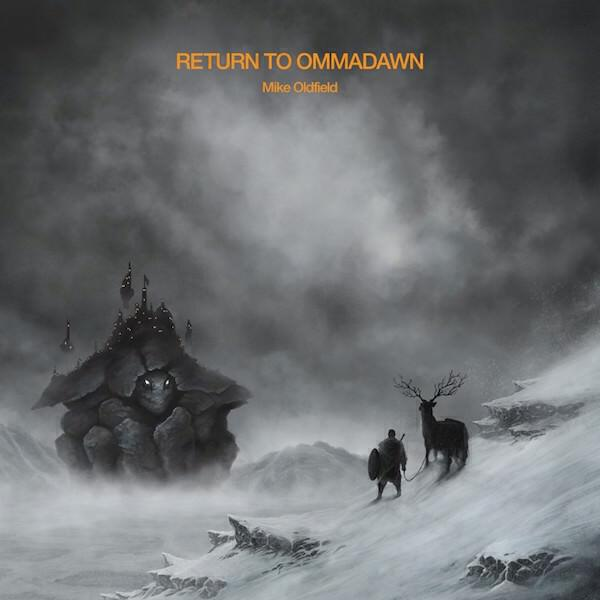

## Mike Oldfield *Return to Ommadawn*

With *Return to Ommadawn*, Mike Oldfield revisits his third album Ommadawn. He has past form for this, having revisited his masterwork Tubular Bells twice (the third revisit and fourth instalment Tubular Bells 4 is due next year). I wrote about Tubular Bells II for my understated classics series. Of course Mike has in fact made many more than three Tubular Bells albums[^1], and this is not a first "return" to Ommadawn. His 1990 album Amorok was a similar affair.

It's important to mention Amorok as it makes for an interesting comparison to this new album. While recording Amorok Mike was disenchanted with making music or at least the political side of it. At that time, Virgin Records didn't even bother to promote his records. It’s telling that one of the bigger rarities of the Oldfield canon is a promo cassette containing three extracts from Amorok that was sent to readers of the WHSmith magazine. 

The trouble with Amorok is that it also distilled the worst of Mike Oldfield's music at that time. It's slipshod in places, relies on jokes that aren't funny and continues with half baked ideas for longer than necessary. In places Amorok seems to say "will this do?" and "how about this?"  It's an album that gurns more than it smiles, and is worse for it. It's not helped by being a single hour-long track or that the cover art defensively excoriates "cloth eared nincompoops" before you even hear it. For all the prettiness and invention of long passages of Amorok, it did not do much to enhance the memory of the original Ommadawn. Hostility towards editing usually means that you need an editor.

It is good that Amorok doesn’t get to settle the legacy of “Ommadawn”. The original album, released in 1975, is the one that settled whether Mike was a one hit wonder or not. Tubular Bells sold by the bucket load and so Hergest Ridge, a quickly-composed follow-up that replaced catchy themes with anger and bluster. Ommadawn was intended as a counter to this. Mike took his time to compose it and made sure to incorporate themes that were important to him. Chief among them are the Celtic instruments that appear throughout the album. 

Until composing Ommadawn, Oldfield had been writing under pressure since demoing the first half of part one of Tubular Bells to Richard Brandon. Writing the remainder of Tubular Bells and the entirety of Hergest Ridge at pace did yield some successful moments: the instrument roll call at the end of Part one of Tubular Bells, the sleepy sunny intros to part two of Tubular Bells and part one of Hergest Ridge. However, the miraculous sunrise intro to Ommadawn is something else entirely. I think it should be regarded as highly as those opening lines of Tubular Bells. 

The rest of Ommadawn works when it doesn't try too hard. It revels in its oddness, something that Oldfield learned to do as the monster success of his debut began to grate with previously supportive critics. Oldfield's contributions are virtuoso throughout, though long passages find him hiding behind his collaborators. These sections are uneven and the whole piece ends up tripped over into silliness by the last four minutes of Part Two. Some track listings represent this section as a single track called "On Horseback". It’s a song about a man who'd rather be on horseback. Unfortunately it also features a children's choir and makes Clive Dunn's much-maligned Grandad sound like black metal. 

Return to Ommadawn differs from Tubular Bells II. It’s not a “shot for shot remake” and the technology is placed firmly behind the speakers rather than through them. The liner notes say little, save to point out that no synthesisers appear on the record[^2]. What we get as listeners is a thorough exploration of all Ommadawn’s themes filtered through a lifetime of experience. It took a while to convince me but after a few listens it is in fact rather marvellous.

Perhaps the most important feature is just how sensitive it is. There are phrases and sections that make me shiver. Other parts will make you think of rain drops tracking their way down window panes. Others are strong and bold and confident, all shiny with winter sunshine. It’s a beautiful melancholic experience with a radiant happy ending. “On Horseback” gets transformed into sampled pulp (see earlier footnote) and apparently the only original vocal contribution to the album is for Mike to say “On Horseback? I’d rather be here!”. Of course mate, you live in the Bahamas now.

This is probably Mike’s best album since Tubular Bells III. It has that album’s sense of exploration, the sensitivity of “The Songs of Distant Earth”[^3] and a self-restraint lacking from the likes of “Voyager” and “Amorok”. It bodes well for Tubular Bells 4, but those reissues of “Islands” and “Earth Moving” (also coming this year?) will look a little jaded by comparison.

## Bonobo *Migration*

When I decided to review Migration I worried that I might repeat [my review of The North Borders](https://mattischrome.com/album-digest-august-2013/) from a few years back. On a first, loose, listen it doesn't sound like a lot has changed. In fact the opening bars of “Migration” sound a bit like the music Apple uses to soundtrack your Photos memories. It's still soulful tasteful dance music that you tend to nod to rather than dance to. Because I listen to a lot of music and to my ears Migration sounds like other Bonobo records more than anything else, it's hard to hear (at first) whether it's any sort of step forward from The North Borders. That is to say, why should you pick this record over any of his other records?

However, I found that when I listened repeatedly and deliberately to Migration I found a lot to like within its layers and beats. Every track is beautifully produced, many elements are sounds that only exist within software. This mannered approach is not new, it's a case of evolution rather than revolution.

While the title track might form a sonic comfort blanket and [Rhye’s](http://www.rhyemusic.com) contributions to “Break Apart” aren’t much to get excited about, the album does pick up with “Outlier”. Lasting eight minutes, it does something pretty cool at about 4:30: a synth line that’s repeated throughout takes over the whole track and becomes meatier than anything on “The North Borders”. As an assertive action reaching out to the listener, it’s the most arresting moment on the entire album.

“Grains” features some interesting voice manipulations but Holly Herndon and Kaitlynn Aurelia Smith cover this ground more convincingly for me. “Second Sun” is a gorgeous chill out track, the strings in particular are very enjoyable as they cut in over the synths. Nicole Miglis of [Hundred Waters](http://hundred-waters.com) appears on “Surface”, a track that is more polished than the work of her band but one that lacks their appeal.

“Bambro Koyo Ganda” seems more in keeping with the album’s title and premise, a collaboration with Moroccan band [Innov Gnawa](http://www.clevelandart.org/events/music-and-performances/innov-gnawa). It’s loose and funky and best of all it isn’t lulling you to sleep. There should have been about five tracks featuring these guys, I will have to check out more of their stuff[^4]. “Kerala” is also upbeat, though also not a million miles from “Jets” on “The North Borders”. “Ontario” is great though, mixing up lots of live instrumentation samples into a compelling whole like a less woozy Lilacs & Champagne.

I don’t like the vocal on “No Reason”, it sounds too much like the anonymous stadium dance of Avicii and his ilk. That said, there are some nice moody moments in the mix: I think I’d like to hear an instrumental version. “7th Sevens” slowly retreads through “Outlier” but with less menace and more soundtrack samples. “Figures” closes out the album with slow strings and more “Grains”-style vocal manipulations, it’s pretty but it’s not going to save your life.

Overall, this is a good hangover album. Enough to keep you awake, but not too much to tax you. There’s no real mission or direction, despite how pretty everything sounds. And of course, I don’t really get hangovers any more.

## The xx *I See You*

The xx continue their progress into colour. Jamie’s solo album last year provides the template for much of “I See You”, in which the band take more steps toward revealing themselves and the characters that populate their songs. Remi in particular sounds like a revelation, lending songs like “Say Something Loving” and “Test Me” with real emotional weight rather than the icy detachment of songs from their first two albums.

The most interesting thing about “I See You” is that it continues to play to the main strengths of The xx, that of producing music pared back to particular principles and ideas. While “I See You” may be less detached from the listener, it still maintains a wary distance. Not for the nothing are the songs about isolation or disquiet in relationships. It’s an album that needs subject matter that matches the tensions in the music.

At some points, I thought that it might be too aching, too self-aware, too self-contained. There’s certainly a lot of repetition in the track list, even if the songs themselves manage to cast light on similar things from different angles. Essentially “Say Something Loving”, “Performance” and “Brave For You” are all about the same thing: taking the strain in a relationship that’s in difficulty. They deserve some slack because that’s  pretty universal subject matter for pop songs and it’s certainly interesting to listen to how the production tricks combine to create very different-sounding songs from essentially the same lyrical ideas.

At the end of the day, I enjoyed this album more than their other two but I still get the feeling while listening to it that it’s all too arch. I still can’t quite care about their songs enough to rave about them (except for “Say Something Loving”, which is great). However, I like the fact that the workings are shown and that, once again, The xx promise great things for the future.

---

[^1]:	Personally, I like to forget that oddities like Orchestral Tubular Bells, The Millennium Bell, and Tubular Bells 2003 ever existed. 

[^2]:	However, “vocal samples” are used. If you listen carefully, this even includes the “Happy?!” sample from Amorok. There is no explanation of which gadgets or software helped make this possible.

[^3]:	The album that I *should* have written about for Understated Classics!

[^4]:	There’s an eponymous EP on Spotify from 2016 that I’ll try to cover in a future digest.