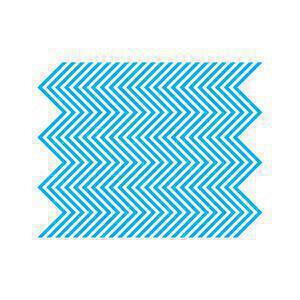
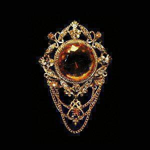
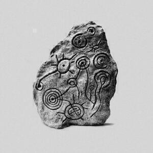
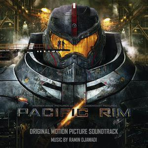

Another four albums for you this month. Sometimes the problem is not finding albums to listen to but actually finding time to listen to them! Often it is not because I don't have time but because I have already found some great albums this month and I am busy listening to those instead. As a result, a couple of these albums are ones that I have only listened to for a week or so, but they are interesting enough to write about. Here are the four albums I am going to write about this month:

1. Pet Shop Boys "Electric"
2. Fuck Buttons "Slow Focus"
3. Holden "Inheritors"
4. Ramin Djawadi "Pacific Rim OST"

## Pet Shop Boys "Electric"

I suppose the Pet Shop Boys releasing another album is like The Rolling Stones or Elton John releasing another album: it doesn't really matter what the album is like, it's just there to remind people to buy tickets for the latest money-spinning tour. The new songs just provide that moment where you can have a chat to your mate or go off to grab an over-priced hot dog or beer.

It's also been a while since the Pet Shop Boys released a decent album. At first I thought it was "Bilingual" all the way back in 1995 (though that's only three-quarters the great album it could have been thanks to some poor choices about what songs went on the album and which went on the B-sides) but then I remembered that 2007's "Fundamental" was also pretty good. In between they've released crap albums ("Release", "Yes" anyone?), side projects (why yes, I'd love to hear a hypothetical soundtrack to "Battleship Potemkin" as I am sure that an archetypical eighties UK synthpop band are exactly who Eisenstein had in mind) and endless repackaged greatest hits compilations.

The good news is that "Electric" is a pretty good album and a complete about-face from last year's dreary "Elysium". This is not to say that it matches the high points of their career: "Actually", "Behaviour", "Very", but by this point they've earned the right to not have to.

Reviews have compared "Electric" to "Very"'s limited edition experimental companion "Relentless". It's certainly true that "Electric" shares with "Relentless" an experimental feel and a number of largely instrumental tracks where Neil Tennant's vocals play second fiddle to Chris Lowe's exemplary knob twiddling. But whereas "Relentless" was like this for all of its tracks and was very much introducing its intended audience to this type of music, "Electric" is a little more piecemeal and by this point the band are also pretty much preaching to the choir. Nevertheless there are some nice surprises.

Take opener "Axis" for example, it sounds like a mash-up (how early noughties!) between The Orb's "A Huge Ever-Growing Pulsating Brain That Rules From The Centre Of The Ultraworld" and the Pets' own "In The Night". Another track that follows in this largely instrumental vein is "Shouting In The Evening" which is, of all things, an attempt at a dubstep tune. The brilliant turn here is Tennant's voice vocodered and squeezed into an auto-asphyxiating wheeze -- an older man exhorting people to have fun through gritted teeth. More successful is "Inside A Dream" which creates a sound scape out of shimmering synths before a beat kicks in that would have sat happily on one of their mid-80s B-sides while an inconsequential vocal weaves in and out.

The out-and-out songs on "Electric" are better than they've been for ages. "Bolshy" manages to include a reference to the political convulsions engulfing the Bolshoi Ballet (just another example of their Russo-philia), while "Love Is A Bourgeois Construct" is as close to a canonical (some might say cliché) Pet Shop Boys song as they've allowed themselves to write for many a year. The "Bourgeois-bourgeois-bourgoisie" breakdown in the middle eight is pleasingly nutty. "Flourescent" manages to sound like it's fallen off "Fundamental" and does that arch succes-de-scandale narrative that they've mined for ages quite admirably.

"Vocal" rounds out the album nice and trancily, though it sags a bit when they hit the line "aspirations for a better life are ordained": it's that sort of clunky phrasing that could only appear in a overearnest Pet Shop Boys song. It's a shame because it's a great song about how music pulls people together in a sense of celebration: it's a song that they've been trying to write for ages (viz "Saturday Night Forever" off "Bilingual") and it is the closest they have come to pulling it off.

Meanwhile the best songs on the album are a cover of Bruce Springsteen's "The First To Die" and a collaboration with Example called "Thursday". The Springsteen cover is amazing because, just as they did all those years ago with Elvis Presley's "Always On My Mind" and The Village People's "Go West", they manage to turn it lock, stock, and barrel into a completely convincing Pet Shop Boys song (heck there are even the clunky lyrics!). In fact I dug out the original (from one of the Boss's more recent albums "Magic") and it sounds more like a Pet Shop Boys song than the Pet Shop Boys version sounds like a Springsteen song. I wonder if one of their reasons for choosing it was because they noticed a similarity between it and another of their songs? I wanted to hate "Thursday" so much but it's actually a really decent pop song and the rap from Example adds a significant extra dimension (in fact there's even one of Chris Lowe's "Paninaro"-style spoken word bits so they're practically a boy band!)

At nine songs and around fifty minutes, "Electric" spreads a lot of good ideas over a decent run time. It doesn't match their peak but it's certainly good enough for this casual Pet Shop Boys listener to enjoy. More importantly, if they perform "The Last To Die", "Thursday", or "Vocal" on the new tour, you might keep on dancing and not head to the bar after all.

## Fuck Buttons "Slow Focus"

Fuck Buttons are one of those bands that I have not got around to listening to yet, which is a shame because now that I have I feel like I missed out until now. "Slow Focus" is an amazing album, not one that is suitable for all occasions but if you need a skull pounding inhuman sound scape for your Thursday morning walk to work, you won't do better than this. Everything is tooled and precise, there's very few sounds on this records that aren't deliberate and mechanical. It's very strange because it feels very real and yet to have this specific and intricate sound it has to be digital doesn't it? It has to have been created inside a computer? That's the only shade of grey on this album: how on earth was it made? It appears to be fully formed and completely abstract, like one of those monoliths in "2001: A Space Odyssey".

The opening track "Brainfreeze" is probably the pick of the bunch for me, all drums and sweeping synths buzzing around. Later on this weird riff comes in that when I first heard it sounded like chanted words; now I can't think for the life of me what I must have been hearing. It's a track full of layers ruthlessly applied over another and yet it holds up and never collapses under the weight of everything. At the exact midpoint the track empties out a bit and coagulates into something like one of those weird interludes on a Jean-Michel Jarre record, but this is just setting things up for the payoff where all the drums and beats start to flood back in: by the end it sounds like a hundred guitar solos being played at once before it all swirls down the plughole into the intro for the yelping, hyperventilating, "Year Of The Dog".

After "The Red Wing" and its hip-hop style beats comes "Sentients", which basically sounds like Kraftwerk gone evil. If those robot arms that you see on production lines ever got the day off and went clubbing, "Sentients" is the song they'd be jumping up and down and spilling their WD40 and coke to. Like "The Red Wing", "Prince's Prize" also features a jaunty synth line and sounds a bit like a sample-free version of "White River Junction" of The Orb's "Orbvs Terrarvm" album. In fact, the whole of "Slow Focus" sounds a bit like what The Orb might have achieved if they'd managed to go the whole hog with the industrial sounds they were exploring on that album.

The final two tracks, "Stalker" and "Hidden XS", go the distance and open the sound right out to full on epic. As throughout the entire album, the sound of both tracks is metallic and ordered but things are lot more cinematic, particularly on "Hidden XS". Last night I fell asleep listening to the album -- you should take that as a sign of my tiredness, not the ability of this album to keep you awake -- and when I woke up halfway into "Hidden XS" I listened and listened and it somehow felt like I was still asleep, still dreaming.

As a purely instrumental and austere album "Slow Focus" has a lot to recommend it. Probably not one for when you have a migraine but if you want to party with some robots or just listen to something _crushing_ this is the album for you.

## Holden "Inheritors"

Patterns are one thing, texture another. If Fuck Buttons' album is chock full of patterns, then Holden's album "The Inheritors" is pretty much full of texture. You can hear it instantly on the opening track "Rannoch Dawn" which builds out of samples of pipes and drums, all twisted and distorted into different shapes. Here you can hear the inherently analogue sounds being digitally manipulated to within a thread's width of sounding real. The thrill of it is quite a different one to that of listening to Fuck Buttons: instead of the brutality and inhumanity of the precision and control, you have the chaotic collapsing sounds falling and climbing over one another.

Many of the tracks on "The Inheritors" remind me of the experiments of Laurie Spiegel ([whose album "The Expanding Universe" I talked about last October](/album-digest-october-2012/)) and I read that James Holden is very much one for maintaining and tinkering with unusual synthesizers. Whereas Spiegel was mapping new terrain and had no guide for the sounds she was creating, here Holden draws on what sounds like a considerable imagination to chart onwards into a similar space beyond. The intriguingly titled "\|\|: A Circle Inside A Circle Inside :\|\|" is delightful confusion of flutes and shaky drum samples, while "Renata" shimmers like a modern pop song that just doesn't happen to have any words, and "The Caterpillar's Intervention" bounces along on a collection of broken beats and sheer joy: it's the happiest bit of electronic music that you will hear all year.

Other tracks like "Sky Burial" and "Inter-city 125" take things apart completely, abandoning beats for tracks that creak with texture instead. "Sky Burial" layers buzzes and clangs over what sounds like a rusty door hinge swinging open: it's ugly and yet has a strange compelling beauty to it too, much like the ceremony that the track is named for. Meanwhile, I can't find anything in "Inter-city 125" that reminds me of the train that was part of my very first Hornby set. It trundles along (in the sidings perhaps?) like a shuffling muted track that Fridge might have put on one of their earlier albums. It gradually adds clicks and riffs, and like the Fuck Buttons tracks, it then subtracts them as the track starts to fade away.

Towards the end of the album "Gone Feral" is a much more lively track full of 8-bit noises that sound like characters bouncing around in a platform game from the early eighties. As with the rest of the tracks here it sounds like it could fall apart at any second and the livelier things get, the more it sounds like everything is going to collapse. The intense sounds around the 2:30 and 2:50 mark are amazing, and at about three minutes everything goes completely crazy for the rest of the track. If you get great satisfaction from blips and beeps and squelches and squoinks, you'll be well served here. Meanwhile, the title track that follows immediately afterward is also pretty intense: a busy and chaotic track that teases various cacophonies over the top of an insistent beat, it's another one for the blip/beep/squelch/squoink brigade.

The final track I will mention is "Blackpool Late Eighties" as it is the longest, most mellow track on the album. It starts off with a huge circling drone and some clipped beats, pretty much holding this pattern as chimes and cute synth patterns unfold over its eight minutes. It's probably the most coherent track here and while much of the fun to be had on "The Inheritors" is from the moments where it feels like things are falling apart and the centre cannot hold, "Blackpool Late Eighties" is ultimately enjoyable because it feels luxurious and deep instead of fractured and cracked. Sometimes we need a little smooth with the rough!

## Ramin Djawadi "Pacific Rim OST"

Finally, a few words on Ramin Djawadi's excellent soundtrack for "Pacific Rim". He wrote the theme for "Game Of Thrones" so if you have seen that show (we're big fans chez mattischrome) you'll know exactly the kind of epic to expect. I haven't seen the film yet (but hope to) though I know exactly what I am matching these sounds to based on the trailers! Basically it's full of epic "Inception"-style ...HONK...s and sweeping "we're gonna kick kaiju butt" strings.

It's really good to listen to while walking to work in the morning. Instead of slouching through a North London suburb to a boring job, I'm swatting away alien creatures and stomping on white transit vans with a giant robot. Or something. That said, there's plenty else to keep your interest: about a third of the way through there's a touching weepy track called "Mako" and there's an unexpected touch of sensitivity to "Physical Compatibility". Meanwhile, tracks like "Striker Eureka" and "Pentecost" are as much about the drama as they are the robots-versus-giant-monster centred stomping.

## What about last July?

Last July Olympic fever was building up to fever pitch ahead of the opening ceremony. I was so chuffed that it contained so much Underworld music and there was even a Fuck Buttons track involved, though cultural sensitivities being what they are they had to be referred to as "F Buttons" on the official soundtrack.

That month I reviewed albums by BT, Monolake, Mohn and Actress. It was the month of black and white covers and fairly minimal electronic music. According to my iTunes stats I have listened to that Actress album a stack of times and yet whenever I put it on I can never remember how it goes.

I sometimes wonder whether I bother to listen to any of these albums again after I have reviewed them, but it turns out that I have listened to three of those four albums in the last couple of months (and greatly enjoyed them too). I am quite pleased about this as it proves that it is good to seek out albums to write about.

## And the July before that?!?

[Meanwhile, back in 2011, I had a bumper crop of five albums in July](album-digest-july-2011). I remember writing this post because I wasn't sure whether I was totally losing the plot over my comparisons of Zomby's "Dedication" to Wire's "Pink Flag" and SBTRKT's eponymous album to 808 State's "Gorgeous". I think in retrospect neither of those comparisons holds up very well.

I probably undersold how much I liked Bon Iver's eponymous album. It's a fine album and it's really nice to have it warbling on while you're doing something else on a lazy Sunday afternoon. I haven't listened to the Brian Eno poetry collaboration album "Drums Between the Bells" very much since, I might have to sit down with it again some time soon: it's a fine experiment, if a little front loaded.

In that post I also wrote about how it took me a while to warm to Washed Out's "Within and Without" and I continue to like it more and more each time that I hear it. Next month sees the release of the follow-up "Paracosm" and the lead-off singles have been _very_ good so I am looking forward to hearing it. If I recall correctly, it gets released toward the end of the month though, so I may not get to write about it until the end of September.
