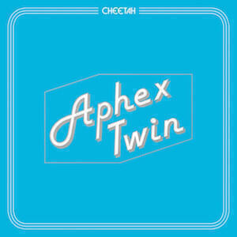

Album Digest July 2016 consists of a bumper five albums, mainly because I couldn't work out which one to drop. I think they're all pretty good though it's great to hear new music from The Avalanches after all this time.

## Bat For Lashes "The Bride"

For her fourth album as Bat For Lashes, Natasha Khan applies her considerable songwriting skills to a concept album. She sings from the perspective of a bride whose husband dies on his way to their wedding. Almost all artists would deliver this subject matter in a melodramatic way, but Khan focusses on the sadness and delivers a beautiful suite of songs.

"The Bride" is a slow sad album but it's so intimate and intricate that at points it can feel as though she is in the room with you. There are few albums that I'd recommend as "headphones music" because of the vocals but this is one. Some of the songs are not the sort that you'd want to hear on a Friday night but you could say the same of songs from a particularly tragic musical.

The first time I listened to "Close Encounters" it gave me chills down my spine. It's spooky and is a perfect fit with the subject matter, but it's also a song that would sit just fine on any of her other albums. On other songs like the spoken word marvel "Widow's Peak" she produces material that feels unlike anything she's released before, so the concept hardly feels like a constraint to her talents at all.

That said, this is not going to be an album that you'll put on for fun. Concept albums about jilted brides are always going to be a niche genre, but the fact that she managed to write such a lovely collection of songs speaks to her talent and her skill. A little more focus on before the event as well as after might add a little more drama. Her previous album "The Haunted Man" was excellent and though "The Bride" is a bit too boxed in to be thought of as highly, I think there will be plenty more great Bat For Lashes albums to come.

## The Avalanches "Wildflower"

Second albums are hard enough, even without allowing sixteen years to accrue since your début. To The Avalanches, who released the groundbreaking "Since I Left You" back in 2000, the business of once more producing something as inventive and fun must have seemed damn near impossible. Yet with little notice "Wildflower" appeared this month just in time to coincide with some wonderful weather (in the UK at least) and possibly claim the title of album of the summer, if not the year.

I confess that it took me a long time to get to grips with "Since I Left You". On release it left me cold and it wasn't until I got hold of DJ Shadow's Endtroducing some time later ("Endtroducing" was released back in 1997 but I missed it) that the sampling approach began to make sense to me. I suppose I was more used to artists like The KLF and The Orb constructing specific narratives with their music. The Avalanches' more scattershot and punky approach made less sense to me.

With "Wildflower" they've come a little way in my direction and I've found it a delight to engage with. The contributions of rappers and singers really complement the instrumental samples. It reminds me of when I would flit between FM radio stations as a kid, that mixture of nostalgic music, adverts and the stuff you were really looking for. It's languid and warm, and better still it presents an opportunity to access that sunny hedonism that characterises youth. I have no idea whether someone young enough to only know digital music would enjoy this album quite as much. The Avalanches won't care, there must surely be enough good will associated with their début even after all this time.

I think "Frank Sinatra" is a great little single, even though it took me a while to love it. You pretty much have to because it's an insidious earworm that would feel like torture otherwise. "Noisy Eater" has a definite "Frontier Psychiatrist" vibe and a fantastic sample of a kid's choir singing The Beatles' "Come Together". It's joyous and if the world needs anything now, it's more joy.

There's a series of tracks on the second half of the album that I first listened to while walking to meet Ingrid at the station. It was a warm July night, not long dark. The moon hung large in the sky and moths batted at every artificial source of light. The music that accompanied my walk felt entirely natural and gave me a complete sense of happiness and ease. I don't think that's an easy thing to create with music, something that ties you into a profound sense of happiness with whatever you are doing at the time you hear it. I think it's very impressive and it just makes me wish that The Avalanches had managed to release more music in the last sixteen years. However, if they had, would the results have been this good?

## Aphex Twin "Cheetah EP"

Talking of long hiatuses, it appears that Aphex Twin is well and truly back. This is his fourth release in two years, another EP that was recorded entirely with one particular synth. That synth is the Cheetah MS800 of the title and has a reputation of being difficult to use.

As a result the "Cheetah EP" lets us see two things: another example of just how talented Richard D. James is at programming his kit and an EP that has a uniform sound. It's very much an Aphex Twin EP too, not an AFX one. But unlike "Computer Controlled Instruments Pt2" and despite the name, the focus is very much seems to be on the tunes rather than how or on what instruments they were made.

> "This affordable Digital Wave Sequencing Synthesiser had ... the honour of being one of the most unfathomable instruments ever made - it was mind numbingly confusing to program..." ([GForce Software](http://www.gforcesoftware.com/extras/syntharchive/cheetah-ms800))

I can't tell you what it is about the synth in question or why that makes "Cheetah" a pleasant EP to listen to. All I can tell you is that the rumbling low bass lines and awkward melodies on these tracks don't sound altogether different from others he's released since his return. I particularly like the longer tracks like "CIRKLON3 (Kolkhoznaya mix)" and "CIRKLON1". The EP as a whole is very accessible, probably even more so than "SYRO".

"CIRKLON3 (Kolkhoznaya mix)" also has [a great video that is well worth checking out](https://warp.net/news/aphex-twin-cirklon3-video/). It was directed by a 12-year-old boy and is the first official Aphex Twin video for 17 years. It looks like it was made by someone playing around with the video editing capabilities of a Mac and that's ok if you're 12. The whole video seems to be him and his friends enjoying and celebrating the weirdness of the Aphex Twin's music for eight minutes.

Overall, the EP is a compelling and interesting listen but perhaps not as earth-shaking as "SYRO" or "drukqs", or even "Computer Controlled Instruments Pt2".

## Beyond The Wizard's Sleeve "The Soft Bounce"

Beyond The Wizards Sleeve is the stage name of DJ Errol Alkan and former Grid member Richard Norris. They came to my notice with some really good remixes for Midlake, Tracey Thorn, Chemical Brothers and Goldfrapp. Their remixes are often drawn-out affairs that explore different facets of the original track. I'd argue that their version of Midlake's "Roscoe" is better than the original, it's certainly why I love Midlake's "Trials of Von Occupanther" album so much.

"The Soft Bounce" is their first album of their own material. It has a psychedelic rock vibe, beginning with a trippy instrumental "Delicious Light". That said, "Iron Age" is much rockier and sounds a lot like the Klaxons. Meanwhile there's a great Stereolab/Broadcast vibe to "Creation", as close as a British band has come to replicating the Brazilian tropicalia sound.

It's not all successful and I prefer the instrumental tracks. "Door To Tomorrow" initially sounds like a _bad_ Klaxons song before deciding to sound like a bad Badly Drawn Boy song. "Diagram Girl" has a great backing track but the vocal is not substantial enough to make a lasting impact. Meanwhile "Black Crow" has a wonderful 70s cop show intro, but it soon starts to sound like Little Dragon singing a Bond theme commissioned by Lidl.

As I mentioned, the instrumentals are better. "Tomorrow, Forever" stretches woozily over seven minutes and in the recent heat has made me feel like the world is melting all around me. It's the aural equivalent of standing in the ruins of an old abbey, the walls stretch up around you but there's no roof and you blind yourself peering into the blazing sun. I admit that a whole album of this type of music might not be super-interesting, but neither is sounding like Turin Brakes on dodgy ecstasy.

The title track is also good and pleasing because it veers off in all directions in a daring way. When you listen to this track you can see the benefits of BTWS moving beyond remix work, as here they take something and smash it wide open. If you tried that while remixing a big name artist, they'd probably send it back.

"Finally First" sounds like a mellower twin of "Setting Sun" by the Chemical Brothers - though that precise record already exists in the form of the Chemicals' own "Sunshine Underground". Nevertheless it bleeds through another short track to the final and best track, "Third Mynd", which marries a spoken word description of what it's like to take LSD to a confused backing. It sounds pretty much exactly how you'd expect it to and listening to it at the traffic lights on your way home from work is very weird indeed.

"The Soft Bounce" is a decent début but Beyond The Wizard's Sleeve would do well to focus on the tracks that bring the weirdness to the surface, rather than trying to suppress it. supressed weirdness is what remixes are for.

## Islands "Taste"

And finally the second of Islands' two 2016 albums: "Taste". I said in last month's album digest that I didn't have much time to properly digest "Should I Remain Here At Sea?". I managed to properly digest "Taste", mainly because it's brilliant - an album that's both different to and superior to its companion. I think I've reviewed them in the correct order.

I'd lamented that the weird multi-structures I remembered from previous Islands albums were mostly missing from "Should I...?". Well "Taste" begins with "Charm Offensive", an appealing song that employs some interesting tricks to worm its way into your heart. One is to perform the first run through of the chorus as an instrumental. Another is to have brilliant lyrics. Another is to collapse in to weird coda. Great stuff.

"No Milk, No Sugar" is based off some chunky 80s synth, to the extent that it makes me think of Yazoo. Again it employs that trick of getting the synths to wordlessly prime you for the upcoming musical lines. It's one of those rallying cries for whatever cause you want to believe in, with suitably vague lyrics, but is no worse for it.

"Carried Away" is a soft sweet song that soars into the evening sky, while "It's Heaven" introduces guitars to a slow song that gathers pace and builds into an anthem by the end. If The Decembrists ever pastiched 80s pop as well as university level literature, they'd sound like Islands do on these tracks.

Other highlights are "Outspoken Dirtbiker" (what a title!), "Snowflake" (far funkier than a song with that title should be) and "The Joke" (darker and more apocalyptic than anything on the rest of the album).

I think there is one great album that you could shake out of these two Islands albums, but given how different each album sounds compared to the other the result might be a bit uneven. I'd say that "Taste" has the slightly larger share of great songs, though it also suffers from not having songs like "Back Into It", "Innocent Man" and "Sun Conure". Nevertheless, with two albums I feel spoiled for choice!

## Next month

Not sure what's coming next month. I'm definitely going to write about the Prins Thomas album "Principe del Norte" which I've only just discovered (It was released in February 2016). I've not seen much else due out that I fancy reviewing so I may go back and pick up a few more releases from earlier in the year. There's also a new Orb EP out, but that will get a separate post like the other two (["Sin In Space Pt. 1"](/the-orb-sin-in-space-pt-1/) and ["Alpine EP"](/orb-alpine-ep/)) did.
