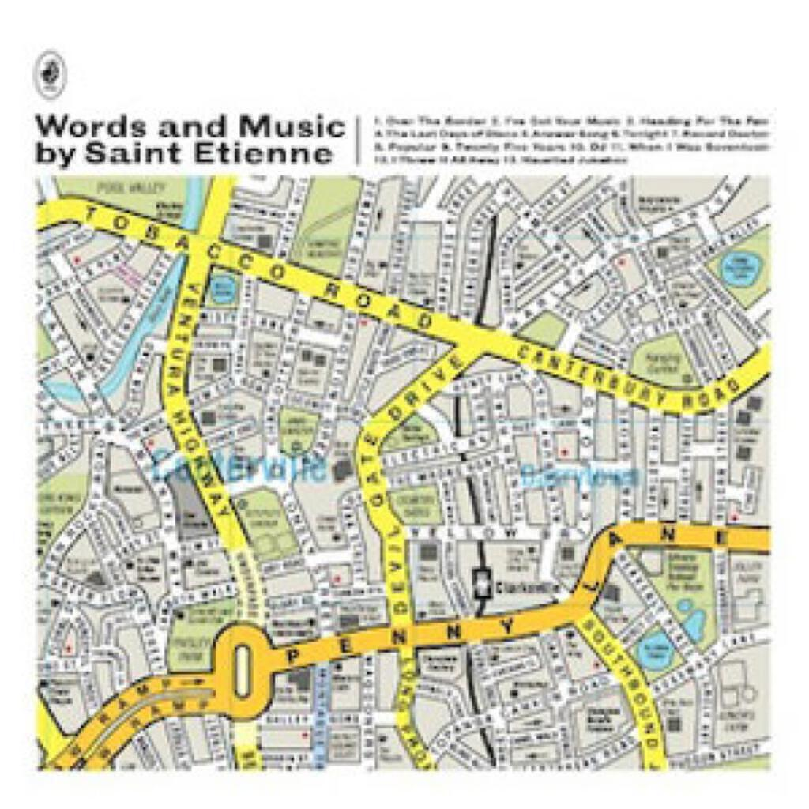
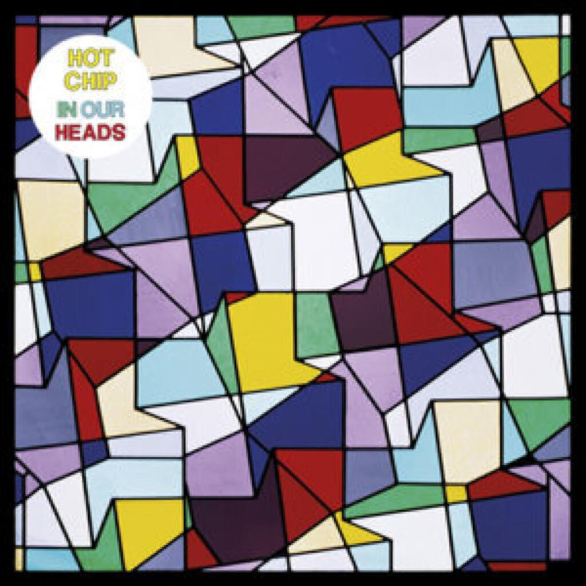
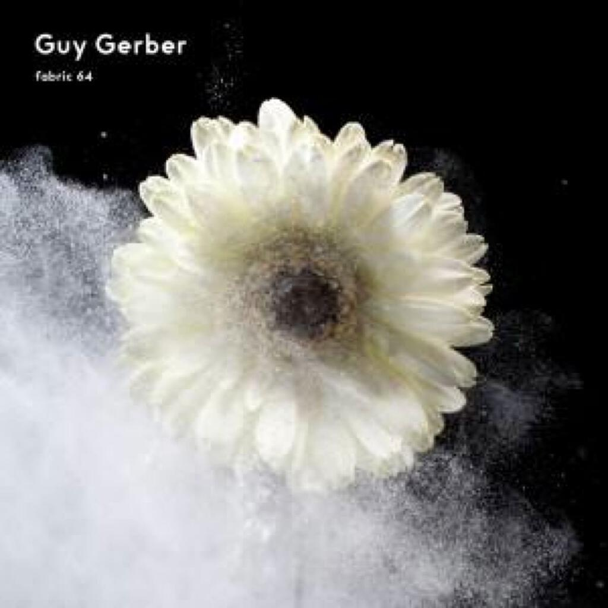

Three fantastic albums for Album Digest June 2012:

1. Saint Etienne _Words and Music by Saint Etienne_
2. Liars _WIXIW_
3. Hot Chip _In Our Heads_

This month is a curious selection in that the albums are all by bands that I already own a few records by. When there is so much other directly related material that you can write about, it makes focussing on the album in hand quite difficult. I am always thinking up rankings and comparisons. Where does this new album fit in with the rest of them? Will I like it as much when the novelty wears off? What would it sound like if they had done Y or Z like they did back on album X?

The whole “feeling a bit guilty about no new artists” thing was alleviated a little when the monthly Fabric CD plopped through the letter-hole, as Guy Gerber’s mix is a wonderfully egotistical one composed entirely of his own tracks. He is not the first Fabric mixer to do this but it was fortunate as it gave me an album of new music by an artist I’d not heard of before to listen to. Unfortunately I don’t know the genre well and opportunities for listening to a seventy-odd minute slab of throbbing electronic music were shamefully few and far between this month. I had to downgrade it to an “honourable mention” at the end of the post, though I include two of the tracks in the mix right at the end of the post.

## Saint Etienne _Words and Music by Saint Etienne_

> “This could be my life / This could save my life.” (_Tonight_)

After their comprehensive reissue series, it seemed as though Saint Etienne had bowed out, giving away tracks from the vaults as part of a victory lap. Instead they appear to have galvanised themselves into producing a magnificent concept album about our love affair with the pop single. All the songs on “Words And Music” present a very personal take on pop music, identifying the ability of the genre to produce songs that listeners can internalise and make a part of their lives. They do this with songs that epitomise these same features. On “Tonight” Sarah sings “this could be my life / this could save my life / … I can hardly wait” and this captures the thesis of the entire album: how even the most simple and seemingly throwaway music can underpin and reinforce our inner emotional lives.

It is a grand project, summarised at the outset by “Over The Border” a spoken word pean to popular music that spans childhood, adolescence and adulthood. I arrived too late to be a collector of the vinyl that is so fetishised here but I felt as strong a bond to my cassettes. I think of that recent Facebook meme featuring a photo of a cassette and a biro with the caption “Share if you know the connection between these two objects”. I also fell in love with a glamourous adult, namely Marie out of Roxette, though neither I nor my friends made the trek to Sweden to see her house, unlike the friends of the song’s narrator that head “to Somerset to see Peter Gabriel’s house”. The song continues through going to gigs and making mix tapes for loved ones, right up to falling in love and wondering whether “when I am married and have kids, will Marc Bolan still be as important”.

The songs that follow “Over The Border” are sequenced to retell its story again through songs. There is definitely a great musical to made from this narrative, especially if they throw in a few of the other great Saint Etienne singles — it could be like “Mamma Mia” but with more references to seeing the KLF on Top Of The Pops last night. Talking of singles, this album is jammed packed with potential singles. This is perhaps unsurprising for an album that is a full on tribute to the joys of pop singles and most Saint Etienne albums do effortlessly knock off at least three solid gold singles, which would be useful to them if the charts still mattered I guess. On “Words And Music” I can count six, maybe even seven, potential singles.

All of these songs are produced to perfection, primed right for the pleasure spot that either gets you up dancing or sets you down to ruminate up the past, mostly the former. There is “I Got Your Music”, a love song to the joy of listening to mix tapes on headphones; “Heading For The Fair”, a song about a first love tinged with candy floss and the whip of the waltzer; “Tonight”, a call to make music the most important thing in your life — even if for just one night; “Popular”, featuring a break up made less painful by nineties dance records; “DJ”, a song about finding and losing love on the dance floor; “25 Years”, which examines encroaching mortality in morbid close-up through the life spans of music genres and their stars; and “When I Was Seventeen” with its telling line “When I was seventeen I thought I knew everything”.

In fact I now feel a bit guilty for not listing all the songs because the remainders are hardly filler, they are just deeper and take a little longer to sneak themselves under your skin. “Last Days Of Disco” seems like a cheesy genre pastiche at first but after a few listens becomes one of those wonderful songs about just dancing and being in the moment for the sake of love, one of those songs that you only ever hear at weddings because a) nobody makes songs like that any more and b) no one really dances to get lost in the moment any more.

I cannot recommend this album enough. It is my favourite of the year so far and I find it hard to imagine what kind of record might top it. If you need cheering up and if you need your faith in love and music need to be restored, you could do worse than giving this little gem a try. The wonderfully witty cover art will give you plenty to look at too but avoid the version with the bonus disc of remixes - they really aren’t worth it. Here’s the video for “Tonight”:

## Liars _WIXIW_

> “Tie me up in a red ribbon / Teach me how to be a person.” (_Flood To Flood_)

It always feels like you damn an album with faint praise when you write something like “it sent me back to the such and such album and I really enjoyed it”. That though is my opening gambit for discussing “WIXIW”, the latest album by Liars. It sent me scurrying back to their second and third albums “They Were Wrong So We Drowned” and “Drum’s Not Dead”, two albums that I loved even though I’ve preferred number four and five for casual listening.

The reason for the nostalgic trip back to Liars’ weirder albums is that “WIXIW” is another of their curveballs - taking the simple structure of their songs, pretty much gutting the rhythm section (at least at first listen) and replacing it with electronics. One of the reviews said “Underworld fronted by Lou Reed” and I’m inclined to agree.

Taking out most of the rhythm section is rather brave. You can argue that as a three-piece, Liars are pretty much all rhythm section. Going back to drowned and drums, I was struck by how both albums were defined by drums and grooves. drowned in particular is a difficult album to get on with (Rolling Stone famously scored it 1/10 but what do they know?) but it is the rhythmic rhythmic elements that save it: see “Broken Witch”, “There’s Always Room On The Broom” and “They Don’t Want Your Corn, They Want Your Kids”.

Meanwhile, listening back to “Drum’s Not Dead” I can remember thinking at the time of its release just how close they were to being an electronic band. Tracks like “The Wrong Coat For You Mt. Heart Attack” are actually quite similar to those on “WIXIW” and the reason that the new album made much more sense after revisiting “Drum’s…” is that they approach the same space - a sort of haunted minimalism - from different angles. On one side you have squally guitar feedback and echoing drums, on the other rippling electronics.

The key question is whether all this striving for context means that I’m trying to disguise the fact that the songs on “WIXIW” are a bit weak. I can’t lie, they took a while to convince me. The opening song “The Exact Colour Of Doubt” (fantastic title!) is a beautiful mirage and instantly shows how using electronics really works with the Liars sound while “Octagon” demonstrates that the drums aren’t dead on this record either. “No. 1 Against The Rush” is probably the easiest Liars track to get along with since “Plaster Casts Of Everything”, despite it being pretty much it’s polar opposite. “A Ring On Every Finger” proves that transplanting the rhythm section into the electronics works well with the pretty chant vocal it is another accessible track.

By about four or five songs in, the true genius of “WIXIW” is revealed - this is a Liars album that is constructed completely differently from the five other Liars albums, albums that themselves are each distinct from one another. Moreover, this distinctiveness is achieved with songs that are among the most accessible that they have written. What is even more special is that this accessibility is achieved without making the songs boring or dumb. Even Radiohead have difficulty doing this sometimes and can’t do it as well as Liars do (perhaps because Radiohead have to carry a larger audience with them as they go).

The title track is pretty dense, the murky centre of an album that is as palindromic in sound as its title. “Flood To Flood” stands out as the best track on the album and contains the lyric “tie me up in a red ribbon / teach me how to be a person”, which could be as much an allusion to a flow of blood as it could be the description of a beautiful red bow. “Who Is The Hunter?” is one of the few Liars songs that you can say has a beautiful vocal, not to mention that it also has a beat that would have sat very nicely on the Hot Chip album. Contrary to the last, “Brats” is the most rumbustious of the songs on the record but is sequestered away near to the end of the record. The final song “Annual Moon Words” is uncharacteristically folky and practically acoustic, disappearing with a “Ping!” noise just as it’s getting going.

“Liars” and “Sisterworld” were albums that proved that Liars could produce direct and comprehensible songs using their sound, “WIXIW” evolves that sound and shows that with those difficult second and third albums they weren’t actually looking for a sound, they’d already found one.

There is a pretty but rather dark video for “No. 1 Against The Rush”. It annoys me because I watched it and at the start there’s this fat old guy getting dressed for a night out. Within about three seconds I’d thought “I bet he’s a serial killer and he kidnaps all the members of the band before a suitably ambiguous ending that reflects the intangible resolution of the song itself”. And guess what? The guy turned out to be a serial killer who kidnaps all the members of the band before a suitably ambiguous ending that reflects the intangible resolution of the song itself. Boring. So I am going to link to this spooky trailer for the album instead that has people trying to pronounce the album’s title:

## Hot Chip _In Our Heads_

> “I know it’s nothing more than flutes / But something in my heart is loose.” (_Flutes_)

It seems like only yesterday that “The Warning” completely blew me away after I had bought it purely on the basis of its cover art. We are now up to album number five all of a sudden (though I did join in at number two) and Hot Chip are now a really important band in my life. The fact that I have already discussed two side project albums by members of the band in album digests this year (“Be Strong” by The 2 Bears in [January](album-digest-january-2012) and “Yesterday Was Lived and Lost” by New Build in [March](album-digest-march-2012)) is another measure of this. Despite those side projects, they have now delivered albums (roughly every two years or so) and the liner notes claim that this one was recorded in just two months at the end of last year and the start of this one. I think it is remarkable that a band with such a strong work ethic still produces such consistent and interesting albums.

As a whole “In Our Heads” is a bit safer than previous albums but it doesn’t dip in quality at the end like “Made In The Dark” and it doesn’t go missing in the middle like “One Life Stand”. In fact it is the most satisfying Hot Chip album to listen to all the way through since “The Warning”. The joys of that album were its scattershot approach to genre and allowing bursts of emotion to pop up in unexpected places; “In Our Heads” is more measured, assuredly navigating changes in pace and emotion throughout.

The first time I heard “Motion Sickness”, I was walking home from work in the rain and the way it built slowly into a weird trumping tuba bass line and then into a typical Hot Chip song made me really happy. It may or may not be about the changes in how we listen to music (see sample lyrics: “Remember when we both first heard / that wall of sound, that wall of sound?” and “There’s a world of entertainment in your head”). The positive vibe continues on “How Do You Do”, a bouncy number with a fantastic lilting vocal arrangement and great lyrics about the healing power of love (“A heart is not breaking / it’s for beating out all the life that needs to begin”) and faith (“A church is not praying / it’s for celebrating the light that shines through the pain”). There are few choruses more uplifting than you make me want to live again.

After the upbeat start the tempo decreases a bit with “Don’t Deny Your Heart”, which starts in an early-90s-pop kind of way (Hello SongPop!) before settling into a lyric about offering love and friendship to the people you meet. The tempo may be dropping but the positive vibes are not! Meanwhile, “Look At Where We Are” is the slowie, a soppy song that would be way too mawkish were it not for the delightfully wry sampled voices making a chorus of disjointed “oh” noises in the background. It is sappy but it doesn’t overstay its welcome.

The pace begins to increase again with “These Chains”, a song that is probably as soppy as “Look At Where We Are”. It is the only song on the album that disappoints me because I think that more could have been made of the slightly creepy subtext of lyrics like “these chains/you’ve bound around my heart/complete me baby/I would not be free”. Mind you, it might have undermined the whole mood of the album if they had done that. The same is true of “Night And Day”, a song about getting it night and day that also has to tow a fine line - this time between cheekiness and outright raunch. There’s a tension in lines like “If I could be inside you baby / in the centre of your life” that’s not so subtle. To prevent things from getting too hot under the collar (or to send things over the top in a completely different direction) there’s a cute little non sequitur rap in the middle that had me asking myself “Do I look like a rapper?” in the shower each morning for about a week.

Next up is “Flutes” which is my favourite of all the songs on the album. It builds for 1:38 on top of some thumping techno and a sample that sounds like a playground chant. It has an indecipherable chant chorus that I always join in with, I just make up the words as I go along. It stretches out over seven luxurious minutes and not one is wasted. The best thing about the song is the contrast to the rest of the album in being a song that derives its meaning and emotional punch mostly from the dynamics of the musical arrangement and the production, rather than the lyrics and their delivery. Sometimes it is better not to explain things and just head for the floor.

After “Flutes” the album settles back into its song-based with “Now There Is Nothing” which relaxes on a funky strut that is enlivened by key and tempo changes. I think it suffers a little in comparison to “Flutes” but it is a fine song that reminds me of The Beatles, though I cannot put my finger on why. The start of “Ends Of The Earth” reminds me of their Kraftwerk remixes but with a splash of an 80s Pet Shop Boys 12” mix thrown in for good measure. Like “Flutes” it builds steadily for a significant proportion of its runtime before introducing the main vocal but the song that emerges is more straightforward, a simple request for compassion from a lovelorn admirer: “All I want is that your love pulls me back”.

On “Let Be Him” I can hear the New Build influence, which is nice. It’s a song about being bummed out about being single: “All this freedom we get / it’s not all it’s cracked up to be” and Hot Chip should probably be commended for their persistence with the idea that working hard for one particular person is the best way to be content. This little snippet from the lyrics doesn’t quite fit with the rest but it is a worthy sentiment: “Work hard / play hard at work / lend me your ideas / but not too fully formed”. Meanwhile, the music features the best use of a pedal steel on a British pop record since The KLF were about.

Finally “Always Been Your Love” is another slow song about true love that they manage to deliver without any cloying sentiment, just pure contentment. It might be because the guest backing vocal by  Gang Gang Dance’s Lizzi Bougatsos is suitably wry and detached, or it might be the cheesy MOR guitar work. Either way, it’s a mellow way for the album to sign off and fade out into gorgeous strings.

I think that “The Warning” remains Hot Chip’s best album to date, which is a little strange given that there have been three more albums down the pipe since. I think there have been plenty of singular stand out moments since then but I do wonder whether they can pull another truly awesome record out of the bag. All the side projects can’t really help can they? We shall have to wait and see.

Here’s the video for “Night And Day”, which manages to be even more barmy than the song itself:

Although nothing can beat this video for “I Feel Better” off “One Life Stand”. It is by the same director and is from the lesser known “boy band versus aliens demolition derby” genre of music videos:

## Honourable Mention: _Fabric 64_ mixed by Guy Gerber

Fabric 64 begins with a steady beat and lots of stray effects shimmering within the mix before a riff reminiscent of both Kate Bush and Royksopp kicks in (“Store-House Consciousness”). Then comes the wonderful caress of “The Golden Sun And Silver Moon”, all moonlit vocal samples that lap softly under the mix before a strident beat kicks in splashing sunshine all over the track and a clearer vocal emerges. “Shady Triangle” continues the trajectory down and takes on deeper, fuller sound. I have no real reference points for how any of it really sounds: [perhaps have a look at the link on the Fabric website](http://www.fabriclondon.com/store/catalog/product/view/id/401/s/fabric-64/categories/8/%20%E2%80%9C%E2%80%A6and%20I%20will%20too%E2%80%9D).

All the subtle shifts and variations as the mix progresses make it very good to work to. For the playlist, I have chosen songs that made me look up to the track listing when I have head my head down. If I hadn’t been limited to just two choices I probably would have chosen “Ribbons Turn To Chains” and “A Blade Through My Piano”.

I also listened to the Totally Enormous Extinct Dinosaurs album “Trouble” on Spotify this month. I thought it was ok but I did not find it as exciting as people were making out.
