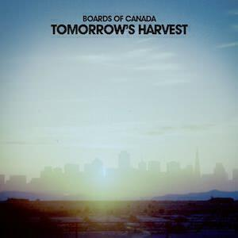

Just two albums this month as I am still enjoying last month's albums so much (and I spent loads of time getting reacquainted with Boards Of Canada at the start of the month). I listened to a few more albums but not often enough to write loads about them so there is an "honourable mention" section at the end of the post that briefly discusses a few more albums.

Without further ado, the two albums are:
1. Boards Of Canada _Tomorrow's Harvest_
2. Jon Hopkins _Immunity_

## Boards Of Canada _Tomorrow's Harvest_

 As you no doubt know, "Tomorrow's Harvest" is the first Boards Of Canada (BoC) album for nearly eight years. It arrived after a rather nifty viral campaign1 and the pre-release single Reach For The Dead got me so excited that I dived right back into their back catalogue in a big way.

The main reason for my back catalogue delve is that up until the start of the month I only owned a rather lush limited edition copy of their second album "Geogaddi". For me, because I completely missed "The Campfire Headphase" back in 2005, this was the first BoC album for over a decade. I caught up on "Campfire..." and found that it didn't really compare to "Geogaddi". Neither did their first album "Music Has The Right To Children" for me. I know it is probably a heresy to criticise a debut album that many consider to be a turning point in electronic music. I don't really disagree with those kinds of statement, I just happen to think that "Geogaddi" is a better album with a more coherent story.

"Coherent story" is a phrase that comes up in my mind throughout as I listen to "Tomorrow's Harvest". Sonically it's not too dissimilar to their earlier stuff, at least not on an initial listen. The difference between this album and their previous ones (with the exception of "Geogaddi" perhaps) is that every track seems to serve a purpose in the larger whole. On "Music..." and "Campfire..." part of the joy of those records is how the little interludes nudge the sound into little cul-de-sacs and new places. On "Tomorrow's Harvest" it feels instead like no single note is wasted and that, in the sense of the truest ambient albums, every sound and beat and sample serves a place in an overarching narrative. It is linear, but with none of the negatives that that adjective might comply.

The overall theme of the album is a sense of post-millenial dread. It echoes through the desolate song titles (e.g. "Cold Earth", "Sick Times", and "Collapse" to name but three) and the artwork: empty spaces and bright blue skies, with agricultural scenes that appear to be abandoned due to either collapse or obsolescence. Much has been made of this sense of dread in reviews of "Tomorrow's Harvest" and in the rare promotional interviews with the band. It was the same when Portishead returned after a long break with their album "Third". So much was made of how much of a bummer their album was, it was almost as if people forgot how nice it was to have them back. (And as this weekend's Glastonbury performance showed, how nice it _still_ is to have them back.)

For all that is made of the supposed "dread" on records like this one and "Third", I think it really is a reflection of a long hiatus taken by a band. As you get older, you need longer to write songs: you know what counts against you, you've already written a few good ones and the new ones aren't allowed to sound the same, you have so much more to say now, etc etc. The longer you take, the more likely it is that you will lift your head above the parapet and see the world as it really is.

Personally, I don't find "Tomorrow's Harvest" any more disturbing than a Radiohead album. The austere sound, the artwork and the song titles do make me think about what kind of world we are creating. The weird hypnotic robot voices on "Telepath" are quite discomfiting, suggesting that technology may not be the ally that we like to think it is. Certainly with things like PRISM in the news, that sensation is only heightened by looking for it in the real world. That said, there seems to be a happy ending of sorts. To my ears the closing three tracks "New Seeds", "Come To Dust", and "Semena Mertvykh" sound upbeat and positive. It squares off nicely and makes me want to play it again and again. And I have.

## Jon Hopkins _Immunity_

 Since 2008's "Insides" (not to be confused with Orbital's 1996 album "In Sides"), Jon Hopkins has contributed to Coldplay's albums "Viva La Vida" and ["Mylo Xyloto"](album-digest-october-2011), and [collaborated with Brian Eno and Leo Abrahams on "Small Craft On A Milk Sea", which was one of my favourite albums of 2010](2010-in-review) (and of course [I love a bit of Eno](uc16) [now and then](album-digest-november-2012)). He's also released an album with King Creosote, who also guests on the title track of "Immunity".

I describe "Insides" to people as being "an ambient album with the shark attacks left in". I was given a copy by a friend and first listened to it on a cold Easter in 2010, happily listening to the celtic strains that introduce "The Wider Sun" and the gentle atmospherics of "Vessel" (with the chiming bits that Coldplay borrowed) before being shocked by the breakbeats bursting in. It's a delightfully heterogeneous album as a whole, though long sections are perfectly twinkly and ambient while the noisy interludes are satisfyingly crunchy.

"Immunity" is as divided between uptempo work and slow chilled out numbers but it plays out as an arc across the eight tracks that basically tells the story of a night out. It starts out with some atmos that put me in mind of Four Tet's fabric mix and sets off through four beat driven tracks, the best being the euphoric single "Open Eye Signal" and culminates in the nine minute "Collider" that stretches out and slowly decelerates across the centre of the album.

The second half of "Immunity" is very chilled out and is perhaps even more blissfully inert than the Boards Of Canada album. "Abandon Window" completely dissipates the clubby mood in a matter of seconds, quickly forming into a pool of reflective piano sounds and gentle synth hum (It's very Eno-like actually) before resolving into a weird choir-like fog of noise. For its final four tracks, "Immunity" is in a wholly different mood, yet the sound of the second half is so in keeping with that of the first, that it doesn't feel too strange. This is probably helped by the kinetic shuffles and glitches of "Form By Firelight", which matches the hazy comfort of warmth to the gentle crackle of the flames.

Even "Sun Harmonics", which part way through breaks down in to the sound of almost nothing, has a strong insistent pulse wrapped around the sonics for most of the track. It is strange how these tracks can leave me with the memory of them being slow and quiet, yet when I re-listen to them, it turns out that they are full of strident pulses and interesting non-trivial details. For an album that is for the most part serene, it's remarkable how busy the tracks often are. It's a nice cognitive dissonance to experience and there's no doubt that Hopkins will continue to produce albums that are both interesting and relaxing to listen to. I just hope he doesn't wait five years next time2.

* * *

### Honourable Mentions

1. _False Idols_ by Tricky. I think of all Tricky's albums since "Angels With Dirty Faces", this is probably the one that sounds most like what most people want. It's not a classic like "Maxinequaye" but there are some pretty good songs on here and his new vocal collaborator is probably about as close as he is going to get to Martina without actually getting his former muse back into the fold. I particularly liked "Do It", "Nothing's Changed" (which, like about five other Tricky songs, interpolates lines from my personal fave "Makes Me Wanna Die"), and "Nothing Matters".

2. _The Wack Album_ by The Lonely Island. Comedy albums rarely remain funny for the length of an album, let alone beyond that. "The Wack Album" had its highs and lows but there are some genuinely funny songs here in a Weird Al Yankovic kind of way. I like how "Spring Break Album" is catchy enough to have you singing "something something / marry a man" after about 0.33 listens and how you as the listener realise before The Lonely Island do that they are going to get F's for their definition of "Semicolons". Elsewhere everything is very crude and will probably raise at least a smirk or two, at least for the next month or so, if you like that kind of thing.

3. _More Tales From The Orbservatory_ by The Orb and Lee 'Scratch' Perry. This is pretty good. I still haven't caught up on the parent to this little EP but I enjoyed the tracks here so I am really looking forward to hearing "The Orbserver In The Star House" at some point. (Minor point: the instrumental versions used to bulk out the track listing really don't add much to the experience.)

* * *

  1.

Which reminds me that I am going to _have_ to re-read and then write about "Pattern Recognition" by William Gibson in the near future…↩

  2.

I'm obviously going to check out that King Creosote collaboration soon.↩