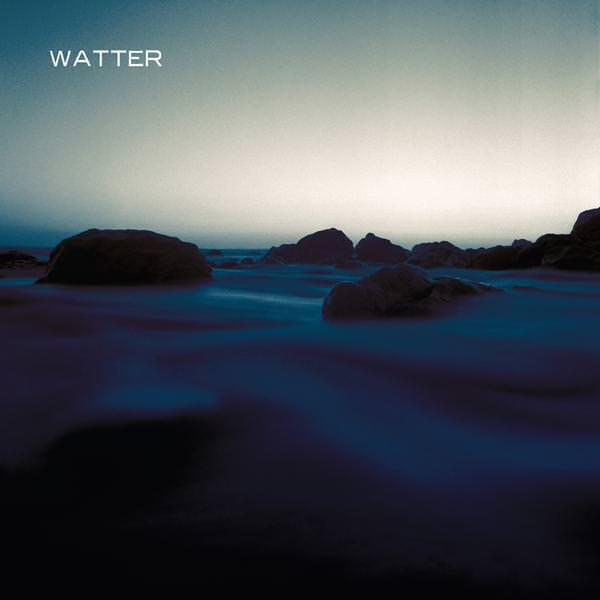
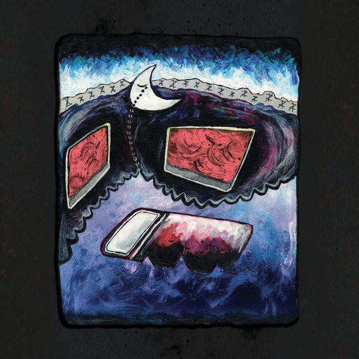
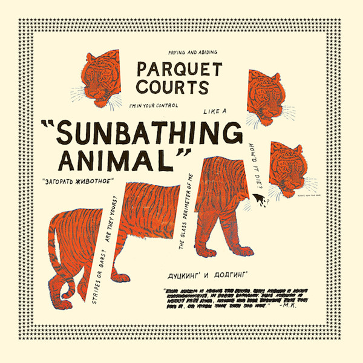
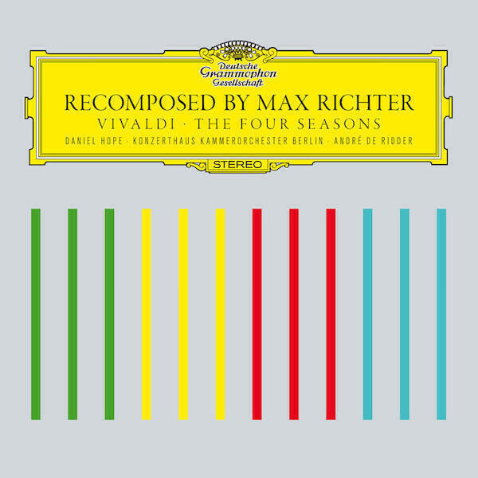

[Watter](http://temporaryresidence.com/artists/watter) are a "supergroup" composed from various members of Grails, [Slint](http://touchandgorecords.com/bands/band.php?id=70), and other bands. I did not know anything about Hundred Waters before this month: "The Moon Rang Like A Bell" is their second album. In fact second albums by bands I know nothing about are a something of theme because "Sunbathing Animal" is Parquet Courts' sophomore effort and I don't know anything about them either. Meanwhile, I've meant to write about "The Four Seasons Recomposed" since April.

## Watter "This World"

The fingerprints of [Grails](http://www.grailsongs.com) are all over this album, a collaboration between Zak Riles (of Grails) and a few other musicians I've not heard of: [Tyler Trotter](http://history.louisvillehardcore.com/index.php?title=Strike_City); [Britt Walford](http://www.factmag.com/2014/03/12/murder-ballads-an-interview-with-slint/) of Slint; and [Rachel Grimes](http://rachelgrimespiano.com). On the opener "Rustic Fog" it's the slippery slide guitars that give the game away, though the gentle heartbeat and the woozy windswept synths add a level of detail that you wouldn't find on [Deep Politics](album-digest-march-2012 or [The Black Tar Prophecies](http://shop.temporaryresidence.com/trr187). In fact ["Rustic Fog"](https://soundcloud.com/temporary-residence-ltd-1/watter-rustic-fog) most resembles one of the longer tracks from either of the [Lilacs &amp; Champagne](http://www.mexicansummer.com/shop/lilacs-champagne/) albums (note that Zak isn't in L&amp;C though); it bubbles rather than boils and the lack of vocal samples gives the music room enough to build and to glower, unlike tracks like "Le Grand" from Grails' hyperactive hip-hop side project.

The second track "Lord I Want More" is more folky with finger-picked acoustic guitars and sensitive piano playing replacing the murky synths until about half way through when it melts into a weird starry synth lullaby, collapsing in on itself like a dream does when you wake up. The end of "Lord I Want More" sets up the intro to <"Small Business", one of two much longer tracks ("Small Business" is 13:32 and "Seawater" is 12:51) that fill out the majority of the run time. "Small Business" begins like a less subtle Grails track, built on strong guitars and strident drums. It's a bit too mellow for it's own good but there is plenty of space and structure for the chiming guitars to move around in. It feels like a relief when the fireworks really kick in on the five and a half minute mark and the track really takes off. With just over four minutes left "Small Business" becomes a gentle trancey piece again with a riff that sounds like stones skipping across the water, completely with splashing sounds and some nifty work with the pedals. It's got a nice [Philip Glass](http://philipglassrework.com) feel to it.

Following this is a shorter track "Bloody Monday" which includes a vocal sample, more finger picking, and a country violin. It's a beautiful wordless song that seems to be a million miles from its title. The sound is so clear and crisp, it really feels like a break from the fog that hangs over Grails records: perhaps this is what "Almost Grew My Hair" could have been in a perfect world.

The other long piece "Seawater" is even better than "Small Business". The first few minutes build off a nagging riff and droning synth: these are the creepiest moments on the album. Then a strong drumbeat kicks in and finger-picked acoustic guitar builds a riff around that instead, before an electric guitar also takes up the riff. In the background the synths still spiral around producing a sound fog to get lost in. As with "Lord I Want More" and "Bloody Monday", the riff is folky when it finally emerges and soars above all everything else. The rest of the track is a guitar playing master class and there's one bit of riffing counterpoint around 8:30 that's so amazing that I can't really explain why it excites me so much. It's noisy and it's mellow, the aural equivalent of salty and sweet.

The final track is the title track, a beautiful sound envelope that's basically virtual reality realised as music. Put "This World" on and imagine the most perfect place you could be, this is music that will transport you there. Expect to hear it soundtracking a quiet moment of transcendent beauty in a movie near you some time soon. More finger picked guitar lines dance over insistent piano motifs gliding forward in time like a figure skater on ice. It's serenely and divinely beautiful.

[The iTunes version of the album has a bonus track "Digital Camo"](https://itunes.apple.com/gb/album/this-world/id848494332) that is also interesting. It doesn't feel as well rounded as the rest of the material here but it's very upbeat and is just a few good lyrics short of being a decent rock song. Unlike the rest of the tracks here, [you get the feeling that the band peeled this one off very quickly](https://soundcloud.com/temporary-residence-ltd-1/watter-digital-camo-digital-bonus-track). Overall "This World" is a fine instrumental album and one that further adds to my belief that Grails are awesome. It's hard to know whether Watter are a permanent proposition or a one-off project: I guess it all depends on whether Grails are in fact in the process of amicably breaking up. Both Lilacs &amp; Champagne and now Watter prove that while we will lose a lot if they are, we will also gain much much more.

## Hundred Waters "The Moon Rang Like A Bell"

I suppose the best way to get started on writing about <a href="http://www.hundred-waters.com">"The Moon Rang Like A Bell"</a> is to provide a list of albums it reminds me of: <a href="https://www.subpop.com/releases/washed_out/within_and_without">"Within And Without" by Washed Out</a>, <a href="http://www.theguardian.com/music/musicblog/2012/dec/13/best-albums-2012-grimes-visions">"Visions" by Grimes</a>, <a href="http://www.factmag.com/2012/06/04/laurel-halo-quarantine/">"Quarantine" by Laurel Halo</a>, <a href="/album-digest-february-2011/">"James Blake"</a> and <a href="/album-digest-april-2013/">"Overgrown"</a> by James Blake, "If You Wait" by London Grammar, <a href="http://www.ranker.com/list/best-enya-albums-list/reference?utm_expid=16418821-33.0-sZtzOfTrqQsZax8VZVyw.0">and one of my mum's old Enya albums</a>. That's not to say that they sound exactly like the exact average of those albums (imagine that?!), it's just a starting point from which we can begin.

Another starting point might be to relate some things that I have learned about the band. They are a four piece from <a href="http://www.visitflorida.com/en-us.html">Florida</a> who have supported Alt+J and <a href="http://thexx.info">The xx</a> in the past. This is their second album and the first to receive major attention. <a href="http://instagram.com/hundredwaters">They have a nice Instagram</a>. I also find it interesting that one of the band was a programmer for streaming music service <a href="http://grooveshark.com">Grooveshark</a>.

They follow the xx/Chvrches/London Grammar template of having a breathy female singer (<a href="http://www.thefourohfive.com/news/article/exposure-nicole-miglis">Nicole Miglis</a>) backed up with a few guys (<a href="http://hearhums.blogspot.co.uk/2011/01/trayer-tryon.html">Trayer Tryon</a>, Paul Giese, <a href="http://blog.grooveshark.com/post/32878521523/an-interview-with-zach-tetreault-of-hundred-waters">Zach Tetreault</a>). What makes them different is that they try to square the difference between perky Chvrches and languid London Grammar. There's lots of quirky production and variation in pace, things that I thought were lacking from London Grammar's "If You Wait". So while a lot of the tracks, like "Broken Blue" and "Chambers [Passing Train]", depend as much on space as sound, there are also songs like the fantastic "Down From The Rafters" that pick up the pace a bit.

The interesting production ideas are what draw the comparison to Grimes and James Blake, while the laid back bits definitely recall Washed Out and The xx. It's a bit unfocussed in places but that's not a bad thing, albums like "Quarantine" and "Visions" are great precisely because the roughness around the edges rewards repeat listening. If you're looking for an album to sunbathe to, try this one.

## Parquet Courts "Sunbathing Animal"

I'd not heard of them at all until a few weeks ago but "Sunbathing Animal" is <a href="http://parquetcourts.wordpress.com">Parquet Courts</a>' second album (<a href="http://parquetcourts.wordpress.com/2014/04/14/american-specialties/">or is it?!</a>). They're from New York and they live up to the hype and <a href="http://pigeonsandplanes.com/2013/05/the-50-greatest-new-york-city-rock-bands/">that heritage</a>. It is better when bands mature out of the spotlight, it gives them a bit of time to refine their vision and come up with some solid material. That is definitely the case here because "Sunbathing Animal" is a cracking album. My response to it has been similar to <a href="/album-digest-april-2013/">"Change Becomes Us" by Wire last year</a>: it's a slow burner overall but there are enough hooks to get you addicted and into loving the whole thing over the long haul.

Let me start by shouting from the rooftops about the hooks. The album begins with the <a href="http://pitchfork.com/features/articles/7925-this-is-it-ten-years-of-the-strokes/">Strokes</a>-like riff of "Bodies Made Of" and then rushes into the single "Black and White". Listen close though, it's not all wiry guitar work and crashing cymbals: there are some pretty cool lyrics there. Later on, there is my favourite song on the album "What Colour Is Blood?" (Still the same that it was, apparently) and the rollicking "Ducking and Dodging".

The template for those upbeat tracks is provided by <a href="http://uk.pinterest.com/JuniperRidge/music-nyc-punk-rock-heroes/">all those New York punk bands you love</a> (or post-punk in the case of "Vienna II" and the title track). For the more mellow tracks the reference points are <a href="http://www.loureed.com/inmemoriam/">Lou Reed</a> and <a href="http://www.stereogum.com/1368561/spiritualized-albums-from-worst-to-best/list/">Spiritualized</a> (though I guess I should say <a href="http://www.theguardian.com/music/2008/aug/01/popandrock.suicide">Suicide</a> to keep up the NYC connections) - in fact "Always Back In Town" sounds like Jay Spaceman backed by The Strokes. The presence of <a href="http://www.banquetrecords.com/RSD14LCDS">LCD Soundsystem looms over the whole album</a> too, in a good way.

There is simply too much to write about this album: be it the way that "She's Rolling" lumbers in and out of view accompanied by the most demented harmonica work I've heard this side of <a href="/understated-classics-13/">The Orb's "Towers of Dub"</a>, or how "Instant Disassembly" seems to <a href="http://www.theatlantic.com/past/unbound/classrev/lolita.htm">compress an entire novel's worth of story into its seven minutes</a>, or even how the thrash of "Sunbathing Animal" makes nearly four minutes seem like just one. Needless to say that, with all this going on, this album is a thing of unmitigated joy and beauty.

## Max Richter "The Four Seasons Recomposed"

Regarding <a href="http://www.maxrichtermusic.com/en/index.php">Max Richter</a>, the question is inevitably: why did he attempt to recompose the Four Seasons? Well mainly it was because he asked to. Deutsche Grammophon has decided to try and be cool (this decision, as is oft the case with humans and record labels, coincides with a base 10 round number anniversary), and commission electronic artistes to "reevaluate" some of their classic classical recordings, sampling them to create new pieces. Previously <a href="http://matthewherbert.com">Matthew Herbert</a>, whose original work I have a profound admiration for, did various apaprently unspeakable things to a recording of <a href="http://en.wikipedia.org/wiki/Symphony_No._10_(Mahler">Mahler's Unfinished 10th</a>). Judging by the reviews of the result in that case, see the quite frothy response on amazon <a href="http://www.amazon.co.uk/review/R1XNS20K72C17S/ref=cm_cr_pr_perm?ie=UTF8&amp;ASIN=B003F0NFPO">here</a> and <a href="http://www.amazon.co.uk/review/R1WXJ22ULODT75/ref=cm_cr_pr_perm?ie=UTF8&amp;ASIN=B003F0NFPO">here</a>, not everyone is ready for music they love to be endowed with additional postmodern flourishes and/or conceptual weight. Traditional listeners of DG records might decide to swap "flourishes" and "weight" for more impolite nouns and I would not hold it against them. However, the modern listener, saturated with "classical" music from day one, may find that the conceptual widgets help to amplify particular signals amid the noise.

Returning to the Four Seasons, Richter decided that he couldn't do enough with the recording he was due to work with and found that the only thing he felt happy to "sample" and rearrange was the original score. As <a href="http://www.imdb.com/name/nm2068037/">a prolific soundtrack artist</a>, Richter no doubt felt there were motifs and riffs that he wanted to cast in a new light, and while sampling is an incredible technique in skilled hands, perhaps these were things he could only do at an atomic level. I'm aware of, but have not heard, his "genuine" (as opposed to screen) work but I do know that it is held in high regard. In particular a piece called "Memory House" that has been <a href="http://www.barbican.org.uk/music/event-detail.asp?ID=15305">performed by the London Sinfonietta</a>. The <a href="http://www.londonsinfonietta.org.uk">LS themselves</a> can be relied upon to be "up for" performing screechy modern pieces - not to say that Memory House is one of those. I'm going to find and copy and listen to it when I can.

When it comes to classical music, my tastes are shallow in some ways - I only dip my toes in the more traditional canon once in a while. I think you can be said to be enthusiastic for a piece if you seek out multiple performances of it and I've only ever done that with three pieces. One is <a href="http://en.wikipedia.org/wiki/Violin_Concerto_(Mendelssohn)">Mendelssohn's Violin Concerto in E-minor</a> (a dip of the toe into that deeper wider canon) and the other is <a href="http://www.boosey.com/cr/music/Steve-Reich-Different-Trains/2699">"Different Trains" by Steve Reich</a> (more akin to the usual bathing place). The third piece (and a second dip of that toe) is <a href="http://www.gramophone.co.uk/features/focus/rodrigo%E2%80%99s-concierto-de-aranjuez-which-recording-is-best">Rodrigo's Concierto de Aranjuez</a> - I have always loved the shimmering mirages of its second movement and have heard quite a few variations, <a href="http://online.wsj.com/news/articles/SB10001424052702304655104579163722788382890">including one by Miles Davis</a>.

Anyway, to actually review the album in question. I like it. It's now to fussy to be enjoyed in the way that the original is best enjoyed: with the lead violin role placed squarely <a href="http://bachtrack.com/review-bbc-prom-34-2013-nigel-kennedy">in the hands of a bonkers virtuoso like Nigel Kennedy</a>. Nevertheless many of the original's charms are intact (that wonderful brooding and shimmering movement in Summer for example) and other facets of the piece are enhanced in Richter's new arrangement: it's much more emotional and lyrical than I remember.

The CD version also contains five electronic pieces by Richter ("Shadows") that are fairly inessential and four remixes of a movement from each of the seasons. The first, "Spring 1", by Richter himself is probably the best, applying all the electronics and bird song samples that he presumably couldn't bring himself to adorn an original DG recording with. The remix of "Autumn 3" by <a href="https://soundcloud.com/fearoftigers">Fear of Tigers</a> is fantastic but presented in a truncated version: the twelve inch version available on SoundCloud and Spotify is far better. The other two mixes are fairly servicable too, <a href="http://www.robotsdontsleep.com">Robot Koch</a> even decides to turn "Summer 3" into hip-hop with results that are not too cringeworthy!

All in all, it's a respectful undertaking that is a qualified success. As with all remakes and reboots and such like, it's always best to retain a connection to the original - just as well there's <a href="http://vivaldisfourseasons.com">a companion app</a> to help you explore both works if you like that kind of thing. Beyond that, I will certainly be investigating more of Richter's work.

