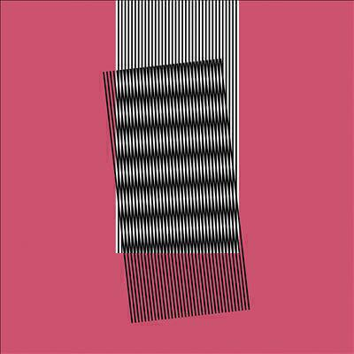
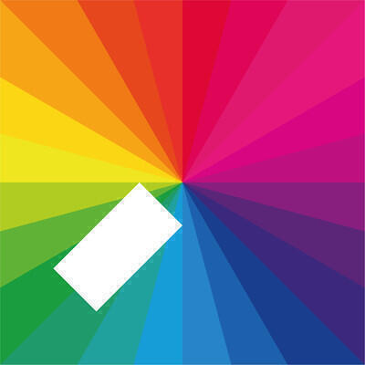
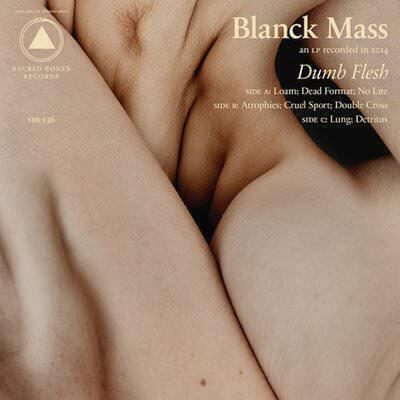
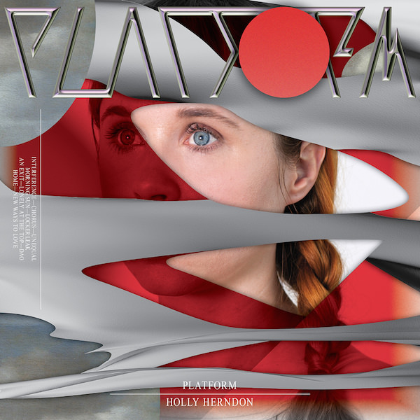
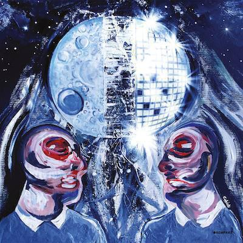

To reboot this series, Album Digest June 2015 features five fantastic albums from Hot Chip, Jamie xx, Blanck Mass, Holly Herndon, and The Orb. I could pick loads more as I've listened to a lot of albums since [February](/album-digest-february-2015/) but I decided to focus on the more electronic material. This means that I have no excuses for not continuing next month with a rockier theme.

## Hot Chip "Why Make Sense?"

Hot Chip seem to be settling in to a pattern with their album releases, alternating between messy experimental affairs and then a state of the art correction. Witness how "The Warning" smartened up the all-over-the-place "Coming On Strong" and how "One Life Stand" moulded and matured the lovestruck meandering of "Made In The Dark" into a lithe ten song set. "Why Make Sense?" takes the earnest song-based approach of "In Our Heads" and casts it into a funky fun-filled fifty minutes. It's as concise as they've been since "One Life Stand".

As usual there are bangers, songs that would happily sit on any of their albums. "Huarache Lights" is a pean to machine intelligence, the line "replace us with the things that do the job better" repeated by a vocoder that gradually melts into an incomprehensible babble. "Love Is The Future" is a sweet love song that takes on the tweeness of "Look At Where We Are" and re-tools into a bouncy pop song.

I think "Easy To Get" is probably as coy and sexy as Hot Chip have been since "Made In The Dark". It's pretty direct about playing easy to get: "You need a coat, something to take off". Meanwhile there's a lovely little synth line that filigrees the chorus that makes it feel like a song you've known for years. It's lovely.

Other tracks like "Need You Now" and the title track aim squarely for the dance floor. The former is built around a lovely sample of an old school house vocal (sorry, I'm not knowledgeable enough to say what it is), giving it a ready-made classic feel. It also features the much underused vocal talents of Al Doyle. The title track has provided some consolation since the disastrous result of the election with its killer line: "Be what you are / at the mercy of your rulers."

Hot Chip are UK dance music's Radiohead. They get on with the job without too much fuss and constantly turn out excellent albums. I wonder what their "Kid A" would sound like?

## Jamie xx "In Colour"

I want to like The XX much more than I do. I love their remixes but their original albums not so much. I admire their spare approach to arrangements and their monochrome artwork, but over the course of a whole album their music tends to leave me cold. Songs that are amazing in isolation, like "VCR" or "Angels", just don't come together well at anything over EP length.

"In Colour" is very much the remedy to that, the colour wheels of the artwork seem very apt. Like anyone trapped in a corner by a restrictive aesthetic, Jamie xx has done the sensible thing and started all over again. This is album is a colourful (there I said it) explosion feel good nostalgic dance music. Stand out tracks include "Gosh", "Seesaw" and "The Rest Is Noise".

"Gosh" takes the rattling brittle rhythms of UK drum'n'bass and moulds it into a warm vibrant opening track. It's all homage and you can feel the love seeping out your speakers.

"Seesaw" shows that with more emphasis on beats and less on introspection, The Xx could be a phenomenal band - in fact this plays more like a remix of one of their songs than a song proper. Remy's detached vocal works well as a vague snippet, while a more extended contribution later on ("Loud Places") gives the album a much-needed breather and its emotional heart ("I go to loud places / to find someone to be quiet with"). Another collaboration with Oliver, the other member of The XX, is less successful but at least it is short.

I have no idea whether "The Rest Is Noise" is inspired by Alex Ross's excellent book of the same name. I think I'd expect more neo-classical wonkiness over the album as a whole if it were. The track itself begins with a minimal beat that initially sounds like it is sticking but eventually emerges into an emotional heartbeat. It is beautifully affecting instrumental music, the sort of thing you'd like to watch the sun come up to. It pulls a lovely feint with a deep bass line toward the end too.

As a whole, "In Colour" reminds me a lot of Four Tet's "Beautiful Rewind" album, which took a similar nostalgic approach and produced a kinetic album that emphatically endorsed an older form of dance music whilst still sounding fresh and new. I wonder if this more expansive approach could also be applied to music by The XX.

## Blanck Mass "Dumb Flesh"

Blanck Mass is the pseudonym of Benjamin John Power, one half of minimalist noiseniks Fuck Buttons. "Dumb Flesh" is his second album under this alias.

If "In Colour" is a euphoric celebration of dance music past, then "Dumb Flesh" could be thought of as a darker trip into its future. Not that this album is entirely ascetic, it also has a knack for hitting the savvy music fan's pleasure points. Take the opener "Loam" which slurs into your headphones with distorted voice samples but ends up becoming a frenetic gated jam by the end of its four minutes.

"Dumb Flesh" is front loaded with possibly the best dance tune of the year, "Dead Format". It's a glowering colossus, a banger that does all that button pushing I mentioned. There's a proper build in it and the main riff is a distorted female vocal that's pulled from pillar to post (or more accurately, around and through your ears like some sort of brain floss). It certainly demonstrates a novel way of getting around sample clearance: mangle your vocals beyond recognition.

After that things are more subdued. The ten minutes of "No Lite" sound like a softer Fuck Buttons track - which isn't to say it isn't relentless and minimal, just that the average Fuck Buttons track is pretty heavy. There are also more elements at play here than on a typical Fuck Buttons tune.

"Cruel Sport" almost has a chorus. About three-quarters of the way through it sounds like a sampler has gained sentience and is trying to rap, all over a beat that's about twice the size of your house. It's epic, almost as good as "Dead Format". There won't be many albums out this year with two tracks as good as "Dead Format" and "Cruel Sport".

The rest of the album is good but doesn't quite match up to the highlights. It's a perfectly serviceable listen but I get the impression that I'll end up putting those two great tracks on a playlist and then forgetting about the rest.

## Holly Herndon "Platform"

This is an album that could teach robots to love. It's excellent. It features pretty much every element I love about dance music and presents it to your with fresh ears. If you bother to listen to just one of my recommendations this month, make it this one.

Holly is a musician and sound artist, and her compositions on "Platform" skip along that boundary between recognisable music and something other, something we might instead choose to call art.

At points it makes me think of [Laurie Spiegel's experiments in how to create electronic music in the first place](/album-digest-october-2012/), the experiments of Glass, Reich, and others in making a modern classical music, and then the simple visceral pleasures of techno's throbs and thuds.

Elsewhere there are tracks that make me think of Prince, James Blake, Grimes, and [Laurie Andersen](https://en.wikipedia.org/wiki/Laurie_Anderson). Most of it though just sounds utterly unique: all those comparisons are just me clutching at straws.

Take "Chorus", it's propelled along by a throbbing beat and yet dominated by sampled voices. It's so precise and full of so many small detailed elements that it is impossible to describe in its totality. Of course its idiosyncrasy and defiance of description does not detract one iota from the very real pleasure of listening to it.

And the thing is things just get weirder and weirder from there. "Unequal" takes what sounds a bit like a medieval plainsong and then wraps it around a barely there beat, before folding in the sounds of running water, bird wings, and samples of poetry. For some people it's not going to make any sense at all but for the open-minded it is genuinely mind expanding.

"Morning Sun" uses a similar formula and is perhaps the most recognisable pop song on the record. It also has a cool video of her walking around on Mars alone, evoking "The Martian". And again, it's not just the fact that it sounds so incredible as a whole (and _like a pop song_ despite of everything that's in there) but that there is so much internal detail. Not only that, but that it can sound logical despite all the tangents and interruptions.

My favourite though is "Locker Leak", which is part sung, part spoken, and all crazy. It's full of tongue twisters, puns, and advertising slogans. There's also a killer beat underpinning it all. I think it says a lot about the crazy mixed up world we live in: a maelström of small snippets that make sense on their own but sound surreal (and a little frightening) when all whipped together.

Seriously. Even if you end up hating it, you need to check out this album at least once on your preferred streaming service. (It might be better if you give it more than one try, it does take some getting used to but it's definitely worth the effort.)

## The Orb "Moonbuilding 2703 AD"

"Moonbuilding 2703 AD" is the tenth Orb album since the future (i.e. the year 2000) arrived, though it feels like the first true Orb album since Orblivion. Despite "History of the Future 2" doing a great job of rehabilitating their more recent material (in my mind at least), it is a genuine relief to hear a classic sounding Orb album again.

I think the familiar sound of the album comes from two things. First, it's just Alex and Thom, which means it's two-thirds of the classic line-up responsible for most of "U.F.Orb" and "Orbus Terrarum". Second, the tracks are about thirteen minutes long on average - something we've not seen on an Orb album for quite a while. It's just a shame that there are only four tracks - though this does make for an easier review.

The expansive run times of the tracks and the spacey material makes for a genuinely relaxing album. I don't think it's a crime for ambient music to lull you into a sleepy state, that's pretty much what I listen to it for.

"God's Mirrorball" marries the sound of the last Alex and Thom only collaboration "Okie Dokie It's The Orb On Kompakt" - this album is released on Germany's Kompakt records too - with the gently undulating rhythms of classic tracks like "Blue Room" and "Valley". There's also something really quite modern about the sound of it too, something that I can't quite put my finger on.

"Moon Scapes 2703 BC" has a nice cavernous beat and is more reminiscent of "Baghdad Batteries"style material, but also the harder tracks on "U.F.Orb" like "Close Encounter". In fact, by about halfway it's splitting the difference between those long mixes of "Assassin", "Majestic", and the trippy alternate takes of "Plateau" you find floating about on various rarity compilations.

"Lunar Caves" is the shortest track. It's quite dark and it doesn't really manage to come together into anything in particular. In the context of the four tracks here, it's fine - the long meandering line between B and D on the track listing. (Actually it reminds me a lot of the really long mixes of tracks from "Orblivion" that were included with the reissue - I think that's the last time we got tracks this length from The Orb.)

Finally the title track is uncharacteristically funky, which isn't to say it isn't welcome: it's certainly nice to hear a new take on their sound alongside all the nostalgia. It has a kind of hip-hop vibe. This might not seem to make much sense but given how successful The Orb were at taking house music into space, why not have another go with another genre. It would certainly be interesting to hear some rapping over this - though maybe not all fourteen minutes!

I think this is a solid addition to their later discography, it certainly bodes well for "History of the Future 3". The sad thing though is that in their heyday, The Orb would have released this much material in one of their singles. For example, the combined length of the "Assassin" EP can't be much shorter than "Moonbuilding 2703 AD" and the diversity of the mixes was not dissimilar to the variations between the tracks here. Ah, the passage of time.

PS: I have the triple vinyl and there are three bonus tracks that I have not been able to listen to yet. I will report on these later once I have a turntable.
