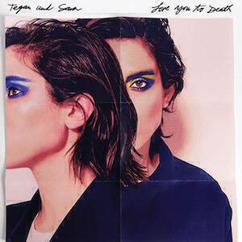
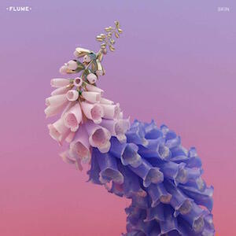

Album Digest June 2016 is a poppy batch of albums. We have the return of my long-time favourites Roxette and the heroes of my South American tour Tegan & Sara. There's some dance music in the form of Flume's album "Skin": an Australian presence ahead of the new Avalanches album next month. Finally there is the first of two new albums by Islands - both were released back in May but one gets reviewed this month and the other next month.

## Roxette "Good Karma"

I've loved [Roxette](http://www.roxette.se) since I was about ten years old. The first album I ever owned was "Look Sharp!" ([Understated Classic #12](/uc12/)) and although my interest waxes and wanes, I usually check in on them when they release new stuff.

This album is pretty much what you'd expect from a pop band that's been going for over thirty years - they're having fun and they want you to have fun. It's nowhere near as good as their best stuff, but Marie can't sing as much as she used to due to previous health problems. When she does contribute it lifts everything, although in some places it sounds like she's been sampled off old records. Whether or not this is really the case I don't know, but it would be typically self-referential if they were. Whatever the circumstances there aren't many songs here that you'd put on the next nostalgic hits compilation they release.

Nevertheless they are still game and they've at least made an attempt to be current. None of the songs are guitar based and they're all very studio-centric. Sometimes they pull off some of the old magic by sheer force of will, as on opener "Why Dontcha" and the rollicking "20BPM". At other points sentiment wins the day, like on "Some Other Summer" (a conciliatory song about teenage heartbreak) and "Why Don't You Bring Me Flowers?" (in which Marie offers to buy you sweater, one as soft as moonlight). Unfortunately you get the odd bit of naff "old geezers do naff R&B" as well, like on the verses of "You Make It Sound So Simple", but at least they're still trying.

Overall it's nice that Roxette continue to make new music but "Good Karma" is not that essential to your world, unless you want a few new tracks to freshen up your mega playlist on Spotify. I'd recommend "It Just Happens", "Why Don't You Bring Me Flowers?", "20 BPM", and "April Flowers". As Marie sings on that last track: "I wish you all the best".

## Tegan & Sara "Love You To Death"

[Tegan & Sara's](http://teganandsara.com) last album "Heartthrob" ended up as one of my favourite albums of 2014. Though it was released in 2013, I didn't buy until I was in Argentina in 2014. I discovered it when I began to play "Closer" loads on my iPad Nano. I ended up playing "Heartthrob" to death on the truck during the rest of the tour, there was something about it that got to the heart of my quest for reinvention. I think when I left for South America, I didn't really know if I was going to change who I was, or whether or not I needed to, but after a few listens of "Closer" I understood that I did and that I was.

When you have a strong emotional connection to a particular album, it can be difficult to build a similar connection to that artist's later material. I think that is the case for me with "Love You To Death". It has the same structure as "Closer": ten immaculate pop songs last well under forty minutes. Every song is precise and clever, not outstaying its welcome and contributing to a sugar rush of the kind that only the best pop music can provide. Just as with "Closer" there are three or four outstanding songs. By this I mean songs that you could consider to be classics, that you could put into books about pop songwriting as examplars of the genre.

"Boyfriend" plays out the illicit side of a love triangle and is a thrilling rush of sexy innuendo and desire. "100x" delivers heartbreak and devastation at the end of a relationship in a mature yet soul-destroying way, one of those rare songs that is lovely despite its emotional charge rather because of it. "Stop Desire" is about as horny as a song can get before becoming so overt that it bores, it's exciting and titilating rather than lascivious or crude.

The other songs are fun too, I especially like how "BWU" playfully pokes fun at gay marriage ("I don't need a white wedding"). It's empowering music that embraces all sexualities and orientations whilst being overtly and cheerfully queer. It's wonderful.

It will be interesting to see where Tegan & Sara go next. Repeating "Closer" was OK because it was such a great album and managing to produce such a close companion with "Love You To Death" is no mean feat. It's clear that they are among the best pop song writers around at the moment and hopefully they can step forward again next time out.

## Flume "Skin"

As far as I'm aware this is [Flume's](http://www.flumemusic.com) second album. I added his self-titled debut album to my Spotify back when it was released but I never managed to find the time to listen to it. I think I will go back to it after hearing "Skin", an album that's not perfect but does have some interesting ideas.

The problem with "Skin" is that it is a bit patchy. There's no real plan, so it feels like an uneven listen. Individual songs are great but as I listened to the entirety of the album I felt like I might enjoy the songs more as part of a playlist or mix alongside other artists' songs.

There's no denying that Flume is a talented artist. He manages to make a track featuring Busta Rhymes sound interesting, something I'd've thought wasn't possible. On the other hand the album features six different female vocalists but you'd be hard pressed to tell each of their songs from any of the others (A possible exception is Little Dragon, because I know their work and the voice of their singer).

The most interesting tracks are the instrumental vignettes. In particular "Wall Fuck", "3", "Pika" and "Free" are all really good. "Pika" sounds like Battles, which is always get a track into my good books. Elsewhere there's a collaboration with Beck, which sounds exciting but it's more of "Morning Phase" or "Modern Guilt" kind of Beck that shows up, when you desperately want it to be an "Odelay" kind of Beck just to pick things up a bit.

"Skin" is good album rather than a great one. I can hear the potential for a great album within these tracks but there's also a frustrating lack of direction at some points. I wonder if Flume can direct his talents toward something more cohesive next time and, dare I say it, a little more fun? (Also, I wonder what that first album sounds like?...)

## Islands "Should I Remain Here At Sea?"

I don't have much to say about the new [Islands](http://islandsareforever.com) album "Should I Remain Here At Sea?" at the moment, save to say that I've listened to it through a couple of times and enjoyed it. It's one of two albums recently released by the band. [Both were crowdfunded](http://www.pledgemusic.com/projects/islands). This one is meant to be a sequel in spirit to their debut "Return To Sea" and it's very straightforward and rocky. I'll be reviewing the other album "Taste" next month. It's meant to be more electronic but I haven't listened to it all yet.

I remember "Return To Sea" as being more tricky and complex than anything on "Shall I Remain Here At Sea?". A case in point is the opening track on each album. "Return To Sea" begins with "Swans", which stretches over nine and a half minutes while twisting and turning over itself multiple times. "Shall I Remain Here At Sea?" begins with a three minute song called "Back Into It" that does pretty much what it says on the tin: it reintroduces you to a more straightforward version of the Islands sound in order to get you back into it.

The songs on "Shall I Remain Here At Sea?" don't deviate too far from that template. They don't have any titles as strange and funny as "Don't Call Me Whitney, Bobby" but the songs are as poppy and fun as that one. I can hear the similarities between "Return To Sea" and this album, though nostalgia may drive me back to the parent over the child. Nevertheless, there is also some sweet and simple stuff that I wasn't expecting. "Sun Conure" is a very cute little song that would be an ideal accompaniment to a caipirinha at sunset on a Brazilian beach.

I look forward to listening to "Taste" as well and I hope I will write more about both albums in next month's album digest.