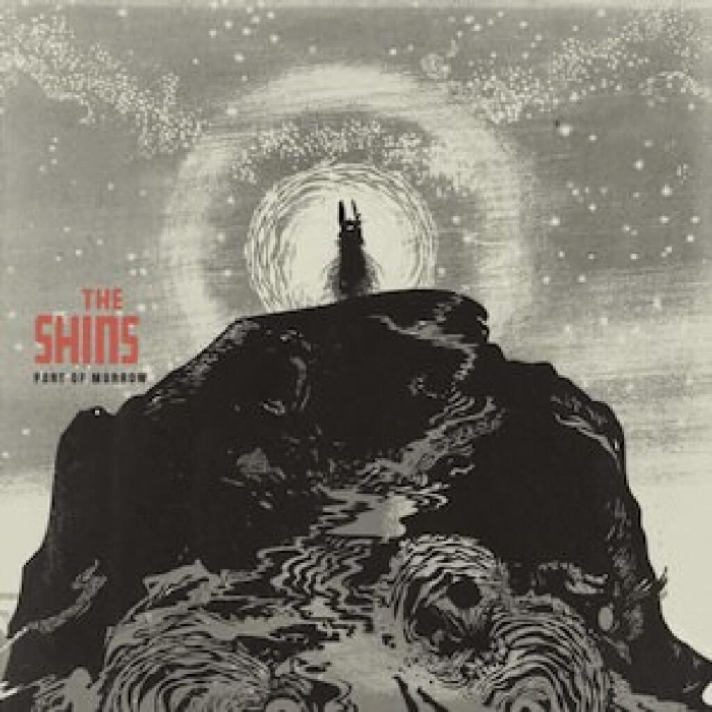
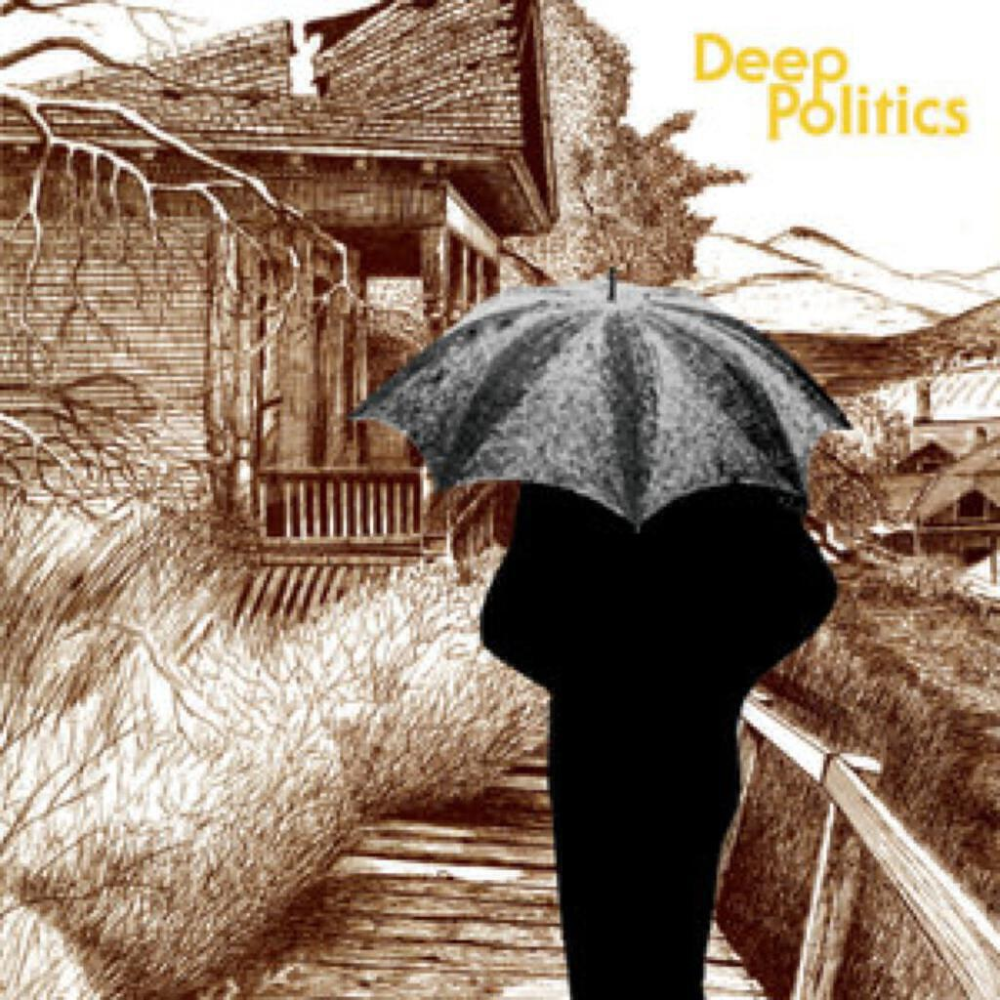
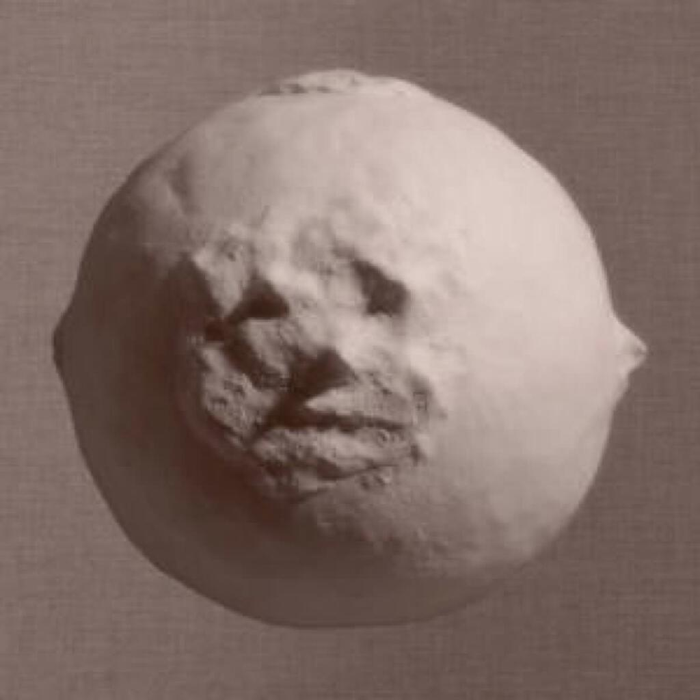

Five albums for Album Digest March 2012

1. Fanfarlo _Rooms Filled With Light_
2. The Shins _Port Of Morrow_
3. Grails _Deep Politics_
4. New Build _Yesterday Was Lived And Lost_
5. Scuba _Personality_

A nice collection of albums this month - things usually pick up in March after a slow period after Christmas. One of these is a “catch-up” (the album by Grails) but apart from that one, everything else was released in the last five weeks or so… I should probably have included the album by Racehorses that I bought on my birthday but I will have to leave that for next month as I haven’t listened to it that much. In fact, it is still in my housemate’s car!

## Fanfarlo _Rooms Filled With Light_

I went to see [Fanfarlo](http://www.fanfarlo.com) on my birthday and really enjoyed the gig. Songs from both albums were played and you could tell from the movement of the band between instruments between songs that this second album is a bit complicated and involves a different sound. At the time I enjoyed the tracks from the previous album a bit more. It’s not a surprise really, I had only owned _Rooms Filled With Light_ for a few days and unusually for me, I hadn’t spent the weeks up to release craving all the new songs. Meanwhile, _Reservoir_ is probably one of my favourite albums of the last five years and many of the songs are bound up with all kinds of memories and experiences.

Another reason for really loving the songs off _Reservoir_ at the gig is that it is a really good set of songs that the band can obviously now play in their sleep. _Comets_, _Luna_ and _Finish Line_ were dashed out with a new intensity live (especially compared to when I had seen them at the O2, supporting Snow Patrol). Meanwhile the songs on _Rooms…_ are a bit slower than the ones on _Reservoir_ and aren’t as immediate. Naturally, the songs that _are_ immediate like _Replicate_ and _Deconstruction_ were introduced at the start of the gig (and did manage to make _I’m  A Pilot_ sound a bit plodding by comparison). The album does this too and so on the first few listens it does feel like you are trudging a bit through the slower material, especially in the second half.

The material is darker throughout, take for example the opening one-two punch of _Replicate_ and _Deconstruction_. The first is a sinister tale filled with virii and howls at the moon, it’s a song that makes you feel like the band have moved on somewhere new after _Reservoir_. Meanwhile _Deconstruction_ feels more like the Fanfarlo of old with lyrics that while echoing tracks like _Finish Line_ and _Howard T. Wilkins_ are much direct: “Let’s cut it up and dissect it / Pull it apart ‘til it’s gone”. Perhaps it is a protest against reviewers or maybe the best attempt at a song about post-modernism since [Idlewild’s _Roseability_](understated-classics-7). (Admittedly the pool of songs about post-modernism is quite small and my sample of it even smaller.)

On my first few times sat listening to the album, it would completely disappear from my ears. It made me realise just how arresting and attention-commanding an album _Reservoir_ is. This is not to say that the rest of _Rooms…_ is junk, far from it. Any regular reader will know that chez mattischrome, much is made of albums that pull you down into murky depths and explore emotion in subtle and understated ways. I am not really sure that anything among these songs could quite be up to that standard though even if they have chipped away at me over the weeks since and revealed themselves slowly.

Initially it was songs like _Tightrope_ that sputter into a bit of life - it’s the album’s third most upbeat song - that held appeal but after a while I found myself really enjoying the sweet romantic misery of _A Flood_ (“Open your raincoat, let it fall / A flood will come here anyway”), getting into the weird grooves of _Feathers_ (something about a river and a siren) and the strangely euphoric quasi-ballad _Bones_, a song that I feel a strong affinity for even if it doesn’t quite feel finished (“It’s in the bones / It’s where the blood goes”).

All in all, it’s a good listen once you have allowed it to grow on you. Is it better than _Reservoir_? Not quite. Will they probably make a better album than this next time out? Very likely. But for now _Rooms Filled With Light_ will do very nicely indeed.

## The Shins _Port Of Morrow_

For a while, The Shins were very important to me. This was back when I had just started my PhD and I was relatively flush for disposable income compared to when I was an undergraduate. The FOPP chain of musical stores was still operating and Bath had two stores filled with cheap CDs, meaning that there was a world of exciting music to explore. What’s more, the cheese and red onion chutney toasties were pretty amazing too.

The Shins’ second album _Chutes Too Narrow_ (swiftly followed by a swoop for their début _Oh, Inverted World_) was one of those exciting musical adventures. Even now, nine years on, it is a solid ten songs that takes me right back to that time — in the way that all the best music does. I can think of people who I have met since then (OK, one particular person) that I can’t remember what life was like before they showed up — yet somehow these songs and the memories they evoke are part of that time. It’s quite spooky to listen to a song like _Kissing The Lipless_ now.

Later on, songs from _Oh, Inverted World_ (specifically _New Slang_) were featured in the movie _Garden State_, which is probably the film that (after meeting the “particular person”) summed up all my romantic angst, so things do get folded back into your life. Of course now we can look back at _Garden State_ and laugh, it’s really not that good a movie and its then uber-cool soundtrack (which got me into Frou Frou as well, another album I find difficult to listen to now…) is perhaps one of the things that ages it.

Later on, The Shins released _Wincing The Night Away_, an album that for me is as awkward as its title. Perhaps I had changed as a person or the ‘band’ (it’s just one guy) had changed too much too, making the whole thing too strange to bear. That said, it does feature some great songs like _Phantom Limb_ and _Australia_. When they come up in my iTunes’ shuffle, I won’t pass them over.

Five years on from _Wincing…_, there is the new album _Port Of Morrow_ (Album titles are not a strong suit) and as always it is pretty good. There are three absolutely amazing songs — _The Rifle’s Spiral_, _Simple Song_ and _It’s Just Life_ — unfortunately, these are the first three songs and so the album falls  flat after that early burst. There are also three rather annoying ones — _September_, _Fall of ’82_ and _40 Mark Strasse_ — and these are pretty near to the end of the album. This means that you should probably listen to the album backwards to get the most of it and does disservice to the title track, tacked on at the end as it is because it is the “slow meaningful one”.

## Grails _Deep Politics_

Last month I raved about _Lilacs & Champagne_, a side project of Grails and so I resolved to discover some of their music. I went back to their most recent album _Deep Politics_, which was released last year and is available on Spotify. In retrospect, it seems obvious that a side project would sound like the band’s home material but perhaps I am just used to side projects as being things that are completely different to an artist’s original material.

All that is obviously missing compared to _Lilacs & Champagne_ is the samples, vocal and instrumental, and beats that give that album its hip hop vibe. What Grails represent then (at least on the evidence of _Deep Politics_) is competent progressive rock though I have read them described as post-rock, which fits too. These tracks build nicely upon some pretty instrumentation, a lot of it reminding me of Mike Oldfield but probably only because I am familiar with all his work.

The opening track _Future Primitive_ sounds to me like a missing link between Massive Attack’s _Protection_ (the eastern strings and the propulsive groove) and _Mezzanine_ albums (those chugging guitars that surface at various points, the somnambulant atmosphere), though the duelling solos by about three-quarters through are pure Oldfield.

_Corridors Of Power_ appears remixed as _Corridors Of Power II_ on _Lilacs & Champagne_, it is instantly recognisable. In fact, in terms of riffs from this album, _Lilacs & Champagne_ probably uses this one as a template — almost to the point of the latter being a remix album. Certainly _Corridors Of Power_ makes the connection between post-rock and hip-hop not seem so far-fetched as you might first think.

My favourite track though is _I Led Three Lives_. Not by coincidence it’s the longest thing here, a simmering epic that showcases the album sui generis and builds to noisy, squally, static at the end. Taken in tandem with the closer _Deep Snow_, which begins with beautiful acoustic guitar and is the most pastoral tune on the album, it makes for a beautiful end to the whole thing. I really love how taking a punt on a single album can lead in loads of new directions. I am looking forward to digging up even more stuff by Grails.

## New Build _Yesterday Was Lived And Lost_

Another month, another Hot Chip side project (and the new album _In Our Heads_ is due from the mothership in June!). Whereas the 2 Bears album last month was a celebration of early 90’s house music, _Yesterday Was Lived And Lost_ is more a celebration of the polished 80’s albums of the likes of Peter Gabriel or Robert Palmer. Like _Be Strong_ could have been, this could easily be a vacuous genre collage but once again it all comes off without a hitch. Despite having loved _Be Strong_, I think that I like this album even more.

Certainly _Behind The Shutter_ is my favourite song of the year so far, it sounds a bit like Erasure and it has a lovely sweet lyric about knowing that someone loves you even they say that they don’t — well that’s my take on it. When I listen to it on the way to work it makes me deliriously happy and I have to fight the temptation not to put it on “repeat one”. Except putting the best song on repeat is not necessary because there are plenty of great songs with many others that are capable of making you grin from ear to ear.

Take _Medication_ for instance, a dry humoured song about the joys of… well… medication. It is the _Sledgehammer_ de nos jours, sort of. Then there’s _Do You Not Feel Loved?_, a sweet counterpart to _Behind The Shutter_ that pads along on a warm house-y beat (that the 2 Bears would have been proud to call their own) and possesses a spine-tingling chorus. Or perhaps I can convince you about _Finding Reasons_, a slightly downbeat number that conjures up the ennui of watching looped bad news on 24 hour news channels.

Elsewhere, _Miranda, Be My Guide_ is one of those great songs that uses a name and takes complete possession of it. My walk to work keeps cutting off another great track that closes the album called _The Silence And The Muttering_ — a shame because it is a lovely confection built around a swirling almost-Fairlight synth and a sweet forlorn lyric (“You’re gonna need the strength of feeling / to escape the silence and the muttering). It culminates in a delicate music box coda, though the iTunes version has a tetchy little bonus track called _Your Love_ tacked on the end too.

One of the joys of Hot Chip albums (aside from the fact that they appear every two years like clockwork) is that they are always so disparate with lots of elements pushing and pulling the songs around in different directions. On albums like _The Warning_, it can seem like barely organised chaos (definitely in a good way) and sometimes I have found myself thinking that a particular track is brilliant (e.g. _And I Was A Boy From School_), wishing that I could have a whole album that sounded like that. I suppose side projects answer those wishes to some extent and, unexpectedly, they’ve turned out to be excellent records that stand alone well too.

## Scuba _Personality_

One of the challenges of writing amateur music reviews like these is that you can sometimes find yourself really liking some music but without having any context for actually writing about it. It can make you feel rather self-conscious (c.f. every album digest that includes an album that describes itself or is described in the media as “dubstep”) and limit your (already limited in my case) ability to describe the music. I say this because I don’t go clubbing and I don’t seem to have many friends who are specifically into this kind of music (by which I mean electronica). It’s quite funny how listening to electronic music is one of my hobbies and yet unlike most past-times it doesn’t seem to have garnered me a whole group of people with whom I can discuss it.

There is still a trail of breadcrumbs to follow though: blogs; fabric CDs; and music discovery sites. Even if - like Hansel and Gretel’s trip to the gingerbread house - it can sometimes end badly, there is still plenty of good music to discover. Often I will ignore something until multiple sources start pointing me toward it (yeah I’m a sheep baaa!) and this was very much the case with Scuba’s _Personality_.

Despite lacking the complete vocabulary and clubbing experience to write about dance music, I do know that there is a lovely house piano break on _NE1BUTU_ and that the riff on _The Hope_ is a pretty nice bit of wonky acid twiddling à la Josh Wink’s _Higher State of Consciousness_ (a track so visceral that it get re-released every three years in barely remixed form to despoil whatever the new trend is).

The majority of the album is very easy to admire but perhaps hard to love - particularly when up against the other more song-centred albums this month - but despite this the best thirty seconds to a minute of music I’ve listened to this month comes from this album. About halfway through _Cognitive Dissonance_, the whole track just turns to sludge as all the ideas from everywhere on the album are piled into the mix creating a sort of electronic music black hole. Something like that is always going to be a ‘moment’ on an album, albums that layer all their elements over one another for a whole album are often very incoherent or tiresome (_Glass Swords_ by Rustie anyone? What a pile of poop that was!) but it is really nice to have them in the middle of what is a solid and warm album full of generous beats.