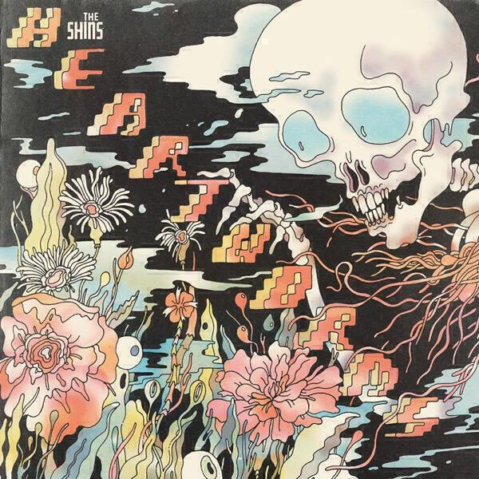
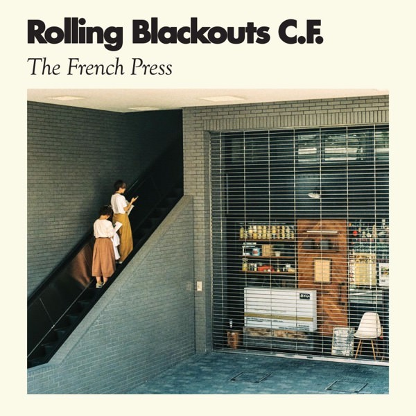

## Blanck Mass *World Eater* 

This album is pretty extreme. It's not for everyone and even for the people who *can* handle it, it's not for all the time. This album is a soul crushing experience at points but there are also points of light. Perhaps this makes “World Eater” more reflective of life as a whole than any other of this month's albums. On balance it's probably less crushing than the last Blanck Mass album “Dumb Flesh”, which I reviewed back in June 2015. 

World Eater begins with “Jon Doe's Carnival of Error”, a woozy fairground instrumental reminiscent of Orbital's “I Wish I Had Duck Feet” from “Snivilization” (an upcoming understated classic). Just as that weird buttery instrumental gets going we lurch into “Rhesus Negative”, which for me is probably the most extreme track I will hear all year. I certainly don't want to hear anything more extreme! It's just at the edge of what I can tolerate: about five different tracks all bundled into one and crash impacted against the nearest hard surface for nine minutes. It is not a track that will calm your anxiety. However, if you're in the mood for it it's a powerful track: one for your weekly primal scream therapy session.

If “Rhesus Negative” is primal scream therapy, then the tracks that follow after are probably some sort of evil yoga. It's pretty much the devil's own mixtape and, as we know, the devil has all the best tunes. “Please” hangs on a vocal sample that sounds ripped from some classic summery house record from the early nineties, but it’s repeated over and over so much that it becomes a plea. All the while beats are smeared all over the please. It’s not as tough as the previous track but it’s still deeply unsettling. 

“The Rat” is the most upbeat track - a stellar synth propelled by a demented bass line that sounds like a demonic remix of the Doctor Who theme. Like the other tracks, it’s weird and disturbing, particularly as elements of the mix are thrown around the stereo image towards the end. “Silent Treatment” is built around what sound like choral samples and the whole track sounds like a hyper-accelerated rush of adrenaline, pretty much what I imagine falling into a black hole might sound like. A rush of beats pushes down and compacts you, though when the vocal kicks in at about two minutes it briefly calms down. It’s mellow but only by the standards of this album: I don’t think it will be on your gym playlist any time soon.

The intriguingly-titled “Minnesota / Eas Fors / Naked” begins with some unsettling and bewitching noises that might be running water, radio static or something else entirely. Probably all three. There’s something deeply compelling about the twitchiness of it. At four minutes it almost settles into a melody but strange spoken word overlays also appear just at the edge of your hearing. It’s almost like the point where you go under before an operation. By about six minutes I’m convinced I’m listening to a drawn out transformation of the opening minutes. At this point there is a melody and it feels like the whole track is pulled out and stretched over itself but backwards in time.

The niftiest trick of all is when the end (beginning?) of “Minnesota / Eas Fors / Naked” lurches into the staticky beats of “Hive Mind”. This is the most accessible track on the album and it even has discernible lyrics. If I were you, I wouldn’t listen to those lyrics to closely... especially if they’re saying what I think they’re saying. Maybe the whole album is a kind of musical Rorschach Test designed to make you see rats, bats and other assorted monsters. 

“World Eater” is not for everyone. When I listen to it I think it’s not really for me most of the time either. However, when you’re in the mood for it this album is utterly compelling - just as “Dumb Flesh” was.

## The Shins *Heartworms*

This is a reasonable collection of new songs from The Shins. It’s been awhile but “they” are back - but really it’s just James Mercer now. This makes it rather tempting to read all the songs as autobiographical. I imagine songs like “Mildenhall” actually *are*, which adds an extra layer of earnestness to them. The Shins’ best songs though have always retained a bit of mystery, which is why the fun of “Half a Million” and the layered vocals of the title track are more welcome. 

Sure, there are some wiggly bits borrowed from his work with Danger Mouse on the Broken Bells albums. Those sounds - like the filtered vocals of “Painting a Hole” and the squelches on “Cherry Hearts” and the aforementioned “Half a million” - were also present on “Wincing the Night Away” and “Port of Morrow”. To summarise, there’s plenty to enjoy if you like those other Shins albums but maybe there’s not the same magic as way back on “Chutes Too Narrow”. 

## Rolling Blackouts CF *The French Press*

The full name of this band is Rolling Blackouts Coastal Fever. I like to think that their name, like a Mexican surname or an Edwardian football club, is simply that of some previous band names strung together. I heard them on the radio on our drive down to Cornwall and so I paid more attention when they popped up on my Discover Weekly as well. They're from Melbourne, Australia (like many great people &#x1f609;) and are similar to The Strokes in their pomp, at least to my naive ears on a first listen. “The French Press” is an EP but as it's almost as long as another of this month's albums, I thought I'd give it a little review.

In fact this EP mixes and matches a lot of other bands that I like. The title track blends The Strokes with the artier janglings of their successors like Parquet Courts. “Julie's Place” sounds like a mellower Oasis (but not shitty mellow like "Gas Panic") and “Sick Bug” emulates the Pixies convincingly. To my surprise things even take an antipodean turn on “Dig Up” where they manage to sound a bit like Crowded House.

The songs as a whole are pleasant and jangly. Playing spot the reference is quite fun. The lyrics don't really go anywhere too deep, though I do like the title track's pleas for clear communication under surveillance. It could be a relationship metaphor but I wasn't sure if any deeper meaning was intended. The lyrics to “Sick Bug” are probably the closest to making sense: that age old subject matter of wanting to get horizontal with someone in their bedroom. 

Give this a spin if you like jangly guitar pop playing in the background while you work. It's not going to start a revolution but it'll help you feel cool. It'll sound great at that artisan coffee shop you hang out at. Vive le French Press!

## JFDR *Brazil*

Like many albums in the digest these days, “Brazil” came to my attention via a song in my Discover Weekly playlist on Spotify. In this case it was the arresting song “Instant Patience”. Clocking in at just under five minutes, breathy Bjork-like vocals are arranged over a delicate synth line. The first time I heard it I was listening to Discover Weekly in bed and almost asleep - this song almost made sit bolt upright. In the dark it sounded like a spooky moment of instant clarity.

JFDR is the professional name of Jófríður Ákadóttir, an Icelandic singer who records most of her music with her twin sister in a band called Pasqual Pinon. “Brazil” is her first solo album. It’s so good that I’m confident that it won’t be her last.

What I so much about the album is the way that it slowly builds up over 9 songs and 35 minutes. (Regular readers will also know how much I love short albums.) “White Sun” is a beautiful simple folk song borne on a plaintive vocal. The melody slaloms around for a few minutes gradually accreting synth noises. Each track repeats this process to some degree, with each song becoming more complicated as the album progress.

The second song “Anew” piles on overdubbed vocal harmonies to a simple guitar line. Imagine Elliott Smith crossed with Bjork! I did, and I was hooked. “Instant Patience” iterates the formula but often cuts away those same vocal harmonies, creating the sense of space that makes the song so spooky and appealing.

“Wires”, and “Airborne” later on, play with drum arrangements. Until “Wires” there’s barely any percussion at all, save for some cymbals that rush up into the mix at the end of “Anew”. “Wires” throbs with intent under that same detached cool voice but completely cuts away halfway through, almost like discovering a sunny clearing in a dark forest.

“Higher State” is a piano ballad punctuated by strange rushes of noise. “Anything Goes” is similarly delicate. Things pick up again with “Airborne” which introduces skittering drums with a vague drum’n’bass feel. Yet even with the pace of the drums, the song still has a languid air in keeping with the rest of the album.

The last two songs keep up the sonic experiments with ever busier arrangements. “Destiny’s Upon Us” even has an electric guitar sulking in the background and there’s a weird 8 bit synth noise that’s most likely off that 1980’s Casio keyboard your mate owned. And yet JFDR’s voice is never overwhelmed by these arrangements, always striking out clear over them. Part of that might be the preparation from earlier tracks, and part of it an otherworldly voice as able to command a noisy backdrop as an entirely silent one. The final song “Journey” is so much a complete song that it feels the whole album has built up to it. A folky ballad with lilting guitar and sparky synths behind it. 

I really like this album. It’s short and coherent. It builds to its ending but each individual song stands alone despite being a component of a larger whole. I’d love to hear remixers get to grips with some of them. It also goes without saying that I’ll be researching the Pasqual Pinon albums. I’ll also be looking forward keenly to new songs from JFDR.