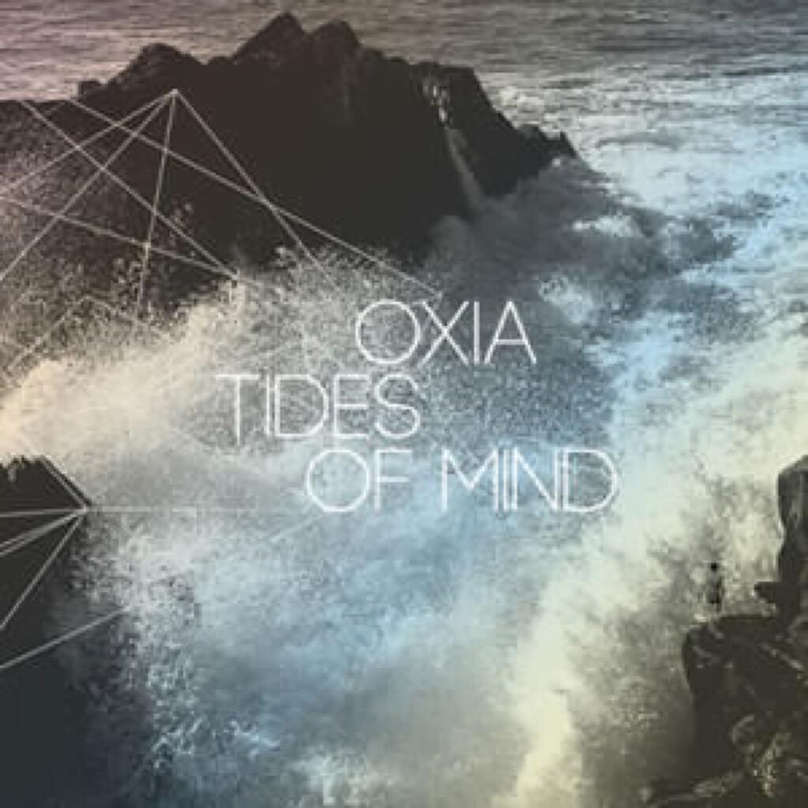

Four albums for Album Digest May 2012:

1. Jack White _Blunderbuss_
2. One Little Plane _Into The Trees_
3. Beach House _Bloom_
4. Oxia _Tides Of Mind_

The [April album digest](album-digest-april-2012) was rather short on songs, so this month I decided to look for albums that were more based around songs not tracks. Electronic music is relatively easy to write about: the music is often simple (but not always), there are recognisable structures and genres (but not always), and there are conventions that are adhered to (but not always). The repetition of those parenthetical “not always” means that while the writing is easy, it is also often quite fun.

Examining songs and nailing down their qualities is a trickier task, or at least in my experience it is. Often you aren’t adding much more than the lyrics and, of course, electronic music often comes with lyrics too. Nevertheless songs are important, part of whatever campfire and/or churchy tradition that your culture may have. Everyone sings and though it may seem a trivial action, it is part of a deeper, innate neurological function within us. Anyway, I am getting the run on myself it would seem, so let’s meet those albums instead!

## Jack White _Blunderbuss_

Apart from Elephant, I didn’t have much time for The White Stripes. I think they often stripped things down too far and I prefer more ornate music - especially when the lyrics are weird, which was often the case with The White Stripes. I remember being particularly miffed when one album began with some brilliant tracks (I think it was the one after elephant) and then drifted into bog standard rhythm and blues.

This solo album by Jack White begins with a sound that won’t alienate White Stripes fans while at the same time the arrangements are much more full-bodied and interesting throughout. _Blunderbuss_ is a bitter breakup album and for the most part I was able to get into the mood of it even if some parts did seem to be slightly self-pitying. The opening one two punch of _Missing Pieces_ and _Sixteen Saltines_ is awesome, a real statement of intent. The latter has the dubious distinction of having a thirty-second sample being included with the demo of Microsoft’s awful Windows 8 - the only good thing to come out of that wasted three hours of my life.

I thought at first that _Freedom At 21_ was rather self-pitying but it has an irrepressible charm about it too, the tetchy fast paced lyrics rattling away over a rickety riff-heavy bluesy backing. Following that _Love Interruption_ is rather melodramatic too but once again the intensity of the delivery wins the day, it’s an entertaining song about swearing off being distracted by love. Despite Spotify being a great music discovery service it can’t tell me who is on backing vocals; this is a shame because finding out would constitute a musical discovery. I will google it later.

The title track is an entertaining piano led piece about a disintegrating relationship. The lyricless refrain of “da da da da” is weirdly sad. Meanwhile I can really relate to the line “doing what two people need is never on the menu” - it reminds me of relationships that I have been in that have failed because the two of us have thought more about how things were seen from the outside over what we could be for one another.

In _Hypocritical Kiss_ there’s mention of “a big gang of people who always believe you” (more self-pity?) and also “the men who fight the world and try to love the girl” on _Weep Themselves To Sleep_. The latter also features one of the best “scherunk” type guitar noises on a record since Radiohead’s “Creep” - sometimes the joy is in the details!

_I’m Shaking_ could have fallen off the back off a truck full of White Stripes B-sides and that’s probably all we need to say about it. _Trash Tongue Talker_ is better, channeling John Lennon in the most flattering way possible: with decent lyrics and a great hollering vocal, two things that never seemed to appear together often enough on Lennon’s records. It’s a shame then that when trying to build a tribute to McCartney he decides to go for a ropey pastiche of _Rocky Racoon_ on _I Guess I Should Go To Sleep_. In between the pair of Beatles tributes is the album’s best track _Hip (Eponymous) Poor Boy_, a song that works so well because it sounds so spontaneous that it could be picked up and played on the hoof. It sounds like it took as long to write as it did to record.

_On and On and On_ is also a pleasant surprise with a nice neat Krautrock-y intro and a much more reflective lyric (more philosophy than self-pity). Best lyric:

> Stars in the sky never worry. 
They don't have to hurry, they move in their own way  
But I have to choose what to do  
How to act, what to think, how to talk, what to say  

Perhaps this is also a self-pitying lyric but I think it is also self-aware and life-affirming; the scariest thing after a break up is that you no longer have that identity that is conferred upon you by being in a relationship while at the same time one of the best things about being newly single is the chance to redefine the way you think about life.

Overall, _Blunderbuss_ is an interesting listen and tells the story of how to get over a breakup over the course of its songs. There are six or seven really great songs here but I do wonder whether I will still be listening to it by next month. Meanwhile, here’s the really cool video for _Sixteen Saltines_ (Warning, this video is not for everyone!):

## One Little Plane _Into The Trees_

[One Little Plane](http://en.wikipedia.org/wiki/One_Little_Plane) is the stage name of Kathryn Bint, a folk singer from Chicago. This is her second album and a review of it interested me because it mentioned that some (all?) of the tracks are produced by Kieran Hebden AKA Four Tet and a couple feature Colin Greenwood from Radiohead. (Sorry I’m so sketchy on the details, Spotify doesn’t give you all the liner notes… At least not yet…)

Anyway, this is a nice little album and her voice reminds me of Mirah, whose album _C’mon Miracle_ is one of my favourites and is definitely going to be written up as an understated classic at some point. The opening track _She Was Out In The Water_ sets the tone nicely, a pastoral song with a spooky undercurrent and a simple arrangement composed of mostly guitar and voice. It has a nice Kate Rusby vibe to it especially in the way she tries to cram slightly more words into each line than the music will allow.

_Nothing Has Changed_ is a devastating breakup song (to sit well as a counterpoint to the ones by Jack White. _Paper Planes_ has more of a band arrangement but I prefer the simpler ones like that on _It’s Alright_. The songs here work well as sunny evening music (as was the case with the  _C’mon Miracle_, an album I played loads one hot summer in Bath).

Most of the rest of the album follows this template. Standouts include _Bloom_, which - quite apart from serendipitous collision with the title of the Beach House album - deviates a little to replace the guitars with a delicate synth filigree. Similarly, the closing track _Synthesizer_ also features a more synthetic but no less delicate arrangement - in fact it has quite a churchy feel and probably the strongest vocal performance on the album.

If there is one criticism I have of _Into The Trees_ it is that, apart from _Nothing Has Changed_ and _Synthesizer_, the lyrics didn’t really grab me. It is a very pleasant album but I don’t think I will go back to it again except for those two tracks. Here’s a sweet little video for _She Was Out In The Water_:

## Beach House _Bloom_

Writing about a fixed number of albums each month is a bit of a chore, especially when [your iPad](http://twitter.com/mattischrome/status/207596998923255808) [eats the](http://twitter.com/mattischrome/status/207597858478759936) [first draft](http://twitter.com/mattischrome/status/207599854510284800). However it does get me listening to new things. I had heard of Beach House but not heard them, in particular good reviews of their last album _Teen Dream_. As a result when I was struggling to find music for this month their new album _Bloom_ was an ideal candidate. I don’t think _Bloom_ is like anything else I have except maybe the Washed Out album that I bought last year. [Their Wikipedia page](http://en.wikipedia.org/wiki/Beach_House) lists some sound-a-likes and inspirations but in the main I have also “heard of but not heard” these bands. Dream Pop, as the genre is rather wistfully known, is a new one on me.

I like it. In the main, each of Beach House’s songs are a cavernous swirl of guitar and keyboard over which Victoria Legrand’s voice dominates. The lyrics are not often clear and there’s the odd duffer in there (Error number 2, where the rhyming dictionary is clung to a little too tightly) but this gives the songs an enigmatic quality reminiscent of New Order in their pomp. It all goes by in a bit of a whirl so I am only going to pick out a few tracks, but it is worth listening to.

The singles _Myth_ and _Lazuli_ are clear and cool, the former opening the album in grand style and the latter shifting things up a notch with a bit of pop jangle for the middle section. My favourite is probably the gentle, chiming _Other People_, while _Trouble Maker_ and _Wishes_ are pretty fantastic songs too (both are kind of about [karma](http://en.wikipedia.org/wiki/Karma)). Annoyingly there is a bonus track (called _Wherever You Go_) stuck on to the end of _Irene_, turning it into something unnecessarily 16 minutes long (about 8 are silence). Both songs are fine, though it is easy to hear that _Wherever You Go_ is too slight to have been on the album proper. I’ve only bothered to listen to it two or three times, which is probably precisely the point of hiding it away. If you go to [the song’s last.fm page](http://www.last.fm/music/Beach+House/_/Irene), the debate there about this track and about bonus tracks in general is quite amusing (i.e. vitriolic).

## Oxia _Tides Of Mind_

It wouldn’t be an album digest without a bit of electronic music would it? I know nothing about Oxia and only one of the three guest vocalists - Miss Kittin - was known to me via her work with Felix Da Housecat. It’s a tidy little album though, bobbing along nicely on housy beats. The Miss Kittin track _Housewife_ is indeed a pun on “house”, describing someone who is both a “wife” to a house and to house music. Elsewhere everything is delightfully minimal and functional but with enough flashes around the edges to keep things from being boring viz the easy-listening organ sounds on _Rue Brusherie_ (which reminds me of Tosca), the clattering reggae-like drum samples on _Nightfall_, and the piano rolls on _Harmonie_ that echo Massive Attack’s _Weather Storm_.

The other two vocal tracks show that if Oxia was interested in making a wholly vocal album it would be well be worth a listen. _Traveling Fast_ (sic) is a pretty and breathy ballad built over some twitchy techno loops and a spooky theremin sound, while _The Phoney Lullaby_ builds from housey hand claps into a tasteful croon that sounds like a cross between Deep Dish and Pet Shop Boys. The vocalist really reminds me of someone but I can’t put my finger on it, I will update here if I work it out.

Overall, the album has a Royksopp kind of vibe, similar to _Melody AM_ but lacking the distinctive vocal contributions that album had. Apparently this is Oxia’s second album and it has been ages between the two, if he produces the third in shorter order and entrusts his work to more collaborators I think I will be very interested to hear the results.
