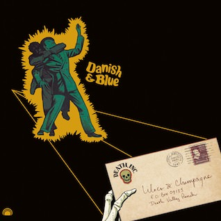
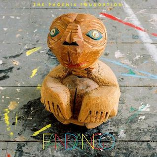
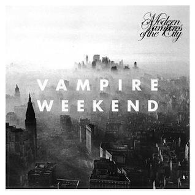

## Lilacs & Champagne _Danish & Blue_

You might remember that last year [I reviewed the first Lilacs & Champagne album](album-digest-february-2012) and I liked it a lot. This album sees them back with more of the same: taking the approach that if it ain't broke, don't fix it. There are very few changes to the formula apart from the fact that the spoken word samples are not quite as good this time and there's a bit more Grails-like guitar solo action.

The action is bookended by two tracks "Metaphysical Transitions" and "Metaphysical Transitions II" that feature an ageing hippy singer pronouncing how "this album" features songs that come from him 'getting his shit together'. In between I don't think this is quite as good an album as the first one. Some of the tracks, like "Sour/Sweet", are a bit on the sketchy side - it's a great idea but it's too short and doesn't go anywhere.

Of the longer tracks I really like "Le Grand", which sounds like something that Mike Oldfield would make if he were to adapt his classic sound to something more modern, and "Refractory Period", which takes the best of the first album and runs with it. Overall, it's a decent enough album but I still prefer the first one.

## The Phoenix Foundation _Fandango_

I've written an album digest on the last of each month since [January 2011](album-digest-january-2011) and in that first set of reviews, I wrote about The Phoenix Foundation's excellent album "Buffalo". That album busted the band out of their homeland isolation (they're from New Zealand) and moved them on to the international scene. "Fandango" is the follow-up.

Whereas "Buffalo" was essentially smooth and languid pop record, "Fandango" cuts loose with the instrumentation a little more and is a messier longer album. This is something that I actually wanted from "Buffalo" but I think "Fandango" is a bit shorter on quality tunes - certainly only opening track "Black Mould" is the only track that really comes close to replicating the joyous rush of "Buffalo"'s title track or the brilliantly weird "Apple and Mango".

What you get in place of weirdness is a worthy attempt at musical diversification. "Fandango" is full of breathing spaces and dead ends. There is some lovely work here: the little coda at the end of "Inside Me Dead", all of "Corale", the gentle drones and chants of the almost eighteen minutes long closer "Friendly Society". Yup, it's the second month in a row that an album that has an enormous track on it. This time it's stuck at the end so it allows the album to peter out in to a sort of trippy haze.

I think "Fandango" is a little too long, there are plenty of places where it could be a bit snappier and some of it seems like a little too much jamming went on to the finished record. That said, I'd be prepared to bet that it sounds great live and on a sunny morning when you haven't much to do but lie in bed listening to cool music.

## The National _Trouble Will Find Me_

So far I've managed to avoid talking about The National on these pages, which is strange because they are one of my favourite bands. Their album before last "Boxer" is one of my all time favourites and is due for an understated classics treatment soon (by about December if I stick to my plans and I never do). Meanwhile, "Trouble Will Find Me" follows on three years after 2010's excellent "High Violet".

At first I found "Trouble Will Find Me" to be a little too morose, even compared to other albums that they have released. Opener "I Should Live In Salt" sets the tone with its Lear-themed confession of guilt for some past abandonment. The trouble is, it has the same scuzzy backing as "Terrible Love", the song that opened "High Violet". Fortunately the album finds its feet later on and after a number of listens, as the hooks begin to sink in, I found it to be incredibly interesting and quite perky.

For instance, there are examples of the humour in the lyrics that can also be found throughout "Boxer", while the band are also clearly trying to push against their own templates: witness the wonderful overlapping of vocal lines on "Don't Swallow The Cap" and the gravelly sing-song lilt of "This Is The Last Time" (the key lyric: "Don't tell anyone I'm here / I've got Tylenol and beer"). Elsewhere there are more pro forma songs, songs that you would pick out instantly as songs by The National: like "Fireproof", which wouldn't have been out-of-place on "Alligator" but is redeemed by its origin story of having been recorded in just one take.

The final track "Hard To Find" is absolutely gorgeous, part of long tradition of albums by this band having great closing songs. "Hard To Find" is only a hair's width away from being something by Bruce Springsteen: it has that eerie twang of the boss running through it, the sound of a song that's been lived in. And that's the key selling point of The National to my mind: even though they are playing a role, the songs always feel lived in and alive -- it's always real, even when it's not.

## Vampire Weekend _Modern Vampires Of The City_

I will be very surprised if a better album than this one is released this year. "Modern Vampires Of The City" is such a great album that it reminds me why I still listen to albums. It's a coherent all-in-one piece consisting of strong songs that each would stand as well on their own. To me, it is one to add to the classic album pile along with "OK Computer" by Radiohead, "Pink Flag" by Wire, and "Revolver" by The Beatles.

You can always tell you're on to a winner with an album if the first track alone makes you want to listen to it over and again in order to dissect and understand it. I'm not talking about a strong single but rather the moment at which you have to listen repeatedly because it changes the way you feel about a band you already know. Think of hearing "Airbag" by Radiohead after hearing just "The Bends" (and ok, "Paranoid Android" and two of its four B-sides), well you get the same experience with "Obvious Bicycle". I listened to it and it was obviously Vampire Weekend, and yet you can hear that something has aged within the band. Now it really feels like they have something to say.

Perhaps they had something to say all along. After the wistfulness of "Obvious Bicycle" was always there on, say, "Giving Up The Gun" off Contra, but this time they play it straight: there's no Tokugawa smile or rusty swords this time. When I first heard the lines "Why don’t you spare their world a traitor / Take your wager back and leave before you lose", it really cut deep. At first it seems quite harsh, almost like saying "Well, why _don't_ you jump?" but after repeated listens the humanity of the whole song -- about how we are all desperate for people to listen to us and understand us -- shines through.

The next song "Unbelievers" is probably the best song about agnosticism ever written, or at least the best song that uses agnosticism as a metaphor for a détente in a relationship that you will have heard in quite a while. Not only is it lyrically excellent but that somehow celtic sounding rising guitar line in the middle eight is wonderful. Whereas on "Contra" the musical arrangements served to showcase some of the showiness of the lyrics, here a different tack is employed.

I guess "Step" could have been on "Contra" but while here it's part of a sustained peak, on the previous album it would have been a stellar highlight. They finally sound like they've found a way to use all that wordiness -- which is actually conspicuous on "Step" because of it being largely absent in the other songs -- and draw out an emotional connection with it. Somehow a song with a line that ends "Mechanicsburg, Anchorage, and Dar Es Salaam" can actually draw an emotional hit.

With "Diane Young" they try what could be thought of as the opposite trick: they couple a (relatively) direct and populist lyric based on a pun to an exhilarating music backing feature surf guitar and manipulated vocals. It's as visceral and exciting as "Stealth Of A Stork" off the Wire album from last month. After that "Don't Lie" and "Hannah Hunt" channel the sounds of Wilco and Death Cab For Cutie respectively into unusually direct songs that meditate on death and the end of relationships. The latter recalls Death Cab's "Tiny Vessels" though the outcome (to me, maybe I'm thick) is a little more ambiguous.

I'll have to be brief about "Everlasting Arms", "Finger Back", and "Worship You", but suffice to say they are excellent too. If their first two albums paid homage to Paul Simon circa Graceland, then this is the point at which imitation breaks out of the mould, the point at which the apprentices break free from the past and start to shape their own direction. "Finger Back" is particularly awesome with its masochistic verses inviting mutilation from a lover and the pay-off line: "I don't wanna live like this / But I don't wanna die..." -- here the ends of relationships and deaths might as well be the same thing. Meanwhile, I defy anyone to sing along to the verses of "Worship You", they're delivered at a breakneck pace and far faster than any rapper!

At first "Ya Hey" seems to continue the themes of the preceding three songs but then the chorus starts up with its twisted manipulated "ya hey"'s that contort and distort and go all high-pitched like something by The Chipmunks (and after a few listens you hear the slowed down repetitions too), it's quite shocking at first but quickly becomes a massive guilty pleasure. It has a lot to say too, pitching itself in with the meditations on life and death and one's place in the world that inform the other tracks. It feels less agnostic and more like it comes out of a dialogue with a god, but then who hasn't been in a relationship where a partner starts to feel more and more like some sort of deity equally capable of handing out pain and pleasure?

Finally we have "Hudson" and "Young Lion". The latter is a little throwaway song with one line in the lyric booklet, something that just rounds off the whole album nicely. This is because to end with "Hudson" would have been a little bleak: it's a bleak end of days story song that moralises "Some men tend to linger on / And some make haste from Babylon / Some will roam their ruined home / Rejoicing 'till the end". There's a wonderfully eerie B-movie riff that underpins things throughout that could only sound spookier if it had been performed with a theremin.

"Modern Vampires Of The City" is fantastic (fang-tastic?). I think I'm satisfied that it will be my favourite album of the year by December, unless something really new and surprising turns up before then. In the mean time, this is a brilliant album that reflects upon themes that I have found myself reflecting upon and moreover, is a musical feast for the ears throughout. Buy it, and buy another copy for someone you really like.