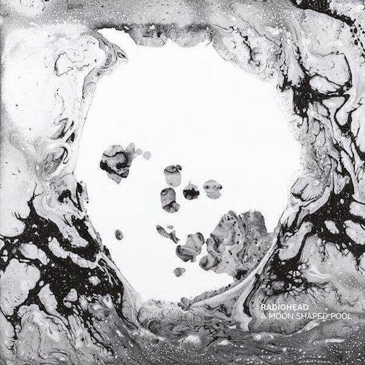
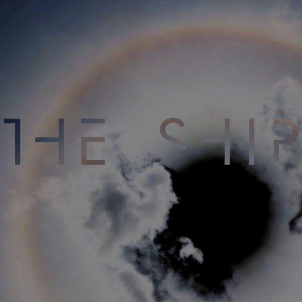
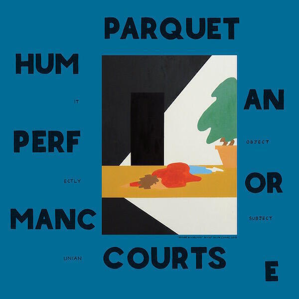
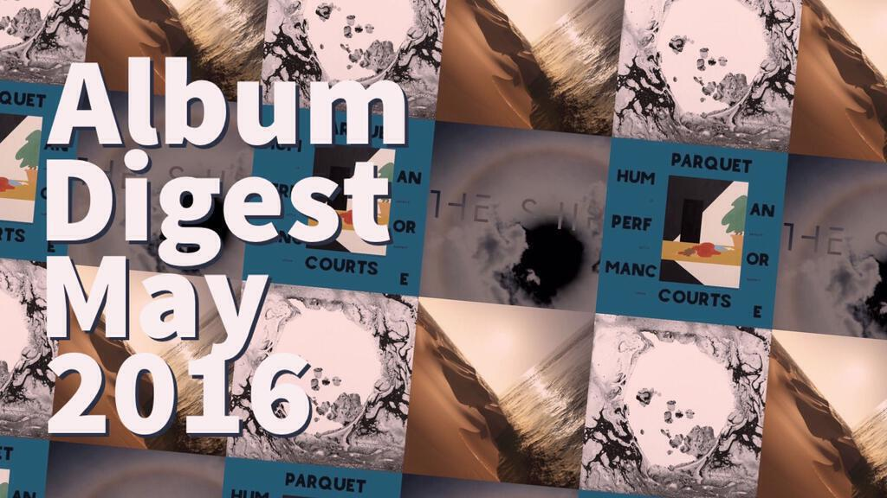

Album Digest May 2016 features the work of four bands or artists that I have reviewed in previous album digests. I also own (or will own) all of these albums on vinyl, so it's handy that I've recently bought myself a record player!

## Radiohead "A Moon Shaped Pool"

Radiohead released "A Moon Shaped Pool" online about three weeks ago and a physical version hits the shops later in June. As with all of their recent albums, it is (mostly) a slow burner that rewards multiple listens.

In the space of two days they released the 'single' and most immediate song "Burn The Witch", and also a more abstract song called "Daydreamer". These turned out to be the opening two tracks. They released the album with no fanfare and people only knew it was called "A Moon Shaped Pool" about an hour before its official release. This happened when Google Music listed it early by mistake. People assumed that the track listing revealed at the same time was incorrect because it was in alphabetical order, but this later turned out to be true.

"Burn The Witch" is the catchiest song Radiohead have released in years: with imposing strings and a sneering vocal it storms by in no time. "Daydreaming" is more of a muddle with murmured lyrics drifting through gentle ambiance until about five minutes in when the strings kick in and take hold. The last twenty seconds always convince me that a gremlin is in my speaker with weird backward vocals and rumbles closing the track. Very spooky.

"Decks Dark" is my favourite song on the album. It is the song that sounds most like a typical Radiohead song and while for most bands this would seem dull but when Radiohead pull all their intriguing elements together it is a delight. The last example of this that I can think of is "All I Need", which also pulls together their outsider mentality and a beautiful musical arrangement. The next song "Desert Island Disk" does this too, and if you've ever wanted to hear folky finger picking on a Radiohead record, then this is your moment. In times gone by this is the song they would have cut in to little pieces and played backwards.

By this point it is clear that "A Moon Shaped Pool" is less abrasive than previous albums. Even though a full-on guitar riff is unleashed at the end of "Ful Stop", the song sounds like a calmer cousin of "The National Anthem". It also has a wonderful middle section that sounds nothing like "The National Anthem".

At this point the theme of album emerges too, it is (mostly) a break-up album. ("Burn The Witch" isn't about a break-up and its title would be unfortunate if it were.) I don't like break-up albums. They're often used by (male) artists to claim they were wronged in relationships they failed to contribute to. But while it is downcast and sad, "A Moon Shaped Pool" avoids self-pity. Break-ups happen: it's horrible but they do. This album explores the realities and surrealities of it. "Glass Eyes" is sweet and sad, let down by not allowing the gorgeous string arrangement to extend far beyond its alloted thirty seconds.

"Identikit" strikes me as funny. It's about wanting to chide a partner for their part in the end of a relationship, but it also evolves into something self-aware and silly. It almost satirises the typical break-up song. The chorus of "broken hearts make it rain" is beautiful and ludicrous at the same time. It also displays an attention to vocal detail that Radiohead often gloss over. Thom's vocals are always an asset to the band, but here the arrangement of the backing vocals also shines.

The ecological theme of "The Numbers" (which began life named for [Rachel Carson's "Silent Spring"](https://en.wikipedia.org/wiki/Silent_Spring)) speaks to a need for personal change. It too has interesting vocal arrangements and wonderful string arrangements. For me this is the first Radiohead album where you can sit and notice the quality of the musicianship without it being mucked about with and obfuscated. That's not fair, "In Rainbows" also found them dispatching songs with consummate skill, which is why many people (not me!) felt that "King of Limbs" was a slight backward step.

"Present Tense" is another great song and I love it almost as much as "Decks Dark". It has a great lyric about grace under pressure:

> "Distance / Is like a weapon / Of self defence / Against the The present tense."

The penultimate song "Tinker Tailor Soldier Sailor Rich Man Poor Man Beggarman Thief" is still growing on me, though it's another track with a fantastic string arrangement. It leads nicely into "True Love Waits". As with "In Rainbows", which revisited the old favourite "Nude", they release a definitive studio recording of [one of their oldest 'missing' songs](http://pitchfork.com/thepitch/1044-19-unreleased-radiohead-songs-that-could-be-on-their-next-album/). It's a beautiful rendition and better than the live version at the end of the "I Might Be Wrong" mini album. I'm surprised at just how _new_ it sounds even after twenty-two years. I think it's because the song had something timeless about it all along.

I'm surprised by just how much I like this album. It's already one of my favourite Radiohead albums. Having recently bought a record player, I'm looking forward to listening to it alongside my existing vinyl copies of "In Rainbows" and "The King of Limbs". I will write an update and review the bonus songs later on in the year.

## Mark Pritchard "Under The Sun"

I wrote about Mark Pritchard's collaboration with Steve Spacek as Africa Hitech five years ago in the [May 2011 Album Digest](/album-digest-may-2011/). That album, "93 Million Miles" was more of an old school dance affair, while "Under The Sun" roves far and wide for inspiration. Mostly electronic, it nevertheless reaches out into pop, rock, and folk music, among others. While albums can suffer when they genre-hop in this way, "Under the Sun" keeps things under control by not making massive leaps. The pace and tone change frequently but not in such a dramatic way that you want to stop listening.

"?" emerges slowly and surely out of the silence over six minutes. "Give It Your Choir" is a collaboration with Bibio that delivers a chilled pop moment. The ideas Pritchard explores in his interludes are interesting. "Infrared" sounds like Neu! and "Falling" has a pleasant 8bit feel to it, like a SNES game soundtracked by Aphex Twin. "Beautiful People" links back to the Radiohead album as it features a guest vocal from Thom Yorke. It also has a wicked catchy flute riff. I bet there are awesome remixes of this track, or that there soon will be.

The album continues in this vein. "Where Do They Go, The Butterflies?" and "Sad Alron" have a Boards of Canada feel, even if they don't quite match BoC's otherworldliness. "You Wash My Soul" (with Linda Perhacs) takes us into full folk territory. There's a wonderful spooky vocal performance and finger-picked guitar, while the synths are subtle enough you wonder if they're even there.

"Cycles of 9" has a modern classical feel with a minimalist repeating riff and a lush string arrangement. It feels a lot like Max Richter's reworking of Vivaldi's Four Seasons. "Hi Red" is a funny interlude and helps to reintroduce the electronics. The next track "Ems" is my favourite. It's another slow building instrumental with a strong minimalist "riff". It reminds of some of the experiments by Laurie Spiegel included on the compilation-cum-reissue of ["The Expanding Universe"](/album-digest-june-2014/).

The spoken word collaboration with Beans called "The Blinds" is interesting. It sounds like a modern version of Tom Waits' "9th and Hennepin". The backing track is an insistent pulse over which weird Kraftwerkian noises intrude. I'm ambivalent about the vocal as I'm not convinced by the poetry and so I'd love to hear just the instrumental version. "Dawn of the North" and "Khufu" both sound like late-period tracks by The Orb, all ripples and no real intent beyond creating a bit of atmosphere.

At just three minutes "Rebel Angels" is one track that could probably do with being a touch longer. It's a hyperactive track that adds a little bit of intensity to a rather slow second half, though it too dissolves into agreeable ambience for the last minute of its runtime. This leads into the title track, which is a midtempo song built around a sample: "For every evil under the sun / There is a remedy". It's an exercise in repetition as the sun slowly ebbs and flows before fading away. Overall it's a pleasant and chilled-out album, ambient without being too sleepy and beaty without being too sweaty. Highly recommended.

## Brian Eno "The Ship"

This review of Brian Eno's excellent new album will be short. There are only four tracks, though the title track does consume half the running time (and two sides of the double vinyl version).

The last time I reviewed an Eno album, it was [his collaborations with Underworld's Karl Hyde](/album-digest-august-2014/). In July 2011 he released ["Drums Between The Bells"](/album-digest-july-2011/), an album that set the poetry of Rick Holland to music, and after that in November 2012 he released ["LUX"](/album-digest-november-2012/), a set of longform instrumentals for an exhibition in an art gallery. This album mixes elements of all three of these recent projects, leaning more heavily on the latter.

The title track is 21 minutes long. It begins with a noise collage before evolving into a fairly literal song about a ship. It's much more compelling than that description makes it sound and most of the joy of it comes in the second where the whole track collapses into noise. The melodies fragment into drones and the vocals get smushed into their component vibrations. Barely audibile spoken word segments and siren calls surface and sink as the track progresses. There are also spatial experiments during the more abstract moments where drones, pulses and other sound elements move around the stereo field. I can't offer much critique because it's such a long piece to consider in its entirety but I can say that I've always enjoyed it. (Though I must say that I also fall asleep to it regularly because it is very relaxing.)

The second half of the album is called "Fickle Sun" and is split into three parts. The first part (18 minutes long) is similar to "The Ship", while part two ("The Hour is Thin") is a poem created by a Markov Chain read by Peter Serafinowiz and part three is a pretty straight cover of "I'm Set Free" by the Velvet Underground. This is a long form piece that asks the listener to consider component parts in isolation, compared to how "The Ship" throws every component at you almost at once.

"Fickle Sun" follows a similar format to "The Ship": what begins as an interesting song about toil and labour becomes deconstructed as the minutes pass. Rather than capturing an impressionistic scene of a ship on the waves, we get interludes of industrial noise and folky work songs. By about twelve minutes in the lyrics are whispered and the melodies are sparse and ambient. As with "The Ship" spoken word elements are whispered over one another and lyrical elements are stretched out, sped up and overlaid. It's disorienting and yet always interesting.

"The Hour is Thin" is strange and funny, especially once you know that it was written by a random process. Peter Serafinowiz manages to read it pretty straight and the piece sounds a lot like those on "Drums Between the Bells". It's a shame that there isn't more information on the sleeve about how the words were created because without it, the track seems not to have any context.

The cover of "I'm Set Free" is excellent. I haven't heard much of Eno's singing before but there is plenty on this album. There's no mucking about: it's a beautiful rendition of a great song, albeit one that I'd not heard of before. I wonder if it's a tribute to David Bowie or perhaps even to Lou Reed. Either way, it's a great way to close out an interesting album.

## Parquet Courts "Human Performance"

["Sunbathing Animal" was one of my favourite albums of 2014](/album-digest-june-2014/). It was a shouty punky affair that made the pain of looking for a job almost bearable. Peppered with intellect and humour, which is also the case on "Human Performance" which is their latest 'proper' album. "Human Performance" came out in March, but back then I wasn't sure if I would write another album digest. By April I had so many albums to write about, I realised I needed to wait to do it justice.

I say it's their first 'proper' since "Sunbathing Animal" but they released two mini albums in between. I reviewed "Content Nausea" in my January 2015 album digest, but I found the more recent and experimental "Monastic Living EP" difficult to listen to. And when I say difficult to listen to, I mean 'tunes' that flirt with the boundary between noise and music. Some experiments, no matter how necessary, should be confined to the laboratory. That said, something about those weird wonky instrumentals filters through into "Human Performance", an album that appears to delve deeper into the thoughts and feelings of its creators.

In the end I bought a vinyl copy of this album, and I'm glad I did. There's a booklet glued into the gatefold with cool artwork and the lyrics set down in a handwritten font. I loved the old school experience of sitting down next to the record player watching the record spin on the turntable with the lyrics spread out over my lap. Not just because it's a great album to sit and listen to, but also - like the best albums - it's a great album to get up and dance to as well.

My favourite songs are "Dust", "Human Performance", "Berlin Got Blurry", and "Keep It Even". "Dust" continues in the vein of the singles from "Sunbathing Animal" and is simply about dust being everywhere. I do love the interesting pedal work and car horns at the end. The title track seems to be about depression, though it could just as well be about lost love. It has an efficient music arrangement and I love how the bass guitar wanders through the song.

I love the lyrics to "Berlin Got Blurry", they pack out the lyric booklet and tell the story of a mad weekend in Berlin. Better still is the surf guitar riff that kicks off each verse and the busy bass line that propels it along. The lyrics are also what draw me to "Keep It Even", though much of my love for this song also stems from the guitar lines supplied by Jeff Tweedy. They sound like they're straight off ["A Ghost Is Born"](/uc-27-a-ghost-is-born-wilco/).

Parquet Courts also wear their influences well on this album too. The guitar solo at the end of "One Man No City" sounds like Rain by The Beatles. "Paraphrased" captures the sound of Pixies to my ears, not just in the shouty vocals and quiet/loud dynamics but also in the angular guitars and the production. The delivery of stream of consciousness lyrics on "Captive of the Sun" sound like it could have come off Beck's "Odelay". "Steady On My Mind" channels Lou Reed in convincing fashion, and not for the first time.

The last three songs aren't so successful. "Two Dead Cops" is shouty and not in a good way. The lyric, which is one of the wordiest in the booklet, is barely discernible. I guess I'll have to listen it again and pay more attention. "Pathos Prairie" attempts to emulate The Clash but I don't think it really works. On the last song "It's Gonna Happen" the band experiment with a slow burner, and it's okay but it just doesn't appeal to me. Imagine "Good Night" from "The Beatles" performed by the Velvet Underground: the idea is awesome but the execution isn't.

Parquet Courts continue to experiment and improve. They write songs that interest me both with their lyrics and with their musical arrangements. Listening to their albums gives me great pleasure and I hope they'll end up like Wilco or Radiohead and churn out an interesting album every few years.

---

## A Note About the Cover Image

A note on the featured image. In an attempt to do things in new ways and in acknowledgement that my phone is almost as powerful as my Mac, I tried to create the image entirely on my phone. Each month I usually create the hero images for these posts using Pixelmator on the Mac. I don't think that will change because although each of the steps involved were simple, there were too many steps. I enjoyed [the experiment in iPhone-only working](http://www.zdnet.com/article/a-month-with-the-iphone-6-plus-surprisingly-useful-for-work-functions/) though.

This month I started with the album covers and used the [Instagram Layout app](http://blog.instagram.com/post/114416360957/layout-from-instagram) to create a 2x2 grid of each cover. Then I put the resulting grid image into a 3x3 grid nine times. This produces the repeating carpet of album art that I like to use each month, but Layout only produces square images. This meant I had to crop the square image down to 16:9 in another app, namely [Snapseed](http://www.stuff.tv/app-reviews/snapseed/review).

For the fancy editing, I used [Adobe Spark Post](http://www.cnet.com/products/adobe-spark/). This is an app designed for easy creation of the text-on-a-picture type posts that one sees all over social networks. I thought it would be nice to have something similar for this post. It's a simple app that allows you to experiment with different settings until you are happy with the result.

To finish I saved the picture to my photo roll and uploaded it from there to OneDrive. This last step was unnecessary but I wanted to run the resulting image through [JPEGmini](http://www.jpegmini.com) on my Mac before uploading it to WordPress. If I can find a decent iPhone app for optimising images, I can eliminate this part and use my phone for the entire process.
