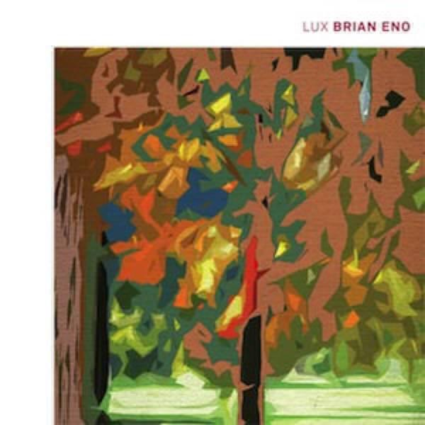

Pretty much a sliding scale between songs and electronic wibble on this month’s albums and a particularly damp, chilly feeling to proceedings too.

1. Bat For Lashes “The Haunted Man”
2. Ital “Hive Mind” and “Dream On”
3. Björk “Bastards”
4. Brian Eno “Lux”

## Bat For Lashes “The Haunted Man”

When it comes to Bat For Lashes, I prefer her first album “Fur And Gold” to her second “Two Suns” because when I listen to the latter I don’t feel connected to any of the songs. For me, “Fur And Gold” remains a wonderful adventure throughout, it’s a fantastic listen.

For a while I thought that “The Haunted Man” just picked up where “Two Suns” left off and I didn’t think it was that great. However, at some point the tide turned and I really started to enjoy it. I think it was when I really started to pay attention to the tracks towards the end of the track listing. As I have mentioned before, I like to listen to albums while walking to and from work, and because of this I tend to enjoy albums more if the best tracks are at the beginning: my walk to work is just 35 minutes and so I don’t often get to listen to whole albums.

I would say that “The Haunted Man” is definitely “back loaded”. Things really kick off with “Laura” (song number 5), it’s the song from this album that you are most likely to have already heard. It’s beautifully spare and sparse, a bit like “Moon and Moon” and delivered in the main from the piano with not much else to accompany it, just the odd phrase from a brass band.

After that comes “Winter Fields”, which I think really shows off of her songwriting skills with some beautiful imagery about the countryside. I think it is great that there is still music that taps into a sense of Englishness (in particular the pastoral aspect of English culture) and manages to draw out something dark and mysterious. It’s something that has been present right from the beginning in Bat For Lashes’ music, it tumbles out of the speakers right from the opening verses of “Horse And I”.

Completing a hat trick of great songs in the middle of the album is the title track. I especially enjoy the glitchy intro, the strange Red-Box-esque drums and choir lines ahead of the chorus (actually it’s a lot like something off Kate Bush’s “Hounds Of Love” too) and the variety of synth sounds throughout: there’s some spooky stuff on the opening verse and some rich deep veins of sound underpinning the main chorus. It feels like a suite of several songs brought together but all the disparate elements combine beautifully.

Elsewhere there are other really great songs, like “All My Gold” (a rattling tribal affair that channels “What’s A Girl To Do?”), “Marilyn” (like so many Bat For Lashes songs it is likeable because at points it just soars away into a beauty) and “A Wall” (simply because it was a grower and I have a grudging respect for songs that are growers). While the whole album doesn’t quite tell a whole story like “Fur And Gold” did, I still believe it all hangs together well as a coherent collection of quality songs. Highly Recommended.

## Ital “Hive Mind” and “Dream On”

These are two mini albums that Ital has released this year, “Hive Mind” was released back in February (I got a copy in June) and “Dream On” was released earlier this month.

It’s tempting to look at these two as two halves of a larger whole, especially as each “album” is just around 42 minutes long. In the case of “Hive Mind”, which consists of just five tracks, this mostly means long spools of near ambient dance music reminiscent of when ambient house had a significant house component to it. The music on “Hive Mind” reminds me a lot of early tracks by The Orb. In fact it sounds more like The Orb’s early remixes like, say, Maurizio’s “Ploy” (the astoundingly titled “Battersea Was An Island Of Mud mix”) – particularly on tracks like “Floridian Void” that unravel into dark swirls of electronica.

On the other hand “Dream On” puts that darkness front and centre. It’s a much more in your face record, it’s both aggressive and forthright. There are fewer, briefer, tracks though the opener “Despot” gets to be just that and rattle and stamp its way through nearly nine minutes of chopped up vocals and retro sounding synths (I’m sure I can hear something that sounds like a Fairlight in there).

Each album has a track that appropriates vocal samples from a big pop act: the opening track of “Hive Mind” “Doesn’t Matter (If You Love Him)” takes snippets of vocals from Lady Gaga and Whitney Houston and shreds them into a robotic mix. Even more drastic is “Boi” on “Dream On” taking a sample of Beyoncé singing “baby boy” and folding it back over itself over and over again for seven and a half minutes. Its one of those genuinely delightful repetitions that ends up seemingly distorted the repeated words into something else.

I really enjoyed both albums. They may not necessarily be two halves of one whole, but they are certainly enjoyable back to back. If I had to choose, my preference would be for “Hive Mind” as it is a really absorbing collection of tunes and some of “Dream On” is a little too abrasive for me.

## Bjork “Bastards”

Say what you like about Björk, she doesn’t half know how to shift a lot of merchandise. This is yet another remix album, this time centred on the “Biophilia” album and mostly comprising a selection from a sequence of limited edition singles released throughout the year. I’ve collected those singles and so I’ve only listened to this album on Spotify because I have most of the tracks already.

It has to be said that I was really wanting to give this album a kicking because at first glance the tracklisting looks terrible - there are some glaring omissions and including one Death Grips mix (let alone two!) represents the inclusion of one Death Grips remix too many. Also, all of Biophilia’s tracks were covered over the course of the eight singles, so it makes no sense for this album not to do the same. Particularly when the most glaring omission is “Cosmogony” which was the stand out track from “Biophilia”.

Nevertheless, I enjoyed the singles and so the bulk of the material here is good and I do find myself warming to the selection, it certainly flows quite well. Little experiments like including Matthew Herbert’s remix of “Sacrifice” as a 50 second reprise after the horrible Death Grips version is a nice little experiment (though if I didn’t have the full version on single number 6 I would be a little miffed). There are still way too many mixes of “Thunderbolt” for me, meaning that the line “scrape these barnacles off me” (yes! really!) appears about four times over the run time of “Bastards”.

The Oscar Souleyman mix of “Crystalline” is amazing and it wasn’t on the singles, it’s my favourite thing on the collection. But then the Current Value mix of “Crystalline” is awesome too and is sadly overlooked, admittedly in favour of his mix of “Solstice” so it’s not all bad. In my view, the wrong mix of “Hollow” is on there too (but the good one is by Current Value too!) and if a mix of “Thunderbolt” has to be there, then why on earth wasn’t it the King Cannibal one? Nevertheless, there are some small revelations: when I first heard the remix of “Mutual Core” I was really underwhelmed, but there’s something about the way those Solomon Islands singers slot very nicely into the opening half of the mix.

Björk has released better albums than “Biophilia” ([something that I discussed last year](album-digest-october-2011)) and has also released two better remix albums than “Bastards” in the shape of the wonderful [“The Best Mixes from the Album Debut for All the People Who Don’t Buy White Labels”](http://en.wikipedia.org/wiki/The_Best_Mixes_from_the_Album_Debut_for_All_the_People_Who_Don%27t_Buy_White_Labels) and [“Telegram”](http://en.wikipedia.org/wiki/Telegram_(album)). Those two told us new things about their parent albums: “The Best Mixes from the Album Debut…” revealed anew the startling plasticity of her sound by manipulating [the amazing songs from Debut](uc15) into stellar symphonies of electronic music; while “Telegram” completely retooled “Post” into bizarre and wonderful shapes, into shapes so contorted that her next album would in fact have to be “Homogenic” in response. “Bastards” does nothing for “Biophilia”, both are patchy albums and perhaps show that not only is Björk is need of a reinvention (beyond apps) but that many of the people remixing her need new ideas too.

## Brian Eno “Lux”

“A Small Craft On A Milk Sea” was one of my favourite albums of 2010 (it was, apparently, a reworking of a rejected soundtrack to Peter Jackson’s adaptation of “The Lovely Bones”) and I wrote about how much I enjoyed last year’s collaboration on “Drums Between The Bells” with Rick Holland. I also chose [“Ambient 2/Plateaux Of Mirror”](uc16) as one of my understated classics, so there is a lot of Eno love on this blog.

“Lux” is a new solo album of four longish pieces, as with “Music For Airports” each part would fill one side of vinyl. In general there isn’t much more to say. The music is like dappled sunlight or the shadows of billowing smoke: as much not there as it is there. It is not really minimalist but there is definitely an economy in the use of the elements of available. It drifts around the room and makes for very pleasant background listening.