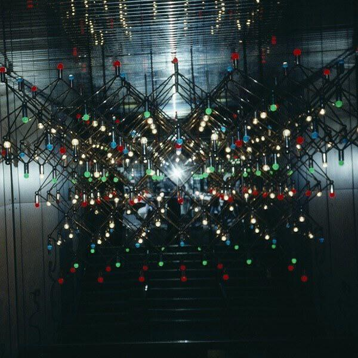
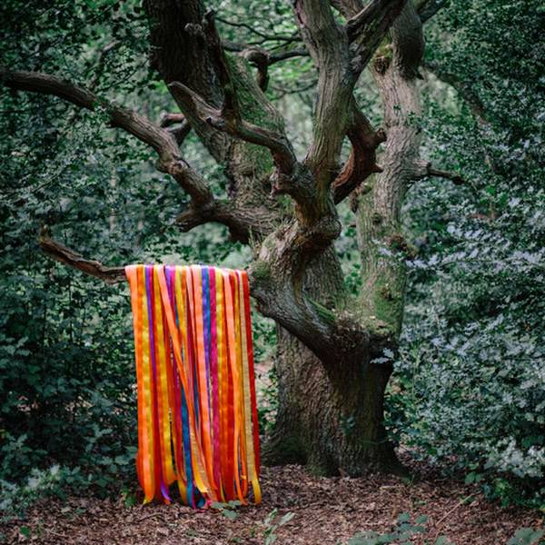
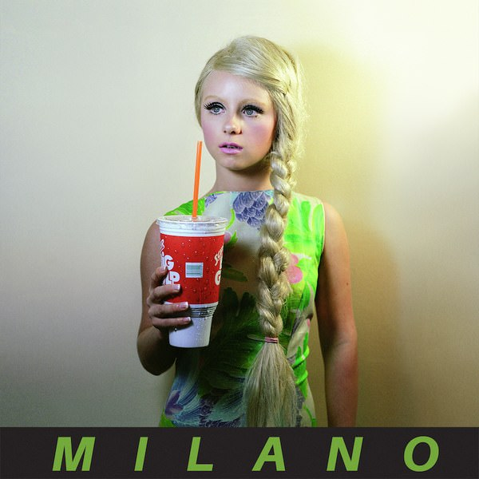
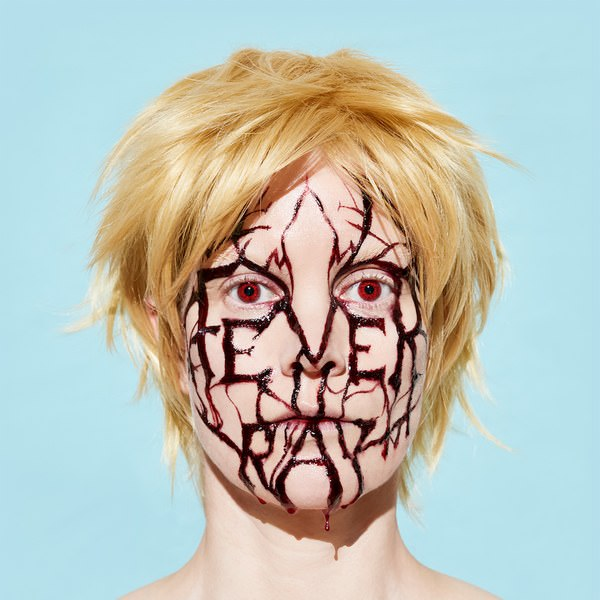

## 00110100 01010100 "0181"

This is a reissue of a Four Tet rarity from 2013 that has recently surfaced on Spotify under an alias[^1]. "0181" collects a series of short experimental pieces from throughout his career, though I'm not enough of a nerd to know whether they are in any particular order. [Last month](album-digest-october-2017)'s 'proper' Four Tet album "New Energy" has a lot more bounce to it, but "0181" nevertheless has some interesting moments that raises it above mere curiosity.

All the track titles are formatted as telephone numbers[^2] (0181 was once the dialling prefix for outer London). The opening tracks 0001 to 0004 sound most like his more recent material, while 0005 is a spray of spindly synth lines that recall earlier albums like "Pause". A lot of the tracks sound really good on headphones as pieces that get out of the way while you get on with things. Some tracks (like the second half of the aforementioned 0005) lurch into hip-hop or jungle genres for a while, so not everything is there to be listened to passively.

Throughout I spotted some nice allusions to other artists. 0007 and 0010 are both more like jazz improvisations than electronica, 0009 sounds like one of Aphex Twin's more mellow compositions, and 0013 is a short sketch that reminded me of beats from "Dead Cities" by the Future Sound of London.

0014 reminds me of his remix of Beth Orton's "Daybreaker", though I haven't listened to that for years (must find my copy) so I could be completely wrong. I listened to the final track 0016 while I walked through Chichester in the dark and its tinkling pianos and strange insistent flute-like pulses made for a perfect soundtrack for shadowy alleys and orange street lights.

All in all, "0181" is a pleasing collection of downtempo sketches that is an interesting complement to "New Energy". 

## James Holden and the Animal Spirits "The Animal Spirits"

Electronic producer James Holden decided to experiment with live instrumentation, forming an improvisational group named the Animal Spirits. The result is a charming album that is less abrasive than much of his previous material. I wrote about his previous album "The Inheritors"[^3] in [July 2013](album-digest-july-2013). It was an intriguing album of electronic music, quite muscular in its way. Re-listening to "The Inheritors" now, I can hear the elements that were perhaps the beginnings of the improvisational style of "The Animal Spirits".

The early tracks like "Incantation For An Inanimate Object" and "Spinning Dance" have an earthy feel. "Incantation..." rises out of the speakers on a fog of eerie plainsong, hissing electronics and the jangle of prayer bells. Eventually the ambience gives way to "Spinning Dance" and a riff that grows and grows, becoming as frenetic as a dance around a roaring camp-fire on a dark night.

"Pass Through Fire" builds a motorik rhythm out of a folksy snippet of music before saxophones burst in and everything goes crazy. The folk figure remains throughout like flames threatening to engulf the rest of the music. "Each Moment Like The First" repeats this trick, sounding like a cross between the theme tune of an 8-bit Dungeons-and-Dragons-themed computer game and a long-lost track by Kraftwerk. And more besides. "The Beginning & The End Of The World" manages to sound like every track of Pink Floyd's "Dark Side Of The Moon" played at once, in a good way.

On "Thundermoon Gathering" I'm reminded of Norwegian band Supersilent, a trio of jazzy improvisers whose unspoken mission was to jam their way through long unstructured pieces while making as much noise as possible. 
The more atonal elements continue to manifest on the title track, albeit underpinned by the most overt electronic riff on the album so far. It makes me imagine something eldritch coming into being under a bright full moon in a cold dark copse of sinewy yew trees. And yet there's also something about the insistent hyperactive rippling of the synth that's also celebratory, a sense that everything is coming into being at once. Old and new, animal and machine, mystical and practical...

So it's something of a shock when all that quickly fades away and "The Neverending" introduces a funky beat. It's by far and away the most lyrical thing here, developing into something beautiful that feels tangible and not, all at once, like sunshine on a winter day. With the most prominent synth lines on the entire album, it shows that these elements are as crucial to Holden's music as the live instrumentation he's sought to include on this album. This is borne out again on "Go Gladly Into The Earth" which pulses with bliss and contentment, mixing both elements in a true fusion of the machines and instruments with the animal spirits in charge of them.

That fusion of man and machine seems to be the whole point of this album. It demonstrates that even the slightest of human touches can enliven the sparest electronic music, and also that the slightest of electronic touches can elevate a repetitive riff into something sacred. This is a fantastic album that also enriches its predecessor. I'd urge you to give both a try.

## Daniele Luppi, Parquet Courts, and Karen O "Milano"

This short album is a collaboration between composer Daniele Luppi, the New York band Parquet Courts and Yeah Yeah Yeahs singer Karen O. Luppi is a composer of film music and he's the lead artist on Milano, a concept album about Milan in the 1980s. It's a collection of tales about models, hustlers and artists. Adding Karen O's voice and Luppi's delicate arrangements to the muscle of Parquet Courts is an inspired choice. While I can't say that the music itself evokes Milan for me, it is nonetheless an entertaining collection of songs.

"Soul and Cigarette" feels like it's been plucked from the more introspective moments of last year's "Human Performance". There are fantastic lyrics throughout the song, particularly the lines about "clapping dirt to a cloud with his hands". "Talisa" and "Mount Napoleon" are both about models and fashion. The former a model trying to make it big, the latter about a coke-addicted rake prowling the upscale shopping streets of Milan.

Meanwhile "Flush" is just *weird* (not that that's a *bad* thing). Other than some Italian lyrics towards the end of the song, I can't connect it to the Milan theme at all. However, it's great fun and enjoyably sweary &#x1F606;, not to mention the taut CAN-like strut that underpins the song. 

"Memphis Blues Again" is told from the point of view of Ettore Sottsass, the Italian designer who founded the Memphis Group, who designed postmodern furniture from 1981 to 1988. They were so named because the Bob Dylan song “Stuck Inside of Mobile with the Memphis Blues Again” played at their first meeting, a fact that this song plays with by referencing Dylan’s track in the title and chorus. It's an amazing rant of a track with [droll lyrics](https://genius.com/13135913) like "Minimalism's absurd / To me its just a word / I wished I'd never heard" and damned funny too.

My favourite track is "Pretty Prizes" which tells the tale of a sex worker who cheats their client. Because the vocal alternates between Andrew Savage of Parquet Courts and Karen O, I find the gender of the hustler changes each time I listen to it[^6]. It amuses me either way, as the sleazy businessman in his hotel room with a view of Il Duomo deserves his comeuppance.

After that the album peters out with a few more songs and a weird skronky instrumental. The album's short enough that this doesn't matter. I doubt I'd have realised that this wasn't just a plain Parquet Courts album but I'm glad that I found it. I've bought a copy on vinyl. Much like ["Human Performance"](album-digest-may-2016), I imagine it's a record that I will flip over and over.

## Fever Ray "Plunge"

Karin Dreijer of defunct electronic band The Knife returns under her solo alias Fever Ray. Eight years after her eponymous debut, it's almost as if she's never been away. "Wanna Sip" is a harsh opening track, her unique voice combines with fireworks of synths and ominous bass lines. Things soften up on "Mustn't Hurry", a slow spoke-sung track not unlike "Triangle Walks" from her debut album.

"A Part of Us" is a cute duet with Tami T. Like many of the songs on "Plunge" it has simple lyrics with a particularly beautiful line about walking hand in hand into the morning mist. "Falling" is a queer rights song. It also begins with these wonderful laser arcing riffs, which are prominent throughout all the songs.

"IDK About You" is an exuberant song about new love. The bridge references a New Order song that I can't quite place. It's also a lot like the version of The Knife's "Bird" that's on the "Shaken-Up Versions" EP.

The next song "This Country" lays down the marker for the theme of the album - the way that your life is supposed to change when you get married and/or have kids. Obviously this is an interesting concept for me given recent events in my life. In [an interview with the Guardian](https://www.theguardian.com/music/2017/nov/18/fever-ray-pleasure-patriarchy-political-revolution-plunge-karin-dreijer) she says "This [album] is about freedom, and curiosity. Now I think it’s absolutely possible to create a family that isn’t a nuclear one, but I didn’t know that then. I had lived a very feminist way of life before I had kids and I was shocked at how society treats you when you become a mother. You’re basically supposed to cut your arms and legs off and stay in the house." The outro consists of the line "This country makes it hard to fuck" repeated over and over. When you think about it -- no matter where you live -- it really does[^5].

"To The Moon and Back" is the best pop song of the year and is certainly has the best final line. "Red Trails" evokes her excellent cover of Peter Gabriel's "Mercy Street"[^4] and has some wonderful celtic violin samples. It's the most satisfying track musically. "Mama's Hand" returns to similar territory as The Knife's "Silent Shout", with a similar riff and structure to "Forest Families". It's like a gentler version of "We Share Our Mother's Health".

Like the first Fever Ray album, this pares down the rougher edges of the work of The Knife and builds up a surprisingly robust collection of bizarro pop songs. They're about important matters but they're also by turns sincere and cheeky. It's an enjoyable album that I will likely listen to for a while yet.

## Playlist

Here's a Spotify playlist of this month's albums:

<iframe src="https://open.spotify.com/embed/user/mattischrome/playlist/7DMGU4srb8ufgtUZSyX5Ny" width="300" height="380" frameborder="0" allowtransparency="true"></iframe>

[^1]: 00110100 01010100 apparently encodes to "4T". 
[^2]: For example, "0181 000 0001". In this review I refer to tracks by their last four digits.
[^3]: Excluding EPs and the like.
[^4]: I think Peter Gabriel chickened out when he used Elbow's cover on the "New Blood" album, it's good but not as ethereal and displaced as the Fever Ray version. Given the provenance of the lyrics, it feels like a lost opportunity. 
[^5]: Something that may be the subject of another post, perhaps.
[^6]: Presumably Parquet Courts wrote and performed demos of the songs and the results were too good with both singers.