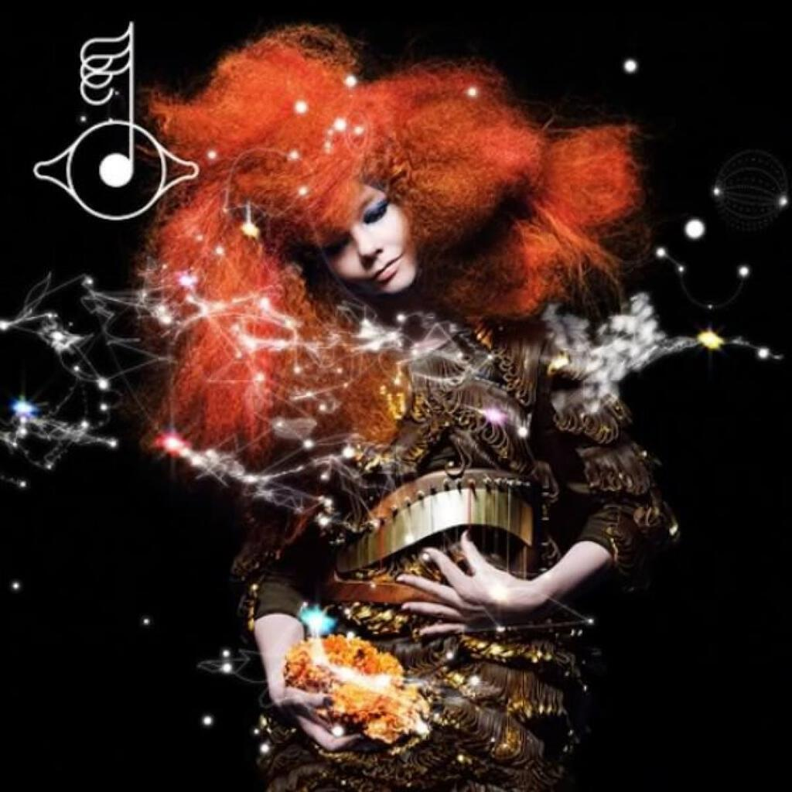
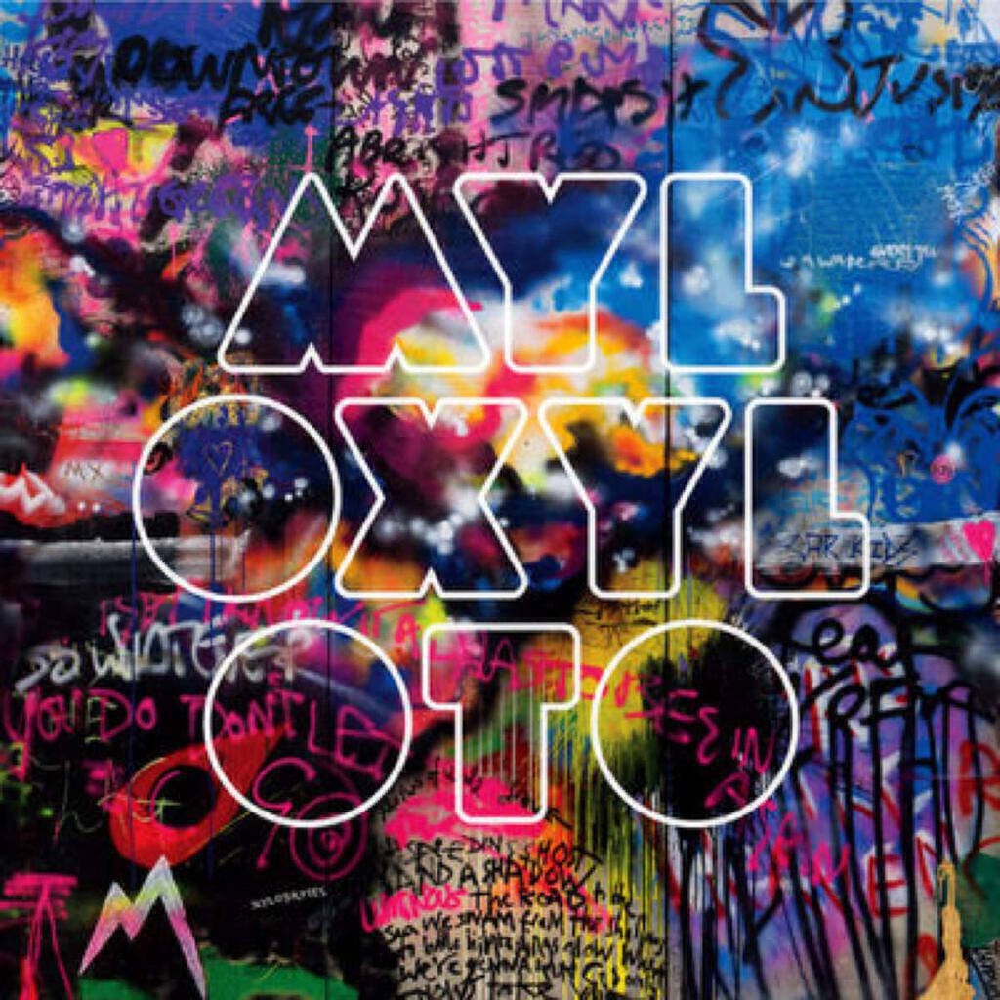
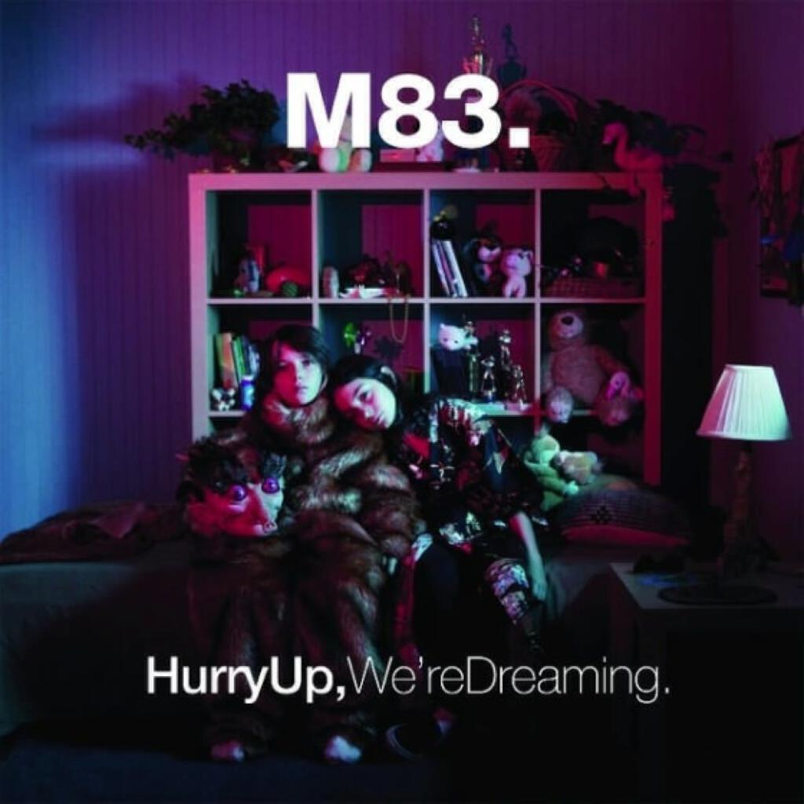
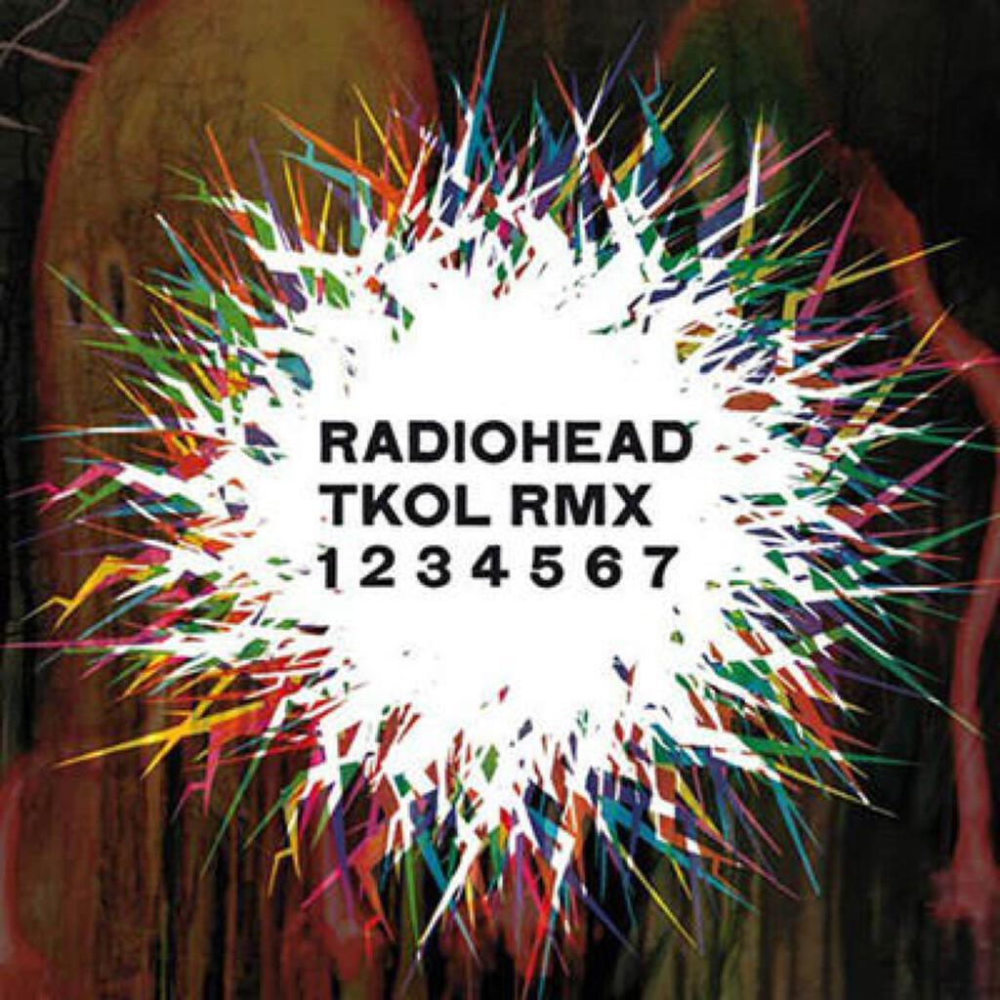

This month we have albums by Björk, Coldplay, M83, and Radiohead.

## Album Digest October 2011 - Intro

I listened to Wilco’s _The Whole Love_ again the other day. I happened to be walking past the venue in Portsmouth where I went to see them live back in 2004 and it seemed the right fit. I really enjoyed the album after a period of not having listened to it and I found that being familiar with the songs allowed me to better appreciate the production of the album. It really is better than I had said last time when I included it in the [September Album Digest](/2011/09/album-digest-september-2011/), I suppose that it was the danger in writing about music you have only had with you for a few weeks (or days in the case of _The Whole Love_).

This is the reason I am not sure whether to continue to writing these monthly album digest posts. I  enjoy them but I will start to add the warning that they are not definitive. I may also start leaving things a little longer before I write about. There is no real need to be bang up to date after all!

I have had a busy month so please bear in mind that I may totally change my mind about these albums in the next few weeks or months!

## Björk _Biophilia_

The fact that it sent me back to her old material is probably not the best advert for the new Bjork album _Biophilia_. I get the feeling that she senses this too, [hence the entire album being available as a series of apps](http://www.wired.co.uk/magazine/archive/2011/08/features/music-nature-science). I confess that I bought these too. As a result I will now talk mostly about the merits of the apps rather than the songs. It is necessary to discuss how the listener might respond to the music differently because of the interactivity, but also to discuss how the music itself changes in order for the listener to be able to interact with it.

I found that it was great fun to play with the apps. I particularly enjoyed the one for _Sacrifice_ because it allowed you to create some rather chaotic remixes of the track based on about thirty samples from the track. Another great one was for _Dark Matter_ because it attempted to teach you about music, you have to play Simple Simon with the notes that make up the organ tracks underpinning the song. Even better, it shows which notes make up particular modes - I probably liked this because the modes had loads of strange names. I found the other apps like _Crystalline_ and _Virus_ were less engaging because they felt more like something to play with while you listen to the song all the way through.

Also interesting are the animations that go with each app, these are the song in the version you find on the CD together with an animation that describes the structure of the song. For example, in the case of _Dark Matter_, you get to see how all those organ chords fit together. What is particularly interesting is that _Dark Matter_ is one of the tracks that sent me back to _Isobel_ and _Hyperballad_ after my first listens to the CD version of the album. There is a definitely a case to make for the apps either helping a listener to understand more challenging material, or more cynically, forcing the listener to engage with lesser content.

_Biophilia_ is not a bad Björk album by any stretch. It is probably her best since _Vespertine_ and like every one of her albums since then, it is front-loaded with the best material. I think that her best songs have generally been about the intimacy of relationships (_Joga_, _Unravel_, _Come To Me_) or personal experience and self-discovery (_Big Time Sensuality_, _Alarm Call_, _The Anchor Song_) or both (_Hyper-ballad_, _Human Behaviour_, _Hunter_). As a result, her more recent songs about more general things like the nature of the universe have left me a bit cold. However, when these songs feature a beautiful and effortless vocal like _Cosmogony_ or are surrounded by gorgeous instrumentation like _Virus_ or _Sacrifice_, this can usually be forgiven.

I think _Biophilia_ will end up rewarding repeat listens much more than _Medúlla_ and _Volta_ did. Until then, there are always the apps to play with.

## Coldplay _Mylo Xyloto_

I persist with Coldplay these days because of the Brian Eno connection but their last album _Viva La Vida, or Death And His Friends_ was a bit of a mess, one that was all the more frustrating for being crammed with good ideas but a bit of a mess. _Mylo Xyloto_, despite the terrible title, is actually rather good and is definitely their best since _A Rush Of Blood To The Head_ and maybe their best yet.

The trick to having lots of ideas, it would seem, is to use them as decoration of good pop songs and not to prop up rather dreary material, as was the case on _VLV_. You can hear them in the jangling chimes that drape themselves all other the chorus in _Hurts Like Heaven_, the tinny delicate reversed samples of the chorus of _Paradise_ that percolate the quiet moments on _Charlie Brown_ and the sudden impersonation of Bono on _Major Minus_. Of course, sometimes old ideas are good too so you get driving riffs like those that underpinned _Clocks_ and _Viva La Vida_ and the “Whoa-oh-oh” replacements for choruses and middle eights.

Apparently there is some sort of concept or plot to all these songs but it is barely detectable, which is probably a good thing. At the end of day, it is a nice collection of pop songs played with good heart and embellished with some great production. Coldplay are good at writing albums that sound different from each other and yet still sound definitely like them. This means they will be with us for a while yet. I think that’s a pretty good thing.

## M83 _Hurry Up, We’re Dreaming_

I am still getting to grips with this fantastic album from M83. I skipped their last album _Saturdays = Youth_ because I wasn’t all that keen on their second album _Before The Dawn Heals Us_. I wasn’t sure I liked how their sound had moved on from their gorgeous début _Dead Cities, Red Seas and Lost Ghosts_. _Dead Cities…_ was one of the first albums that I bought as a PhD student, an amazing shoegaze album drenched in reverb with great tracks like _Run Into Flowers_, _America_ and _In Church_. It was quite a good idea album to get spaced out to while walking home from university.

_Hurry Up, We’re Dreaming_ is a massive leap on from _Dead Cities…_ and _Before The Dawn…_, for one thing there has been a move from “tracks” to “songs” and there is a real muscularity to the vocals. Whereas before the vocals would be buried under mountains of synth and reverb, now you can hear them even when there is a really dense arrangement going on behind them. It makes tracks like the opening trio of _Intro_, _Midnight City_ and _Reunion_ truly compelling. The first time I heard them, my hair stood on end for almost the entirety of their combined thirteen minutes. It really is the best of both worlds.

Elsewhere _Reconte-me une histoire_ is full of charm and childish glee (a girl tells the story of a special frog that makes magical things happen when you lick it) and _Year One, One UFO_ is a brilliantly arranged giddy knees up that you might expect from someone like Lemon Jelly, that is until the guitars really kick in like they mean it (Compare this track to the rather weedy _The Shouty Track_ off LJ’s _‘64-‘95_).

The double album structure is well suited to me as each half lasts the time it takes me to walk to work, although I think CD2 is more suited to the morning and CD1 to the evening. I find that I have listened to CD2 less, perhaps because of that aforementioned strong opening but I really should be more even-handed or I am going to miss out on fantastic songs like _Steve McQueen_, which sounds like it would fit in really nicely on the Washed Out album that I really loved earlier on in the year.

Overall, _Hurry Up, We’re Dreaming_ is a fantastic album, perhaps one of the best this year.

## Radiohead _TKOL RMX 1234567_

This is a collection of remixes of tracks from The King Of Limbs, an album that is fast cementing its place as one of my favourite Radiohead albums. I think it is better than _In Rainbows_, I love the knotted textures and dead ends. It coos and sighs and is definitely up there as one of the more upbeat and optimistic Radiohead albums.

Does this mean that _TKOL_ is ideal material for remixing? I would have said yes but this collection is rather uneven. Personal favourites include the two mixes of _Giving Up The Ghost_, particularly the one by Brokenchord because the sounds a bit like it is constructed from the wonderful Mike Oldfield B-side _Bones_ (even though it almost certainly is not).

It is good value for money in that it collates for about £8 a collection of seven vinyl only EPs that would set you back £12 each. OK, you have to make do with a CD and not seven slabs of beautiful clear vinyl but we all have to save money these days.

The problem is that some tracks are over represented. With 19 remixes here from a ten track album, this means there should be roughly two mixes of tracks and so that there are five mixes of _Bloom_ is a little hard to take (The Blawan remix is awesome, will definitely be hunting down more of their material). Also, there are no remixes of _Supercollider_ or _The Butcher_, both of which would have been great source material for the remixers who have contributed here. What is quite cool though is the mega mix contributed by Altrice (Mostly _Bloom_ (again!) and _Giving Up The Ghost_ I think…), another palpable highlight that uses most of the songs to build a new track. I will no doubt discover more on repeat listens, I find it is a good album to put on shuffle and code to.
