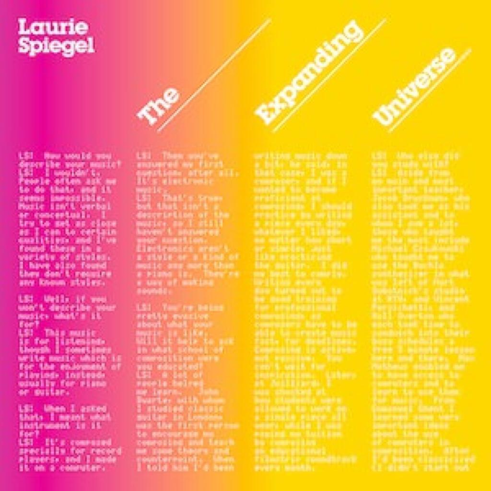
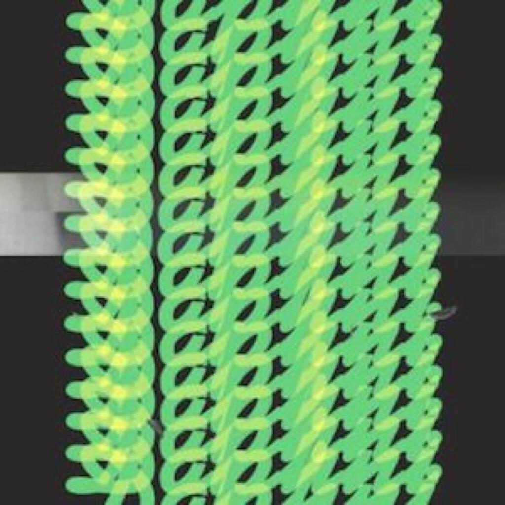

It has been a strange month and I found that I didn’t listen to a lot of new music. I have been a bit down and when that’s the case I tend to take refuge in music that I know well, stuff that cheers me up. I have listened to last month’s fave a lot, Nelly Furtado’s “The Spirit Indestructible”. I said a lot of nice things about it but it probably didn’t come over in my writing just how much I really liked it.

Meanwhile, there were five albums I mostly got my teeth into this month though I didn’t listen to them as often as I would have liked. I will write now about four of the five that are similar to one another. The fifth album is “The Haunted Man” by Bat For Lashes, but I will wait until next month to write about that as I’d like to take a little more time to unpack it and get to know the songs better. The other four albums don’t really have songs, so it is less of a problem. All four are by and large abstract electronic albums and so I am going to write about them in a pretty general way. The albums are:

1. “Dependent And Happy” by Ricardo Villalobos
2. “The Expanding Universe” by Laurie Spiegel
3. “Jiaolong” by Daphni
4. “Mala In Cuba” by Mala

I had heard a lot of strange things about Ricardo Villalobos. He was one of the first artists to turn in a Fabric compiliation consisting solely of his own tracks (I wrote about a similar enterprise by Guy Gerber [in June](album-digest-june-2012)) and then there was that weird business of the 31 minute single based around a single trumpet sample or something (which I haven’t yet heard). This album was released in two versions: a CD with 11 tracks and then a 14 track version across 3 12” packs (2 double and one single, making for ten sides in total). Despite already having adventures with vinyl this year, I decided to buy the CD version and then cheekily get the versions from the vinyl edition by (ahem) other means[^1]. It’s not just a case of missing out on three tracks if you stick to the CD version, the vinyl contains longer versions of some of the tracks.

The tracks on the vinyl version are longer and are perhaps meant to be consumed at three seperate sittings, whereas the CD features shorter tracks that are mixed together and to be consumed all in one go. Either way it’s an exhausting album of minimal techno that on headphones worms its way into your ears and shatters your brain. I think I prefer the CD version for its brevity, though there is a lot to favour the widescreen and sinuous 12 minute vinyl version of “Tu Actiuud” over the 9 minute one on the CD. I really haven’t listened to it enough to remember what else pops out apart from the amazing last track (on the CD) called “Die Schwarze Massai”, it’s quite short and it bubbles along in a crisp way – like a slightly more animated version of [Mohn](album-digest-july-2012).

If “Dependent And Happy” is all sleek modern abstraction, then this reissue of Laurie Spiegel’s “The Exanding Universe” represents an origin point of sorts. The music on “The Expanding Universe” was composed and recorded with the computers at Bell Laboratories in the mid to late 1970s. Just 5 of the 19 tracks on this reissue were on the original album, so it represents a really interesting archive of music being made with computers at that time. There are really interesting liner notes with the CD and I’m looking forward to reading them more closely.

The music here is a gentle classical music of sorts entirely created on computers. Obviously there were analogue synths as early as the late 60s but computer music in the 70s would have relied on machines the size of a fridge and operated by punch card, a wholly different way of creating music digitally than is the case today. However, the important question is whether, as with Kraftwerk, the music stands up as something innately interesting rather than simply as a curio or evolutionary waypoint in the development of electronic music. I think that the music does indeed stand up well to the passage of time. It is quite minimal and relies on repetition and counterpoint, but it is really quite relaxing and beautiful. Perhaps the best example of just how pretty some of the tracks are is “East River Dawn”, a wonderfully shifting piece lasting just over 14 minutes that evokes its title perfectly.

I had an interesting thought about this music in relation to the minimalism of Philip Glass and others. I often feel that the minimalist composers are not very compassionate to the people who have to perform their pieces. I did wonder whether the pieces on “The Expanding Universe”, written to be performed by a computer, are in fact more human (and humane) than the pieces composed with the intention to be performed by humans. I guess it is a minor point.

I have not listened to Daphni’s “JiaoLong” anywhere near enough. I know this because every time that I do listen to it, I have a whale of a time. In many ways it is a similar album to Four Tet’s “Pink” ([which I wrote about last month](album-digest-september-2012)): a collection of tracks recorded for various twelve inches and DJ sets – this time by Dan Snaith, the central brain behind Manitoba/Caribou. These tracks are clearly geared toward the dancefloor, no mucking about, and they are all the more enjoyable for it. I tried to do some work while listening to this and I just ended up dancing along instead.

Another thing I like about this album is that it is pretty brief, so nothing overstays its welcome. My favourite tracks: “Yes, I Know” a wonderful collision between something really wiggy like Vitalic’s “Poney” and a 70’s dancefloor hit… …that sounds like it’s playing in a dustbin; “Pairs” a steady simple track that is grafiti’d with all manner of basslines and synth squiggles; “Springs” which descends into tweaky acid madness that really does make you think of springs; “Long”, a warm and hazy closing track that is probably as warm and cosy as a track still aimed squarely at the floor could possibly be.

“Mala In Cuba” is an intruiging dubstep album built out of samples sourced by Mala on a trip to Cuba. Unfortunately, while it is certainly an interesting listen, I found that the fusion of the two worlds was not quite as complete as I’d hoped. It strikes me as much more of a dubstep album than one filled with references to Cuba or Cuban music. In fact it isn’t really until about halfway through the album (“Como Como”) when a bit of real latin flavour really starts to shine through. “Cuba Electronic” (which follows “Como Como”) is probably the first successful attempt to produce something genuinely new on the album – a wonderful skittering rush that leans heavily on latin percussion samples. Up until then there are clearly latin sounds present but the atmosphere is much more Hoxton than Havana, it’s a rather homeopathic infusion of latin beats into the dubstep sound. (However I do need to listen to it a few more times…)

I think the track that really hammers home just how good an album “Mala In Cuba” could have been is the final track “Noche Sueños”: the vocal helps to establish the flavour but I also think it is the reason for retaining more instrumentation so that while the synths and drum machines provide surface detail, there are also some organic elements that help to sustain the atmosphere. However, listening to the track again for the purposes of writing this, I found that there were more electronics present than I remembered – again showing how much more successful “Noche Sueños” is compared to the rest of the project.

[^1]: I did not actually manage to get a rip of the third vinyl, so I am two tracks down on this version of the album (though one of them is on the CD and is probably, at 12 minutes long, unedited).