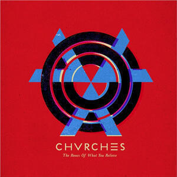
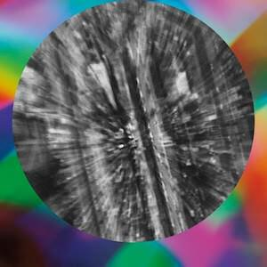

Four great albums this month for the last album digest in a while.

## CHVRCHES "The Bones Of What You Believe"

I first got into CHVRCHES on Record Store Day, one of my bits of swag was a Irn Bru coloured 12" of the Recover EP that, according to eBay, tripled in value over night. Judging by this, their full debut, my see-through orange slab of happiness may hold its value, because it's clear that CHVRCHES should be around for the long haul. "The Bones Of What You Believe" is a master class in upbeat pop songwriting that doesn't have to pander to the lowest common denominator.

In fact the only real flaw in this album is that it might be slightly _too_ relentless; while I was still getting to know the songs it was rather exhausting to listen to this slew of upbeat music and the album as a whole could do with a couple more changes of pace. As it is, the only slow song is the last one - although the two bonus songs on the limited edition (thanks Spotify!) are good enough and slow enough that their inclusion on the album proper could have a good album great.

Quality is consistently high but the best tracks are the ones already released as singles: "The Mother We Share", "Recover", and "Gun" which might be the best out-and-out pop song I've heard so far this year save for Vampire Weekend's "Diane Young". However, there's some great supporting stuff in the rest of the track listing: "Lies" arrives at the point where the CHVRCHES formula begins to make sense and is appropriately euphoric; "Night Sky" is a wonderful song, though I did think it was "Nice Guy" for a while; and "Under The Tide" shows that there's more than one vocalist in the band.

Overall it's a good pop album and I'm really keen to see where they go next.

## DARKSIDE "Psychic"

I'm almost at the end of this first section of monthly album digests - a run of 34 consecutive monthly posts about at least three albums. Because I love music it has not been difficult to do and my skill at writing these puff pieces about albums I like has increased over this time. Early on I did find it a little difficult to find and write about enough albums and perhaps my biggest regret is the short shrift that I gave to Nicholas Jaar's excellent album "Space Is Only Noise", something that only happened because I simply hadn't spent enough time listening to it.

DARKSIDE are a collaboration between Nicholas Jaar and guitarist Dave Harrington, and "Psychic" is their first proper album. In order to atone for past mistakes, I made sure that I listened to it _a lot_ and it was a very rewarding experience. I said back in May that I thought that Vampire Weekend's would probably be my favourite come the year's end but I have to say that "Psychic" runs "Modern Vampires Of The City" pretty close. Of course it does this in spite of (or perhaps because of) being a completely different kettle of fish. While "Psychic" is a bit less electronic than "Space Is Only Noise", it certainly operates in a similar way - presenting music that is exploded into its constituent elements and explored.

The result is a very mellow and spacious album that seems to unfold in a different way with each listen. The highlights are "Golden Arrow" - a glorious 11 minute deconstruction in which the remains of who knows what kind of track are smeared around your headphones - and "Metatron", which closes the album and is probably the closest thing to a recognisable song here. Highly recommended.

## Four Tet "Beautiful Rewind"

Another fine album from Four Tet this, it is more like "There Is Love In You" than last July's singles collection "Pink". All the tracks are quite short and the whole forty minutes flies by, ebbing and flowing in that wonderful Four Tet way. When I went to see Radiohead in Spain back in 2002, Four Tet were the support act and I bought a t-shirt in celebration of this (I'd been a massive Fridge fan). That shirt was emblazoned with the title of a track from his second album "Pause" - "Everything Is Alright". I think it's great that ten years on, he's creating music that makes me feel just that!

## HAIM "Days Are Gone"

I really like this album but I can't think of anything interesting to say about it! And yes, I have listened to it a lot! Perhaps I just need to live with it a little more before it starts to mean something.