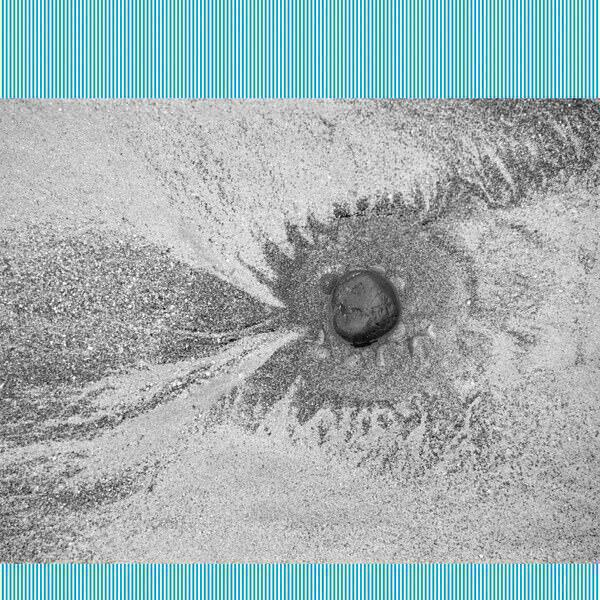
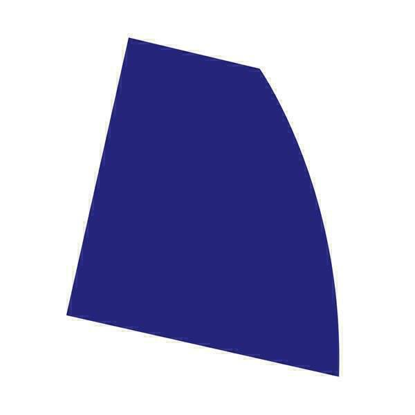

## Mary Epworth "Elytral"

This album came to my attention because its lead single "Me Swimming" appeared on my Discover Weekly playlist. I'd never heard of Mary before but this album was one of those nice discoveries that one sometimes makes when one tries to broaden what one listens to. The aforementioned "Me Swimming" is probably the best track, a beautiful slice of summery experimental pop layered over a beat that you can imagine as the kicks of a swimmer compared to the swirling lyric that imitates the pull of the strokes through the water. Or the other way round. I was a latecomer to swimming, I'm not very good at it. But I do know a good song when I hear one.

The rest of the album is an interesting mix of songs made enjoyable by experimentation and songs made enjoyable by virtue of being lovely songs. It's a little frustrating that these modes rarely intersect, perhaps only on "Me Swimming" but it's still a good album for a Sunday morning. You can blow out the cobwebs with the weird jazzy openers "Gone Rogue" and "Last Night" and gradually sink into more conventional songs like "Towards The Dawn" and "Lost Everything". I will definitely be looking out for more.

## Kaitlyn Aurelia Smith "The Kid"

Confession time. I have about two thirds of the album digest for last October sitting on my hard drive doing nothing. It consists of a scathing review of the last album by The Orb and an almost complete review of "Ears" by Kaitlyn Aurelia Smith, which ended up being one of my favourite albums of the year. This is along with "Sunergy", her collaboration with Susanne Ciani.

"The Kid", which follows on just over a year after "EARS", is a concept album that follows a child from conception through birth and development, on through to adulthood and death. The track listing almost reads like a poem. It's the sort of concept for an album that electronic music seems ideally suited to, and so you wonder why so few artists have taken on the idea.

As with "Sunergy" there are plenty of beautiful bubbling generative synth sounds and as with "EARS" there are plenty of strange and inventive double-tracked vocal phrases. Much of "EARS" consisted of songs that sounded as though they were written in an invented language, which is what made it so compelling. Once again the songs on "The Kid" often sound like gibberish but at times phrases burst through, perceptible and understandable. In a way, it's a lot like the moments you experience with young children when the burble of their baby talk suddenly breaks into clearly defined descriptions of wants, needs, feelings and loves. On "A Kid", Kaitlyn manages to absolutely capture that moment of revelation, and does it in such a way that it could apply to any similar experience of just "getting" something all of a sudden. A reminder then, that our childhood experiences are not something to be lived once, but things to be revisited, as learned techniques for overcoming difficulties.

The overwhelming sensation on "The Kid" is joy. I love the way that "In The World, But Not Of The World" totters just at the edge of control. The way that the pulses and strange animal-like noises of "Who I Am & Why I Am Where I Am" slowly speed up as the track progresses are a delight. It's wonderful to discover an experimental album that is so celebratory. I haven't listened to it anywhere near enough. [She's playing live in London later this month](http://scala.co.uk/events/kaitlyn-aurelia-smith/), but I don't know if I'll be able to make it as it's a school night. I listened to "EARS" loads, so I think "The Kid" will be on my playlists for some time yet.

## Four Tet "New Energy"

Four Tet is another artist with a rock solid reputation for delivering great albums. Sometimes they can be a bit off-kilter like "Everything Ecstatic" or somewhat functional like "Pink". His last album consisted of two long pieces that were great to listen to, provided you had the time. Sometimes though, his albums can be revelations like "Beautiful Rewind", "There Is Love In You" or career highlight (and future understated classic) "Rounds". I think "New Energy" almost gets there.

I'm really grateful to my work colleague Rich who pointed me towards Kieran Hebden's excellent set on Radio 3's [Late Junction](http://www.bbc.co.uk/programmes/b006tp52). Kieran (Four Tet) played a wide range of material, explaining that they formed some of the inspirations for the album. I enjoyed the show a lot and it reminded me that Four Tet's entry in the \"DJ Kicks\" series is also excellent, and well worth seeking out.

"New Energy" alternates between longer tracks and shorter interludes. Generally the longer tracks are pretty uptempo, much like tracks on "Beautiful Rewind" or "Pink". Few of the tracks are as club-oriented as those on "Pink", though the longest track "SW9 9SL" does feel pretty close to the dance floor. I especially like "Lush" (presumably not a cover of the Orbital track) because it performs some clever timing tricks, with a riff that sounds as though it is competing with itself as it repeats. It's almost like the aural equivalent of an optical illusion.

Many of the bassier tracks sound great on a car stereo. Unfortunately the wonkier beats made it one of those albums that Ingrid wanted to pass on after a while. I understand that, the repetition that makes for good concentration at work is not the same as that which makes for good concentration while driving. This is much more of an album to have on in the background while you are working. That said, one of the quiet interludes managed to fool me into thinking someone's phone was ringing. When I took my earphones out to find the source of the ringing, I realised my mistake.

Elsewhere the influence of Indian classical music that was also present on "Morning/Evening" continues in "Daughter". Of the short interludes, I like the quiet opener "Alap" and the jumbled-up tones of "10 Midi". They don't mess up the flow of the album as much as you think they might but I probably enjoyed "New Energy" slightly less than his other great albums precisely because it doesn't quite flow as well as an album like, say, "There Is Love In You". That said, there are some really decent tracks here and I can't wait to hear what remixers make of tracks like "Scientists" or "Lush". Perhaps there might even be something on the order of Floating Points' mighty remix of "Sing". We can but hope.

## Rival Consoles "Night Melody"

I have meant to write about this album for a few months now. You might be able to guess from the cover that it might be a bit dry and abstract. I assume that I also encountered it in my Discover Weekly playlist but [maybe it was the glowing 8.0 review from Pitchfork](https://pitchfork.com/reviews/albums/22148-night-melody/) that got me interested.

It's a lovely bit of music. I'll admit that the first few times I listened to it at night and promptly fell asleep. It's repetitive and brittle, almost like a mathematical puzzle set to music. In comparison with the Four Tet album it's colder and more sterile, and I think it's only since I've spent a lot of time with "New Energy" that I've also begun to appreciate "Night Melody" a bit more. This kind of abstract sterile music can drive you a bit bonkers if you spend too much time with it, but it tends to be great to have on in the background if you're attempting to fix a coding problem or even write a blog post.

## Playlist

Here's a Spotify playlist of this month's albums:

<iframe src="https://open.spotify.com/embed/user/mattischrome/playlist/1yn8oKyT23YsRp0aTWMfh7" width="300" height="380" frameborder="0" allowtransparency="true"></iframe>
