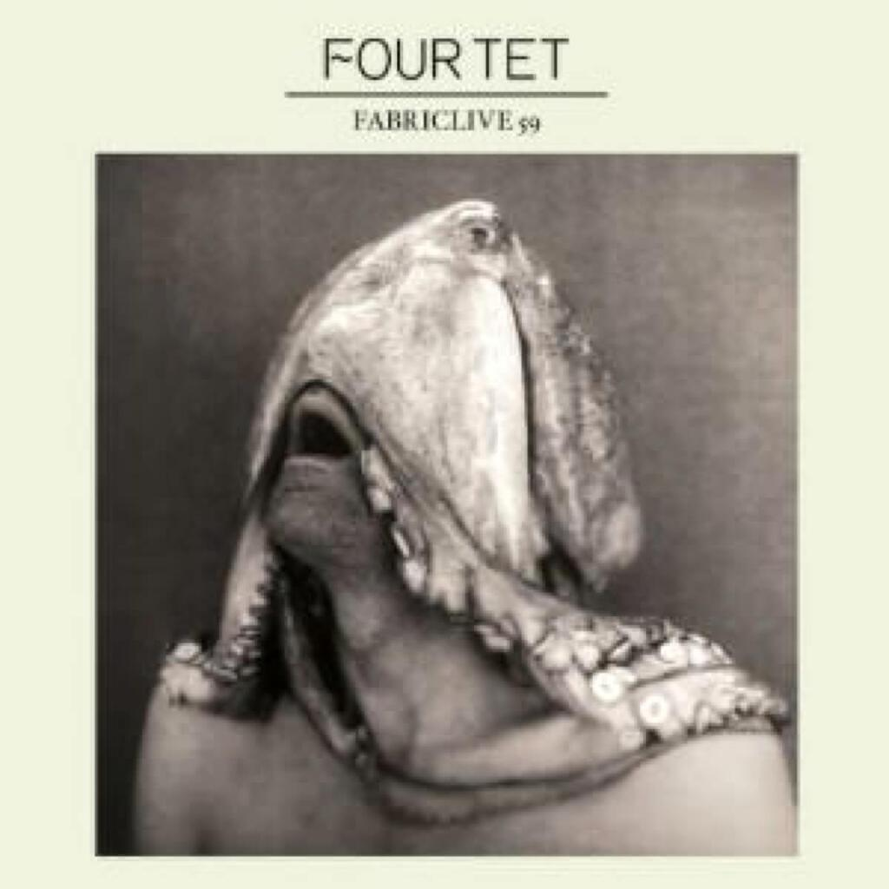
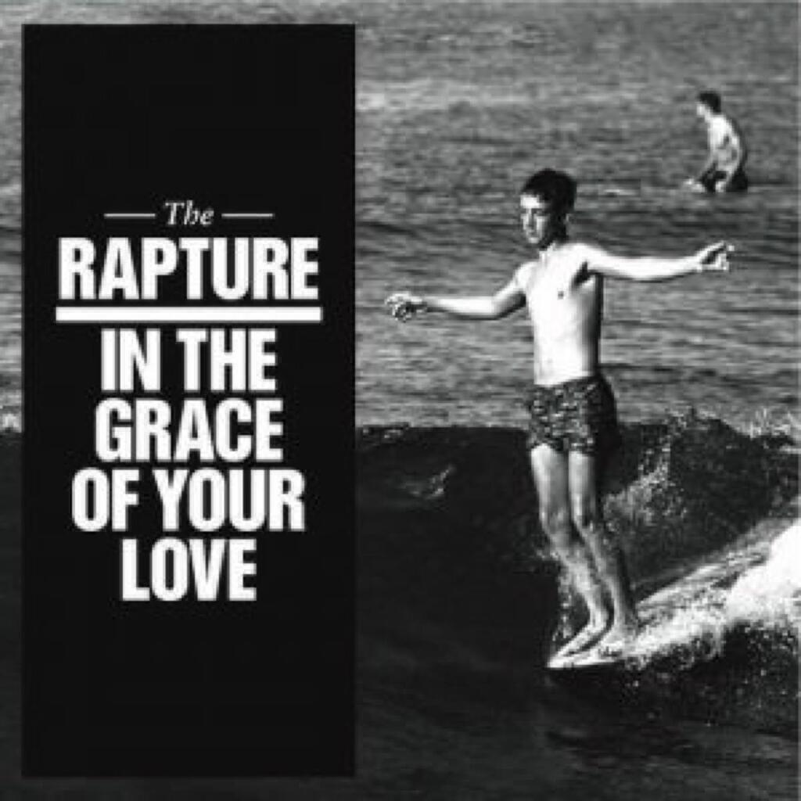

Hmmm, a rather grey looking selection of covers this month. The albums I have listened to most are:

1. John Beltran _Ambient Selections_
2. FabricLive 59 mixed by Four Tet
3. The Rapture _In The Grace Of Your Love_
4. Wilco _The Whole Love_

I have actually only had the Wilco album since Monday of this week (the 26th) but it has inveigled its way into my consciousness quite quickly. As I have said before, [this blog owes its name to a Wilco song](/2010/playlist-1-metallic/) and they are quite an important band to me. The other albums are mostly electronic, although The Rapture are distinctly indie flavoured as they hit the dance floor.

## John Beltran _Ambient Selections_

I came across this album entirely by chance while reading [Resident Advisor](http://www.residentadvisor.net/) the other week. The idea of the album intrigued me and I think that it is well known that I do love a bit of ambient music. I was also attracted to the [coloured triple vinyl](http://www.delsinrecords.com/release.php?idxRelease=2417) at first as it did look rather pretty. (It’s sold out now, I could have had the last one!) Admittedly, I have no record player to play them on but Delsin do allow you to download MP3s to accompany any physical purchases. In the end I settled for the CD, stumping up an extra three euros for the physical manifestation and a bonus track.

It is a really peaceful and placid CD. It is definitely something you could put on in the background and work to. If you don’t pay close attention it can wash over you and into the ether. I have no problem with this as that is what ambient music is supposed to do. The bonus is that a lot of the tracks also reward a closer listen too: _Collage of Dreams_ is actually quite bouncy and textural for ambient, _Sweet Soul_ and _Brilliant Flood_ have a pleasing techno dimension to them, and _Guitaris Breeze_ is simply just beautiful.

If there is one criticism is that it is a bit sterile in places. The crunchy bits a quite satisfying and so it is disappointing when it sags a little in the middle. Perhaps more worryingly these points seem to correspond with the only 2011 material on the collection. Meanwhile two tracks near the end _Vienna_ and _Collage Revisited_ bristle with energy and invention, it would have been nice to have heard that throughout.

## _FabricLive 59_ mixed by Four Tet

Obviously this latest instalment in the Fabric series of mixes wins the cover of the year straight off the bat. Meanwhile, I frigging love Four Tet. Last year’s _There Is Love In You_ was a fantastic album that arrived in my life just when I needed it, all smiles and beats and happiness. _Rounds_ did much the same as I was finishing my masters and starting my PhD. His first band Fridge were a major source of comfort during my undergraduate years (my copy of their album _Happiness_ arrived on September 11 2001) and his support of Radiohead in San Sebastian in 2002 was a highlight in an evening chock full of highlights.

I also eventually realised that I already had a mix collection from him, [the _DJ Kicks_ compilation from 2006](http://www.dj-kicks.com/FourTet/). That was a fantastic record that stayed in the kitchen CD player for months, a really interesting concoction of sounds all sounding as though they came from a parallel universe where the music was much better. That CD gave me a re-introduction to Stereolab and Autechre, while introducing me to Curtis Mayfield (who I should have known about already) and to Animal Collective (who I did not really investigate until last year). The best thing about the mix as a whole was just how fun it was, skipping from one genre to another and keeping everything moving and kinetic and interesting.

The new mix five years on has these features too though because it is for Fabric it is a little more studious, a geeky effort aimed squarely at the dancefloor. This is no bad thing as it makes for a compilation with that same propulsiveness but operates within a tighter and more refined collection of genres. Not that I am saying the diversity of the _DJ Kicks_ mix was a bad thing, far from it. I just mean that it is also nice to have a more focussed collection to listen to too. Anyway, it is not as if restricting oneself to club friendly music is that much of a restriction anyway, such is the diversity in the music these days - the Fabric compilations themselves are often shining examples of this.

I don’t mention the Fabric CDs every month because I very rarely have the opportunity to listen to 70+ minutes of continuous music these days and when I do, a Fabric mix is often not the most appropriate choice. However, I am glad that I made the effort for this mix as it is fantastic. The time flies by and a lot of the choices are genuinely entertaining and interesting. One thing that is certain is that I shall have to get hold of a copy of _Street Halo_ by Burial at some point before the year is out.

It is highly recommended.

## The Rapture _In The Grace Of Your Love_

Sometimes I buy a record just because of its cover. I know that you are not really supposed to do this and to be honest, I have tracks by The Rapture on various compilations and generally tend to like records released on [the DFA label](http://dfarecords.com/main/), so I didn’t go in completely blind. I just loved that picture of the surfer, it’s a great fit to the subject matter of the album.

I was pleasantly surprised by _In The Grace Of Your Love_ because most of the tracks that I already had were either remixes or part of mix compilations. It was refreshing to hear slightly more traditional songs from them. The album itself is a solid 6 out of 10 album with a surprisingly warm heart. I was a little surprised that there wasn’t a little more material that you might directly relate to the DFA sound, all you get here is _Can You Find A Way?_ and the single [_How Deep Is Your Love?_](http://www.junodownload.com/products/how-deep-is-your-love-remix-ep/1835956-02/) towards the end. Those two songs are excellent and are bankers for compilations, especially the latter as it can be dropped whenever you feel like going all disco.

The rest of the album is alright, concerned with finding a place in the world and tinged with a slight Christian evangelism (the clue is in the name of the band after all) that thankfully doesn’t suck. I would be happy to spin it from time to time although I have a feeling I may only be digging it out for those two stand out songs.

## Wilco _The Whole Love_

I mentioned up at the top of this post that Wilco must been a lot to me as a band. If you include the two [Mermaid Avenue](http://www.woodyguthrie.org/merchandise/mermaidavenuevol1.htm) albums then they were on a six (possibly seven as I still haven’t bought a copy of _A.M._) album hot streak between _Being There_ and _A Ghost Is Born_. In 2004 I saw them live in Portsmouth drawing on that material and they were really rather awesome. It seems weird that it is only seven years ago, it feels like a whole lifetime.

After the largely woozy and experimental _A Ghost Is Born_ though, they kicked out a dog in the shape of _Sky Blue Sky_. Suddenly a band that had been constantly shifting and reinventing itself had been caught in the glare and found that it wasn’t sure where to go next. The lyrics were exceptionally poor, all the experimentation was stripped back and everything was decidedly boring and samey. I don’t think I listened to it more than three times. EDIT: I went back to _Sky Blue Sky_ and it turns out I was being a bit harsh. Most of it _is_ rather dreary but there are at least two cracking songs on there: _You Are My Face_ and _Side With The Seeds_.

Last time out I think they tried to pick and mix from earlier albums and perhaps aware that most bands that far into their careers would be releasing a greatest hits they called it _Wilco (The Album)_. It was better than _Sky Blue Sky_, especially given that I can think of songs that I actually like. As an example, I think that _Deeper Down_ would have nestled nicely on _Yankee Hotel Foxtrot_ or _A Ghost Is Born_.

The trajectory continues here, there is no out-and-out invention on _The Whole Love_ and a lot of the middle seems at first listen to be padded out with the _White Album_ pastiche that they mastered in _A Ghost Is Born_’s more straight-laced moments. However, the tracks that bookend the album are exceptional. The opener _Art of Almost_ is a great buzzing concoction that isn’t hindered by the rather abstract lyrics (in the same way that _Panthers_ and _I Am Trying To Break Your Heart_ aren’t) and I find it to be really exciting. I am not sure whether an entire album of jams like this would be particularly spectacular but I can’t help hoping for one anyway.

Meanwhile, at the other end of the album and at the other end of the experimental spectrum, we have _One Sunday Morning_. It is twelve minutes long and is actually a full song that includes a rather tender lyric between a son and a father discussing religion. It is probably one of their best lyrics since _Via Chicago_ or _How To Fight Loneliness_. Unlike previous long tracks at the end of Wilco albums, it actually fills out its full run time - unlike say _Less Than You Think_, which closed _A Ghost…_ and included about eleven minutes of migraine-inspired white noise. There was a good reason for that at the time but it doesn’t bear repeat listens so I am glad that this song doesn’t have a similar structure. Instead it trails off into the distance with a cute little guitar figure.

It is a fitting end to an album that hopefully sets Wilco up for something more adventurous next time out. This was probably the last of their albums that I was going to buy without thinking about it but now I am genuinely curious again about where they might go next.
