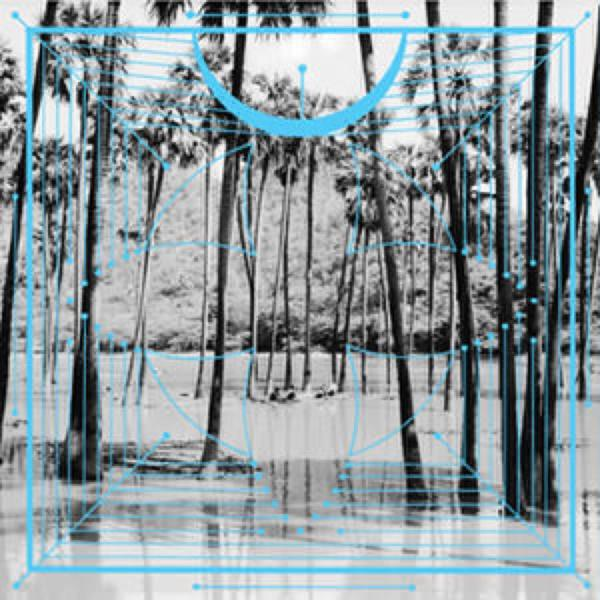
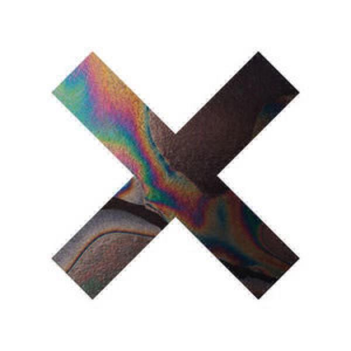
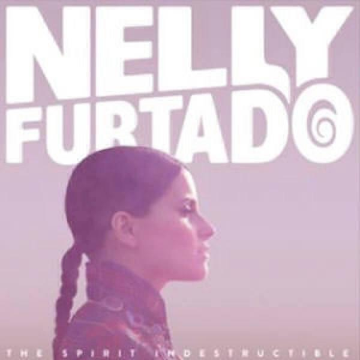
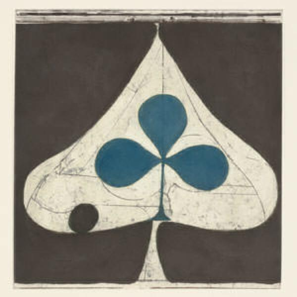

I had a bit more time to listen to this month’s albums because I was on holiday for two weeks. I didn’t manage to write about them while on holiday though! In fact I bought and listened to a few more, but I will save them for next month. The albums I will discuss now (in order bought) are:

1. Four Tet “Pink”
2. The xx “Coexist”
3. Nelly Furtado “The Spirit Indestructible”
4. Grizzly Bear “Shields”

It’s quite a diverse collection and, Four Tet apart, quite song based.

## Four Tet “Pink”

“Pink” is a collection of tracks that were self-released on vinyl throughout the last year. The first track “Locked” was featured on Four Tet’s fabriclive mix [that I wrote about in last Semptember’s album digest](album-digest-september-2011) (as was “Pyramid”), there it was the closing track in the mix and served to wind everything down. It is strange how well it also works as a build-up track, I haven’t checked to see if they are the same version but the one on “Pink” slowly builds, introducing various elements (including…) in turn.

“Lion” has a wonderfully spooky riff that looms into view at about 2:50 over an old school beat but it pretty much holds that structure until about 8:00 (with about 50 seconds to go) when the pulse of the track is lowered and some gentle chimes introduced. “Lion” definitely strikes me as one side of a twelve inch, it’s structure is one of getting into a groove and holding that for a fixed period – either until the chimes or until something is dropped into the mix.

Perhaps it is foreknowledge of how this album came to exist but compared to “There Is Love In You”, “Pink” definitely feels like a collection of discrete entities. Most of the tracks here could stand alone, but I couldn’t imagine listening to “Love Cry” without also hearing “Sing” or “Angel Echoes” in the same fifty or so minutes. Here you have those floor-oriented tracks but there are also tracks like “Jupiters”, which, despite being one of the shortest tracks, features about three movements in just under six minutes.

“Ocoras” is another short and simple track, while “128 Harps” doesn’t seem to feature 128 harps but does seem to feature the main riff of “Moon”, the opening track from Bjork’s “Biophilia”[^1]. It also has some nice texture and a weird sampled vocal loop, one of those that seems to blur into swearwords as it is repeated over and over.

I don’t really remember where “Pyramid” slots into Four Tet’s fabric mix but I do remember the vocal loop. I think we can count it as one of the set-building tracks here. After that comes “Peace For Earth”, the longest and most satisfying track on “Pink”. It is quite slow and ambient throughout, at points it resembles something from [Brian Eno and Howard Budd’s “Ambient 2: The Plateaux Of Mirror”](uc16). Elsewhere (around the 5:00 mark) it picks up the pace a little and could be said to resemble “Sing” (a sort of slowed-down, weirder, cousin) from the previous album, especially the longer edit that appeared on the single.

“Pink” rounds out with “Pinnacles”, which plays out in style of “Locked” and “Lion” but is perhaps a little more interesting because it features elements that are closer to something song-based. I’m not describing what I mean very well!

## The xx “Coexist”

“Coexist” is the second album by The xx and much like the first one, it’s quite slight and evasive. Every song is short and fleeting, many are similar to one another, giving the impression of a thirty five minute suite of songs that are facets of one larger whole. That said, this album does throw in some spikier bits than the previous one (though admittedly that would not be that hard).

I think that the first track “Angels” is beautiful and I was blown away when I heard it in advance of the album. In many ways it is even _sparer_ than most of the songs on “Xx” and it weaves into that time between sunset and streetlights, a perfect song for dusk. Sadly, it’s the high point of an album that’s interesting as an experiment but not really that great as a bunch of songs.

“Fiction” has a nice pulse to it (the whole album is “nice”), but the chiming guitar riff that runs through it and the previous song “Chained” are like echoes of “Angels” so the first three tracks all feel like different parts of one whole.

Meanwhile “Try” has this weird slowed-down siren of a riff but that’s really the only thing that sets it apart from “Angels”, “Chained” and “Fiction”. This seems to be the problem with the album. On the first album, songs like “VCR” and “Islands” stood out from the rest of the songs on the album and also seemed to be about _different things_, whereas “Coexist” is a bunch of songs that basically do just that… they coexist, layering over the top of one another and all moping about a point of indeterminacy in a relationship.

If you have “Coexist” on in the background for it’s thirty five minute runtime, you’ll lift your head once or twice to pay attention and that’s it. Unfortunately it’s boring enough to work to (how do you think I got all this website organised on my holiday?!) but too boring to fall asleep to.

## Nelly Furtado “The Spirit Indestructible”

Fortunately, a Nelly Furtado album is never boring. “The Spirt Indestructible” might be a bit lowest common denominator in parts and extra-cheesy in others, but it knows where your pleasure centres are and determinedly attempts to tap them repeatedly over its twelve song core[^2]. It is largely successful in doing so.

In general, the songs are better than they were on “Loose” and once again they can be divided into broad groups: relentlessly positive (the title track, “High-Life”, “Bucket List”, “Enemy”, “Believers (Arab Spring)”), hip-hop dalliances (“High Life”, “Something”), ill-advised sexual braggadocio (thankfully restricted to just “Hoops (The Bigger The Better)” this time), party tunes (“Parking Lot”, “Waiting For The Night”) and keening love songs (“The Most Beautiful Thing”, “Circles”).

That classification might make “The Spirit Indestructible” look like a bit of a mess and on the first few listens it is, a chaotic jumble of styles that very much confirms [the rumours that it was repeatedly put back by the record company](http://www.contactmusic.com/news/nelly-furtado-album-delayed_1329454) because they had no idea how to sell it. However, after a few listens it begins to knit together really well (despite the fact that [much like her still-best album “Folklore”](uc20) it does sag a bit at the end) because there are tracks that span several of the categories. For example, the title track also has a party bit in it even if it is a shame that the lyrics to the middle 8 are just the repetition of “AEIOU” (well I did say it was lowest common denominator in parts).

NAS throws in a rather perfunctory rap and steals the limelight on “Something” (nice Terminator reference though), which would otherwise be a rather sweet and understated song about love and trust (Hook: “I want to give you something / I know how to make something out of nothing”). However, on “High Life” the rap verses really add to the song and transform it into something bigger.

I was quite impressed with “Parking Lot”. It might sound like M.I.A. (uncannily so) but smoothed down and made “chart friendly” (whatever that means now that the charts mean virtually nothing), but there’s a nice spark to it – and there’s no way that M.I.A. could squeeze in the deliriously demented doowop bit at the end either. (Also, M.I.A’s third album was terrible – so we should be grateful for mainstream clones.)

I won’t carry on and tell you about every song, but I should mention “Circles” because for ages I completely ignored it. It’s tucked away deep in the album’s weaker second half and while it is rather understated, it’s a lovely little love song that deserves your attention. Nelly actually does these really well, I guess that’s why quite a few people pine for another album like “Folklore”[^3].

To finish up, this a great little mainstream album that will cheer you up if you are down and is great in the mornings for getting you pepped up for the day ahead.

## Grizzly Bear “Shields”

“Shields” strikes me as being similar to “Life’s Rich Pageant” by R.E.M., not so much in terms of sound but in terms of marking a point where a band suddenly clicks, realises its strengths, and decides to play to all of them at once. Another similar comparison might be “OK Computer” by Radiohead, where that band not only delivered the songs but also a coherent aesthetic to go with them. I think “Shields” is a fantastic album, full of stunning songs all wrapped up in a gorgeous sound world that is at once both familiar and totally unique.

“Sleeping Ute” is apparently the sole surviving song from an initial recording session for this album and it still has the air of “Veckatimest” hanging around its shoulders. When “Speak In Rounds” kicks in, the difference is obvious – the two singers’ voices are much more confident and the pace of the song turns on a sixpence thanks to the fantastic playing of the band. Previously Grizzly Bear songs shimmered and simmered but “Speak In Rounds” just leaps out of the speakers and sounds like it has always existed, has always been a classic.

Everything on “Shields”” sounds purposeful and engaged, even the hallucinatory little instrumental “Adelma”. Right from the first line of “Yet Again” a story is being told, whereas on previous albums songs like “Dory” (nudge, nudge, wink, wink) and “Two Weeks” seemed to just hover and be impressionistic. Going back to the R.E.M. comparison that I started with, early tracks like “Laughing” and “Harborcoat” are among my favourite songs but more for mood than meaning, whereas something later like “Welcome To The Occupation” is much more engaged with the world.

The sense of atmosphere and place has not been abandoned though, the squally outro to “Yet Again” and the dense sonics of “The Hunt” (not to mention the more familiar vocal) capably show that. It’s just that now a sense of engagement and spirit now courses through the band’s playing. The lyrics are better too, I looked them up on the internet and the nature of the singing means that there are still liberal “???”’s strewn throughout people’s transcriptions but as I listened closely and filled in the gaps, I fell deeper in love with these songs. Check out the lyrics to “A Simple Answer”, they’re excellent. The last time I remember being so deliberately engaged with a band’s lyrics was with those on “Alligator” by The National[^4].

I’d write more but all the songs are quite dense and so I need to listen to them a lit more to fully get to grips with them. I guess that is a hearty recommendation in itself but let’s be completely unequivocal: “Shields” is thoroughly recommended as one of the best albums of the year so far.

---

[^1]: I’ve been collecting the singles in the Biophilia remix series ([which seems to be on hiatus at the moment](http://bjork.com/#/news/remixseries8announcement)) and there hasn’t been a mix of “Moon” so far. I will take “128 Harps” to be a _de facto_ remix of it if another does not appear on volume 8.
[^2]: I say “twelve song core” as this is an album more benighted by the horrible phenomenon of bonus tracks than any other I have come across in quite a while. My pre-order version has two extra tracks but there is also a version with a bonus disc (of some rather warmed over sub-B-side tracks judging by a quick play on Spotify) and additional bonus tracks specific to different retailers (to be fair these are just different remixes of the lead single “Hoops”) and then other songs specific to Germany and Japan.
[^3]: Yes, another niche online community that I belong to!
[^4]: This was mainly to check that I really did hear the lines “It’s a common fetish for a doting man / to ballerina on the coffee table cock in hand” in “Karen”.