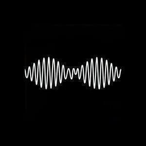

A nice diverse selection of albums this month:

1. Arctic Monkeys "AM"
2. BT "A Song Across Wires"
3. Goldfrapp "Tales of Us"
4. Janelle Monáe "Electric Lady"

## Arctic Monkeys "AM"

This whole review is basically me catching up with the rest of the world and realising that the Arctic Monkeys are ace. To be fair, I did notice how awesome they were at the opening ceremony of the Olympics last year, and I have liked the odd one or two of their singles, but up until now I haven't really wanted to listen to any of their albums. In fact before "AM", I already had two (ripped from the CDs of friends) but had never bothered to listen to them.

Olympics aside, their performance at Glastonbury earlier this year was what made me decide to investigate "AM". It was rightly given a nice big slot on the BBC iPlayer and I spent an enjoyable morning in my bedroom dancing to it. Because I don't know many of their songs, I didn't know at the time that their set included a number of the new songs (of course it would, it's totally logical in hindsight!) but after watching it I was determined to investigate the new album when it emerged.

It's brilliant. It ticks pretty much all my boxes for what a good album should be:
1. Short. It's 42 minutes long.
2. Consistent.
3. Has songs that work well as stories.

There is no real need for me to go through song by song and say what they're about, a couple of my favourites should suffice. I will mention that there is, unfortunately, one duffer: "Mad Sounds". It has lyrics like a Britpop B-side and sounds like a filler song from a U2 album (and not one of the good ones). Even then it's not completely awful but I do skip it more often than not (plus side: the album's even shorter!).

So faves then: "Why'd You Only Call Me When You're High?", mainly for the title but also for the backing which actually manages to make good on the comments they've made in interviews about making songs that sound like 50 Cent and Dr. Dre; "Arabella", probably the most exuberant song I have heard all year and the way that such cool ideas are hung across lyrics that are pretty much tongue-twisters is quite satisfactory; "Knee Socks" - Martin Buber says that "an anecdote is the recital of an incident that illuminates an entire destiny" and it was never more true than with this song; and finally "I Wanna Be Yours" as it manages to be super cute and laugh out loud funny at the same time.

I should really go through and pick out some of the really funny and really clever lyrics but if I did that I would be here all day! Highly recommended.

## BT "A Song Across Wires"

This new album from BT follows the now established pattern for his releases: a slow almost ambient album followed by a more song-based album, so following [last year's woozy "If The Stars Are Eternal So Are You and I"](album-digest-july-2012) we have the collaboration and song filled "A Song Across Wires". Like the last BT album with songs "These Hopeful Machines" it's being released in multiple versions at once: on the double CD release, one CD of short versions of the tracks and a second CD with the album's tracks mixed into one continuous track using the longer versions of the songs. Both these versions are also on Spotify and the short version of the album on iTunes includes the continuous mix.

Of course, I'm nothing if not a stickler for trying to get hold of everything (viz [the Ricardo Villalobos album last year](album-digest-october-2012)) and so I went for the full length versions, which are (currently) only available from Beatport. It's annoying to have to sign up for yet another site but in fairness the album in one download was cheaper than the short versions from iTunes. Unfortunately, getting hold of the longer versions is a necessity. While the songs on "These Hopeful Machines" (released as "These Humble Machines") worked really well as five or six-minute pieces, the short versions of the songs on "A Song Across Wires" are almost like jingles reduced to little over three minutes. In some cases the full song seems to have completely different personality to the edit.

From this point I will only discuss the long versions. As usual there are a few instrumental tracks and the best of these is "Skylarking", which opens the album. It's a beautiful lilting trance tune that's probably the first he's written in quite a while that bears comparison with career highlights like "Flaming June". The other two "Tomahawk" (an old tune that's been around for ages now, it is the track that probably benefits the most from hearing the long version) and "Vervoeren" are less successful to my ears, and none of the three quite have the wonderful bone-juddering qualities of THM highlight "Nocturne et Lumiere".

You can split the songs between those with actual lyrics, like "Stem The Tides" and "Surrounded", and those that tend to use vocals as additional wallpaper, like "Letting Go" (Key lyrics: "Letting go/letting go/letting go go go") and "Calling Your Name". Obviously the former are slightly more satisfying, especially "Stem The Tides" and the closer "Lifeline". Meanwhile I also really like "City Life" though the lyrics are in Korean so I can't understand them; I'm cool with that and I think this is the first bit of K-Pop to make it into my music collection.

"A Song Across Wires" is pretty good, though if pushed I'd prefer "These Hopeful Machines" or the UK version of "Movement In Still Life". I guess I'm old school.

## Goldfrapp "Tales of Us"

I can't think of any other band that does what Goldfrapp does so well and that is to switch between two poles with each album, so every album feels different but when you compare that album to others like it they sound like gentle iterations on one another. In one cluster you have "Black Cherry", "Supernature" and 2010's "Head First": generally upbeat sexy party music; and in the other cluster you have début album "Felt Mountain", "The Seventh Tree" and now "Tales of Us". Last year's singles collection was also surprisingly cohesive. Tellingly, the new songs on that release would work pretty well on "Tales Of Us".

The other thing about Goldfrapp that is said less often (and this may be because it is my opinion and not so much an empirical fact) is how much Alison Goldfrapp's voice has improved with time. She has always had a really good way with a tune, which is why she is on so many great albums that I loved in my teens (highlights are her contributions to Tricky's "Pumpkin" off "Maxinequaye" and to "Sad But True" off Orbital's "Snivilisation") but here her voice just sounds gorgeous. It helps that the backing this time around is very stripped back and bare, save for the sweeps of strings, and if this is making you think of "Felt Mountain", you'd be right. It could almost be "Return To Felt Mountain: Even Feltier" but this time around there are real songs with proper lyrics that you can make out and everything. No guff about fascist babies this time.

However, there's no "Oompa Radar" either, and everything is played very straight. Apart from the string arrangements, there's almost no instrumental clutter: no beats, no wubs, not even so much as a funky synth wash. The focus is entirely on the songs. In some places it's over earnest like a comedian playing a serious role, but in the main it's very satisfying and pretty. It's not compelling all the way through, when I listen in the daytime my mind does wander in the middle before the final brace of songs pulls me back, and if I listen to it at night I fall asleep. (Recall that I have said many times in my reviews that an album that consistently sends you to sleep is a very useful to have.) Nevertheless the first five songs and the last two definitely suggest that there is plenty of life in Goldfrapp yet. If they stick to type, the next one will be all glitter and disco balls and white horses, but maybe they won't, maybe they will succumb to senescence and if "Tales of Us" proves anything, it's that there will be no nicer place for Goldfrapp to graze out their dotage than on the foothills of Felt mountain.

## Janelle Monáe "Electric Lady"

Every month I give something different a try and sometimes I get a nice surprise. This month it was Janelle Monáe's "Electric Lady". I first encountered her on "Stargate Universe" and thought at the time that her record company must have had high expectations for her to shoehorn her into the show the way they did (and here we are, she's outlived that series many-to-one). Apparently, this album is part of a sequence with an overarching story about sentient robots etc but apart from the skits it doesn't seem to intrude into the music that much. It is great to see science fiction themes in (relatively) mainstream music though.

It's not a perfect album (it has skits for a start, even if they are pretty funny) because it is a bit too long and could do with being a bit more focussed in places - it gets a bit baggy toward the end. However the good definitely outweighs the bad and there are some great pop songs here, especially if you happen to like your pop songs with an R&B sheen. "Dance Apocalyptic" is one of the best pop songs in ages, I liked the sappy duet "Prime Time" with Miguel more than I thought I would (is it me or is he on everyone's records at the moment?) and "What An Experience" is a fine song to end the album on (and perhaps the only song that I would have liked to have been a little longer.)

I think I will check out her other albums on Spotify before I have to suspend my subscription while I am away. I will certainly miss the chance to take a random punt on albums each month because nice surprises like this make it all so much fun.

## Next month

The CHVRCHES album, which I have already been playing the hell out of, the HAIM album (to keep up the run of all capitals band names), and something else that I haven't decided on yet. And maybe Disclosure's "Settle" because I'm supposed to have written about that ages ago...
