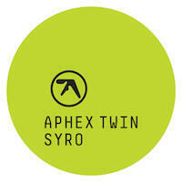

Album Digest September 2014 contains four amazing albums, including the long-awaited return from the Aphex Twin, and an album from Cymbals Eat Guitars released about a week after I wondered what had happened to them. Spooky. Rounding out the selection this month are a cool punky-disco album by The Juan Maclean and a truly remarkable offering by Vessel.

## Aphex Twin *SYRO*

*SYRO* is the sixth album by Aphex Twin and his first official Aphex Twin release since Drukqs in 2001[^1]. Announced with a typically cryptic track listing at a month's notice via the dark web, along with artwork that resembles a tax receipt for the costs of releasing the album, his anarchic streak appears intact. Therefore the most suprising thing about SYRO is just how conventional it sounds on first listen.

The reason SYRO feels a bit subdued to begin is because the tracks are pretty mellow and evenly paced. Unlike Drukqs, which veered between beautiful prepared piano pieces and full-on drill'n'bass madness, this album harks back to earlier efforts like Richard D. James Album (RDJ) and I Care Because You Do (ICBYD). The eerie voices on minipops 67 \[120.2\]\[source-field mix\] hark back to the creepy childsongs on To Cure A Weakling Child, while XMAS_EVET10 \[120\]\[thanaton3 mix\] would sit nicely on either of the Selected Ambient Works albums. The next track produk 29 [101] even throws in the odd incongruous swear to its weird melted take on musak, but this too is nothing new: you can find it in Cock/ver10 off Drukqs and Come On You Slags off ICBYD. The impression you get is one of comfortable craft and of laurels being rested on. 

That's not to say that SYRO is a complete time warp back to the 90's. 180db_ [130] has something of a 2-step shuffle to it, while CIRCLONT6A \[141.98\]\[syrobonkus mix\] updates the Aphex Acid template in a manner so confident and sleek that it can only have been made this century. It's so crowdpleasing that it has an almost Daft Punk feel to it[^2] and it's not the only one, syro u473t8+e \[141.98\]\[piezoluminescence mix\] also sounds like the overrated French funkers. The other CIRCLONT track, CIRCLONT14 \[152.97\]\[shrymoming mix\], manages to marry breakbeats with those burbling acid synths more successfully than on any of his previous tracks. The innovative aspect of SYRO is how amazing and together everything sounds, as though it were pay-off for all those experimental and abrasive albums we endured in the 90s.

Of course, there are other theories. Richard D. James' most revered work is now almost a quarter of a century old, and most audiences aren't that far behind the curve (nor are that many artists that far ahead of it). There are teenagers alive now who will listen to SYRO and consider it to be a throwback, kids that think Selected Ambient Works, Vol. 2 sounds like classical music[^3]. SYRO feels like the distillation of his previous work into one joyous album. It is enjoyable to listen to because it feels *made* rather than generated and it's weird for that to feel disappointing, because it really shouldn't be. He claims to have recorded vast amounts of material over the last thirteen years, so perhaps there are still uncharted territories for him to cover. Perhaps these are the only gems that remain after scouring the mines. Perhaps Warp Records really need the money and there are five more very similar sounding Aphex records to follow over the next few years. In any case, the joy comes from the music rather than knowing what comes next.

## Cymbals Eat Guitars *Lose*

Cymbals Eat Guitars are a four-piece indie rock band from Staten Island, New York. Lose is their third album since their debut Why There Are Mountains was released back in 2009.

I should have written about their second album Lenses Alien three years ago but I got caught up writing about a bundle of electronica albums that I'd bought instead. A shame, because Lenses Alien is a fantastic record. It's a bit complex though and the band admit in interviews that it's difficult to play live, which partly explains why Lose is a ton more accessible. 

Personal events for the band have also lead to the songs being darker and more autographical than before. The increase in emotional investment in the lyrics is an interesting counterweight to the simplification of the songs. For instance, musically the opening song Jackson is triumphant: all cooing backing vocals and soaring guitars, but lyrically it talks about a friend messed up by drugs. This continues on Warning with lyrics you're looking mightily ghostly / like Bowie on Soul Train and the shape of true love is terrifying over a Springsteen-esque rock out.

Elsewhere the lyrics win out over the songs. Child Bride has a lyric about an abused school friend who later turns up to a gig with a girlfriend who has got her into crack. What's awful is that if it's true then it's a heartbreaking tale of how a life changes in an instant that the narrator witnesses, and even if it's not true, you just know that it could be true for *someone*, that things like this happen all the time, and that's just impossibly sad. And the sing-song chorus captures something almost as bad, the feeling of guilt that comes from knowing you were there at the moment when things changed (not just the narrator of the song, you, me, everyone - we all have these moments in our lives) and this is what eats up our twenties, what causes us to lose our twenties, the regret for the ones who didn't make it. We might not end up loaded all the time, but we'll be dodging it in some way too. How will this ever change? I don't know, you don't know, and neither do the people in these songs.

So Lose ends up being this lyrically dark album that is punched through with the light that music provides. It's strong and meaningful stuff. It reminds me a lot of The Wrens (who are mentioned in the lyrics) and their album The Meadowlands, which was about getting to thirty and still not understanding what you're supposed to be doing. Lose is a sort of prequel to that. At the end of your twenties you have a mythology of your life built from your experiences and mistakes, by then you have found the thing you need to get you through the dark. Most people are lucky and find that it's a particular person, or a job, or their children. Others are not so lucky and face entering their thirties with an all-too-pernicious means of dealing with their dread at what is to come. Those people, and I counted myself among them, often feel as though they are about to fail. Lose captures that feeling but also provides a salve: with tunes this good at your back, no matter how sad, how could you lose?

## The Juan Maclean *In A Dream*

The Juan Maclean are a band on the DFA label consisting of John Maclean and Nancy Whang. Nancy was in LCD Soundsystem too. In A Dream is the third studio album by The Juan Maclean, if you exclude things like mix albums. I meant to review it last month but it only recently appeared on Spotify.

It's a jolly and upbeat album. The opening track Space Is The Place sounds exactly how I'd imagined it would, like a cross between New Order and Giorgo Moroder's soundtrack to The Neverending Story. It only gets going when Nancy's vocals kick in and through the whole album I prefer the songs where Nancy's voice runs the show[^4]. Fortunately that's most of them.

Second track Here I Am sounds a bit like a Pet Shop Boys remix from 20 years ago and I mean that in the best possible way. It would be better if it was more than just a chorus but it's fun and upbeat. Everything else glides by too: a glib bass riff that could be lifted from Run 2 or Round &amp; Round by New Order illuminates the gentle and insistent Love Stops Here (at about 3:40 in); the gentle attempts to understand a shy lover on You Were A Runaway underpinned with a disco beat; and the delightful relationship tongue twisters of I've Waited So Long backed by 80s beats that evoke shoulder pads and city skylines at night[^5]. These songs all drift by supported with the galaxial twinkle of synth, house beats, and vocal coos. It is pop music with a dance twist.

I often write about how albums are front loaded with the best songs but on In A Dream The Juan Maclean save the two best songs for last. A Simple Design pits a witty verse-chorus-verse lyric to a similar dance-pop design as the rest of the album, while The Sun Will Never Set On Our Love is a remarkable ten minute song that seems to rush by in three or four. It ends with a repeated mantra of send it in a rocket ship / send it out to space / racing past the stratosphere / we'll leave without a trace which ties the album back to where it started.

In A Dream isn't as cool as the LCD Soundsystem albums but is just as fun and wears its influences transparently and well. It's entertaining and I will certainly keep on listening to it. 

## Vessel *Punish, Honey*

Vessel is the *nom de vacarme* of Bristol-based musician Sebastian Gainsborough. Punish, Honey is his second album. I haven't listened to the other one yet. It is allegedly constructed from homemade instruments, though I haven't been able to find out whether these were electronic instruments, or acoustic instruments that were then sampled and used as found sound[^6]. Whichever way around, and even if this weren't the case, Punish, Honey is still a remarkable album.

It begins inauspiciously with Febrile that sounds exactly how detractors of electronic music sourced from found sound might imagine. It's a couple of crashes of metal and then some drill-like and siren-like noises. It's pretentious and unnecessary, but it serves well as a pallette cleanser for what follows.

Red Sex is my favourite piece of music I've heard so far this year. It's a driving throbbing relentless piece - all brute and yet also all machine - with an incredible sawing high pitch riff caterwauling over the top. You can almost sing along, so long as you are confident that whining EE OO EE-OO EE-OO-OO-OO EE-OO as you walk down the street isn't going to get you sectioned.

Drowned In Water and Light is all drama and darkness, perfectly controlled and poised throughout. Euoi is perhaps the only track I don't absoloutely love, but there's a busyness beneath the dissonance that I am starting to appreciate as I listen to the album over and over. Then, just when you think the album is all thumps and slams, dissonance and pain, a huge melody breaks out on Anima which gives things a real shot in the arm half way through. It's not quite as good as Red Sex but it stops the album from becoming too self-absorbed. The next track Black Leaves and Dead Branches is a slow spooky track built around what sounds like a (presumably homemade) dub melodica.

Punish, Honey is not the easiest listen but it's far more accessible than I was expecting (or than Febrile lets on). It's dark and fun. Think Fuck Buttons with a few more rough edges. It seems more innovative than the Aphex Twin album, which perhaps emphasises my point about where new music is now, but Aphex's music is as much the start point for this album as it is for SYRO. Perhaps that doesn't matter, what's more important is that there are fantastic albums like this out there. Give it a go, you might be surprised at how much you like it.

---

[^1]: Warp Records released Chosen Lords, a compilation of tracks from his Analord series of vinyl releases, in 2005. Most tracks on it are credited to the transparent AFX [alias](https://bleep.com/stream/aphex-aliases). He has also released several tracks credited to The Tuss while he's been 'away'.
[^2]: Thankfully Aphex Twin isn't *that* lowest common denominator.
[^3]: Perhaps it is!
[^4]: I also love her contributions to the LCD Soundsystem albums.
[^5]: Not to mention a great bit of Vocoder work that Kraftwerk would be proud of.
[^6]: After several listens I'd settled on the latter, but I still don't know for certain.