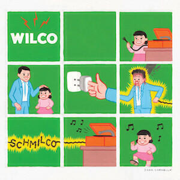
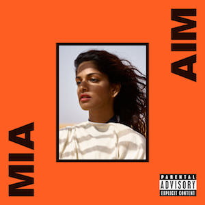

This month's album digest features albums by Wilco, M.I.A., Local Natives, and a collaboration between Kaitlyn Aurelia Smith and Suzanne Ciani.

### Wilco *Schmilco*

*Schmilco* is the tenth studio album by Wilco, which regular readers will know are one of my favourite bands. [There's no need to repeat that anecdote about why this blog has the name that it does.](/whatever-happened-to-that-hat/) Meanwhile, this album follows on from last year's *Star Wars* and is probably the third Wilco album to have a jokey meta- kind of title. (The other one is the rather splendid *Wilco (The Album)* from 2009.) I didn't write a review of *Star Wars*; it  was released for free and for some reason it passed me by. *Schmilco* is a fairly similar album and that's not a bad thing.

It's a short album containing songs that are mostly acoustic, though there are some that stand out because they diverge from that formula. I'd say a fairly typical song would be *If I Ever Was A Child*, which trills along nicely for three minutes. It revists the territory of *A Ghost Is Born* with allusions to migraines, albeit it does so in a brief and throwaway lines. It's a fairly mysterious song which makes the simple arrangement feel clever, as though there is some hidden depth. I need to listen to it some more to be sure whether or not there actually is.

Another standout track is *Common Sense*, a song that has another crack at Krautrock. This time instead of focusing on Neu!-like motorik stylings as per *Spiders (Kidsmoke)* they deliver a clattering clanging loose-limbed jam that I recognised  as being like CAN. It has a similar feel to many of the more song-like demos on [CAN's (not-so) recent box set](/can-the-lost-tapes/).

I also quite like *Locator*, a song that could be about drones and/or being tracked by Google. It's effortless and wry. Even better, it doesn't overstay its welcome. It begins to fade out almost as soon as it reveals what it's all about. That's also true of the whole album, which is a brief and jangly affair that doesn't stick around too long. A bit like when a cool friend comes to visit. Hopefully they'll be back again soon.

### M.I.A. *AIM*

Forgive me if I write M.I.A. as MIA from now on. *AIM* is her fifth album. I love her first two albums *Arular* and *Kala* deeply, but found her third to be pretentious and annoying. I managed to miss out on her fourth album *Matangi*, I think because it was released while I was in South America. (Even if I ended up with more data access over there than I thought, I didn't really think that maintaining Spotify access would be possible).

So I don't know what *Matangi* is like but I do know that *AIM* is frustrating. It's not bad in the way that the third album was bad (I'm avoiding the awkward typography of its title), it's just frustrating. I think there are songs that MIA wasn't confident in that would have been better given more care and attention. I think there are others that aren't that good but that maybe she thinks are pretty good. There are also some decent songs and  good ideas.

Let's start with the good stuff. The opening track *Borders* is great and probably just how you'd expect MIA to sound in 2016. There's a song called *Ali R U OK?* that's funny and witty, but which also has a darker point to discuss. *AMP* delivers a positive feminist message with both strength and humour. I think she's as relevant as she ever was.

She's still clever and innovative too. *Jump In* shows her inventiveness hasn't dimmed. On *Kala* she used technology to emphasise and accentuate her samples and ideas, hooking it up to great tunes. Here the songwriting has abandoned her a bit but the self-sampling and looping provide a weird and weary air to the tune. This is why I wonder if the malaise of *AIM* is grounded in a lack of confidence: I think that ten years ago she would have saved the idea for a better song. I know that this is conjecture and nitpicking on my part but that's why we have to discuss the poorer songs too.

*Bird Song* straddles the good and the bad aspects of the album. There's a great sample but the underlying idea is underdeveloped. There's potential, but it just descends into a bad joke rather than make a valid point. Two mixes of it don't help to shake the half-assed feel of it either. If that won't do, will this? I like it enough for it to make my playlists but it feels as though it could and should have been so much better.

The rest of the album is mostly dull rather than awful. I'd never imagined a MIA record would ever be boring back when I was so enjoying *Arular* and *Kala* so much. For example, *Freedun* (featuring Zayn Malik formerly of One Direction) is a total snoozefest. Apparently it was written over Whatsapp and that doesn't surprise me. *Foreign Friend* is almost witty but it is dragged down by an awful vocal from Dexta Daps. *Finally* is so denched in autotune as to be pointless: the whole point of her previous records was not hiding behind studio tricks, she always articulated herself with her own voice.

In the end, in a pun that writes itself, *AIM* as an album seems aimless. All is not entirely lost but perhaps like Tricky (another artist lost to wilfulness and misdirection) she's now doomed to echoing past glories with diminishing returns. I hope that's not the case.

### Local Natives *Sunlit Youth*

On my first few listens I was very excited by *Sunlit Youth*. I was amazed that I'd never heard of them before. After a few more listens I feel more that this is a solid album with a couple of big-hitting singles. It gets major bonus points for featuring Nina Persson of the Cardigans (Second [understated classics klaxon](/understated-classics-25-long-gone-before-daylight-cardigans/) of the month) and for featuring lyrics about a chrome palace (especially given the first [Wilco-related understated classics klaxon](/uc-27-a-ghost-is-born-wilco/)).

The song with the Chrome palace lyric is *Villainy* and is probably the song that's embedded itself most into my head this year. I fell in love with its video, which cleverly subverts the lyric video. They're a band that's clearly in love with their own lyrics but not without reason, I find them to be enjoyable to read. They also make good videos, or rather they know a good video treatment when they see one. The video for *Wide Eyes* - a song from their first album *Gorilla Manor* - is one of the best I've seen in years. I've embedded it below, because it's excellent.

<iframe width="560" height="315" src="https://www.youtube.com/embed/NmefFcRJbXE" frameborder="0" allowfullscreen></iframe>

I will be checking out all their previous albums. Because one of them was produced by a member of The National (another of my favourite bands), I was expecting Local Natives to have a certain depth. As it turns out - on *Sunlit Youth* at least - they have more earnestness than depth. For example *Fountain of Youth* could just be incredibly earnest ("We can do whatever we want / we can say whatever we mean") or be satirising overearnestness - it's hard to tell.

Elsewhere it doesn't really matter what their intentions are. *Masters* has an intensity that drives it along not to mention an interesting squiggly bass line. *Mother Emanuel* has a killer chorus but gets right to the jugular from the first verse. It also has a bridge that sounds a bit like *Chopsticks*, which shouldn't work but does.

There are mis-steps too. I think that *Ellie Alice* is a bit boring but I can relate to the story of travelling through the channel tunnel while wasted from lack of sleep. *Sea of Years* tries to hard to close the album on something resembling a weepie, though I do like the drumming.
I will listen to Local Natives' other albums and will keep an ear out for any new material. From the earlier videos (like *Wide Eyes*) I wonder whether they peaked early. That'd be good for me as there'll be even better albums than *Sunlit Youth* for me to discover, but it also means that album number four could be even better too. Win win.

### Kaitlyn Aurelia Smith and Suzanne Ciani *Sunergy*

This album consists of two tracks and is thirty five minutes long, so it's more like a single. The Spotify version also has a bonus track that extends the album by another 18 minutes. I'll write mostly about the two main tracks.

So who are Kaitlyn Aurelia Smith and Suzanne Ciani?

[Kaitlyn Aurelia Smith](http://kaitlynaureliasmith.com) is an American composer who has already released an album this year. As a result of enjoying *Sunergy* so much, I will include her album *Ears* in next month's album digest. She has collaborated with Mark Pritchard ([review of *Under the Sun* here](/album-digest-may-2016/)) She's also made a remix of a piece from Max Richter's *Sleep* project, so I will track that down too. (This reminds me that I need to write about *Sleep* at some point too!)

[Suzanne Ciani](http://sevwave.com) is an American composer with a long career as a pioneer of electronic music. She's produced lots of commercial and soundtrack work, as well more established albums. Five of her albums have been nominated for Grammy awards.

The two women were brought together by their love of the [Buchla](http://buchla.com) synthesizer, which is what I presume is what noodles over the two (or three) tracks on *Sunergy*. It's beautiful generative music that deserves to languidly spread over tens of minutes at a time in the way that it does. In many ways it reminds me of [Laurie Spiegel's work](/album-digest-october-2012/), though I think that was made on custom-made synths and computers rather than on a particular synthesizer.

Anyway, these two (three) tracks deserve your attention. The short track list makes for a quick review. *A New Day* fizzes and meanders with all the promise of a dawning morning. *Closed Circuit* is a little more lively, though it has a quiet intensity rather than an overt one. The electric riffs roil in tight curls before peeling off and over one another. It's music with both motion and stillness. The "bonus" track *Retrograde* is more animated. Though also constructed on the great whooshes of the Buchla synth, there are also moments where the intensity rises to almost noisy electronic roar, with cataracts of melodies crashing between the ears and notes that teeter on top of one another clamouring into the mix. It's thrilling stuff, especially if you sometimes like to think of music as a place to be rather than a means of getting there.
