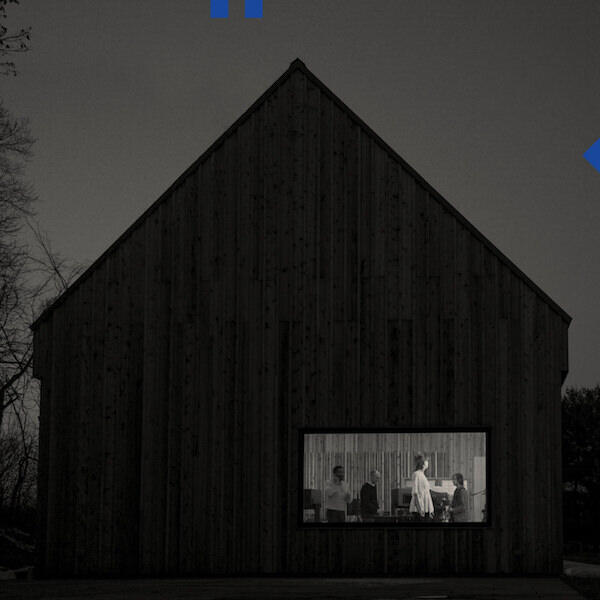

Note: Recent months have been very busy, so this album digest combines a review of the new album by The National with a couple of reviews left over from earlier in the year.

I've written a few more album reviews in the past months but I'm so far behind (February and March have already been published on a considerable lag) that I'm just going to pepper forthcoming digests with additional reviews of older albums.

## The National "Sleep Well Beast"

The National are one of my favourite bands. Up until this album, they would release a great album every two years. However four years have passed since 2013's "Trouble Will Find Me". Not that you would know it from the opening pair of "Nobody Else Will Be There" and "The Day I Die". The first is a slow burner, creeping in like "Terrible Love" on "High Violet" but without that song's eventual pyrotechnics. It's a song about wanting to get to a party early so that you can leave the party early. It seems as though The National have aged in the same way I have. On the other hand, "The Day I Die" is about as poppy as they've ever deigned to be. It's a simple and catchy song, and, as it it turns out, it's a palette cleanser for the more experimental fare to follow.

"Walk It Back" stretches three song fragments over six minutes. A twitchy riff and a detached vocal line (mostly just the title) dominate the opening minutes, before a spoken word and found footage collage takes over. The track closes with a beautiful instrumental interlude with another of The National's highly underrated string arrangements. "Walk It Back" also manages to bleed into lead single "The System Only Dreams In Total Darkness" without too much fuss. It's a mid-tempo song that descends into squally guitar riffs, it sounds National-like but without being cliché. You can say the same for "Born To Beg" in which a languid vocal lolls over an insistent yet delicate beat but in keeping with their new sound, it also gets a bit fuzzy in the middle.

Next up is "Turtleneck" which is the most raucous song The National have produced since "Mr November"[^1]. That song was about the disillusionment the band felt at the re-election of George W. Bush in 2004. You can guess who this one's about. It's a song of bitter disappointment rather than anger, full of pithy lines about politicians.

Following this there are three more beat-driven tracks. "Empire Line" is one of those songs that The National write effortlessly, a sort of cross between "Green Gloves" and "Fake Empire". It even has a touch of auto tune. "I'll Still Destroy You" is the best song on the album, with another drawn out ending like "Walk It Back" but this time with a clatter of drums and an epic string arrangement that somehow manages to cut through in between, like shafts of sunlight through clouds or overhead lights on the motorway. "Guilty Party" features perhaps the glitchiest musical backdrop and a lyric that reminds me of "Pink Rabbits" from "Trouble Will Find Me". It also reminds me of when I saw them live in 2007 and they did "About Today" (one my favourite songs ever), expanding it to over eight minutes with a crazy  drummer jam at the end of the lyric. I love how The National's amazing rhythm section makes tracks like these seem completely effortless. 

Afterwards there are two slightly more straightforward songs, "Carin at the Liquor Store" and "The Dark Side of the Gym". The former is another "Pink Rabbits" style ballad full of self-deprecation and word games. The latter initially sounds a bit like the opening of "Dark Side of the Moon" but it turns out that the title does indeed come out of the content of the lyrics - "I'm gonna keep you in love with me... for a while...". Once again, they deliver a completely new and modern kind of love song in the vein of "Mistaken For Strangers" or "Karen". 

The last track is the title track, which for me is the only disappointment. Another twitchy track that resembles "I'll Still Destroy You" but doesn't quite work for me. Perhaps it will given a bit more time. Tucked away as it is right at the end of the album, I haven't given it too much consideration so far. At the moment, it just feels like a weird bonus track or remix. Nevertheless "Sleep Well Beast" (the album) is well worth a listen and is full of songs that will sit well in any playlist of great songs by this band.

## Nelly Furtado "The Ride"

This new album from Nelly Furtado follows on from "The Spirit Indestructible" and "Mi Plan", both of which I liked. I noted in [my review of *The Spirit Indestructible*](album-digest-september-2012) that it was all over the shop. The only version of it on Spotify now is the deluxe edition, a hot mess that confuses quantity for quality. [*Mi Plan* was a nice tack back to 'proper' song writing](https://mattischrome.com/album-digest-january-2013/) but it wasn't successful enough to warrant a sustained change of direction.

I am a big fan of Nelly Furtado and her music. I think that "Whoah Nelly!" and "Folklore" are both really great albums, choosing the latter as [an understated classic](uc20). Each album differs a little from the last so she seems to grow with each step. She's also been judicious with her choice of collaborators. These have been distinctive enough for her to raise her game without overwhelming her identity. "The Ride" is self-released and features no collaborators save for a new producer, [John Congleton](https://en.wikipedia.org/wiki/John_Congleton), who has worked on albums by St. Vincent and Goldfrapp among many others.

I first listened to "The Ride" on headphones and hated it. The new production style is hostile to headphone listening. I found this a surprise because so much music is now geared toward headphone listening. Moreover, given that this album is meant to be a return to more personal song writing it seems silly to make it so awful to listen to on headphones. If you're aiming for intimacy and feeling, why layer the songs in such gimmicky and prickly production?[^2]

So the best thing about "The Ride" (and it's not much of a win) is that it doesn't quite sound as awful out loud. However, the songs themselves indicate that this album may be one reinvention too many. If you want a Doctor Who reference - and who doesn't? - this is her Colin Baker album. It has moments where the material transcends the presentation and it's not so awful as to suggest that future incarnations will be as bad.

Take "Cold Hard Truth" and "Pipe Dreams" for example. These are objectively great songs. In fact the former wears the new production so well that maybe this was what convinced Nelly to run with it. It's punchy and marries well with its subject matter. "Pipe Dreams" echoes "Explode" from "Folklore", telling the story from an older, more jaded, angle. Again the production doesn't wave around unnecessarily and there is also a wonderful spooky video to accompany the song on youtube.

The rest of the album is okay, provided you don't listen on headphones. The trouble is that none of it is going to set the world alight. That's a shame because she's been brave enough to self-release an album that *does* experiment and innovate. The problem is that some experiments do end in failure. This is one of those. The big question is what happens next? I hope she carries on regardless: grows a little, changes a bit and keeps on singing.

## Goldfrapp "Sliver Eye"

From one album to another, Goldfrapp slalom between sleepy pastoral idylls and futuristic sexy techno pop. On "Silver Eye" they once again make this transition, opting for a noisy bravura sound following the gentle strings and croons of [2013's "Tales of Us".](https://mattischrome.com/album-digest-september-2013/ "Album Digest September 2013, featuring a review of "Tales of Us" by Goldfrapp.") I said of the last album:

> ...if "Tales of Us" proves anything, it's that there will be no nicer place for Goldfrapp to graze out their dotage than on the foothills of Felt Mountain.

Well as it happens there's plenty more glitter balls and white horses in the band yet. *Silver Eye* is a mostly sparkly and stompy return to form. Unlike the last uptempo Goldfrapp album "Head First" which played things pretty straight, this album contains some songs that are downright peculiar and it's all the better for it. 

Lead single "Anymore" sticks to the template for Goldfrapp singles by songs like "Number 1" and "Ooh La La", though there's something squelchy low in the mix that gradually overtakes the song as it progresses. Joe Goddard's remix on the 12" is even better, it's very much the Dr. Hyde to the album version's Mr. Jekyll. On the album, the de facto title track "Systemagic" also succumbs to this transformation, it's a rollicking beast almost dripping with bass lines. It's a fissile song, one that's about ten seconds from corroding through your speakers. It's also insanely catchy, which always helps.

 "Tigerman" returns to "Felt Mountain"-type material, channelling "Lovely Head". It's also got these weird whooshy bits that seem to throw themselves around your speakers  and on headphones it produces a disorienting effect. 

In a first for Goldfrapp, "Become The One" is almost entirely spoken word. The lyric has a Laurie Andersen feel but also reminds me a little bit of "Happiness" and "Clowns" from "The Seventh Tree". This might be another track that responds well to remixes. "Faux Suede Drifter" pulses and drifts for five minutes, a weird little torch song. I love the way it picks up just after the three minute mark, it's very eighties - sounding a bit like the atmospheric bits of Whitney Houston's "I Wanna Dance With You".

"Zodiac Black" begins like a folk song, it could almost like a leftover from "Tales of Us" or a song that would have sat well on [JFDR's "Brazil" in March](https://mattischrome.com/album-digest-march-2017/ "March's album digest features a review of "Brazil" by JFDR."). I really like the way that the atmospherics hiss behind the lyrics like misty moonlight. Unfortunately, while the song always feels like a moment of catharsis is coming, what ultimately arrives is disappointing. The song doesn't really go anywhere. This seems to be a problem with the majority of the tracks on "Silver Tree": they're good but they don't really amount to much. In the end songs like "Moon in Your Mouth" and "Ocean" and the others already discussed sound like the more forgettable tracks that will be scraped for another greatest hits comp in a few years' time. I really wanted to like this album, but in the final analysis it's good but not great.

[^1]: Mr November is the first song I ever heard by The National. I was in Moles nightclub in Bath and I even went up to the DJ to ask what the song was. I bought a copy of "Alligator" that weekend and was hooked.
[^2]: The same approach was successful for St. Vincent on her self-titled album precisely because she was singing about the alienating experiences of our increasingly digital lifestyles.
