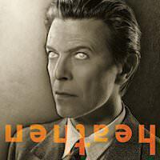

I thought I'd add three of my favourite David Bowie albums to my review of Blackstar to a form an album digest tribute. Also among my favourites but not included here is "Outside", which will be included in the understated classics (currently it's number 66) at some point. I thought about bumping "Outside" up the running order but I'd like to be objective about it when its turn comes.

### Station To Station

"It's not the side effects of the cocaine / I'm thinking it must be love" sings Bowie on the title track of his tenth studio album "Station To Station", released in 1976. But this album is most definitely almost entirely built on cocaine, from the weird Kabbalah channeling title track, to the smooth funk of "Golden Years" and on toward to the weepy conclusion of his cover of "Wild Is The Wind".

It's an album that Bowie claimed he couldn't remember making. Written and recorded in a period in which he was apparently living on red peppers and milk. And cocaine, lots of cocaine. He was working on the film "The Man Who Fell To Earth" and had become immersed in his character, Thomas Jerome Newton. It was Newton who would inform Bowie's then stage-persona The Thin White Duke: imagine a scary haunted skinny coke-addled Sinatra.

I think that it's testament to his songwriting skills that some of his of most interesting songs are on this album, written at a time of near breakdown. "Station To Station" itself twists and contorts through about four parts, some influenced by the Krautrock sounds that would help inform his next three albums, but also built on a traditional rock foundation. It doesn't feel like ten minutes at all. 

"Golden Years" is one of those great Bowie songs like "Fame", "Sound and Vision" and "Under Pressure" that make it so hard to pin down a list of your favourites. "TVC15" is probably the best song ever written about a television eating Iggy Pop's girlfriend. "Word on a wing" and "Stay" are both unusual due to their strident religious references but the former in particular just shows what an amazing writer he was: six minutes and not an ounce of extraneous material. 

### "Heroes"

Despite being ambitious and having long tracks, "Station To Station" always flies by when I listen to it. Another thoroughly enjoyable album that seems to stick around for just an instant is "Heroes", the second of the so-called Berlin trilogy. It was a hard toss-up to chose it over "Low" as "Low" contains my all-time favourite Bowie song "Sound and Vision" and an incredible suite of near-instrumentals on its second side.

"Heroes" is slightly more conventional than its two predecessors, but only just. Everyone knows the amazing title song. It's about a couple that meets each day to kiss in sight of the guards patrolling the Berlin wall. About how simple acts of love can make powerful and silent stands against tyranny. There are other pop masterpieces on "Heroes" like "Beauty and the Beast" and "V2 Schnieder" (a tribute to Kraftwerk's Florian Schneider), but the sound is mostly pretty bleak. 

"Blackout" has a wonderful atonal stomp to it and a vocal that may be unmatched in all of the rest of his work - spanning a shouty spoken word section, to the R&B sounds of "Young Americans" to that Bowie-est of Bowie-esque deliveries of the lines between "If you don't stay tonight" and "I will kiss you in the rain". Every time I am actively listening to "Heroes" I have to listen to this song two or three times consecutively. As we'll see when we come to "Blackstar", it's one of those Bowie songs that just stands completely out of time and place.

Elsewhere, "Sense of Doubt", "Moss Garden" and "Neukoln" replicate the eerie atmospherics of the second half of "Low". Though Bowie will be rightly remembered as a man often possessed by songs filled with frenetic energy, it's also worth remembering how much stillness and calm runs through other parts of his work. It's a side that is underappreciated.

### Heathen

"Heathen" should by all rights be a strange mish-mash of a record. It's three or four songs rescued from the abandoned 2001 album "Toy", two covers from "Pin-ups 2" that was shelved in the early 80s, and about four songs "informed by" the events of 9/11. Yet somehow, it's a convincing late peak - one of many if you include "The Next Day" and "Blackstar".

The opening track "Sunday" is a creepy shimmering track about a forgotten world full of chants and allusions to degredation and decay that only bursts into life in the last minute or so. It borrows much from those quiet moments on "Low" and "Heroes".

His cover of the Pixies' "Cactus" takes a bit of getting used to: he moves from emulating Black Francis in the first verse but by the end he's giving it the full Bowie treatment. Bands like the Pixies - outsiders driven on by the power their songs and the stories they have to tell - probably owe their existence to Bowie.

"Slip Away" and "Slow Burn" are both amazing songs that have been largely ignored even though they'd probably be lauded had they been on one of the albums he released prior to 1984.

I think "Everyone Says 'Hi'" is probably the first of the songs that Bowie started writing about knowing he would eventually have to stop writing songs. It just captures that hopeful dislocation of someone getting in touch after a long time apart. I remember hearing it on the radio on my birthday one year and it was wonderful. It's not a song with a profound artistic statement, in fact it's benign and domestic, but it has this innate storytelling quality to it. It just reaches for you from out of the speakers.

The album closes with "A Better Future" which has this brisk and beautiful little eight note riff underpinning the verses, and "Heathen (The Rays)" which revisits the subject matter of the opening track. Both have a downcast outlook, particularly "Heathen" where he asks "Have I stayed too long?" and realises "I can see it now / I can feel it die". The point here is that Bowie pretty much treated every album like it was his last, that's why they were usually so good. 

### Blackstar

The exceptional title track of Blackstar begins "In the villa of Ormen / Stands a solitary candle / In the centre of it all / Your eyes". If you Google "Ormen" or "villa of Ormen", you get nothing. Perhaps this is a reference so arcane and obscure that we'll never know what or where it is. But perhaps it's just an act, one built from words disguising of others: "the veil of performing". To me it seems like a song about seeing your pain reflected in the responses of others. The whole ten minutes are remarkable. 

When "Blackstar" was announced much was made of one PR chap saying that it sounded "pretty out there" and most people, confronted with that downright weird video for the title song, might have agreed. But it is in fact a pretty accessible album, especially when you consider what it says. Some people might find the free jazz noodling on "'Tis A Pity She Was A Whore" a bit much but it's a pretty song and the more I listen to it, the more I love the jazz parts. The version of "Sue (Or in a Season of Crime)" is shorter and less obscure than the one on last year's "Nothing Has Changed" compilation.

In between those jazzy tracks, we have "Lazarus", another song that will be better remembered for its video and the message seemingly encoded in its title. It is quite simply the best song of what we will no doubt call Bowie's all-too-short late era of "The Next Day" and "Blackstar". I don't think it's sentimental to say that. When I first heard it I thought about how there would one day be a day where we wouldn't hear new songs from Bowie ever again. I thought it might be quite soon, that he would soon retire for good. I just didn't expect it to be two days later. 

The last three songs are also excellent. I love the mixture of polari and nadsat (the slang from "A Clockwork Orange") even if it does encode the song to such an extent that you wonder if it means anything at all - but then does it have to? Does Jean Genie? It works well musically, I especially like that self-sample of "Where the fuck did Monday go?" and the rolling sinister synths that start to appear in the mix toward the end.

"Dollar Days" and "I Can't Give It All Away" both sum up his situation in ballad form. The former pokes fun at his place (or lack of it) in the establishment "If I never see the English evergreens I'm running to / It's nothing to me", while the latter explores the business of needing to write autobiographically after a lifetime of vowing not to do so: "Saying no but meaning yes / This is all I ever meant / That's the message that I sent". Both songs are heartfelt and they tap into that tranquil reflective side of Bowie's work that I highlighted earlier. It truly is a fitting farewell.
