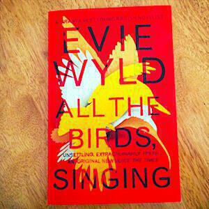

I recently finished reading _All The Birds, Singing_, the second novel by [Evie Wyld](http://www.eviewyld.com). It’s about a woman called Jake who lives alone on a farm with a dog called Dog on an island somewhere off the coast of Britain. She has sheep to look after but something keeps coming in the middle of the night to kill them.

Meanwhile, as the narrative on the island moves forward in the present, a second narrative peels off backwards to explain her past. This takes place in Australia. Jake is still working with sheep but there is a confrontation with a fellow farmhand who threatens to expose a secret from her past. As this second strand unfurls, we begin to see why Jake is jumpy and convinced that the deaths of her sheep represent ill-portent. However, because this second story rolls backwards in jumps, we have to wait until the end for the terrible events that set her on this path.

Wyld uses the two narratives to drive the plot and it does a good job at keeping you reading. The structure is one I’ve encountered before in Iain M. Banks’ _Use of Weapons_ where it is used to devastating effect. The secret at the heart of “All The Birds, Singing” does not quite have the same impact as a chair made of bone[^1], but this protects the plot from being overwhelmed by the device and appearing contrived.

The voyage into Jake’s past is dark one, though it is brightened by comic episodes and the strong character of Jake who you are always rooting for. Meanwhile the action in the present grinds a little at first[^2] but picks up pace in later chapters so that past to present and back again happens in a blur of pages. The story of what is happening to Jake’s sheep is a red herring, there’s no reason for it given within the pages of the novel[^3] and for some readers this might be a disappointment. However, because of how the novel is constructed, the payoff for the reader is finding out what happened in her past.

Good novels tend to have a big idea at their core. In _All The Birds, Singing_ the big idea at play is how our memories become crystallised in our past and protected by us, to be endlessly revisited and protected from others who might challenge them. Jake is shown in the present time line to be phoning her family but is never able to say anything. You get the impression that she seeks forgiveness but at the same time denies it to herself. The fact that the time line in the present is unresolved by the end of the novel and that it is so sketchy points to how we need time to process and develop our memories. We are so often defined by things that occur in the heat of a moment, and it takes a long time for the wounds to heal and for scars to form. Eventually we live with our wounds and scars because there is no other option and _All The Birds, Singing_ is an excellent description of that process.

## Links to other reviews of _All The Birds, Singing_

1. [Tim Lewis for The Observer](http://www.theguardian.com/books/2013/jun/30/evie-wyld-birds-singing-review).
2. [Jeff Vendermeer on Ecstatic Days](http://www.jeffvandermeer.com/2014/07/02/review-all-the-birds-singing-by-evie-wyld/).

---

Hero image is a modified version of ["Birds Fly"](http://www.flickr.com/photos/zebrapares/4216634133/) by [Zebra Pares](http://www.flickr.com/photos/zebrapares/), [(CC BY-NC-SA 2.0)](http://creativecommons.org/licenses/by-nc-sa/2.0/).

---

[^1]: Sorry, this is a weeny spoiler for Use of Weapons.
[^2]: I put the book aside for a week to read [Colorless Tsukuru Tazaki by Haruki Murakami](/colorless-tsukuru-tazaki/).
[^3]: Sorry, that was a minor spoiler.
