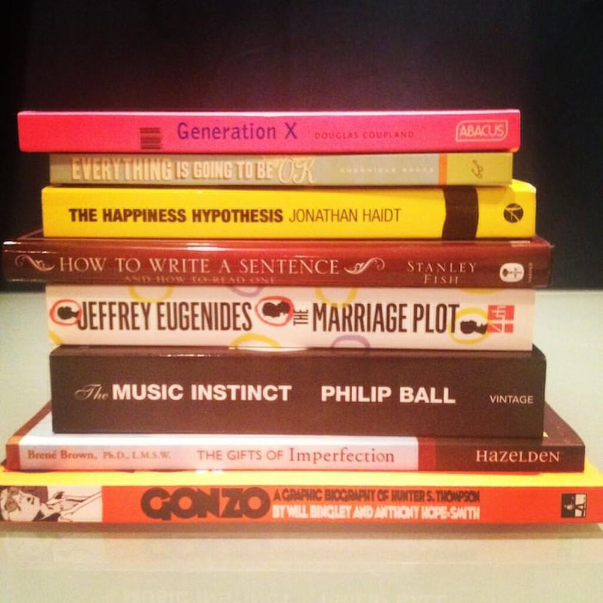

More books to add to the “University of life” course list. From top to bottom: I picked up “Generation X” for 50p in a charity shop in Tintagel. “Everything Is Going To Be OK” is a picture book full of inspirational mottos. “The Happiness Hypothesis” is the most useful and interesting book that I have read in a long while. I decided to read “How To Write A Sentence” as an alternative to Strunk and White’s “The Elements Of Style” which, while useful, can be a little stuffy! “The Marriage Plot” is a novel with interesting reviews, it was also (ahem) well-priced. After love I decided to go after music as something else I wanted to read about, hence “The Music Instinct” which comes highly recommended. “The Gifts Of Imperfection” is a manifesto for embracing life in a wholehearted way. And “Gonzo”? Well, [I have written about that one already](gonzo-a-graphic-biography-of-hunter-s-thompson).
